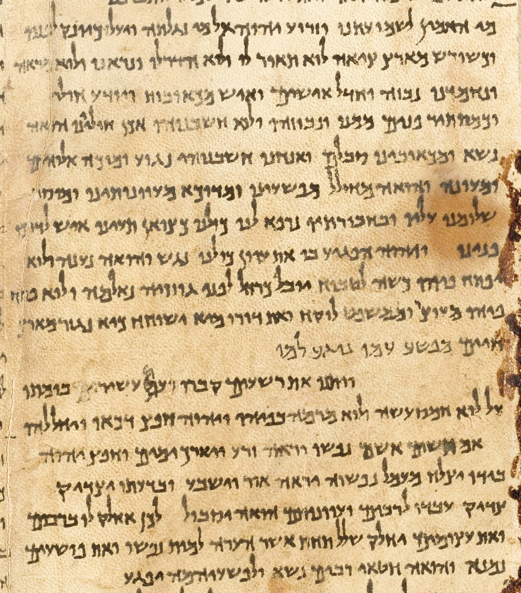

# Appendix F: The Dead Sea Scrolls -- Grace Gems and the Teacher of Righteousness

## The Discovery

In 1947, a Bedouin shepherd discovered clay jars in caves near Qumran, along the northwestern shore of the Dead Sea. Inside the jars were scrolls that had been hidden for over two thousand years. The scrolls contained biblical manuscripts, sectarian rules, hymns, and theological writings from a Jewish community that existed from roughly the second century BC to the first century AD.

The community was led by a figure known only as the Teacher of Righteousness. We don't know his real name. We know that he taught the sovereign grace of God, that his followers fled into the desert to escape the Pharisees, and that his writings were sealed in caves and forgotten for two millennia.

<figure class="book-figure-center">

<figcaption>A column of the Great Isaiah Scroll, copied at Qumran roughly a century before Christ -- the oldest complete book of the Hebrew Bible, sealed in the caves until 1947.</figcaption>
</figure>

## The Theology

The theological content of the Qumran scrolls is explicitly predestinarian. What follows is a selection of the most significant passages, drawn from the Hodayot (Thanksgiving Hymns), the Community Rule, and the Aramaic Apocalypse. These are not cherry-picked fragments. They are sustained theological arguments, written two centuries before Christ, that read like they could have been written by the authors of this book.

First, a word from the historian who recorded what the Essenes believed:

> *"The sect of the Essenes affirm, that fate (God) governs all things, and that nothing befalls men but what is according to its determination."* -- Flavius Josephus, *Antiquities of the Jews*, Bk XIII, Ch V, Sn 9

Note the contrast: Josephus explicitly records that the Essenes held to absolute predestination, *unlike the Pharisees and Sadducees, who allow for some scope for free will.* The debate is 2,200 years old. The sides have not changed.

**On the sovereignty of God over all things:**

> *"Everything is engraved before You with the ink of remembrance for all the times of eternity, for the numbered seasons of eternal years in all their appointed times. Nothing is hidden, nor does anything exist apart from Your presence."* -- Thanksgiving Psalms (1QH 9.24-25)

> *"All that is now and ever shall be originates with the God of knowledge. Before things come to be, He has ordered all their designs, so that when they do come to exist, at their appointed times as ordained by His glorious plan, they fulfill their destiny, a destiny impossible to change. He controls the laws governing all things, and He provides for all their pursuits."* -- Community Rule (1QS 3.15-17)

**On justification by grace alone:**

> *"As for me, my justification lies with God. In his hand are the perfection of my walk and the virtues of my heart. By His righteousness is my transgression blotted out."* -- Community Rule (1QS 11.2-3), Wise/Abegg/Cook

> *"As for me, to evil humanity and the counsel of perverse flesh do I belong. My transgressions, evils, sins, and corrupt heart belong to the counsel of wormy rot and those who walk in darkness. Surely a man's way is not his own; neither can any person firm his own step. Surely justification is of God."* -- Community Rule (1QS 11.9-10), Wise/Abegg/Cook

> *"As for me, if I stumble, God's loving-kindness forever shall save me. If through the sin of the flesh I fall, my justification will be by the righteousness of God which endures for all time. Though my affliction break out, He shall draw my soul back from the Pit, and firm my steps on the way. Through his love He has brought me near; by His loving-kindness shall He provide my justification. By his righteous truth has He justified me; and through His exceeding goodness shall He atone for all my sins. By His righteousness shall He cleanse me of human defilement and the sin of humankind, to the end that I praise God for His righteousness, the Most High for His glory."* -- Community Rule (1QS 11.11-15), Wise/Abegg/Cook

Read that passage again. "Justification is of God." "By the righteousness of God." "Not his own." "Neither can any person firm his own step." This is not Calvin in 1536. This is not Luther in 1517. This is a Jewish writer, two centuries before Christ, articulating sola gratia with a precision that most Reformed theologians would envy.

**On the two seeds -- the righteous created for grace, the wicked created for wrath:**

> *"I know by Your understanding that it is not by human strength . . . a man's way is not in himself, nor is a person able to determine his step. But I know that in Your hand is the inclination of every spirit, and all his works You have determined before ever You created him. How should any be able to change Your words? You alone have created the righteous one, and from the womb You established him to give heed to Your covenant at the appointed time of grace and to walk in all things, nourishing him in the abundance of Your compassion, and relieving all the distress of his soul for an eternal salvation and everlasting peace without want. Thus You raise his glory above the mortal. But the wicked You created for the time of Your wrath, and from the womb You set them apart for the day of slaughter. For they walk in a way which is not profitable, and they reject Your covenant and their soul abhors Your truth. They have no delight in all that You have commanded, but they chose that which You hate."* -- 1QHodayot 7, translated in *The Dead Sea Scrolls: A New Translation*, Michael Wise, Martin Abegg, Jr., & Edward Cook, p. 89 (HarperSanFrancisco: 1996)

**On God as Author of all creation, including every spirit and every word:**

> *"By Thy wisdom all things exist from eternity, and before creating them Thou knewest their works for ever and ever. Nothing is done without thee and nothing is known unless Thou desire it. Thou hast created all the spirits and hast established a statute and law for all their works . . . Thou hast created the earth by Thy power and the seas and deeps by Thy might. Thou hast fashioned all their inhabitants according to Thy wisdom, and hast appointed all that is in them according to Thy will . . . In the wisdom of Thy knowledge Thou didst establish their destiny before ever they were. All things exist according to Thy will and without Thee nothing is done."* -- 1QHodayot IX, translated in *The Complete Dead Sea Scrolls in English*, Geza Vermes, pp. 253-255 (Penguin Books: 1997)

**On the deity of the coming Messiah:**

> *"He will be great over the earth . . . all will worship him . . . He shall be called great and he will be designated by his name. He will be called 'Son of God' and they will call Him 'Son of the Most High' . . . His kingdom will be an eternal kingdom, and all His paths in truth and uprightness . . . He is a great God of gods . . . His kingdom will be an eternal kingdom, and none of the abysses of the earth shall prevail against it."* -- 4QAramaic Apocalypse (4Q246) Col. I:7-9; Col. II: 1,5-8

These texts teach:

- **Absolute sovereignty** over every person's way and works -- "nothing is done without thee."
- **Two seeds** created differently from the womb -- the righteous established for grace, the wicked created for wrath.
- **Predestination before creation** -- "before ever You created him," "before creating them Thou knewest their works for ever and ever."
- **No human contribution** -- "not by human strength," "neither can any person firm his own step."
- **Justification by God's righteousness alone** -- "my justification lies with God," "by His righteousness is my transgression blotted out."
- **The deity of the Messiah** -- "Son of God," "Son of the Most High," "a great God of gods."

This is the same theology presented in this book. Not because we borrowed from the scrolls. Because both derive from the same Scriptures. And it is no wonder that modern scholars have dismissed this theology. It violates their free will and conditional system. The Pharisees of today are the same as yesterday.

## The Suppression

Modern scholars have largely dismissed the predestinarian theology of the scrolls. The emphasis in Dead Sea Scrolls scholarship has been on the archaeology, the textual variants, the community's practices, and the historical context. The *theology* -- the explicit, unambiguous predestinarianism -- is routinely downplayed, recontextualized, or ignored.

The Pharisees of the first century suppressed this theology with political power. The scholars of the twentieth and twenty-first centuries suppress it with academic indifference. The method changed. The result is the same.

## The Significance

The Dead Sea Scrolls demonstrate that sovereign grace theology is not a later invention of Augustine, Calvin, or the Reformers. It is the *original* Hebrew theology. The predestinarianism that the church attributes to Calvin in the sixteenth century was already present in Jewish nonconformist communities two centuries before Christ. The Pharisees corrupted it with Greek philosophy. The scrolls preserve what the Pharisees tried to destroy.

This matters because it places the framework of this book in a historical lineage that stretches far beyond the Reformation. The Teacher of Righteousness, Luther, Toplady, Gill, Higby, and this book are all standing in the same stream. Different centuries. Same truth. Same suppression. Same Author behind it all.

## Further Reading

- Bob Higby, "Dead Sea Scroll Evidence" (pristinegrace.org)
- Brandan Kraft, "Grace Gems from the Dead Sea Scrolls" (pristinegrace.org)
