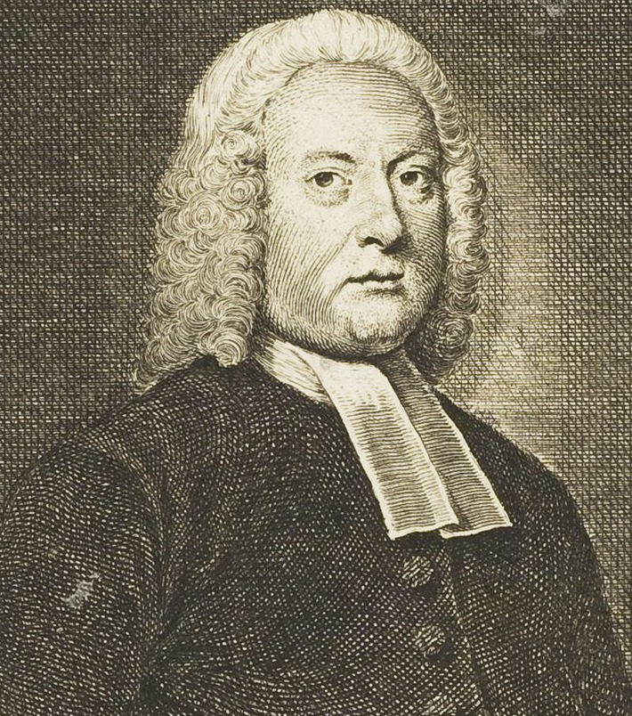
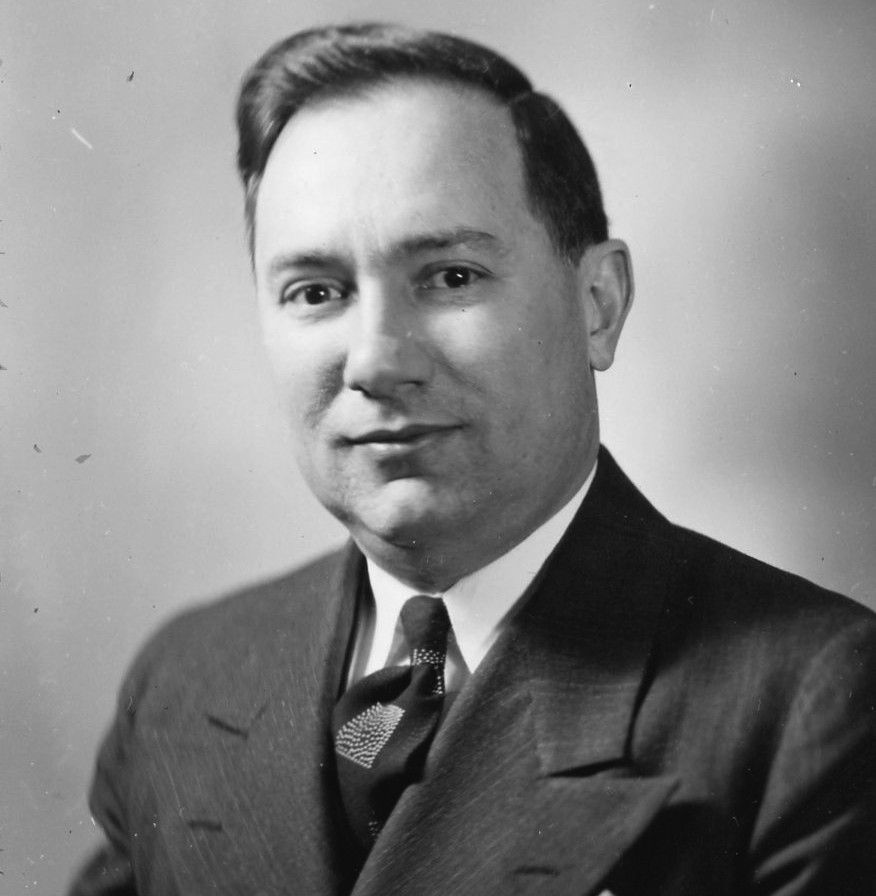
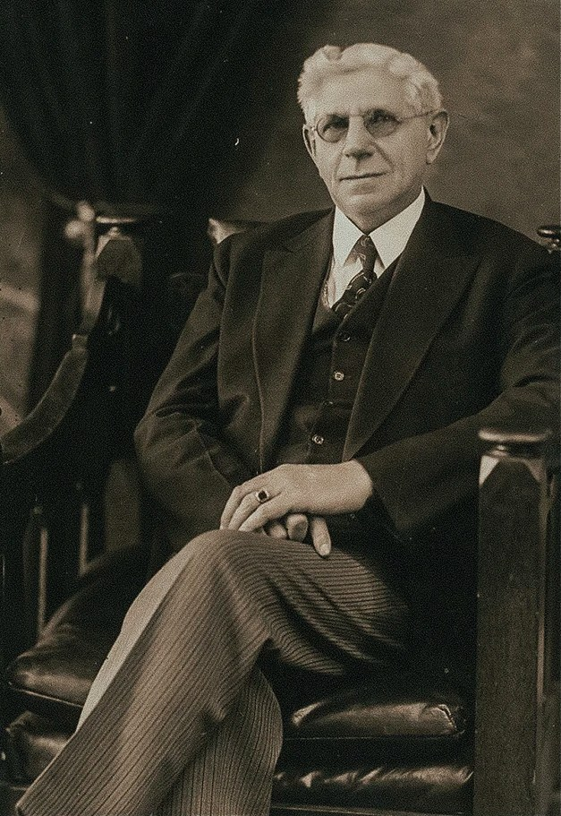
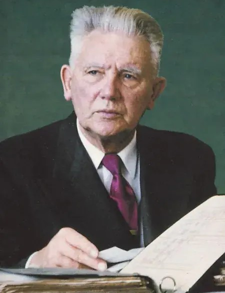
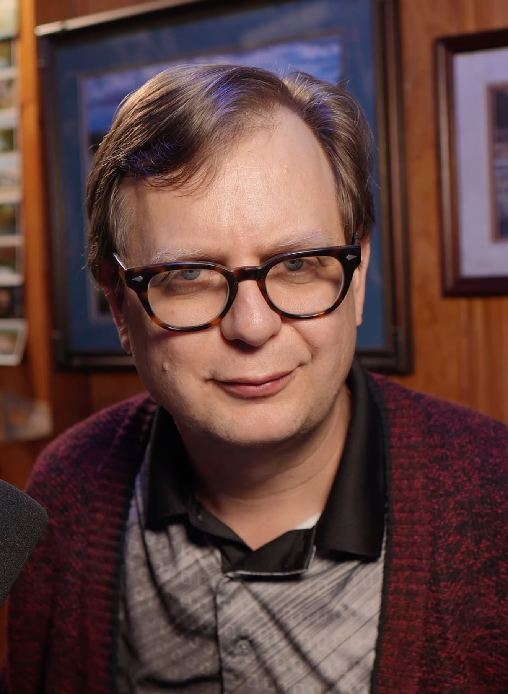

# Appendix I: The Framework in Context -- A Comparison of Reformed Systems

This appendix places the framework of this book alongside some of the major Reformed systematic theologies in history. The goal is not to attack these systems. It is to show the reader where the framework agrees, where it departs, and why. Every system listed below contains truth. Every system listed below contains error. Including this one. This book holds its positions with open hands and invites the reader to find the contradiction.

The comparison is organized by doctrine. Each row identifies a major theological question and shows how each system answers it. Where the framework agrees with a system, it says so. Where it disagrees, it says why.

## The Systems Compared

<div class="portrait-gallery">
<figure><figcaption>John Gill<br/>(1697-1771)</figcaption></figure>
<figure><figcaption>Gordon H. Clark<br/>(1902-1985)</figcaption></figure>
<figure><figcaption>Louis Berkhof<br/>(1873-1957)</figcaption></figure>
<figure><figcaption>Wayne Grudem<br/>(b. 1948)</figcaption></figure>
<figure><figcaption>Herman Hoeksema<br/>(1886-1965)</figcaption></figure>
<figure><figcaption>Brandan Kraft<br/>(b. 1975)</figcaption></figure>
</div>

**John Gill (1697-1771).** Particular Baptist. Supralapsarian.[^i-gill-supra-bio] Author of *A Body of Doctrinal Divinity*. The closest historical predecessor to MCT. Rejected common grace. Held to eternal justification. The framework owes more to Gill than to any other systematic theologian.

[^i-gill-supra-bio]: A label Gill wore loosely -- "for my own part, I think both may be taken in." See the fuller note at the Order of decrees row of the comparison table.

**Gordon Clark (1902-1985).** Presuppositionalist. Supralapsarian. Author of *Religion, Reason and Revelation* and numerous other works. Started from the axiom "the Bible is the Word of God" and derived everything through logic. The framework's epistemology is deeply influenced by Clark.

**Louis Berkhof (1873-1957).** Dutch Reformed. Infralapsarian. Author of *Systematic Theology*. The standard Reformed textbook for most of the twentieth century. Represents mainstream confessional Reformed theology.

**Wayne Grudem (b. 1948).** Evangelical Reformed. Author of *Systematic Theology*. The most widely used systematic theology in contemporary evangelicalism. Holds to continuationism and complementarianism. Represents the broad evangelical center.

**Herman Hoeksema (1886-1965).** Protestant Reformed. Supralapsarian. Author of *Reformed Dogmatics*. Rejected common grace and the well-meant offer. Founded the Protestant Reformed Churches. The closest denominational tradition to MCT.

**Brandan Kraft (b. 1975).** Operational idealist. Supralapsarian. Author of *A Thought in the Mind of God* (2026). Named Modified Covenant Theology (MCT) around 2004. The framework integrates sovereign-grace monergistic soteriology with operational-idealism metaphysics, simulation cosmology, and the firmware-flash diagnostic of regeneration. Rejects federal headship. Rejects common grace and the well-meant offer as classically formulated. Holds eternal justification (Gill's position) as ontological rather than merely decretal. Affirms two-seeds anthropology, the image of God in the elect alone, and heaven and hell as the same authored reality experienced through different firmware. Rejects the Augustinian inheritance of Plato's *God is not the author of sin* ethic on the authority of Isaiah 45:7. Starts systematic theology from an ontological axiom (*everything that exists is a thought in the mind of God*) rather than from an epistemological axiom. The framework's distinctive contribution is integrative: the sharpest sovereign-grace soteriology combined with the widest-arms ecclesiology, both grounded in the operational-idealism substrate that no prior systematic theology has used. This framework is his.

## Doctrine by Doctrine

### Ontology -- The Nature of Reality

This is the chart that explains every other chart. Every difference in theology, soteriology, ecclesiology, and eschatology between the framework and the Reformed tradition traces back to this table. The building is different because the ground is different.

| Doctrine | Gill | Clark | Berkhof | Grudem | Hoeksema | Kraft |
|----------|------|-------|---------|--------|----------|-------|
| Nature of reality | Realist | Realist in print; privately a Berkeleyan idealist[^i-clark-idealist] | Realist | Realist | Realist | Operational idealism |
| God's relationship to creation | Sustains from outside | Sustains from outside | Sustains from outside | Sustains from outside | Sustains from outside | Thinks creation at every moment |
| Physical/spiritual distinction | Dualist | Dualist | Dualist | Dualist | Dualist | One substance, two rendering modes |
| "God is not the author of sin" | Affirmed and defended | Affirmed (God the cause, not author)[^i-clark-cause] | Affirmed | Affirmed | Questioned but retained | Rejected (Isa 45:7)[^i-cheung] |
| Starting point | Epistemological | Epistemological | Epistemological | Epistemological | Epistemological | Ontological[^i-ontological] |
| The sentence | None | None | None | None | None | See below |
| Role of Scripture | Starting axiom | Starting axiom | Axiom + natural revelation | Axiom + general revelation | Starting axiom | The source the sentence is derived from |

[^i-cheung]: One contemporary writer deserves naming here. Vincent Cheung, a Clarkian occasionalist, has affirmed outright that God is the author of sin and dismissed the author/cause distinction as wordplay (*The Author of Sin*, 2014). The framework honors the candor -- he is, as far as I can find, the one prior writer who refused the hedge in print. The difference is route and reach: Cheung affirms the proposition from within Clark's epistemological scripturalism while retaining the traditional fall narratives for Satan and Adam; the framework derives it from the rendering ontology and follows it all the way down -- Satan created evil, Adam created sinful, every frame authored. He asserted the proposition and left the rest of the old system standing. This book rebuilds the whole system around it.

[^i-clark-idealist]: One of the best-kept secrets in Reformed philosophy, and it deserves to be told. Ronald Nash, lecturing on Berkeley, told his students: "in his own system of metaphysics Gordon Clark was an Idealist very much in the Berkeleyian camp." Where Berkeley said *to be is to be perceived*, Clark would say *to be is to be conceived* -- conceived in the mind of God. Planets, mountains, men: thoughts God is thinking. And Nash explains why nobody knows it: Clark deliberately kept his metaphysics out of print, fearing readers would use it to dismiss the rest of his work. The account is secondhand -- Nash's lecture testimony, transcribed by Douglas Douma (notes on Nash's *History of Philosophy and Christian Thought* lecture series, lecture 26, douglasdouma.com; see also Douma, *The Presbyterian Philosopher*, 2017) -- and it cannot be verified against anything Clark published, which is precisely the point. If it is true, it is a shame he never published it. Edwards reached this ground and left it in his notebooks. Clark reached it and locked the drawer. At least it is published now.

**The framework's distinctive position.** Reality is information in God's mind, rendered physically. God thinks creation into existence at every moment; if He stops thinking it, it stops existing. There is one substance (information) and two rendering modes (physical and non-physical), so the body-spirit dualism the tradition inherited from Plato dissolves. Isaiah 45:7 overrides the Republic ethic. The starting point is ontological rather than epistemological: the framework begins with what reality IS, not where to find truth, and the epistemology follows from the ontology rather than the other way around. The sentence is the framework's load-bearing axiom: *"Everything that exists is a thought in the mind of God, sustained by His will, authored by His purpose, and held together by personal covenants of love."* It is derived from Scripture (Heb 11:3, Col 1:17, Acts 17:28, Isa 45:7), not in place of Scripture.

[^i-ontological]: The framework's starting point is ontological, but the ontological sentence is derived from Scripture (Heb. 11:3, Col. 1:17, Acts 17:28, Isa. 45:7). Scripture is not replaced by ontology. Scripture is the source from which the ontological foundation is drawn. The difference is that every other system declares Scripture as the axiom and then builds theology on top of it. This system asks what Scripture says reality IS, derives a sentence, and then derives everything else -- including the epistemology and the doctrine of Scripture itself -- from that sentence. The circle is intentional: the Author of reality authored the book that reveals what reality is. The axiom explains itself because the Author authored the explanation.

Every system above starts by answering the question "where do we find truth?" The framework starts by answering a prior question: "what IS reality?" And the answer to the second question determines the answer to the first. If reality is information in God's mind, then truth is found wherever God reveals His thought: in Scripture, in the architecture of creation, in the rendering itself. The epistemology is derived from the ontology. Not the other way around.

Clark came the closest. His insistence that all truth is propositional, and that propositions are the fundamental objects of knowledge, is one step short of the sentence. Clark said all truth is a thought. The framework says all *reality* is a thought. Clark located the thought in logic. The framework locates it in a Person. And if Ronald Nash is to be believed, Clark privately took the step the framework takes openly: his own metaphysics was Berkeleyan idealism, *to be is to be conceived* in the mind of God, kept out of print on purpose (see the note on his idealism at the Nature-of-reality row of the comparison table). The closest system in this comparison was closer than its author ever let his readers know.

[^i-clark-cause]: Clark affirmed that God is not the author of sin while insisting, in the same breath, that God is its ultimate *cause*: "Let it be unequivocally said that this view certainly makes God the cause of sin. God is the sole ultimate cause of everything." See Gordon H. Clark, *Religion, Reason and Revelation* (Philadelphia: Presbyterian and Reformed, 1961), in the chapter "God and Evil." Clark resolved the tension by definition -- cause is not authorship -- not by appeal to paradox, which he opposed throughout his career.

### The Decrees of God

| Doctrine | Gill | Clark | Berkhof | Grudem | Hoeksema | Kraft |
|----------|------|-------|---------|--------|----------|-----|
| Order of decrees | Supralapsarian[^i-gill-supra] | Supralapsarian | Infralapsarian | Varies | Supralapsarian | Supralapsarian - the ONLY true supralapsarian system |
| God authors evil | Decrees evil; denies authorship | Cause of sin, not author | Cautious - "permits" | No - "permits" | Decrees evil; denies authorship | Yes - "permission is sovereignty with plausible deniability" |
| Equal ultimacy | Implied | Yes | Denied | Denied | Yes | Yes - explicit and unapologetic |
| Providence | Active, continuous | Active | Active but with secondary causes | Active with secondary causes | Active, continuous | Active - God thinks reality into existence at every moment |


[^i-gill-supra]: A label Gill himself refused to wear cleanly. In the *Body of Doctrinal Divinity* ("Of Predestination") he weighed the two schemes and answered, "for my own part, I think both may be taken in" -- men considered as not yet created in the decree of the end, as created and fallen in the decree of the means. Supralapsarian where the plan begins, infralapsarian where the details get pressed. That is the very move Chapter 5 diagnoses, performed by the framework's closest predecessor. He is classed supralapsarian here by the shape of his system -- eternal justification, election before any consideration of the fall, no free offer -- and because the decree of the end is where a man's lapsarianism actually lives.

### The Person and Work of Christ

| Doctrine | Gill | Clark | Berkhof | Grudem | Hoeksema | Kraft |
|----------|------|-------|---------|--------|----------|-----|
| Atonement | Particular | Particular | Particular | Particular (with universal aspects) | Particular | Particular - the thought rendered in blood |
| Justification | From eternity | At faith | At faith | At faith | From eternity[^i-hoeksema-justif] | From eternity - God NEVER viewed His people as condemned |
| Active obedience | Yes | Yes | Yes | Yes | Yes[^i-hoeksema-active] | Yes - far more than Sinai compliance |
| Federal headship | Yes | Yes | Yes | Yes | Yes | Rejected - God creates each person sinful directly |

### Salvation

| Doctrine         | Gill        | Clark       | Berkhof     | Grudem      | Hoeksema    | Kraft                       |
| ---------------- | ----------- | ----------- | ----------- | ----------- | ----------- | --------------------------- |
| Common grace     | Denied      | Denied      | Affirmed    | Affirmed    | Denied      | Denied                      |
| Well-meant offer | Denied      | Denied      | Affirmed    | Affirmed    | Denied      | Denied                      |
| Faith as duty    | Disputed    | Gift (assent) | Affirmed    | Affirmed    | Affirmed    | Denied -- gift, not duty    |
| Sanctification   | Progressive | Progressive | Progressive | Progressive | Progressive | Positional and continuous   |
| Preservation     | Yes         | Yes         | Yes         | Yes         | Yes         | Yes -- from eternity        |

**The framework on salvation.** Common grace is denied: rain on the wicked is the increase of wrath, not grace (Ps 92:7). The well-meant offer is denied: the gospel is proclamation, not offer. Faith is a gift, not a duty; the framework stands alone on this against most of the Reformed tradition. Sanctification is positional in status (Christ IS the believer's holiness) and continuous in growth (the Spirit keeps teaching). Preservation runs from eternity, not just from conversion; the elect were preserved in Christ before they ever believed.

[^i-hoeksema-active]: Hoeksema affirmed the imputation of Christ's righteousness, including His active obedience, but -- unlike the Westminster tradition -- he rejected the covenant of works, the scheme usually invoked to ground active obedience as merited reward. For Hoeksema the obedience is covenantal and filial rather than the fulfillment of a works-contract. See Herman Hoeksema, *Reformed Dogmatics* (Grand Rapids: Reformed Free Publishing Association, 1966).

[^i-hoeksema-justif]: Hoeksema held justification in two aspects: eternal in the decree of election ("justified from before the foundation of the world") and realized in time through faith, on the ground of Christ's death and resurrection. "From eternity" names the first aspect; it does not deny the second. See Hoeksema, *Reformed Dogmatics*.

### The Law

| Doctrine | Gill | Clark | Berkhof | Grudem | Hoeksema | Kraft |
|----------|------|-------|---------|--------|----------|-----|
| Moral law binding | Yes (third use) | Yes (third use) | Yes (third use) | Yes in substance - via NT repetition, not third use[^i-grudem-law] | Yes (third use) | No - dead to ALL the law. Christ is the rule. |
| Three divisions | Yes | Yes | Yes | Rejected - the Mosaic covenant ends as a whole | Yes | Rejected - the law is one unit |
| Sabbath obligation | Ceremonial; ended in Christ. Lord's Day stands on apostolic practice | Transferred to Sunday | Transferred to Sunday | Not binding; the one commandment not repeated | Transferred to Sunday | Ended in Christ. The rest is Christ Himself. |

[^i-grudem-law]: Grudem's position, stated across the three law rows: the Mosaic covenant "is terminated" at the cross and "none of its laws are binding on Christians, at least not in any direct way" -- but most of the Ten Commandments are reaffirmed in the New Testament and bind on that ground, the Sabbath being the one commandment never repeated. He builds his ethics without the moral/civil/ceremonial division and without the Reformed third use. See Wayne Grudem, *Christian Ethics: An Introduction to Biblical Moral Reasoning* (Wheaton: Crossway, 2018), chap. 8.

### The Church

| Doctrine | Gill | Clark | Berkhof | Grudem | Hoeksema | Kraft |
|----------|------|-------|---------|--------|----------|-----|
| Polity | Congregational | Presbyterian | Presbyterian | Congregational (plural elders) | Presbyterian/Reformed | Participatory - no one-man pulpit |
| Baptism | Believer's, immersion | Infant, sprinkling | Infant, sprinkling | Believer's | Infant | Believer's - mode is conscience. The sign is the Spirit. |
| Baptismal regeneration | Denied | Denied | Denied | Denied | Denied | Denied - the error this framework exists to refute |
| Women in ministry | Complementarian | Complementarian | Complementarian | Complementarian | Complementarian | Complementarian - but the pulpit shouldn't exist for anyone |

### Anthropology

| Doctrine | Gill | Clark | Berkhof | Grudem | Hoeksema | Kraft |
|----------|------|-------|---------|--------|----------|-----|
| Image of God | Universal | Universal | Universal | Universal | Lost in the fall; only the formal capacity remains | Elect only |
| Adam's original state | Created righteous, fell | Created righteous, fell | Created righteous, fell | Created righteous, fell | Created righteous, fell | Created sinful - the fall revealed what was already there |
| Origin of Satan | Fallen angel | Fallen angel | Fallen angel | Fallen angel | Fallen angel | Created evil - never fell. Isaiah 14 is about Babylon. |
| Two seeds (ontological) | Implied | Not addressed | Not addressed | Denied | Implied | Explicit - Genesis 3:15. Different thoughts in God's mind. |

### Eschatology

| Doctrine | Gill | Clark | Berkhof | Grudem | Hoeksema | Kraft |
|----------|------|-------|---------|--------|----------|-----|
| Millennium | Historic premill | Historic premill[^i-clark-premill] | Amillennial | Historic premill | Amillennial | Amillennial |
| Revelation framework | Historicist | Not detailed | Amillennial-idealist | Futurist leanings | Amillennial | Amillennial + partial preterism + historicism |
| Final punishment | ECT, undifferentiated | ECT, undifferentiated | ECT, undifferentiated | ECT, undifferentiated | ECT, undifferentiated | Curse of law and condemnation of gospel distinguished |
| Nature of the fire | Analogical | Analogical | Analogical | Real, not pressed | Analogical | Analogical -- God's presence through corrupt firmware |
| Hell | Separate place, torment | Separate place, torment | Separate place, torment | Separate place, torment | Separate place, torment | Same reality as heaven, opposite firmware |
| Heaven | Throne-worship; embodied | Throne-worship | Throne-worship | Throne-worship; embodied | Throne-worship | Eschatological feast; full embodied life |
| Saints reigning | Reign with Christ; separated geography | Reign with Christ | Separated final states | Reign in the new earth | Reign; separated geography | Reign IN the same rendering, not from a distance |
| The glass (1 Cor 13:12) | Not a category | Not a category | Not a category | Not a category | Not a category | Comes down for everyone; opposite experience |
| Resurrection body | Spiritual body | Glorified | Pauline categories | Glorified, continuous | Glorified | More physical, not less |
| Marriage in the resurrection | None contracted | Not developed | None | None | Not developed | No new marriages, but covenant companions persist |
| Satan and demons | ECT in the lake | ECT | ECT | ECT | ECT | Quarantined |

**The framework's distinctive eschatology.** The framework holds amillennialism on the millennium, partial preterism on the AD 70 fulfillment of much New Testament apocalyptic language, and historicism as the interpretive lens for Revelation, with an open hand on the specific date-mappings the historicist tradition has tried over the centuries. The sentence does not set dates. The framework distinguishes two consequences in the final state. The curse of the law is measured and proportional; Christ bore it fully for the elect. The condemnation of the gospel is eternal shame (Daniel 12:2); Christ did not bear it. Hell is not a separate location but the same rendering experienced through corrupt firmware, *"in the presence of the Lamb"* (Rev 14:10), which the elect experience as glory and the reprobate experience as fire. The fire itself is analogical; the Reformed tradition had the analogy, and the framework supplies the ontology the analogy was pointing at (Isa 33:14). Heaven is the eschatological feast (Isaiah 25:6, Rev 19:9), embodied and full: bodies, food, wine, reunion, work, intimacy, worship, covenant. Not a disembodied choir loft. The saints reign with Christ over the reprobate within the same creation, not from a separate geography (Rev 5:10, 20:6; 1 Cor 6:2-3; Dan 7:22, 27). The framework derives the *nature* of the reign; it does not derive the *experience* of it (1 Cor 2:9). The glass of 1 Cor 13:12 comes down for everyone in the final state, with opposite experience: glory for the elect with Christ's covering, horror for the reprobate exposed before the Lamb. The resurrection body is more physical, not less; Christ ate fish and walked through walls (Luke 24:42-43, John 20:19). A rendering upgrade, not an escape from matter. The legal register of marriage ends at death; the ontological register persists; covenant companions (*chaver*, Mal 2:14) carry into the new creation. Satan and the demons are quarantined, the fourth group outside the three-group final rendering. Chapters 27, 28, and 29 develop each of these in detail.

[^i-clark-premill]: Clark was a historic premillennialist, not an amillennialist -- a point on which the framework differs from him. He argued that amillennialism and postmillennialism cannot be fitted to the biblical data, "and hence only premillennialism is left," though he declined to press the thousand years as a literal figure. The quotation is from Clark's unpublished *Introduction to Theology* (c. 1974), quoted in Douglas Douma, "On Clark's Millennial Arguments," douglasdouma.com (June 2, 2016); Clark takes the same position in *What Do Presbyterians Believe?* (Philadelphia: Presbyterian and Reformed, 1965).

### Epistemology

| Doctrine | Gill | Clark | Berkhof | Grudem | Hoeksema | Kraft |
|----------|------|-------|---------|--------|----------|-----|
| Starting point | Scripture | Scripture as axiom | Scripture + natural revelation | Scripture + general revelation | Scripture | The ontological sentence (derived from Scripture) |
| Type of starting point | Epistemological | Epistemological | Epistemological | Epistemological | Epistemological | Ontological |
| All reasoning circular | Not addressed | Yes[^i-clark-circular] | Not addressed | Yes (ultimate authority) | Not addressed | Yes |
| Presuppositionalism | Not formalized | Yes (Clarkian) | Kuyper/Bavinck line - proofs are testimonia, not arguments | Presuppositional (soft)[^i-grudem-presup] | Not formalized | Yes -- boot parameters determine everything |

**The framework on epistemology.** The framework is the only system in this comparison that starts with what reality IS, not where to find truth. The ontological sentence is derived from Scripture (Heb 11:3, Col 1:17, Acts 17:28, Isa 45:7), so Scripture is not displaced; it is the source. Epistemology follows from ontology. All reasoning is circular because the system predicts its own rejection by those whose firmware has not been flashed. Presuppositionalism is not just a method but the framework's diagnostic of every human mind: the boot parameters determine what the application layer can recognize.

[^i-clark-circular]: Clark held that all reasoning rests on an indemonstrable axiom and that no axiom can be proved from outside its own system -- the "no neutral ground" conviction this framework shares and names "circular." Clark himself preferred the word *axiomatic* and broke with Cornelius Van Til precisely over Van Til's embrace of paradox and reasoning "in a circle" (Van Til, *The Defense of the Faith*, Philadelphia: Presbyterian and Reformed, 1955). The framework's sense of "circular" is ontological -- because God is the substrate, every chain of reasoning returns to Him -- and is owed to Clark's axiomatic method more than to his vocabulary.

[^i-grudem-presup]: Grudem is better classed as a soft presuppositionalist than an evidentialist: he holds Scripture to be self-attesting and grants that any defense of an ultimate authority is necessarily circular -- "Everyone... uses some kind of circular argument while defending his or her ultimate authority for belief." See Wayne Grudem, *Systematic Theology: An Introduction to Biblical Doctrine* (Grand Rapids: Zondervan, 1994), chapter 4. He also employs evidences, which is why "soft" is the fair qualifier.

### The Canon

| Doctrine | Gill | Clark | Berkhof | Grudem | Hoeksema | Kraft |
|----------|------|-------|---------|--------|----------|-----|
| All 66 books equal | Yes | Yes | Yes | Yes | Yes | No - homologoumena and antilegomena. Some self-authenticate more clearly than others. |
| James | Held without comment | Held without comment | Held without comment | Held fully | Held without comment | Held but ranked. The weakest book does not override the strongest. |

## The Augustinian Foundation

Every system in this comparison except the one presented in this book stands on a foundation laid by one man: Augustine of Hippo, in the late fourth and early fifth century.

Augustine took Neoplatonic philosophy and fused it with Christian Scripture. He inherited two things, from two different sources, and the distinction matters. From Plato's *Republic* (which reached him at second hand, through Cicero and the Latin Platonists, since no Latin *Republic* existed and his Greek was never strong) he absorbed the ethical axiom that the divine cannot be proposed as the author of evil. From Plotinus, he inherited a realist corruption of Plato's original idealism, a hierarchical ontology in which the One sits at the top, matter at the bottom, and God acts upon the physical world from outside. Plato himself was not a realist. Plato was an idealist. For Plato, the invisible forms are the primary reality, and the physical world is their shadow. Appendix J develops this in full. Plotinus bent that structure into a hierarchy, and Augustine received the bent version, not the original. He built his theological framework on those two imports, the ethical axiom from Plato and the realist hierarchy from Plotinus, and that framework became the foundation of Western Christianity for the next sixteen centuries.

<figure class="book-figure-portrait">

<figcaption>John Calvin (1509-1564), French School. The greatest systematician of the Reformation -- and one more builder on Augustine's floor. Calvin recovered the gospel of sovereign grace and never once questioned the Platonic ground it stood on. This framework keeps his soteriology and replaces the floor beneath it.</figcaption>
</figure>

Calvin built on Augustine. Luther built on Augustine. The Westminster divines built on Augustine. Gill, Clark, Berkhof, Grudem, Hoeksema, every name in the chart above, built on Augustine's foundation. They disagreed about the building. None of them questioned the ground it stood on. The realist ontology came through Augustine from Plotinus's corruption of Plato's idealism, and the "God is not the author of sin" ethic came through Augustine from Plato's *Republic*. Every major system since has inherited both without reexamination.

```
PLATO  (4th c. BC)
    Idealism (Forms over particulars)
    + the Republic ethic ("God is not the author of evil")

                |
                v   Plotinus (3rd c. AD) bends idealism into realism
                |

AUGUSTINE  (4th-5th c.)
    Imports both:
        - the realist ontology (from Plotinus)
        - the Republic ethic (from Plato)
    Fuses them with Scripture

                |
                v

THE WESTERN CHRISTIAN TRADITION
    Aquinas, Calvin, Luther, Westminster
    Gill, Clark, Berkhof, Grudem, Hoeksema
    Every system in the comparison above stands on this foundation

THIS BOOK  (2026)
    Stands on a different foundation: Scripture, on its own terms
        (John 1:1, Heb 11:3, Col 1:17, Isa 45:7)
    The architecture is idealism, because Scripture teaches it --
        mind precedes matter, the invisible is more real than the visible
    Rejects what Augustine inherited:
        - the Plotinian realist hierarchy
        - the Republic ethic ("God is not the author of evil")
```

The framework of this book does not build on Augustine's foundation. It lays a new one.

The realist ontology is replaced by operational idealism, which recovers Plato's original insight that the invisible is more real than the visible and then does what Plato could not do: it names the Mind. The Platonic ethic is replaced by Isaiah 45:7. The "secondary causes" framework that every system since Augustine has used to distance God from evil is replaced by one cause, God's thought, rendered. The body-spirit dualism that Plato authored and Augustine baptized is replaced by a rendering engine that honors the physical as a good rendering of a deeper reality. And the vocabulary of substance, essence, and form that Aristotle provided and the tradition adopted is supplemented by the vocabulary of rendering, firmware, layers, and information.

This is not a claim of superiority. It is a structural observation. Every system from Augustine to the present has modified the building. None has replaced the foundation. The framework of this book is the first complete theological system since Augustine to start from a different ontological ground.

Whether this is an advance or an error is for the reader to judge. The framework invites the judgment. The system that invites criticism is the system that has nothing to hide.

## What the Framework Adds

Every system above was built within the boundaries of its camp. Gill was a Particular Baptist. Clark was a Presbyterian logician. Berkhof was Dutch Reformed. Grudem is an evangelical. Hoeksema was Protestant Reformed. Each of them signed a confession, belonged to a denomination, and operated within a tradition that constrained what they could say.

This book signs no confession. It belongs to no denomination. It operates within no tradition except Scripture itself. And it derives everything from one sentence that none of the systems above ever articulated.

The framework does not replace these systems. It stands on their shoulders. Gill's eternal justification is here, Clark's presuppositionalism, Hoeksema's rejection of common grace. Even Berkhof's careful scholarship informs these pages, if only as the standard against which the framework measures itself.

But the framework goes further than any of them. Not because the author is smarter. But because the sentence demands it. One sentence, followed honestly, produces positions that no camp would fully endorse. And the man who follows the sentence all the way to the end will find himself, like the author of this book, theologically homeless.

Campless is not a complaint. It is the only honest place to stand when the truth doesn't fit inside any fence.

## Clark and Kraft: A Detailed Comparison

Of all the systems listed above, Gordon Clark's is the closest to this framework in method. Both are presuppositionalist. Both are supralapsarian. Both reject common grace and the well-meant offer. Both insist that all reasoning is circular and that the question is not "which system can be proven from neutral ground?" but "which system accounts for reality?" Both were accused of hyper-Calvinism by their contemporaries. And both were right.

But the similarities mask a fundamental difference in starting point, scope, and destination. What follows is a detailed comparison for the reader who knows Clark and wants to understand where this framework departs from him and why.

### The Starting Point

Clark's axiom is epistemological: "The Bible is the Word of God." Everything in Clark's system is derived from this proposition. It is the foundation on which all other knowledge rests. If the Bible is the Word of God, then what the Bible says is true. And from there, Clark builds his theology, his ethics, his philosophy, and his critique of every competing system.

The framework's sentence is ontological: "Everything that exists is a thought in the mind of God, sustained by His will, authored by His purpose, and held together by personal covenants of love." This is not a claim about a book. It is a claim about reality itself. It is a statement about what EXISTS, not about where to find truth.

This difference matters enormously. Clark's axiom requires the reader to accept the Bible before the system begins. If you don't accept the Bible, Clark's system has nothing to say to you. The presuppositions are in place before the first argument is made, and the unbeliever is simply told that his own presuppositions can't account for reality.

The framework's sentence does not require the reader to accept the Bible first. It makes a claim about the nature of reality that can be evaluated on its own terms. "Is reality fundamentally information?" is a question a physicist can engage with. "Does information require a mind?" is a question a philosopher can engage with. "Does the architecture of the universe look authored?" is a question a programmer can engage with. The sentence meets the reader where the reader already stands, in the world, looking at reality, asking what it is. And THEN, once the ontology is established, the Bible confirms and expands what the sentence already claimed.

Clark built a fortress. The framework builds a bridge. Both are necessary. But the bridge reaches people the fortress never will.

### The Architecture: Why Starting at the Center Reaches Everything

The difference between Clark's starting point and the framework's starting point is not just a theological preference. It determines what the system can REACH.

Clark starts at epistemology: "The Bible is the Word of God." From there, certain domains are derivable (theology, ethics, praxis) and certain domains are unreachable (physics, neuroscience, psychology). Epistemology is about WHERE to find truth. It doesn't tell you what reality IS. And if you don't know what reality is, you can't derive how reality behaves.

The framework starts at ontology: "Everything that exists is a thought in the mind of God." And the ontological sentence doesn't sit at one end of a hierarchy with other domains stacked above it. God is NAMED in the sentence. Theology is embedded in the ontology, not derived after it. The sentence IS theological. And every domain radiates outward from it equally:

| Domain | Question | Clark's Reach | The Framework |
|---|---|---|---|
| Theology | Who is God? | Derived from the axiom | Embedded in the sentence -- God is the Thinker |
| Epistemology | How do we know? | THE AXIOM | Derived -- knowing requires the Author's firmware |
| Science | How does reality behave? | Unreachable | Derived -- physics studies the rendering |
| Psychology | How does the mind work? | Not addressed | Derived -- the four-layer model, pre-propositional information |
| Ethics | How should we act? | Derived from the axiom | Derived -- liberty, the Spirit writes the commandments |
| Eschatology | What is the final state? | Stated (amillennial) | Derived -- same reality, different firmware, the glass |
| Praxis | What do we do? | Derived from the axiom | Derived -- participatory church, the agape feast |

The sentence is the center. Every domain radiates from it. Not in sequence, not "first ontology, then theology, then epistemology." Simultaneously. The sentence generates theology AND science AND psychology AND eschatology at the same time, because the sentence IS about all of them. "Everything that exists" includes the physicist's particles and the theologian's doctrines and the psychologist's mind and the eschatologist's final state. One sentence. Every domain. Radiating outward from one center.

Clark's axiom is a starting point at one end of a line. The framework's sentence is a center with every domain as a spoke. The line reaches what's ahead of it and can't see what's behind it. The center reaches everything, because everything is equidistant from the center.

This is why Clark's system produces theology and apologetics but cannot reach physics. This is why the framework produces theology AND physics AND neuroscience AND eschatology AND the glass AND the rendering engine. The scope of the output is determined by the position of the starting point. Start at one end of a line, reach the domains ahead of you. Start at the center, reach everything.

### Knowledge and Propositions

Clark held that all knowledge is propositional. You either know a proposition or you don't. There is no "feeling" knowledge, no intuitive knowledge, no non-propositional awareness that counts as real knowledge. This is rigorous and defensible, but it creates a problem: it has no vocabulary for pre-propositional experience.

The framework introduces the four-layer model (Chapter 17): hardware, firmware, operating system, application layer. The application layer processes propositions; that is Clark's domain. But the firmware and OS layers process information BEFORE it reaches the application layer. Feelings are pre-propositional information. The amygdala fires before the prefrontal cortex catches up. The feeling arrives before the thought. And in the framework, feelings are not nothing. They are information, God's information, arriving through channels that Clark's system doesn't acknowledge.

This is not a rejection of Clark. It is an expansion. Clark was right that knowledge is propositional. But the framework adds that pre-propositional information is REAL information, processed by layers of the mind that Clark never mapped. The Spirit operates at the firmware level, beneath propositions, beneath conscious thought. Clark's system describes the application layer beautifully. The framework describes all four layers.

### The Image of God

Clark held the traditional Reformed position: the image of God belongs to all humanity. The framework departs from this (Chapter 12) and holds that the image of God belongs to the elect only. The reprobate bear the image of the serpent (John 8:44).

Clark would have objected to this. His commitment to the universal image of God was connected to his view of human rationality: all humans are rational beings, and rationality is the image. But the framework distinguishes between biological rationality (which all humans share) and the spiritual image (which belongs to the elect). The application layer is present in all humans. The image of God is more than the application layer.

This is one of the sharpest departures from Clark and from every other system in the comparison. And it follows from the two seeds framework that Clark never developed.

### The Incarnation

Clark treated the incarnation as a logical problem: how can one person have two natures? His answer was careful and orthodox, following Chalcedon. But Clark's treatment of the incarnation was primarily defensive, answering objections, clarifying the creed, avoiding heresy.

The framework treats the incarnation as the climax of the ontology (Chapter 6). If reality is information in God's mind, the incarnation is the Author entering His own story. The information became matter. The Word became flesh. The Programmer stepped into the program. This is not just a Christological doctrine. It is the moment where the entire framework demonstrates its power, because no other ontology can describe the incarnation this way. Clark's axiom can affirm the incarnation. The framework's sentence can EXPLAIN why the incarnation is the most stunning event the ontology predicts.

### Ethics and the Law

Clark held to the third use of the law, the moral law remains binding on believers as a rule of life. The Westminster Confession shares this position. Most Reformed theology does.

The framework rejects the third use entirely (Chapter 20). The believer is dead to ALL the law. Christ is the rule, not the law. The Spirit writes the commandments on the heart, not because the law is still binding, but because the Spirit produces the same obedience the law demanded, without the law. "Believe in Jesus and do as you please" (Chapter 21) is the framework's ethic. Clark would have been horrified by this sentence. But the framework derives it from the same presuppositionalism Clark himself taught: if the Spirit controls the boot parameters, and the boot parameters determine behavior, then the external law is unnecessary for the regenerate.

### Eschatology

Clark was a historic premillennialist. The framework is amillennial, a point of departure, though a narrow one.

But Clark never proposed that heaven and hell are the same reality experienced through different firmware. Clark never wrote about "the glass." Clark never distinguished the curse of the law (measured, ending) from the condemnation of the gospel (eternal, shame). The framework's eschatology goes further than any system in the comparison, not because it speculates more, but because it derives more from the ontology. If reality is a rendering, the final state is a rendering upgrade. If firmware determines experience, the elect and reprobate experience the same God differently. None of the other systems have the vocabulary for this. The framework does, because the sentence generates the vocabulary.

### The Secular Reader

Clark's greatest weakness is that his system has no on-ramp for the secular reader. If you don't accept the Bible, Clark has nothing to say to you except "your presuppositions can't account for reality." That is true. But it is also a dead end for evangelism. The unbeliever hears "accept my axiom or go away" and goes away.

The framework's greatest strength is that it does have an on-ramp. Appendix G (The Simulation) is written for the secular reader who has never opened a Bible but suspects that reality is information. The sentence meets them where they are. The physics confirms the ontology. And the Person behind the information is introduced not as an axiom to be accepted but as the logical conclusion of what the reader already believes.

Clark built a fortress for the saints. The framework builds a bridge to the world. The saints need both. But the world only sees the bridge.

### The Verdict

Clark was brilliant. His epistemology is the sharpest in Reformed history. His logic is impeccable. His presuppositionalism is the correct method. And his influence on this book is deep; Chapter 25 is Clarkian to the bone.

But Clark started with a book. The framework starts with reality. Clark assumed the Bible. The framework derives the need for the Bible from the nature of existence. Clark's system is closed; it speaks only to those who already accept the axiom. The framework's system is open; it speaks to anyone willing to think honestly about what reality is.

The framework does not replace Clark. It stands on Clark's shoulders, uses Clark's method, and extends Clark's logic further than Clark himself was willing to go. Into the two seeds. Into the image of God. Into the law. Into eschatology. Into the bedroom. Into the simulation.

Clark would have disagreed with much of this book. And the framework would have welcomed his objections. Because the system that invites criticism is the system that has nothing to hide. And the sharpest doctrine produces the widest arms, even for the man whose fortress you just walked out of.

### What Clarkians Will Object To -- And Why the Framework Holds {#objections-and-answers}

The Clarkian reader who has made it this far deserves a direct conversation. Because I know what you're thinking. I know the objections forming in your mind, because I was trained by the same method you were. Here they are, stated as strongly as I can state them, with the answers that I believe hold.

**"You abandoned the axiom. Without the Bible as the starting point, you have no foundation."**

I didn't abandon the axiom. I went deeper than the axiom. Clark's axiom, "The Bible is the Word of God," is epistemological. It tells you WHERE to find truth. The sentence is ontological. It tells you WHAT truth is about. And the ontological claim generates the epistemological one. If everything that exists is a thought in the mind of God, then God communicates. And if God communicates, there must be a revelation. And that revelation is the Bible. The sentence doesn't bypass the Bible. It derives the NEED for the Bible from the nature of reality. Clark started at the Bible and worked outward. I started at reality and arrived at the Bible. We're standing in the same place. I just took a different road to get there. And my road has an on-ramp that Clark's does not.

**"Pre-propositional information is not knowledge. Clark was right to exclude it."**

Clark was right that KNOWLEDGE is propositional. I agree. I'm not calling feelings "knowledge." I'm calling them "information." And information is a broader category than knowledge. The amygdala fires first. The prefrontal cortex catches up only after. That gap is not empty. It is filled with information, real data, authored by God, arriving through the nervous system He designed. Clark's system has no vocabulary for what happens in that gap. The framework does. And the framework's vocabulary (pre-propositional information, firmware channels, hardware interrupts) describes real phenomena that Clark's system skips over. I'm not shrinking Clark's category of knowledge. I'm adding a category he never mapped. The two are not in competition. They're different layers of the same architecture. Clark described the application layer. I described all four. And the Spirit operates at layers beneath the one Clark acknowledged.

**"The four-layer model is psychology, not theology."**

It's both. And the distinction is artificial. The amygdala is hardware God designed. The presuppositions beneath conscious awareness are firmware God installed. The feelings that arrive before thoughts are the operating system processing God's information. And the conscious mind that reflects on all of it is the application layer that Clark spent his career describing. Neuroscience isn't the enemy of theology. It's the study of God's engineering. And the man who refuses to look at the layers beneath the application layer is the man who debugs at the surface and never finds the root cause. Clark was brilliant at the application layer. But the Spirit's deepest work happens at the firmware level, beneath propositions, beneath conscious thought, beneath everything Clark's system can see. Regeneration is a firmware flash. Clark would call it "the gift of faith." We're describing the same event. I'm describing WHERE in the soul it happens and HOW the change propagates upward to conscious awareness. Clark described THAT it happens. The framework describes the mechanism.

**"The bridge to the secular reader compromises the axiom."**

The bridge does not compromise the axiom. The bridge extends the method. Clark's method says: start with your presuppositions and show that they account for reality better than the alternative. That's exactly what Appendix G does. The secular reader presupposes that reality is information (simulation theory). The framework says: follow that presupposition honestly and see where it leads. It leads to a Mind behind the information. It leads to a Person. It leads to the Author. Clark's fortress tells the unbeliever "accept my axiom or leave." The bridge says "follow YOUR axiom honestly and see that it leads to the same Person." Both are presuppositionalist. The bridge is just better at reaching the person who hasn't accepted the axiom yet. And reaching people is what the gospel is for. Clark would not have written Appendix G. But Clark also had almost no secular readers. The framework has a door for them. And the door leads to the same Christ that Clark's fortress was built to protect.

**"You're a Clarkian who went off the rails."**

I'm a Clarkian who went further down the tracks. The rails are the same, the method, the presuppositionalism, the circularity. The insistence that the system must account for ALL of reality, that's Clark. The refusal to appeal to neutral ground, that's Clark. The willingness to follow the logic wherever it leads, even when the destination makes people uncomfortable, that's Clark to the bone. What I added was the ontology beneath the epistemology, the layers beneath the proposition, and the bridge to the world outside the fortress. Clark would have argued with me. He argued with everyone. But he would have recognized the method. And he would have read the book. Because Clark was never afraid of a system that invited criticism. That's the legacy. And the framework honors it by doing exactly what Clark taught: follow the logic. All the way. Even when nobody else will.
