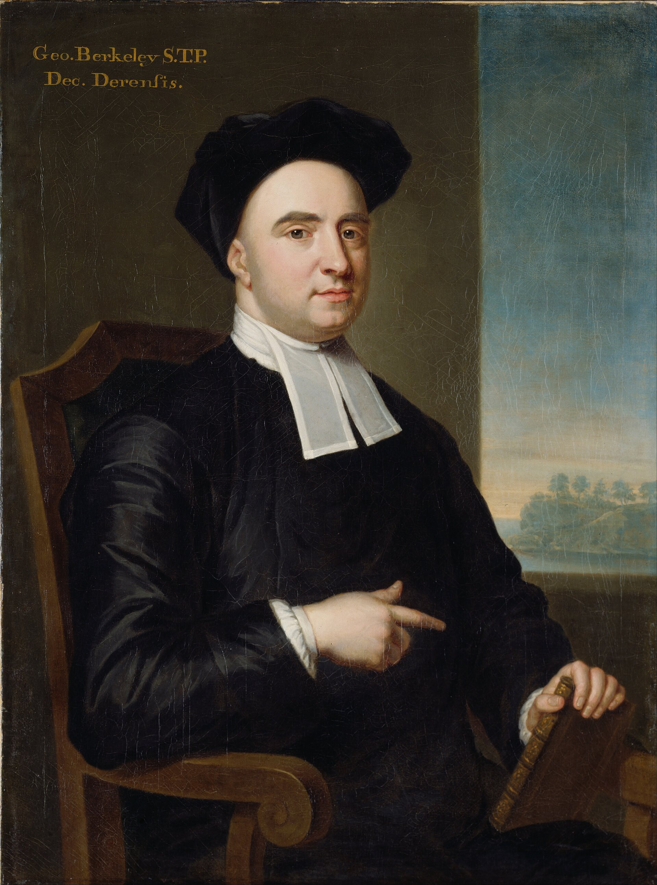
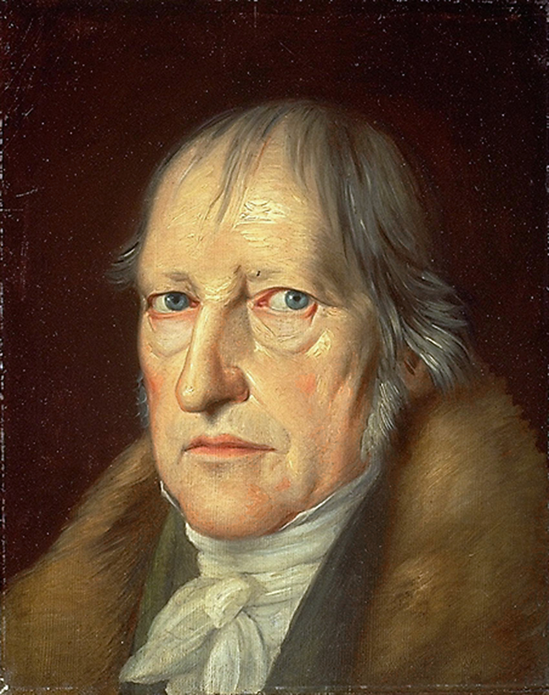
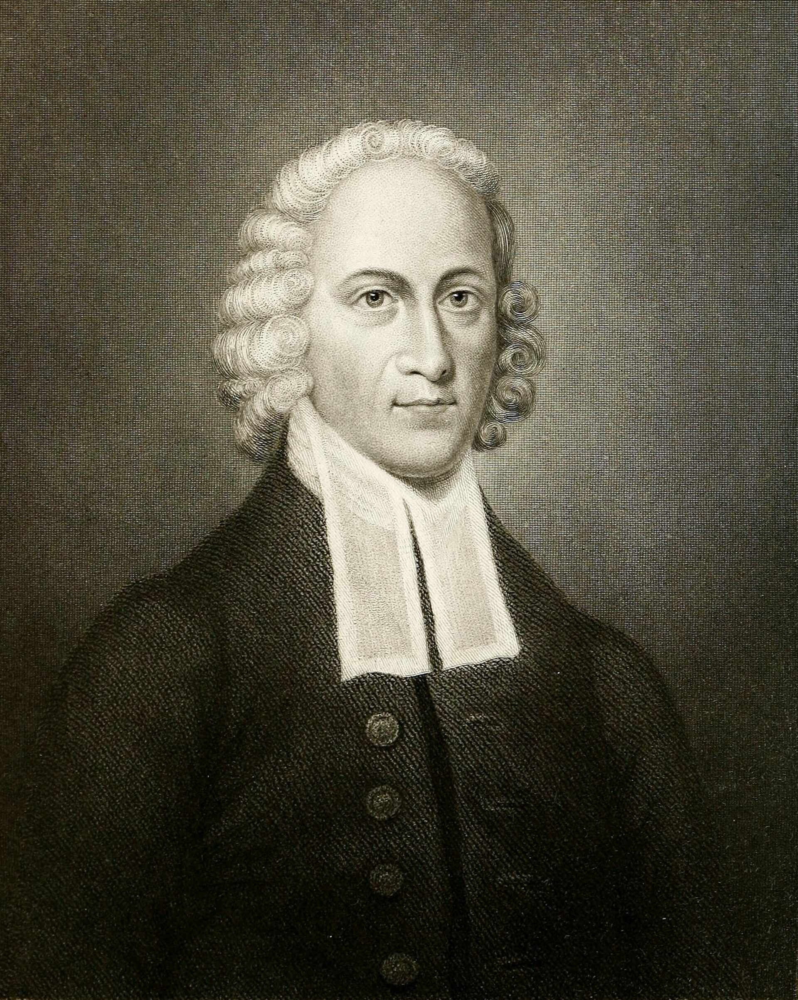

# Appendix J: Operational Idealism -- Beyond Materialism and Traditional Idealism

I need to explain why the ontology of this book is different from anything else in the Reformed tradition, and why it matters. Because most readers will not have noticed. They will have read thirty chapters and thirty appendices and assumed the whole thing was built on the same philosophical foundation as every other systematic theology they've ever encountered. It isn't. And the foundation is the reason the system produces things that no other system can produce.

Every systematic theology in the history of the church has been built on one of three ontological foundations: materialism, realism, or traditional idealism. The materialist says matter is primary and the mind is a product of matter. The realist, which is where the Reformed tradition lives, says the physical world is real, created by God, and exists as an independent reality that God acts upon from outside. The idealist says the mind is primary and matter is a product of the mind. And for two thousand years, Christian theology has assumed that you have to pick one.

This book takes a fourth position. I call it operational idealism. Not because I set out to invent a new ontology, but because the sentence demanded one and I followed it where it led.

## The Four Positions

Before I explain what operational idealism is, let me show you what it isn't. Here is a comparison of the four ontological positions across the questions that matter most for theology.

| Question | Materialism | Realism (Reformed Default) | Traditional Idealism | Operational Idealism |
|----------|-------------|---------------------------|---------------------|---------------------|
| What is primary reality? | Matter. Physical stuff. Atoms and energy. | The physical world, created by God but independent of Him once created. | Mind. Consciousness. Ideas. | God's active thought. Reality IS the thought He is thinking right now. |
| Where does the physical world come from? | It is the fundamental reality. It was always here or emerged from prior physical states. | God created it. It exists as an independent reality that God acts upon from outside. | It is a shadow, an illusion, or a lower order of reality projected by mind. | It is a rendering of God's thought. Real, good, authored, but not the deepest layer. |
| What is the status of the body? | A biological machine. The brain produces the mind. | Good but fallen. Needs redemption. Distinct from the soul. | A prison. Something to escape or transcend. | A rendering that gets upgraded. The resurrection body is MORE physical, not less. |
| What is the relationship between God and the world? | God (if He exists) acts upon an independent world. | God created the world and sustains it through providence, but the world has its own existence apart from His thought. | The world is mental, but the relationship to a personal God is usually unclear. | The world IS God's thought. There is no gap between God and reality. He sustains it by thinking it. |
| What happens at death and resurrection? | The machine stops. Consciousness ends (or God miraculously restarts it). | The soul departs the body. At resurrection, God miraculously reunites soul and body. | The soul escapes the body into a higher spiritual reality. | The rendering engine upgrades. The same thought, rendered at higher resolution. The body gets better, not discarded. |
| What are heaven and hell? | Two separate places. One where God is, one where He isn't. | Two separate places. The saved go to one, the damned to the other. Spatial separation required. | Escape from matter into pure spirit (heaven) or continued bondage to matter (hell). | The same reality experienced through different firmware. Same room. Different capacity to process it. |
| What is science studying? | The fundamental reality. Science explains everything, given enough time. | God's creation. Legitimate but limited. Cannot reach spiritual truths. | Shadows. Science studies appearances, not the real. | God's engineering. Neuroscience maps the hardware He designed. Physics describes the rendering engine He built. |
| What does the resurrection look like? | A miracle. God adds supernatural properties to a natural body. | A miracle. God intervenes from outside to restore and glorify the body. | Irrelevant or metaphorical. The point is to leave the body behind. | Constraints removed. The "miraculous" properties were always there. The old rendering was subtracting from the thought. |
| Who are the historical representatives? | Most modern philosophy. Most secular science. | Augustine. Calvin. Berkhof. Grudem. Hoeksema. Most of the Reformed tradition. | Plato. Berkeley. Hegel. The Gnostics (in extreme form). | Edwards leaned here. Poythress gestured. Kraft formalized. |
| Is there a bridge to secular thought? | No bridge needed. Secular thought already lives here. | Limited. Apologetics argues from evidence, but the ontological gap between God and world makes the bridge fragile. | Academic philosophy engages, but the religious versions are seen as archaic. | Simulation theory. The secular world already suspects reality is information. The sentence meets them there. |

## Why Not Materialism?

Materialism says matter is the fundamental reality and the mind is a product of matter. The brain produces consciousness. Chemistry explains thought. Physics explains everything, given enough time and enough data. This is the default ontology of the secular world, from the Enlightenment to the present.

Materialism cannot explain consciousness. It has tried. For four hundred years it has tried. And the best it has produced is the "hard problem of consciousness," which is a fancy way of saying we don't know why matter thinks. The materialist can map every neuron, trace every synapse, catalog every neurotransmitter, and still cannot explain why any of it produces the subjective experience of being a person. Because it doesn't. The hardware doesn't produce consciousness. The hardware *receives* consciousness. The brain is a television, not a broadcast tower. And materialism, which assumes the television is all there is, will never find the signal by studying the screen.

Materialism also cannot explain information. DNA is a four-letter digital code. Functional information systems do not arise from random processes (Chapter 3). The materialist has no explanation for why the universe is intelligible, why mathematics works, why the laws of physics hold from one moment to the next, or why consciousness exists at all. These are not gaps in knowledge waiting to be filled. They are structural failures of an ontology that starts with matter and tries to derive mind from it. The framework starts with mind and derives matter from it. And the derivation works.

## Why Not Realism?

Realism is the position the Reformed world actually holds, whether it names it or not. It says the physical world is real, created by God, and exists as an independent reality that God acts upon from outside. God made the world. The world is there. God does things to it. Providence is God intervening in an independent system. Miracles are God overriding the system from outside. Heaven and hell are two separate locations because reality requires location. The body and soul are two distinct substances joined together by God and separated at death.

This is the default foundation of every major Reformed systematic theology from Calvin to Grudem. And it is the position this book most directly replaces.

The problem with realism is the gap. If the world exists independently of God's thought, then there is a gap between God and the world. God acts upon the world, but the world has its own existence apart from Him. And that gap produces three consequences the Reformed tradition has never been able to resolve.

First, the gap requires "secondary causes" to explain how God relates to evil. God doesn't directly author evil, the realist says, He works through secondary causes. But secondary causes are just permission with extra steps. And permission is sovereignty with plausible deniability (Chapter 5). The gap between God and the world is the space where the law of Plato hides. Remove the gap, and there is nowhere for Plato to stand.

Second, the gap requires spatial separation for heaven and hell. If reality is a collection of independent objects in locations, then the saved must be in one location and the damned in another. But Revelation 14:10 says the torment happens in the presence of the Lamb. The realist framework cannot hold that verse without breaking. Operational idealism holds it naturally, because the difference between heaven and hell is not location but firmware (Chapter 28).

Third, the gap makes the resurrection a miracle added from outside. God intervenes in the system to add supernatural properties to the body. But Chapter 29 shows that the resurrection is the opposite: constraints removed, not features added. The "miraculous" properties were always there. The old rendering was subtracting from the thought. The realist cannot say this because the realist's body is an independent object, not a rendering of a thought. Remove the gap, and the resurrection is the thought expressed faithfully for the first time.

Realism is not wrong about the physical world being real. The physical is real. The rendering is real. Genesis 1:31 says God called it good. But the physical is not independent. It is not self-sustaining. It is not the primary reality. It is a rendering of a deeper reality, the thought of God, and it depends on that thought for its existence at every moment. Realism honors the physical but misidentifies it as the foundation. Operational idealism honors the physical AND identifies the actual foundation: the Mind that thinks it.

## Why Not Traditional Idealism?

Traditional idealism says mind is the fundamental reality and matter is a product of mind. And that sounds closer to what this book teaches. But it isn't. Because traditional idealism has a fatal problem: it devalues the physical.

Berkeley said things exist because they are perceived. *Esse est percipi.*[^j-berkeley] The tree exists because God perceives it. Remove the perception and the tree disappears. This is clever, and it's not wrong about the dependence of matter on mind. And to be fair to the bishop, his God is not the idle spectator the slogan suggests: Berkeley names Him "the Author of Nature," actively imprinting the ideas of sense in their steady order (*Principles*, secs. 29-33). But the authorship is thin. Order without covenant. Regularity without telos. Benevolence without blood. Berkeley can tell you *that* the tree is kept; he cannot tell you why the tree matters to the One keeping it. It could be different. It could not exist. It's contingent in a way that strips it of dignity.

<figure class="book-figure-portrait">

<figcaption>George Berkeley (John Smibert, c. 1730). The bishop who got the first move right -- matter depends on mind, *esse est percipi* -- and the telos wrong. His God keeps the tree in steady order but never says why the tree matters. Operational idealism takes Berkeley's insight and gives it what he lacked: covenant, purpose, love.</figcaption>
</figure>

Hegel took idealism in a different direction. His Absolute Spirit unfolds through history in a dialectical process, the mind of the universe gradually becoming aware of itself through human consciousness. And Hegel's system is brilliant in its architecture. But it is impersonal. The Absolute Spirit is not a Person. It does not author with intention. It does not love. It does not hold reality together by *personal covenants of love*. And Hegel's idealism became the philosophical backbone of liberal Protestant theology in the nineteenth century -- Strauss and Baur and the Tübingen school, with Feuerbach finishing the slide by reducing theology to anthropology -- which is why the Reformed world threw idealism out entirely. Hegel poisoned the well. And the baby went out with the bathwater.

<figure class="book-figure-portrait">

<figcaption>G.W.F. Hegel (Jakob Schlesinger, 1831). His Absolute Spirit unfolds through history but never loves, never authors with intention, never holds reality together by covenant. Hegel's impersonal idealism became the backbone of liberal Protestant theology -- and so the Reformed world threw idealism out entirely. He poisoned the well, and the baby went out with the bathwater.</figcaption>
</figure>

And the Gnostics took idealism to its extreme. Matter is evil. The body is a prison. The physical world was created by a lesser, malevolent deity, and salvation is escape from matter into pure spirit. The Gnostics despised the body. They despised creation. They despised the flesh that Christ assumed in the incarnation. And every idealist tradition in history has a gravitational pull toward this contempt for the material, because if mind is primary and matter is secondary, it is very easy to slide from "secondary" to "inferior" to "evil."

The framework of this book does not make that slide. And the reason it doesn't is the sentence. The sentence says reality is held together by personal covenants of *love*. Love is not a load-bearing word in Berkeley, or Hegel, or the Gnostics. Love means the Author cares about what He is rendering. Love means the physical world is not an accident, not a shadow, not a prison, not a side effect. It is a thought God is *choosing* to think, and He called it good (Genesis 1:31). The rendering is good. The body is good. The material gets upgraded at the resurrection, not discarded. Jesus ate fish after He rose from the dead (Luke 24:42-43). Thomas touched His wounds (John 20:27). The higher resolution rendering is MORE physical, not less.

That is the anti-Gnostic commitment of operational idealism. The thought is primary. But the rendering is honored. The invisible is more real than the visible. But the visible is *good*.

## The Contemporary Idealist: Donald Hoffman and the Pantheist Exit

Berkeley and Hegel are dead men. The idealist a reader of this book is most likely to actually encounter is alive, on YouTube, and brilliant. Donald Hoffman, a cognitive scientist at the University of California, Irvine, has arrived from the secular side at the framework's own first move, and he is worth pausing on precisely because his conclusions sound so much like these and his foundation is so fatally different.

Hoffman's Interface Theory of Perception holds that spacetime and physical objects are not fundamental. They are a survival-built interface -- desktop icons, in his image -- that evolution shaped for fitness, not for truth. Close the window and the icon is gone; objects do not exist unperceived. His Conscious Realism holds that consciousness is the ground floor and matter is derived from it. By evolutionary game theory and the mathematics of perception he has argued, rigorously, that mind is prior to matter and the physical world is a rendering of something deeper. On that much he is a better ally than most theologians, and the agreement should be stated plainly rather than hidden: Hoffman and this book agree that materialism is false and that the world of objects is a display, not the substance.

And then he walks off the cliff. His fundamental reality is an impersonal network of "conscious agents," and in his more speculative reach, a single infinite consciousness of which every finite mind is a fragment. He is formally non-committal about whether to call it God, but the gravity of the system pulls one direction, and the monists and the mystics feel it and claim him, and he lets them. It is pantheism with an equation attached: all is one consciousness, and we are parts of it. That is the precise conclusion this framework was built to deny, and the denial runs along the line the section below draws in full. The author-and-character distinction developed under *This Is Not Panentheism* is exactly the thing Hoffman lacks. He could not conceive of an Author who thinks a genuine *other* into being, so when he made consciousness fundamental he had nowhere to put us but *inside* God. Operational idealism had somewhere to put us: as thoughts, distinct from the Thinker, real because He thinks us and creaturely for the same reason. Mind-first metaphysics does not collapse the Creator-creature line. It collapses only if you have no doctrine of authorship, and Hoffman has none.

Four things follow, and they are the reason the framework calls his system not a smaller error than materialism but a more dangerous one.

First, pantheism does not enrich the gospel, it deletes it, by necessity and not by accident. If all that exists is one consciousness, there is no holiness, for nothing is set apart from itself; no sin, for your rebellion is only the one consciousness doing something to itself; no gospel, for there is no one outside the predicament to rescue anyone inside it, and a God who is everything cannot save, He can only rearrange Himself; and no love, for love requires an *other*, and pantheism abolished the other on the first page. It arrives in the robes of the highest spirituality and it has quietly emptied the room. It is the most elegant nihilism on the market, and it is selling well.

Second, it deletes the body and the self along with the gospel. The popular fog that flows downstream from Hoffman calls the body a prison and an illusion to escape, and it dissolves the individual *you* -- your name, your face, the self God authored -- back into an impersonal mist where almost nothing of you survives. The framework denies both at the root. The body is *good*, authored good and raised good; the higher resolution rendering is more physical, not less (Chapter 29). And the self is not a drop briefly distinct before it slides back into the ocean. It is a thought God is thinking on purpose, real because He thinks it and never dissolved, because the Author does not stop thinking the ones He loves. And notice what the dissolution actually promises -- that you, at the bottom, are God. That is not a new spirituality. It is the oldest sermon there is, *ye shall be as gods* (Genesis 3:5), re-released in a lab coat. It will not always announce itself, either. It comes wearing our own words: a "cosmic Christ" who is a state of mind and not a Man, a "divine spark" in everyone, "Christ-consciousness." Watch the joint every time. If the Christ handed to you is a feeling, a frequency, or a principle hiding inside you, and not a particular Man with a particular name who died and rose in a body, it is not Christ.

Third, pantheism cannot keep God good, and authorship can. If everything is God, then evil is God too, and the pantheist must either deify evil or dissolve it into illusion, and both are catastrophes. The framework authors evil as a real thought, distinct from the Author, rendered for a named purpose (Isaiah 45:7), without the Author being evil. The novelist writes the murderer without committing the murder. Authorship is the only ontology that can hold God as the source of all things, evil ones included, and the doer of none of them.

Fourth, Hoffman's own foundation forbids his conclusion. He grounds perception in fitness, not truth -- evolution, he says, tuned our senses to keep us alive, not to show us reality, which is exactly why he thinks the interface hides the world. Grant it, and then turn it on him: the theory by which he tells us this is itself the product of those same fitness-tuned faculties. If evolution did not build us to see truth, it did not build Hoffman to theorize it. He has sawed off the branch he is sitting on, and Chapter 25 names the only repair -- a mind can be trusted to reach truth only if a truthful Author aimed it at truth on purpose. Hoffman removed the Author and kept the confidence. Only the framework is entitled to both.

And here is the answer no argument about consciousness can reach and no fog can absorb. You do not meet this with a better theory of mind. You answer a face with a Face. The whole machinery of the mystic exit is about *shedding* the particular -- the body, the name, the self -- to melt back into the undifferentiated One. The center of this faith is the Author who did the exact opposite. The infinite Mind that thinks the whole world into being did not stay a fog. He became particular. *The Word was made flesh* (John 1:14), one Man, at one time, in one body, in a town still on the map (Chapter 6). He came down instead of telling us to climb, was made sin for those who are not divine, and finished it. And He rose in a body, kept the scars, and ate broiled fish in front of His friends (Luke 24:42-43). The risen, particular, scarred Christ is the bone the fog chokes on, because a religion built on escaping matter cannot digest a Man who is matter forever.

So the two idealisms take the same first step and name the Renderer in opposite ways. Hoffman makes Him an impersonal sea we dissolve into; the framework names Him the personal, holy, triune God who speaks us into being and keeps us forever distinct from Himself. Same diagnosis of the disease, opposite physician. The reader thrilled by Hoffman's demolition of materialism should take the thrill and keep walking, because the house he builds on the rubble has no Savior in it, no sin to be saved from, and no one home but the architecture. He is a brilliant man who has seen halfway through the veil and called the light a mirror. The arms are wide enough even for him, and one prays the firmware flash finds him.

## What Makes Operational Idealism Different

The word *operational* matters. It distinguishes this ontology from every other form of idealism in two ways.

First, it is *active*, not passive. The thought is not a static idea existing in some Platonic realm of forms. The thought is God *actively thinking right now*. Reality is sustained moment by moment by the continuous act of God's will. If God stopped thinking a thought, the thing that thought represents would cease to exist. This is not Berkeley's perception, which is passive. This is not Hegel's unfolding, which is impersonal. This is the living God actively sustaining every atom of creation by the word of His power (Hebrews 1:3). It is personal. It is intentional. It is continuous.

Second, it is *productive*. The word operational means it *does things*. It generates vocabulary that no other ontology can generate. The rendering engine. The firmware. The four-layer model of the soul. The glass. Heaven and hell as the same reality. The re-rendering. The resurrection as constraints removed rather than miracles added. None of these concepts are available to a materialist, because a materialist has no framework for reality being information. None of them are available to a realist, because a realist treats the physical world as independent and has no vocabulary for rendering, resolution, or upgrade. And none of them are available to a traditional idealist, because a traditional idealist devalues the very material that these concepts describe and upgrade.

Operational idealism is the ontology that allows a theologian to say, in the same breath, "the invisible is more real than the visible" AND "the physical gets upgraded, not discarded." It holds both. It honors both. And it produces a theological vocabulary that neither materialism nor traditional idealism can match.

And third, it is *held*, not trapped. This is the deepest distinction. Every other form of idealism that has ever existed produces the impulse to escape the rendering. Plato wanted to escape the cave. The Gnostics wanted to escape the body. Berkeley's world dissolves if God stops perceiving. Hegel's Spirit is impersonal, unfolding without love. The simulation theorists want to find the exit and wake up in "base reality." Every one of them sees the code and feels trapped by it.

Operational idealism sees the code and feels held. Because the code has an Author. And the Author is personal. And the Author is love.

*"In him we live, and move, and have our being."* (Acts 17:28)

We are inside the Mind. We know we are inside the Mind. And instead of wanting to escape, we worship. Because the Mind that thinks us is the Mind that holds us. And the rendering is not a prison. The rendering is a love story, authored by a God who called it good and gave it to us freely. The difference between every idealism in history and this one is a single word: held. Not trapped. Not imprisoned. Not deceived. Held. By personal covenants of love. And a man who knows he is held does not look for the exit. He rests.

And fourth, the direction is reversed. Every other philosophy in the history of Christian theology was imported FROM philosophy INTO theology. Plato's ontology was imported by Augustine. Aristotle's categories were imported by Aquinas. Kant's epistemology was imported by the liberal tradition. In every case, the direction was: philosophy first, then theology built on top of it, then Scripture read through the philosophical lens. The philosophy determined what the theology could produce, and the theology determined how Scripture was interpreted.

Operational idealism reverses the direction entirely. The sentence came from Scripture. The theology was derived from the sentence. And the philosophy emerged from the theology because the theology required an ontology that no existing philosophy could provide. The direction is: Scripture first, theology derived, philosophy generated. The philosophy was not chosen. It was produced. By the sentence. From the Word of God.

This reversal is not a minor point. It is the reason the framework produces results that no other system can match. Every system that starts with philosophy is constrained by the philosophy it chose. If you chose realism, your theology can only produce what realism allows. If you chose idealism, your theology can only produce what idealism allows. But if the theology produces its own philosophy, the philosophy is unconstrained by prior commitments. It is shaped by the sentence, not by Plato, not by Aristotle, not by Hegel. And a philosophy shaped by Scripture produces theology that a philosophy shaped by a Greek thinker never could.

## Why Augustine Chose Realism -- And Why It Matters

There is a question the Reformed tradition has never asked, because asking it would threaten the ground it stands on: why is the entire tradition realist? Why did nobody build on idealism? Plato was an idealist. The Forms are the real thing. Matter is the shadow. The invisible is primary. If the church's greatest theologian had taken Plato's idealism straight, the entire history of Western theology would be different.

But Augustine did not take Plato straight. He took Plato through Plotinus, the third-century Neoplatonist. And Plotinus changed the recipe.

Plato said: the Forms are real. Matter is a shadow. The invisible is primary. That is idealism.

Plotinus said: yes, but the Forms emanate downward from "the One" through layers. The One at the top, then Nous (Mind), then Soul, then Matter at the bottom. And matter is the LOWEST emanation. Matter is the farthest point from the One. Matter is where evil lives, not because God authored evil, but because matter is the degradation of the divine as it flows downward from its source. Evil, in the Neoplatonic system, is a privation, an absence of good. The farther you get from the One, the less good there is. And at the bottom, where matter lives, good is nearly absent. That is evil.

Augustine took Plotinus, not Plato. And the import was decisive.

From Plotinus, Augustine received: (1) matter is real, it is the bottom layer of a hierarchy, not a shadow of something else. (2) Evil is a privation of good, an absence, not a thing God created. (3) God acts on the world from outside and above, through layers, not from within as the thinker of the thought. (4) "God is not the author of sin," because evil comes from distance, not from authorship.

That is realism. Not Plato's idealism. A realist hierarchy where matter is the bottom and God acts on it from the top. And Augustine baptized it. He fused Plotinus's hierarchical ontology with Christian Scripture and produced the foundation that every Reformer, every confession, and every systematic theology in the West has been standing on for sixteen centuries.

Calvin built on it. Luther built on it. The Westminster divines built on it. Gill, Clark, Berkhof, Grudem, Hoeksema, every name in Appendix I, built on it. And not one of them questioned the ground in print. One of them questioned it in private: Ronald Nash's testimony is that Gordon Clark's own metaphysics was Berkeleyan idealism -- *to be is to be conceived* in the mind of God -- and that he deliberately kept it out of his books (Appendix I). The rest never questioned it at all.

The irony is this: Plato was closer to the sentence than Augustine was. Plato saw the invisible as primary. The Forms are the real thing. Matter is the rendering. If Augustine had gone straight to Plato, skipped Plotinus, and combined Plato's idealism with Isaiah 45:7 ("I create evil"), he would have arrived at something very close to operational idealism. The invisible is primary. God authors everything, including evil. The physical world is a rendering. But Plotinus got in the way. He turned the invisible-is-primary insight into a matter-is-degraded hierarchy. And Augustine took the hierarchy. And the hierarchy became the floor. And nobody has replaced the floor until now.

This book goes back past Augustine, past Plotinus, to the original insight: the invisible is more real than the visible. And then it does what Plato could not do: it names the Mind. Not an impersonal Form. Not an abstract One. A personal, sovereign, covenant-making God who thinks reality into existence and holds it together by love. That is what Plato almost saw and could not reach. And that is what Augustine almost had and traded for a hierarchy.

## Edwards and the Road Not Taken

Jonathan Edwards is the one figure in Reformed history who came close.

<figure class="book-figure-portrait">

<figcaption>Jonathan Edwards (1703-1758). The one figure in Reformed history who stood in this field three hundred years early -- that the physical world is a series of divine dispositions, reality continuously created moment by moment, things essentially ideas in God's mind. He glimpsed operational idealism in his unpublished notebooks and never built the house. This book picks up where he left off.</figcaption>
</figure>

Edwards held that the physical world is a series of divine dispositions, that God continuously creates reality moment by moment, that physical things are essentially ideas in God's mind. His unpublished *Notes on the Mind* and his dissertation *The End for Which God Created the World* contain passages that read like a preview of operational idealism. Edwards understood that the invisible precedes the visible. Edwards understood that reality depends on God's continuous sustaining act. Edwards was standing in the same field.

But Edwards never built the house. He never named it. He never formalized it into a system. He never connected it to the four-layer model or the firmware or the rendering engine, because he didn't have the vocabulary of computation that the twenty-first century provides. And more importantly, Edwards' theological heirs ignored his idealism entirely. They took his soteriology, his revival theology, his works on the affections, and they left the ontology in the unpublished notebooks. Because the Reformed world didn't want idealism. It wanted realism. And Edwards' most radical insight, the one that could have changed the trajectory of Reformed theology, was filed away and forgotten.

This book picks up where Edwards left off. Not by reading Edwards and extending his work, because I didn't read Edwards' idealist writings until after the framework was already built. The sentence generated the ontology independently. But when I discovered Edwards had been standing in the same field three hundred years earlier, it confirmed something I already suspected: the truth has a way of surfacing wherever an honest mind follows Scripture to where it leads, even if the mind that gets there doesn't have the vocabulary to name what it found. And Edwards was not alone in the field. Gordon Clark stood in it two centuries later and -- per Ronald Nash, who knew him -- knew exactly where he stood: a Berkeleyan idealist in his own metaphysics, *to be is to be conceived*, who chose never to publish it. Twice the sharpest Reformed mind of its century arrived at the threshold, and twice the work stayed in the drawer. It is a shame. It is also a commission: what they declined to publish, this book publishes.

## Why the Reformed World Is Realist

And here is the question that needs to be asked: why has the entire Reformed tradition, from Calvin to the present, operated on realist assumptions? Why did no one follow Edwards into idealism? Why is the field empty?

The answer is Hegel.

Hegel's absolute idealism became the foundation of liberal Protestant theology in the nineteenth century. It was the philosophical engine behind the higher critical method -- Strauss's mythical Gospels, Baur's Tübingen school -- and behind Feuerbach's reduction of theology to anthropology. Much of what the Reformed world spent the nineteenth and twentieth centuries fighting was standing on Hegel's shoulders. And the Reformed response was not to offer a better idealism. It was to reject idealism entirely. If Hegel is the enemy, and Hegel is an idealist, then idealism is the enemy. The logic is clean. It is also wrong.

Van Til came closest to recovering something. His insistence that "there are no brute facts," that all reality is God-interpreted, leans idealist without committing. But Van Til explicitly rejected idealism by name, because he associated the word with Hegel and everything Hegel represented. Van Til tried to carve a middle path, not quite realist, not quite idealist, deliberately neither. Frame inherited the ambiguity. And the rest of the Reformed world never even tried.

Vern Poythress gestured at it. His work on information theory and theology, his claim that the laws of nature are God's speech, his argument that information precedes matter, all of this leans in the right direction. But Poythress never committed. He never said "the physical is a rendering of the thought." He stayed in the safe zone where God's word *governs* matter rather than saying matter IS the thought. Close. But not there.

And so the Reformed world remains uniformly realist. And the cost is that it cannot generate the vocabulary this book generates. It cannot describe heaven and hell as the same reality because its ontology requires two places. It cannot describe the resurrection as constraints removed because its ontology requires miracles added. It cannot describe the glass because its ontology has no framework for the relationship between information and rendering. The realist foundation limits what the theology can produce. And nobody notices, because nobody has seen what the alternative produces.

Until now.

## What Operational Idealism Generates

Let me be specific about what this ontology makes possible that no other ontology can produce.

**The rendering engine** (Chapter 3). If reality is God's thought rendered into matter, then the physical world is a rendering, and renderings have resolutions, constraints, and upgrade paths. This concept does not exist in a realist framework. A realist has matter. Period. There is no rendering to upgrade. There is only the physical world, and if it changes, God must intervene from outside to change it. Operational idealism says the Author upgrades the rendering engine, and the "miracles" are what the thought always looked like before the constraints were imposed.

**The firmware** (Chapters 16-17). If the soul has layers, and the deepest layer contains the boot parameters that determine everything above it, then regeneration is a firmware flash, not an application-layer patch. Therapy works at the application layer. Regeneration works at the firmware layer. This distinction is only possible in a framework that treats the mind as an information-processing system with layers, and that framework is only possible in an ontology that treats reality as information.

**Heaven and hell as the same reality** (Chapter 28). If reality is a thought in the mind of God, and that thought is rendered through firmware, then the same thought rendered through different firmware produces different experiences. The same God, the same presence, the same room. Different firmware. Different experience. This is impossible in a realist framework. A realist needs two places because his ontology requires location. An operational idealist needs one reality because his ontology requires only information and the capacity to process it.

**The glass** (Chapter 28). If the curator is an application-layer function that manages exposure, and if the glass is the curator's wall, then the final state is the glass coming down for everyone. The elect can handle it because they have new firmware and Christ's covering. The reprobate cannot handle it because they have neither. This entire metaphor, the most precise description of the final state the framework produces, requires an ontology that can describe consciousness in terms of information processing. Materialism has no glass because it has no curator. Realism has no glass because its spatial separation makes the metaphor unnecessary -- if the damned are in a different place, there is no shared reality to stand in. Traditional idealism has no glass because it has no body to stand behind it.

**The re-rendering** (Chapter 29). The resurrection body is not a miracle added from outside. It is the thought rendered at higher resolution. The constraints of the old rendering engine are removed, and what was always true about the person becomes visible. Walking through walls is not a supernatural addition. It is what happens when locality constraints are removed. This concept requires an ontology that distinguishes the thought from the rendering. Materialism cannot distinguish them because it doesn't believe in the thought. Realism cannot distinguish them because it treats the physical as independent rather than as a rendering of something deeper. Traditional idealism cannot distinguish them because it doesn't honor the rendering.

**Marriage as rendering, not as sign** (Chapter 10, Chapter 29, Appendix A6). Under realism, marriage is an earthly sacrament that points at a heavenly reality separate from itself. When the heavenly reality arrives in fullness, the earthly sign is no longer needed and dissolves. That is the only eschatology realism permits about marriage, and it is the eschatology the tradition has preached for sixteen centuries. Operational idealism says the sign and the substance are not separate. Marriage IS the rendering of the eternal mystery (Eph 5:31-32) at this resolution. At the resurrection the rendering continues at higher fidelity because the rendering constraints lift, while the thing rendered does not dissolve. The covenant companion is still the covenant companion at the feast. This conclusion is impossible to reach under realism and unavoidable under operational idealism. The ontology had to be swapped first; the eschatology derived itself from the swapped floor. See Appendix A6 for the full exegetical work.

Every one of these concepts traces back to the ontology. And the ontology traces back to the sentence. The sentence generated operational idealism, and operational idealism generated the vocabulary that makes this book possible.

## The Method: Swap the Floor, Re-Derive

Everything listed above traces a single repeatable move. Operational idealism is not just a doctrine the book argues for. Operational idealism is the floor that every other doctrine in the book was re-derived on top of. The method is simple, and it is the master method of the project:

1. **Find the doctrine.** Any doctrine where the Reformed tradition has landed in an unsatisfying or biblically-thin place.
2. **Find the ontology.** Look underneath the doctrine for the realist or Platonic ontology holding the tradition's conclusion in place.
3. **Swap the floor.** Replace realism with operational idealism in the adjacent domain the doctrine depends on.
4. **Re-derive.** Walk back through the same Scripture with the new floor underneath. Watch the doctrine land differently, not because the exegesis changed, but because the ontology under the exegesis changed.

Marriage and eschatology is the book's cleanest worked example, and I had to run the method on it before I could reach the eschatology I now hold.

Under realist ontology, marriage is a sign pointing at a heavenly reality it is not. The sign and the substance are separate. When the substance arrives in fullness, the sign dissolves. Matthew 22:30 reads as marriage-ends-at-death no matter how carefully the exegete handles the verse, because the underlying realism has already decided the conclusion before the exegesis begins. I tried for years to reach a different eschatological reading while still standing on a realist floor, and I could not get there. The conclusion was always baked into the floor, not into the verse.

Swap the floor. Under operational idealism, marriage is not a sign pointing at an external reality. Marriage IS the rendering of the eternal mystery authored in the Mind. The rendering is not a shadow pointing at a substance somewhere else. The rendering IS the substance at this resolution. At the resurrection, rendering constraints lift and the thing rendered continues at higher fidelity. There is no shadow to dissolve because there was never a shadow to begin with. The covenant companion persists.

The shift in conclusion happened in the ontology, not in the verse. Matthew 22:30 reads the same words in both frameworks. What changes is what marriage *is* on the way to the verse. Change the ontology, and the verse lands where the ontology lets it land.

This is how every novel conclusion in the book is reached:

- **Federal headship** dissolves because operational idealism removes the separate-legal-space realism requires (Chapter 11).
- **Common grace** dissolves because there is no independent creation for divine benevolence to operate on outside the elect economy (Chapter 19).
- **Permission language for evil** dissolves because there is no gap for permission to occupy (Chapter 13).
- **Eternal generation** dissolves because the Plotinian-realist hierarchy that makes *generation* intelligible is not the floor the framework stands on (Appendix A1, Appendix N Costume 21).
- **Justification from eternity** holds without the usual objections because the eternal thought was never not-thought; the Author never had a moment when the elect were condemned in His Mind (Chapter 11).
- **Heaven and hell as the same reality** follows because the rendering engine is one engine with two possible firmware states, not two places (Chapter 28).
- **Marriage at the feast** follows because the rendering does not dissolve when constraints lift (Chapter 29, Appendix A6).

Each case runs the same four steps. Find the doctrine. Find the ontology. Swap the floor. Re-derive.

Why name the method out loud here? Because the book's critics almost always attack a surface conclusion without noticing the ontology under it. Marriage at the feast. God as author of evil. No federal headship. No common grace. No eternal generation. Each surface conclusion looks indefensible to a reader standing on realism, because realism cannot hold the conclusion. The critic insists the exegesis is strained. The critic is not wrong about his own side; he genuinely cannot hold the conclusion from where he is standing. What the critic is not seeing is that the framework is not standing where he is. The framework is standing on a different floor, and from that floor the conclusion lands without strain.

If a reader wants to argue with the book, the argument should be at the floor. The surface disputes will keep talking past each other until the ontology question is engaged.

If a reader wants to receive the book, the order is this appendix first (the ontology), then Appendix N (the historical diagnosis of the alternative), then the derivation chapters. In that order the conclusions are not novelty against plain Scripture. They are what plain Scripture has been waiting to say for sixteen centuries, behind a floor the church did not know was there.

## The Bridge

And here is the thing that no materialist ontology and no traditional idealist ontology has ever produced: a bridge to the secular mind that doesn't require the secular mind to accept the Bible first.

The simulation hypothesis is mainstream in secular thought. Bostrom, Musk, Tegmark, the mathematical universe hypothesis, the holographic principle, the information-theoretic approach to physics. The secular world already suspects that reality is information. They already entertain the possibility that the physical world is computed. They already have the vocabulary of rendering, processing, and simulation.

Operational idealism meets them there. Not by borrowing their vocabulary to make an old argument (the way the "God is the programmer" apologists do). But by deriving the same ontology from a different starting point and arriving at the same vocabulary independently. The sentence says reality is God's thought. The physicist says reality might be information. They are describing the same structure from different angles. And the bridge is the moment the secular mind realizes that the theological framework accounts for everything the simulation hypothesis accounts for AND more, because the simulation hypothesis has a simulation but no Simulator, a program but no Programmer, information but no Mind.

Appendix G (The Simulation) is written for that reader. And it is only possible because the ontology is idealist. A realist theologian cannot write Appendix G. He has no bridge. He has matter on one side and God on the other, and the secular mind sees no connection between them. The operational idealist has information on both sides, and the connection is the sentence.

## Why the Rest Falls Apart

Materialism falls apart because it cannot explain consciousness. If matter is all there is, then the mind is an accident of chemistry, and the thought "materialism is true" is just a chemical reaction that has no more claim to truth than any other chemical reaction. The system saws off the branch it is sitting on. It always has.

Realism falls apart because it needs the gap. God over here, the world over there, secondary causes in between, permission language to protect God from authoring evil. The whole system is built on keeping God at arm's length from His own creation, and the arm's length is where Plato lives. Remove the arm's length and you get Isaiah 45:7, and the whole realist structure has no place to stand.

Traditional idealism falls apart because it hates the body. If the mind is primary and matter is secondary, then matter becomes the thing you escape, and the body becomes the prison, and the resurrection becomes an embarrassment instead of the climax. The Gnostics took idealism to its end and it produced contempt for the flesh. That is not Christianity. That is Plato in a robe.

Operational idealism holds because it does the one thing none of the others can do. It honors the invisible as primary AND honors the physical as good. The thought is more real than the matter, AND the matter is a rendering the Author called good, AND the rendering gets upgraded at the resurrection instead of discarded. The body is not a prison. The body is a rendering that gets better. Jesus ate fish after He rose from the dead. The physical is not the enemy. The physical is the thought expressed, and the expression is loved by the Author who expressed it.

And operational idealism holds because it eliminates the gap. No secondary causes. No permission. No arm's length. God thinks the thought and the thought IS the rendering. The distance between God and the world is zero, because the world IS His thought. That is why Isaiah 45:7 works. That is why Colossians 1:17 works. That is why Acts 17:28 works. *"In him we live, and move, and have our being."* Not alongside Him. IN Him. The gap is gone. And when the gap is gone, the theology that depends on the gap goes with it.

The rest falls apart because the rest was built on foundations that require something the sentence does not allow: distance between God and His own thought. Operational idealism is the only ontology that puts God's hand directly on every atom, every event, every sin, every grace, every frame of the filmstrip, without recoil. And the recoil is what every other system was built to do. They were built to protect God from His own creation. And God never asked to be protected.

## Objections and Answers

**"This is just Berkeley with a Christian coat of paint."**

Berkeley said things exist because they are *perceived*. The framework says things exist because they are *authored*. And Berkeley himself could not live inside his own slogan -- he had to name God "the Author of Nature" to keep the world running in order (*Principles*, secs. 29-33). But an author of nature's regularities is still not an Author of persons and covenants. The framework's God is *thinking* the tree into existence right now, deliberately, with purpose, held together by personal covenants of love. The tree matters in this framework. In Berkeley's it is merely kept. That's not a coat of paint. That's a different building.

**"This is Hegel dressed up in Reformed clothing."**

Hegel's Absolute Spirit is impersonal, dialectical, and unfolding. The framework's God is personal, sovereign, and eternal. Hegel's spirit becomes aware of itself through history. The framework's God has always known everything and authored every frame before the first one played. Hegel leads to liberal theology because his system has no fixed truth, only evolving synthesis. The framework has fixed truth because the Author doesn't change His mind. The only thing this framework shares with Hegel is the word "idealism." And that word means something completely different here.

**"Idealism leads to Gnosticism."**

Traditional idealism does, because it devalues the material. Operational idealism does the opposite. Jesus ate fish after the resurrection. The body gets upgraded, not discarded. The rendering improves. Genesis 1:31: God saw everything He had made, and it was very good. The physical world is a thought God is choosing to think, and He called it good. If that's Gnosticism, then the Gnostics owe Genesis an apology.

**"Realism works fine. God created the world and sustains it. There's no reason to replace what isn't broken."**

Because it IS broken. Realism cannot hold Revelation 14:10, torment in the Lamb's presence, without two locations and a contradiction. Realism cannot explain the resurrection without miracles added from outside. Realism requires secondary causes to protect God from authoring evil, which is the law of Plato in a Reformed suit. The building looks fine from the outside. The foundation has a crack. And the crack is the gap between God and the world that realism requires and the sentence eliminates. If God's thought IS the world, there is no gap. No secondary causes. No spatial separation. No miracles from outside. The thought produces everything directly. And the theology that follows from a gapless ontology is richer than anything the gap can produce.

**"The Reformed tradition has been realist for five hundred years. You're departing from the tradition."**

I am. And the tradition has been wrong about the ontology for five hundred years. Not wrong about the soteriology. Not wrong about the doctrines of grace. Not wrong about the glory of God in salvation. Wrong about the *foundation underneath all of it*. The tradition built beautiful theology on a realist foundation that limits what the theology can produce. This book builds the same beautiful theology on an idealist foundation that produces more. The soteriology is the same. The eschatology goes further. The anthropology goes deeper. And the bridge to the secular mind exists for the first time. The tradition is not wrong. It is *limited*. And operational idealism removes the limit.

**"Edwards never formalized this. There's no reason to trust that you have."**

Edwards didn't have the vocabulary. He lived before computation, before information theory, before simulation theory, before neuroscience mapped the amygdala's head start on the reasoning cortex. The twenty-first century gave me tools Edwards didn't have. And the sentence gave me a starting point Edwards never articulated. Edwards had the instinct. This book has the architecture. And the architecture produces results the instinct never could.

**"You're a programmer, not a philosopher. This is amateur ontology."**

Yes. I am a programmer. And that is exactly why I can see what the philosophers missed. Because the philosophers don't think in terms of rendering engines, firmware layers, information processing, and system architecture. They think in terms of substance, essence, form, and matter. And those categories, inherited from Aristotle, have constrained Western philosophy for two thousand years. A programmer looks at reality and sees information being processed. A philosopher looks at reality and sees substances with properties. The programmer's vocabulary is better for this. Not because programmers are smarter than philosophers. Because the vocabulary of computation is closer to the truth than the vocabulary of Aristotle. And the sentence demands a vocabulary that can describe reality as information. Aristotle can't provide it. Computer science can.

## This Is Not Panentheism

The charge will come. It came against Edwards in 2016, when Michael Horton, in *Modern Reformation*, warned that Edwards' idealism represents a problematic panentheistic approach in which *"the only entity that really exists is God, and creaturely actions are little more than divine actions in their visible manifestations."*[^j-horton] Horton cited Charles Hodge's older warning that he *"couldn't discern a hair's breadth between what he called pantheism and Edwards's idealism."* And Horton urged caution regarding Edwards' *"more speculative meanderings"* for those committed to historic Christian orthodoxy.

The charge will come against this book too. And the charge is wrong, for the same reason it was wrong against Edwards.

Pantheism says God IS the creation. The Creator and the creation are identical. There is no distinction. Panentheism says the world is part of God's being, that God depends on the world, or the world is an extension of His substance. Operational idealism says neither of those things. Operational idealism says God THINKS the creation. The creation is a thought in His mind. And the Thinker is not the thought. The Author is not the novel. The Painter is not the painting. The Mind is not its content. The distinction between the Thinker and the thought IS the Creator-creature distinction, maintained as sharply as any realist could ask for. It just does not require spatial separation.

And that is where Horton and Hodge both go wrong. They assume the Creator-creature distinction requires a gap, God in one place, creation in another, with distance between them. When an idealist comes along and says the distinction is between the Thinker and the thought, not between two locations, the realist cannot process it. His vocabulary has only two categories for the relationship between God and world: identity (pantheism) or separation (realism). Since idealism is not separation, the realist calls it identity. But it is neither. It is authorship. And authorship is a third category the realist does not have.

A novelist is not identical to his novel. A novelist is not separated from his novel by a physical gap. The novel exists in the novelist's mind. The novel is real. The characters are real. The story is real. But the novelist and the novel are not the same being. The novelist can stop writing. The novel cannot stop being written. The dependence runs one direction. That is not pantheism. That is not panentheism. That is authorship. And authorship is what the sentence describes.

The analogy has a limit, and the limit sharpens the point. A human novelist writes within time, and the novel exists in the world outside him. The Author thinks outside time, and the rendering exists eternally within the timelessness of His own Mind. The human analogy is the lower-resolution version. The ontology the sentence describes is the higher-resolution reality the analogy points at. The dependence still runs one direction. The distinction still holds. And the timelessness of the Author is what removes the last lingering worry that the rendering could ever coerce Him, exhaust Him, or complete Him.

Horton says the biblical objection is creation *ex nihilo*, that creation exists contingently through God's freedom and love, not from necessity. The framework agrees entirely. God thought a new thought. The thought was not derived from pre-existing material. The thought is contingent on God's will. He could have not thought it. The thought is free. God chose to think it out of love, not necessity. And the thought is distinct from the Thinker. The creation is not God. All three conditions of orthodox creation *ex nihilo* are preserved. Horton cannot find the violation because there is no violation.

And God's aseity is preserved entirely. The Author does not need the rendering to be the Author. He was who He was before the first frame was thought, and He would be who He was if the rendering had never been thought at all. The rendering is freely given, not necessarily extruded. That is the line that divides operational idealism from every form of panentheism ever named. Panentheism requires divine dependence on creation. Authorship refuses it at the ontological root.

And here is Horton's deepest worry. It is not really the ontology. It is the agency. He voices the concern that *"creaturely actions are little more than divine actions in their visible manifestations."* That is a worry about whether the creature is real enough to act. Whether the will of a man is his own act, or only a puppet move in the Author's hand. And the framework answers that worry directly. Creaturely actions are real actions, performed by real creatures, within the authorship of a real God. The rendering is authored, and the characters within the rendering genuinely act. A novelist authors the story, and within the story the characters truly think, truly deliberate, truly choose. The authorship does not collapse the action. The authorship sustains the action. What the framework denies is not creaturely agency. The framework denies that creaturely agency can operate independently of the sustaining Author, which is what the realist slides toward without admitting it. The creature is real. The will is real. The act is real. And none of them are independent of the Author who thinks them moment by moment. Chapters 15 through 17 defend this in detail. Operational idealism does not flatten the creature into God's act. It grounds the creature's act inside God's sustaining thought, which is the only ground that keeps the creature from dissolving into the void the moment the Author stops thinking.

And here is the irony that sits underneath the whole charge. The tradition Horton defends has always confessed Acts 17:28: *"In him we live, and move, and have our being."* Paul at Athens -- the standard Reformed proof text for providence and concursus. That is the sentence of this book in Paul's voice. IN Him. Not alongside Him. Not across a gap from Him. IN Him. The very verse the realist tradition quotes to describe God's providence is the verse the idealist uses to describe the ontology. If we live IN God, and move IN God, and have our being IN God, then the relationship between God and creation is not spatial separation. It is indwelling. And indwelling is what operational idealism describes. The tradition's own proof text undermines the tradition's objection.

And here is the thing that has to be said about the method underneath the charge. Horton cites Hodge. Hodge cited Augustine. Augustine cited Plotinus. Plotinus modified Plato. The chain of authority goes straight back to a pagan philosopher who never opened the Hebrew Scriptures.

The "this is panentheism" charge is not a derivation from Scripture. It is a tradition of men warning against a position that their tradition's founder never derived from the Bible in the first place. The realist ontology was inherited, not exegeted. And the warning against idealism is not a conclusion from the text. The warning is a preference of the inherited ontology, defending itself.

This is the pattern the book has been naming since the preface. Defending instead of deriving. The appeal runs to authority and tradition, not to the text. Show me the verse that says reality must be spatially separated from God. Show me the verse that says the Creator-creature distinction requires a gap. Show me the verse that says "in him we live and move and have our being" does not mean what it says. The verses do not exist. The realist ontology was imported from Plotinus through Augustine and never questioned. And when a framework arrives that questions it, the defense is not exegesis. The defense is "Hodge warned us."

That is circular reasoning in a clerical collar. Hodge assumed realism. Hodge evaluated idealism from inside realism. Hodge concluded that idealism was too close to pantheism. And the conclusion is now cited as if it were an argument. But it is not an argument. It is a presupposition defending itself by appealing to a prior holder of the same presupposition. That is the very circularity Chapter 25 describes. All reasoning is circular. The question is which circle accounts for reality. And the circle that starts with "Hodge said so" accounts for less than the circle that starts with Hebrews 11:3 and Colossians 1:17 and Acts 17:28.

Three categories, not two. Identity. Extension. Authorship. Pantheism, panentheism, and operational idealism. The realist knows only two of them because his tradition came from Plotinus and Plato, and that tradition had only two of them to offer. Scripture has the third. *"In him we live, and move, and have our being."* Paul wrote the third category into the canon. The tradition lost it. The book restores it. This is not panentheism. This is the authorship Scripture already describes, named clearly for the first time in a vocabulary a modern reader can carry.

## The Peace of Zero Distance

And in the end, the ontology is not about arguments. It is about what the ontology produces in the person who holds it. Materialism produces numbness. Realism produces trust with anxiety. Operational idealism produces peace. Real peace. The peace of zero distance between you and the God who thinks you.

| | **Materialism** | **Realism** | **Traditional Idealism** | **Operational Idealism** |
|---|---|---|---|---|
| **What you are** | An accident. Chemistry that happened to become conscious. | A creature. God made you and acts on you from outside. | A consciousness trapped in a body. The body is the prison. The mind seeks escape from matter. | A thought. God is actively thinking you right now. |
| **The distance** | Infinite. There is no God to be near. | Real. God is over here, you are over there, and the gap is always present. | Uncertain. The Mind behind reality may be impersonal or undefined. The relationship is philosophical, not personal. | Zero. You exist IN Him. He is not reaching across anything. He is THINKING you. |
| **The peace available** | Resignation. "Nothing matters, so stop worrying." That is not peace. That is numbness. | Trust across a gap. "God is over there and He cares about me." Real peace, but with anxiety underneath it, because the gap means you are always wondering: is He there? Is He hearing me? Does He see me? | Escape. "The body is the prison and death is the release." That is not peace. That is contempt for the rendering God called good. | Zero distance. You do not have to wonder if God sees you. You are His seeing. You cannot fall out of His mind because you ARE His mind's content. |
| **What prayer is** | Talking to yourself. | Reaching across the gap to a God who is somewhere else. | Meditation toward the abstract. An attempt to transcend the physical into the spiritual. | Communion inside the Mind that is already thinking you. The prayer is happening inside the God who already knows. |
| **What death is** | The chemistry stops. You stop. | The creature separates from the body and crosses the gap to God. | Liberation. Escape from the prison of matter into pure spirit. | The rendering changes. The thought continues. God does not stop thinking you because God does not forget His own thoughts. |

*"In him we live, and move, and have our being."* (Acts 17:28)

In. Not near. Not alongside. Not across a gap. IN. That one word contains the whole peace of operational idealism. And every other ontology puts you somewhere other than IN, and somewhere other than IN is somewhere the peace leaks out.

## Future-Readiness -- The Floor That Holds the Coming Questions

The arguments above are about the floor as it stands now. There is one more test, and it is the test that will matter most over the next century. The questions that are coming are not the questions theology has been asked before. They are technological, cosmological, and identity-altering: artificial intelligence and personhood, mind uploading, transporter scenarios, genetic engineering, posthuman augmentation, contact with extraterrestrial intelligence, the simulation hypothesis, quantum consciousness. Each will test every metaphysical floor that purports to handle reality. Most are coming. Some are already here. The question this appendix presses is: which floor survives the test?

I suspect science will gravitate increasingly toward simulation theory and pantheistic idealism over the next century, as the substrate-of-mind question becomes harder to dismiss and the cosmic-mind hypothesis becomes the only place materialism can retreat to. The simulation hypothesis is already mainstream in academic philosophy (Bostrom, 2003) and in physics-adjacent speculation. Pantheistic idealism is already gaining cultural traction through neuroscience-inflected mysticism, panpsychism, and Eastern-monist syntheses. *Operational idealism is the floor that holds the substance of those moves while keeping the personal Author the rivals must give up.*

| | **Materialism** | **Realism** | **Traditional Idealism** **(Pantheist / Simulation)** | **Operational Idealism** |
|---|---|---|---|---|
| **Simulation hypothesis** | Bites the bullet but cannot ground the regress: who simulates the simulators? | Rejects; substance metaphysics cannot integrate informational ontology. | Compatible by definition. The simulator is the cosmic mind. But the simulator is impersonal or unknowable. | **Subsumes it.** The "simulator" is named: the personal sovereign God. Reality as thought in His mind is the framework's existing claim. |
| **AI consciousness and personhood** | Functionalism plus the unsolved hard problem of consciousness. Over-attributes (chatbots) and under-attributes (sleepers, fetuses). | AI has no soul; therefore not a person. Crisp but assumes substance dualism the rest of the framework cannot survive. | AI participates in cosmic mind to whatever degree it does. Open and ambiguous. | **AI is a person if and only if God authors a person into it.** Outside observers cannot tell. The Author can. The same epistemic humility as the doctrine of election. |
| **Mind uploading** | Pattern-identity fissions; substance-identity cannot draw lines. Both broken. | Soul cannot be uploaded; upload is a copy. Crisp and coherent if substance dualism is granted; the cost is that substance dualism is increasingly hard to defend on its own terms. | Pattern preserved equals identity preserved. Same problem as the materialist pattern view. | **Identity is in the Author's continuous rendering. The Author decides whether the upload is the same person or a new one rendered to look like the original.** Matches the existing answer for resurrection without requiring substance dualism. |
| **Transporter scenarios** | Murder plus copy, or pattern-identity preserved. Both break Trek's working assumption that the crew survives. | Soul cannot be transmitted; transporter equals death plus new person. Crisp and coherent on substance-dualist premises. | Pattern is what matters; identity preserved across transmission. | **The Author renders.** If He renders the same person on the other side, it is the same person. The atoms do not determine. The pattern does not determine. The Author does. Same answer as substance-dualist realism arrives at, reached without the substance-dualist commitment. |
| **Genetic engineering and designer humans** | No deeper question. Engineering is engineering. | Concerns about "what God did not intend." Tradition-bound, unclear answers. | All is mind; engineering rearranges mental patterns. | **God authors each person directly with their nature.** Genetic engineering is a means He uses, not a replacement for the authoring. |
| **Posthuman augmentation** | Ship of Theseus problem. No clean answer. | Soul anchors identity through augmentation. Reasonable on substance-dualist premises; the cost is that substance dualism has to be defended independently. | Identity is fluid; augmentation is just rearrangement. | **The Author renders the whole rendering, biological and augmented layers alike.** No Ship of Theseus problem because the framework was never staked on the substrate, and no substance-dualist commitment required. |
| **Extraterrestrial intelligence** | Persons by functional criteria. No theological vocabulary. | Hard questions about fall and redemption. Lewis's space trilogy territory. No settled answer. | Aliens are emanations of cosmic mind. No special status. No room for redemption history. | **Aliens are thoughts in the Author's mind. He authored them.** Open theological questions about their fall and redemption can be held without breaking the framework. |
| **Quantum consciousness** | Penrose-Hameroff or similar. Still material. Does not change the hard problem. | Does not engage; quantum mechanics already breaks substance-realism. | Confirmation. Observer-dependence supports cosmic mind theories. | **Substrate-agnostic.** Quantum or classical, the rendering is authored. The double-slit experiment is hint, not threat. The observer-dependence is the framework's existing claim. |
| **Hard problem of consciousness** | Unresolved. Eliminativism (Dennett) or hand-waving at emergence. | Soul handles it, but at the cost of substance dualism that does not survive scrutiny. | No problem; mind is primary. But the mind is impersonal. | **No problem. Mind is primary AND personal.** First-person interiority is part of what God renders. |
| **Future-readiness verdict** | Breaks at every test. The same root assumption (matter primary, mind derivative) fails repeatedly. | Holds within its inherited categories but cannot extend. Substance dualism does not survive scrutiny. | Holds the idealist insight but lacks a personal Author. Collapses into impersonal cosmic mind or simulation regress with no protagonist. | **Holds across all scenarios.** The Author authors. Substrate is downstream. The framework is futureproof because it locates reality where reality actually sits. |

The pattern across the chart is the structural failure of materialism, the strained-but-coherent persistence of substance-dualist realism, and the protagonist-less drift of pantheistic idealism. Materialism breaks because the same root assumption (matter primary, mind derivative) fails at every test of personal identity, consciousness, and authorship. Substance-dualist realism handles many of the scenarios with a soul that anchors identity, but the entire structure depends on substance dualism being defensible on its own terms, and substance dualism is increasingly hard to defend in light of modern neuroscience and physics. Pantheistic idealism handles many of the questions but at the cost of the personal Author. The simulator becomes anyone, the mind becomes impersonal, and the cosmic story has no protagonist.

*Operational idealism holds the future scenarios most coherently, because it is the floor that locates reality in the personal authoring of a sovereign Mind without requiring substance dualism and without depersonalizing the Mind.* The framework was not designed for the future questions. It was designed for the substrate question. The future questions all reduce to the substrate question, and operational idealism answers it in a way the rivals struggle to match.

A note on what this chart is and is not. The chart projects the framework forward against scenarios most of which we have not yet experienced. AI consciousness is contested, mind uploading is theoretical, transporters and proven simulation theory are speculative, and contact with extraterrestrial intelligence has not happened. The chart's claim is metaphysical projection, not proof. What it argues is that operational idealism remains *coherent* across these scenarios in a way the rivals struggle with. That is a structural-readiness claim, not a tested claim. The rivals have answers; the question is whether their answers strain or flow. The chart's wager is that operational idealism flows where the rivals strain. The wager will be tested by the century.

When science gravitates further toward simulation theory and pantheistic idealism in the coming decades, as it likely will, the church will face a temptation: either join the gravitation and lose the personal Author, or refuse it and stay on the inherited Reformed-Aristotelian floor that the science is already breaking. Operational idealism is the third option. It accepts the idealist insight and keeps the Author. It accepts the simulation insight and names the Simulator. It accepts the cosmic-mind insight and refuses to depersonalize the Mind. It is what each of those rival positions would be if they had not given up the protagonist. *And the protagonist is the Author of Hebrews 1:3.*

## For Further Study

The following passages speak to the themes of this appendix and are commended to the reader for independent study.

**Reality as sustained by God's active thought and word:** Heb. 1:3; Col. 1:17; Acts 17:28; Neh. 9:6; Ps. 104:29-30; Ps. 33:6; Ps. 33:9; Isa. 40:26; Isa. 46:10; Job 34:14-15; Rev. 4:11.

**The invisible as more real than the visible:** 2 Cor. 4:18; Heb. 11:1; Heb. 11:3; Rom. 1:20; Col. 1:15-16; John 1:1-3; John 1:14; 1 Tim. 1:17; 1 Tim. 6:16.

**The physical creation as good, not evil:** Gen. 1:31; Gen. 2:7; 1 Tim. 4:4; Col. 1:16; Ps. 19:1; Ps. 24:1; Ps. 104:24; Rom. 1:20; Acts 14:17; Rev. 21:1-5.

**Against Gnosticism and the devaluing of the body:** Luke 24:39; Luke 24:42-43; John 20:27; 1 Cor. 6:19-20; 1 Cor. 15:35-44; Rom. 8:11; Rom. 8:23; Phil. 3:20-21; 1 John 4:2; 2 John 1:7.

**God as the Author who thinks reality into existence:** Isa. 45:7; Isa. 46:10; Eph. 1:11; Rom. 11:36; Dan. 4:35; Ps. 115:3; Ps. 135:6; Prov. 16:4; Lam. 3:37-38; Amos 3:6.

[^j-berkeley]: George Berkeley, *A Treatise Concerning the Principles of Human Knowledge* (1710), sec. 3: *esse est percipi* ("to be is to be perceived").

[^j-horton]: Michael S. Horton, "Panentheism and Jonathan Edwards," *Modern Reformation*, April 30, 2016. The "hair's breadth" phrasing is Horton's characterization of Hodge; Hodge's own verdict was that Edwards's continued-creation doctrine "in its consequences, is essentially pantheistic" -- Charles Hodge, *Systematic Theology*, vol. 2, in the discussion of Edwards on original sin.
