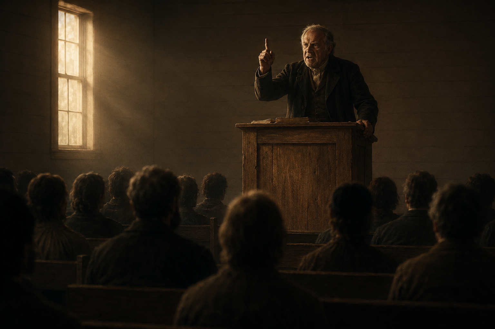
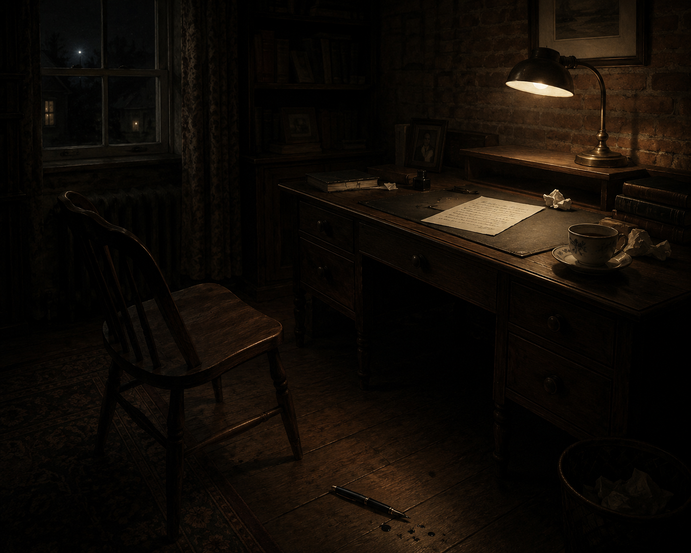
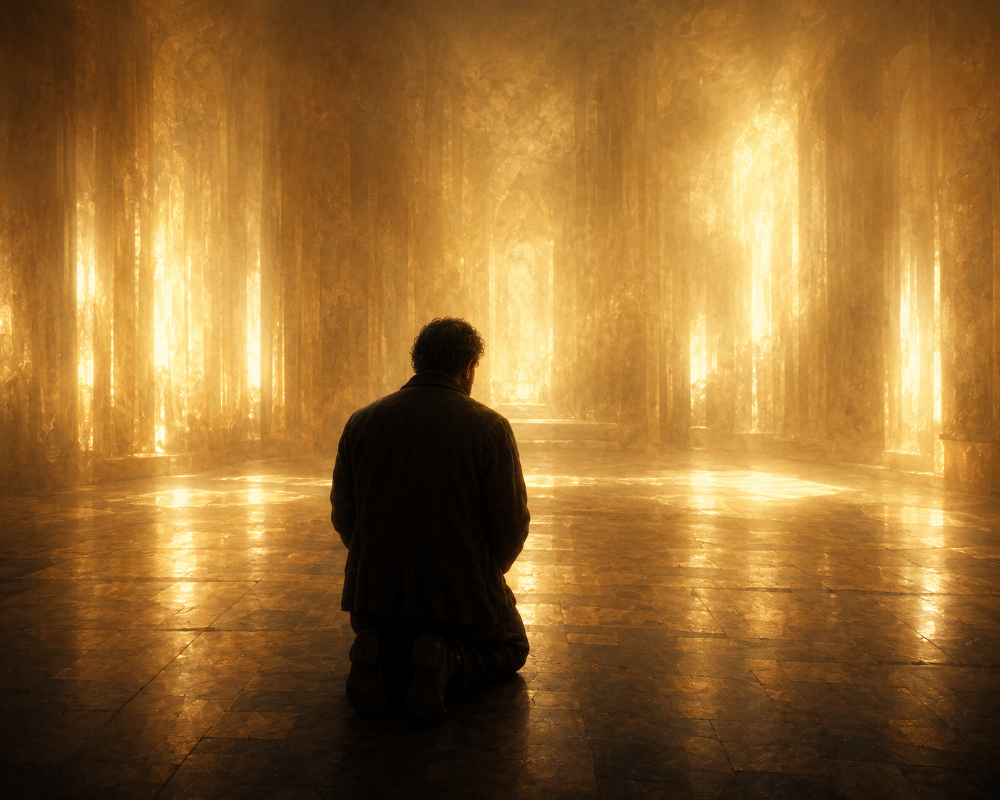
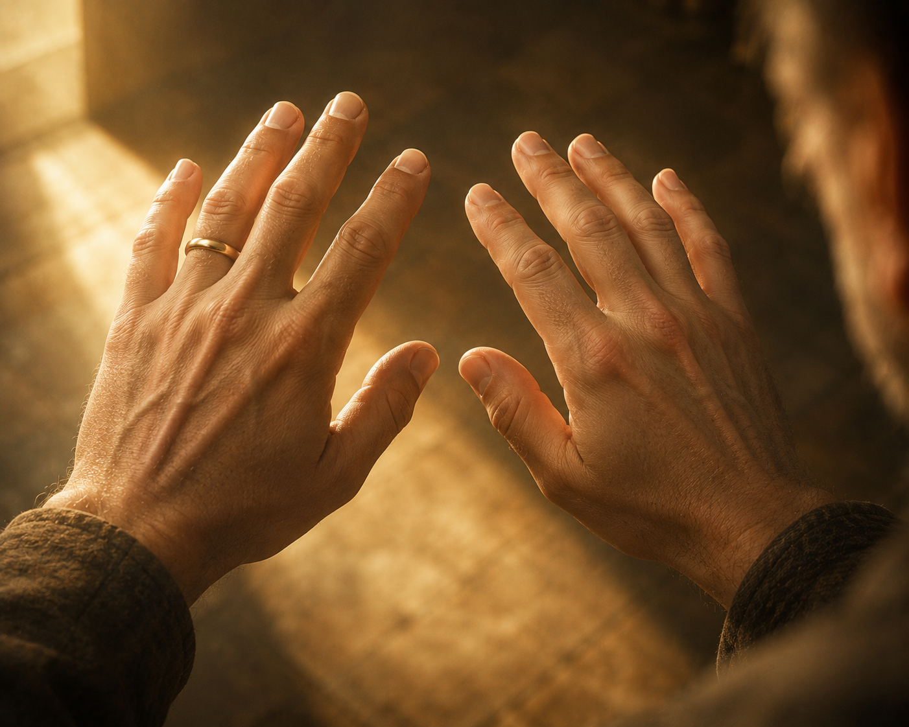
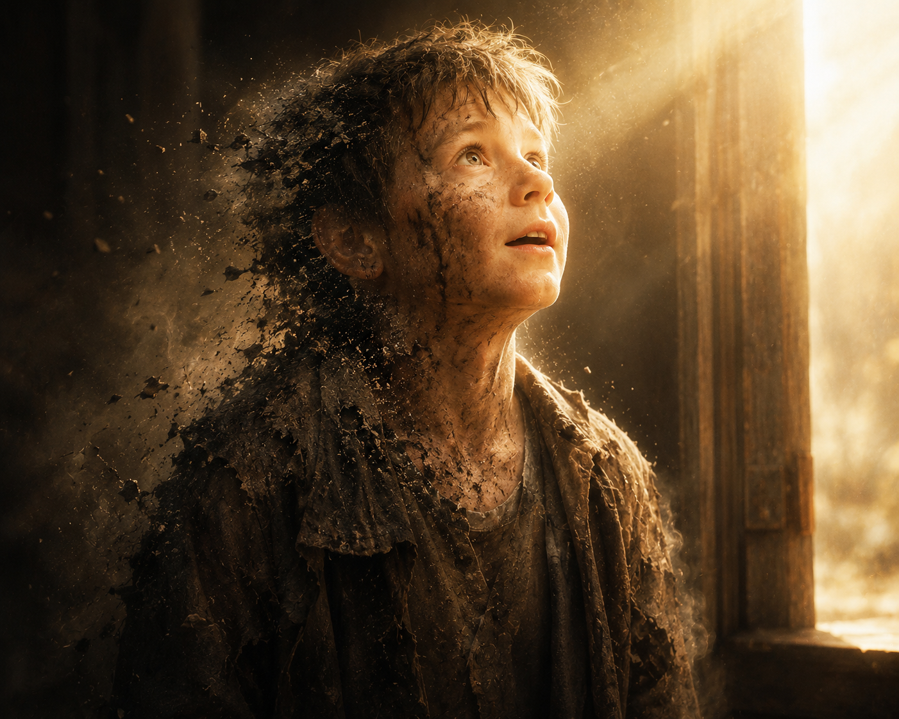
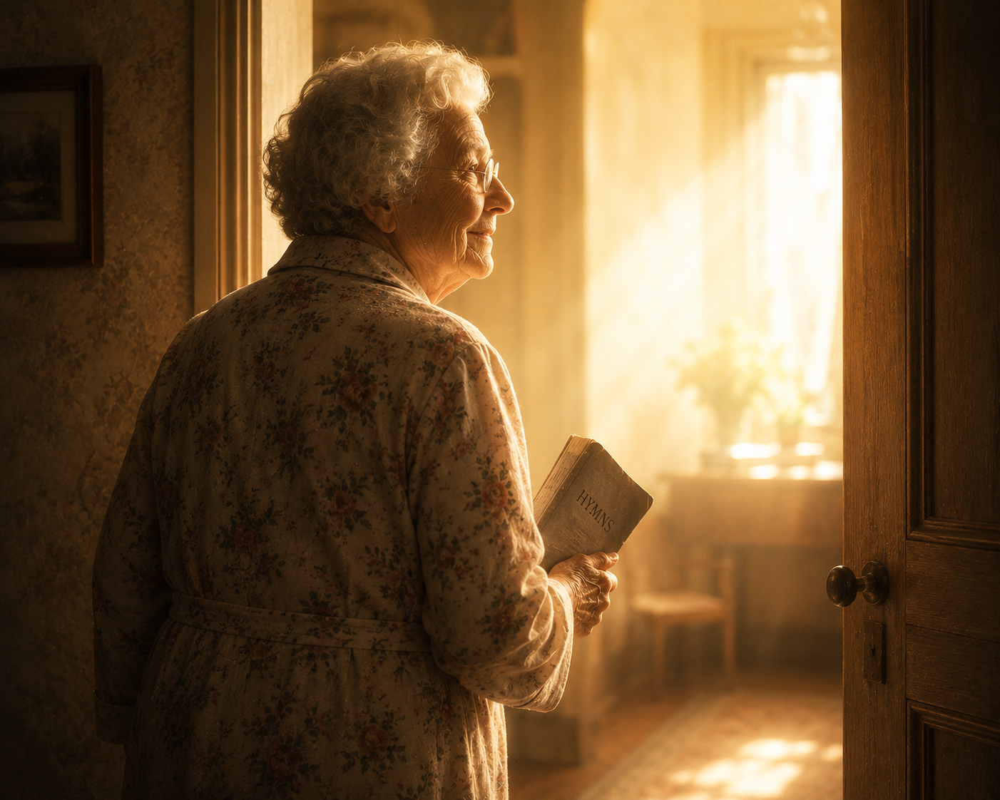
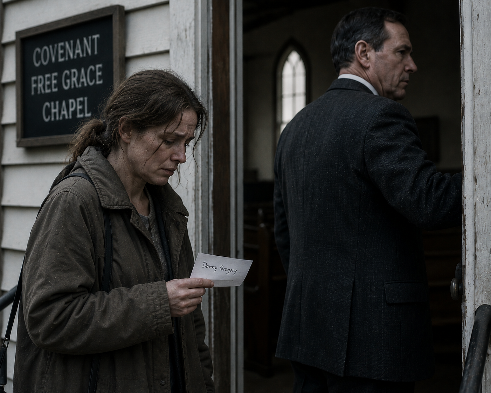
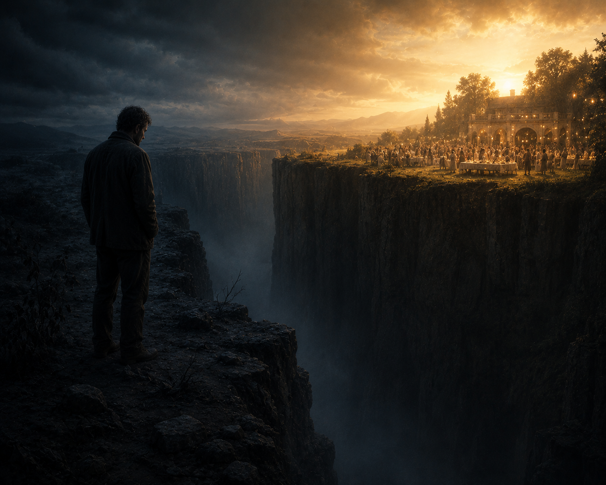
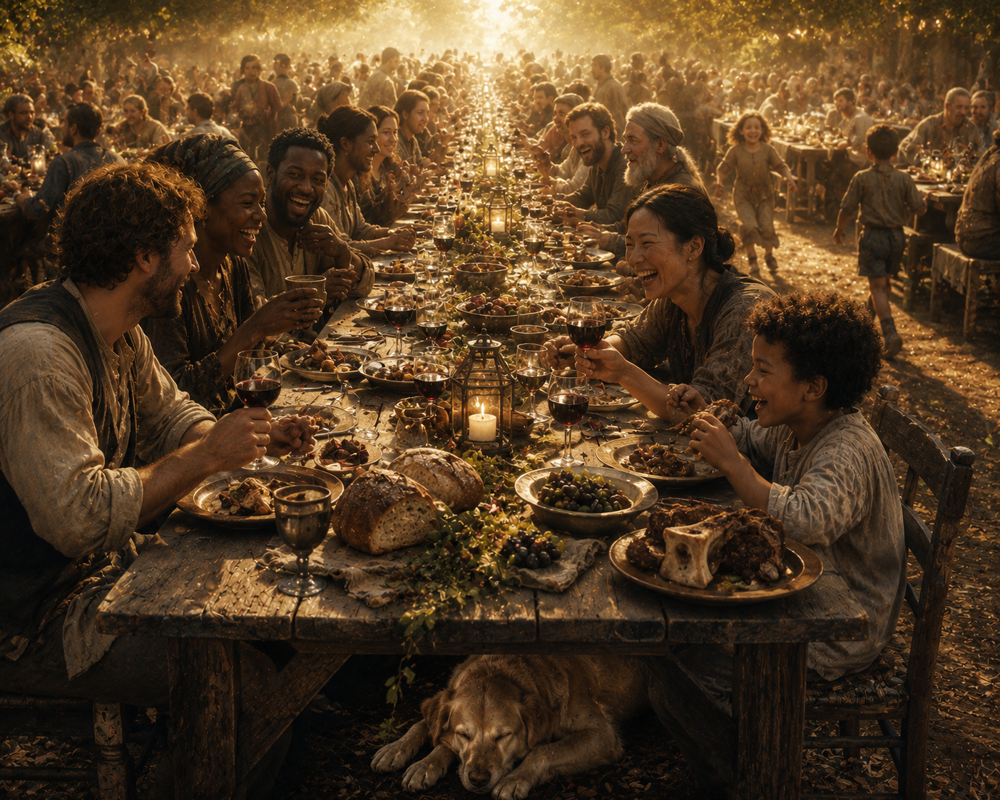

# Appendix L: A Vision of the Final State

## The Gatekeepers

*What follows is a parable. The truth of it is not the circumstances but the substance. The substance represents the final reality according to the Christian scriptures. Scripture references are selective, not exhaustive. The man in the chapel is not any one man. The three at the feast are not any three people. And yet they are also every one of them.*

### I. The Last Sermon

Richard Holloway had preached for forty-two years at Bethany Gospel Chapel, a small non-conformist assembly of forty members on a two-lane road outside the town. He had never been ordained by a presbytery because he did not believe in them. He had never taken a salary because he did not believe in that either. He had worked a job in the mornings and studied in the afternoons and preached on Sundays, and he had been faithful to the doctrines of grace as he understood them, and he had never softened, and he had never compromised, and he had never written a pamphlet he was not certain of.

<figure class="book-figure-float-right"></figure>

On the last Sunday of his life he preached the most satisfying sermon he had preached in years. He stood behind the plain wooden pulpit his father-in-law had built in 1978 and he took as his text Galatians 1:8.

*"But though we, or an angel from heaven, preach any other gospel unto you than that which we have preached unto you, let him be accursed."*

And then he named the man. He said *"A certain young writer has published a book in which he calls free-willers brothers. He has set aside the fence that Paul built with his own blood in the epistle we just read. He has compromised the gospel. I will not compromise the name. I will call him what he is."* And he called him that. And forty amens came back from the congregation, and a few of the older men wept.

<figure class="book-figure-float-left"></figure>

He went home to the small brick house where his wife Margaret had died six years earlier. He heated a cup of tea in the kettle she had used for thirty years. He sat down at his desk to finish a letter to a younger pastor who had asked him for counsel on how to preach against compromise. He wrote three paragraphs. The fourth began with the words *"You must never shrink from naming the wolves."*

He did not finish the sentence. The heart that had carried him for sixty-seven years stopped at ten forty-seven in the evening. His face came down on the letter. The pen rolled off the desk. The tea went cold.

And he opened his eyes in a room of light.

### II. The Vestibule

The room had no walls that he could see. Or it had walls but they were walls of light, and the light was not coming from any source he could locate, and yet the light was not uniform. It gathered in places, as if some part of the room mattered more than another part.

<figure class="book-figure-float-right"></figure>

He was standing. He realized this slowly. His back did not hurt. He had not noticed in life how much his back hurt, because he had always had the habit of not noticing. But now the ache was gone, and its absence was what told him his back had been hurting for forty years.

He looked down at his hands. They were his hands. But they were his hands at thirty. The liver spots were gone. The knuckles were smooth. His wedding ring was on his finger, which surprised him because he had taken it off at Margaret's funeral and worn it around his neck ever since on a chain. Now it was on the finger. It was as it had always been, before.

<figure class="book-figure-float-left"></figure>

He smelled bread.

He had not smelled bread like that since his mother had baked on Saturdays in 1962.

Across the room, a figure was approaching. The figure was not walking exactly. The figure was there, and then the figure was closer, and the closeness seemed to be the choosing of it rather than the crossing of a distance. The figure wore a simple tunic. The tunic was clean but the clean was the kind of clean that made every other clean look dirty. His hands hung at his sides.

When he saw the hands, Richard Holloway fell on his face.

Because the hands had scars in them.

He stayed on his face for a long time. He thought he should say something. He thought he should open with *"I have preached thy gospel, Lord."* He thought he should cite the Book of Romans. But when he opened his mouth, nothing came out, because the room was too large for any words he had memorized.

After a long time, the voice came.

It said only one word.

*"Watch."*

### III. The First

The door on the far side of the room opened.

A man came through it. Richard Holloway knew him at once, because he had just spoken his name from his pulpit four hours earlier.

It was the writer. The compromiser. The young man who had published the book.

Holloway's chest seized. He thought, *He has come for judgment.* He thought, *This is the trial of the heretic.* And a part of him, the part that had preached the sermon four hours before, was relieved. Because the relief of being proven right by the Lord Himself was the relief he had imagined for forty years.

The young man walked toward the figure with the scarred hands. He did not kneel. He walked until he was close enough to be held, and the figure held him, and the figure said, *"Well done, thou good and faithful servant: thou hast been faithful over a few things, I will make thee ruler over many things: enter thou into the joy of thy lord"* (Matthew 25:21).

And the young man wept into the scarred shoulder. Not the weeping of a man receiving a reward. The weeping of a man finally home.

The figure gestured toward another door. The door opened onto music and laughter and the smell of bread and wine.

The young man walked through it.

The door closed behind him.

Holloway stood up slowly. His legs had stopped holding him. He tried to form words. He said, *"Lord."*

The scarred figure turned toward him. There was no anger in the face. There was no welcome either. There was something Holloway could not read.

The voice said, *"Watch."*

### IV. The Second

The door opened again.

The man who came through had no business being in a room made of light. His clothes were soaked. The smell came in first, and the smell was vomit, and urine, and the iron of blood, and the chemical sweetness of whatever poison he had been drinking when he died. He was filthy. His face was crusted. His eyes were the eyes of a man who had not looked anyone in the face for thirty years because his shame was too heavy.

Holloway recoiled. He did not mean to. The recoil was reflex. He had spent his life teaching that the fruit of the Spirit is the evidence of regeneration and that sanctification must follow justification and that a man whose life produces no holiness has never been saved. And this man on the threshold was the visible negation of every sermon he had ever preached about the marks of grace.

The man on the threshold was Danny Mercer. Half his life in prison. Died in an alley behind a Wendy's in Huntington, West Virginia, in a pool of his own vomit.

The figure with the scars walked toward Danny. And as the figure walked, something began to happen to Danny that Holloway did not understand.

The filth fell. Not wiped, not washed. Fell. As though it had no right to stay. The smell lifted. The crust on the face dissolved. The shoulders came up. The eyes came up.

And the face that looked up at the figure was a young face. The face of a boy who had been loved by his mother before his mother died when he was nine. The face before the bottle had taken him. The face before the cell had taken him. The face before the alley had taken him.

<figure class="book-figure-float-left"></figure>

Danny looked at the scarred hands and said, *"You came for me in the cell."*

The figure said, *"I never left."*

Danny wept. He wept the way a man weeps who has not been allowed to weep since he was a child. And the figure held him while he wept, and when he was done the figure said, *"All that the Father giveth me shall come to me; and him that cometh to me I will in no wise cast out"* (John 6:37).

The figure gestured toward the feast door.

Danny walked through.

Holloway's voice came out of his throat before he could think. *"Lord, his life showed no fruit. His life was a ruin. His life --"*

The figure turned.

*"His life was my evidence. He did not forget my name. I did not forget his."*

Holloway opened his mouth. Nothing came.

The figure said, *"Watch."*

### V. The Third

The door opened.

A woman came through it. She was eighty-one years old. She was wearing a flowered housecoat. She had a paper hymnal folded in one hand. She did not look confused. She looked like a woman walking into a kitchen she had cooked in for fifty years.

Her name was Mary Sutcliffe. She had attended Holloway's chapel for three months in 1982 before quietly leaving because the sermons had made her feel stupid and she could never seem to follow the argument. She had joined a small Baptist congregation across town and sung in the choir for forty-two years. She had raised six children with a husband who drank for most of their marriage. She had never read a theology book. Her whole theology was *"Jesus loves me and I love him and he died for me."* She had said it thousands of times in fifty years and had meant it every time.

She walked into the room of light. She saw the figure with the scarred hands. She did not kneel.

She walked to him and she took his hand like she had known him her whole life, which she had, and she said, *"Oh. It's really you!"*

<figure class="book-figure-float-right"></figure>

And the figure laughed. It was the first time Holloway had ever heard a laugh like that. It was the kind of laugh that had been waiting to be laughed since before the foundation of the world. The figure said, *"Mary. Come eat."*

Mary said, *"I brought my hymnal. Is that alright?"*

The figure said, *"You won't need it, but you can keep it if you like."*

Mary smiled. She walked toward the feast door. Before she reached it, she turned and looked at Holloway, and for one moment her face was the face of a woman who had sat in the back pew of his chapel in 1982 and had not understood the sermon and had gone home feeling small.

She did not say anything. She just looked at him.

Then she turned and walked through the door.

Holloway said, *"Lord, she could not articulate the first doctrine of grace. She did not know the difference between a condition and a consequence. She did not --"*

The figure turned.

*"She articulated me every time she spoke."*

### VI. The Filmstrip

The figure turned fully toward Richard Holloway now. The face was the face that had held the young man, and held Danny, and laughed with Mary. But when it was turned toward Holloway, the face did not smile. It did not frown. It was the face of an Author looking at a page.

Holloway stood up straighter. He had rehearsed this in his head for decades. He had practiced the words in the shower and in the car and in the pulpit. He cleared his throat, which did not need clearing but which he cleared out of old habit, and he began.

*"Lord, Lord. Have I not preached in thy name? Have I not defended thy gospel against the compromisers? Have I not called out the heretics from the pulpit? Have I not guarded thy flock against the wolves? Have I not held the line when every other man softened? Lord, I have been faithful. Lord, I have --"*

The figure raised one hand.

*"Watch."*

A filmstrip appeared. It was not on a screen. It was in the air, and then it was in Holloway's own mind, and he could not tell the difference between seeing it and remembering it.

He saw a Sunday morning in 1987. A woman standing in the open doorway of his chapel, holding a piece of paper. Her son's name was written on the paper. Her son was in jail, addicted. She had come asking the pastor to pray for him.

And Holloway saw himself as he had been that morning. He saw his own face looking her up and down. He heard his own voice saying, *"Ma'am, when you can answer the catechism I hand out to new members, we can talk about what prayers are appropriate to offer in this fellowship."* He saw the woman's face fall. He saw her leave. He saw her walk to her car. He saw her sit in the driver's seat and weep.

<figure class="book-figure-float-left"></figure>

Her son was Danny Mercer's older brother. He had died of an overdose in 1991, and his mother had died two years after that, never having found anyone to pray for him.

Holloway fell to his knees.

The filmstrip continued.

He saw Mary Sutcliffe in the back pew of his chapel in 1982. He saw her folding her hands in her lap because she could not follow the sermon. He heard his own voice from the pulpit that Sunday saying, *"There is a simple kind of believing that does not save. The flesh can muster a sentimental trust in a sentimentalized Jesus and mistake that for the operation of sovereign grace."* He saw Mary's cheeks flush. He saw her look down at her lap. He saw her stop coming.

He had never asked her why she stopped. He had noted her absence in his ledger with the word *"insufficient."*

The filmstrip continued.

He saw the young writer at his desk at two in the morning, reading Holloway's denunciation on a laptop screen. He saw the young man's face. He expected to see anger there. He did not. He saw grief. The grief of a younger brother who had hoped an older brother might still be reachable.

He saw the young man close the laptop. He saw him pray. He saw him pray *for Holloway.*

He saw the young man open a different window and keep writing his book.

Holloway fell onto his face.

The filmstrip ran for a long time. It ran for every Sunday. Every pamphlet. Every letter to a younger pastor warning him about the compromisers. Every member turned away at the door for being *"insufficient."* Every weeping widow given a tract instead of a hug.

When the filmstrip ended, Holloway was weeping. Not the weeping of repentance. The weeping of a man who is seeing himself for the first time and cannot un-see what he has seen.

He said, *"Lord. Lord."*

The figure looked at him.

For one moment, and only one, the face of the figure was sad.

The figure said, *"I never knew you"* (Matthew 7:23).

### VII. The Chasm

Holloway tried to rise. He could not. He tried to speak. He could only say *"Lord, Lord, Lord,"* over and over, and each time he said it, he was farther away than the time before.

The room of light began to recede. Not because it moved. Because Holloway was no longer in it.

He found himself at the edge of a great chasm. He could see the feast from here. It was in a resolution his eyes could no longer fully render, but he could make out what was happening. The young man was laughing with a group of saints. Danny was eating bread with his mouth full, and no one cared. Mary was singing a hymn he had heard her hum in 1982. She was harmonizing now. Her voice was fuller than it had been on earth. He realized with a sharp pain that he had never heard her speaking voice, not once in three months, because he had never asked her a question.

The chasm was fixed. He could see it was fixed. The fixedness of it was more real than anything he had ever preached from any pulpit.

<figure class="book-figure-float-right"></figure>

He looked across the chasm, and one more figure came into focus. A man he recognized. A theological writer whose books he had quoted in every sermon for forty years. The man who had taught him the doctrines of grace. The man whose volumes lined the top shelf of Holloway's study.

The man was on the wrong side. His face was twisted in shame.

Their eyes met. The man on the other side of the chasm mouthed two words at Holloway, and Holloway could not hear them, but he knew them.

The words were *"me too."*

Holloway closed his eyes.

The chasm held.

### VIII. The Feast

Through the door, the feast ran to the horizon.

The tables were long. The saints at the tables were saints in bodies. Not ghosts. Not disembodied souls floating through a hymn. Bodies. Upgraded bodies. Bodies that could run and eat and embrace without growing tired. Bodies that were the bodies they had always been but rendered at a resolution earth had never been able to hold.

The wine was real. It was red, and it was aged, and it poured thick. The bread was real. It steamed. The meat was fat and full of marrow, as Isaiah had said it would be (Isaiah 25:6). Children ran between the tables. A dog had found a spot under the head of the feast table and had fallen asleep with its nose on its paws.

<figure class="book-figure-float-left"></figure>

The young writer was at one table with a group of saints Holloway would have recognized as freewillers in life. They were laughing about something together. The writer was holding a cup and the cup was not small.

Danny Mercer was at another table. A woman was sitting next to him. She was younger than she had been when she died. But her eyes were the same. She was his mother. She was not saying anything. She was just holding his hand. He was eating with his other hand and crying a little while he ate. She kept holding his hand.

Mary Sutcliffe was standing on a long rise beyond the tables. A choir was forming. The choir was larger than any choir she had ever sung in. She was not the soloist. She was in the alto section, third row. She had her hymnal open because she wanted to. The man conducting the choir turned around and it was her husband, the one who had drunk for forty-two years. His face was the face he had had at the altar in 1963 when they were married. He smiled at her, and she smiled back, and they sang.

The figure with the scarred hands sat at the head of the table.

He was not separated from the feast. He was not apart in glory. He was sitting at the table, and he was eating, and he was laughing, and he was listening to the saints nearest him tell stories of their lives, and occasionally he would laugh out loud and touch the shoulder of whoever had spoken, and the one he touched would lean into the touch the way a child leans into a parent's hand.

The dog under the table stretched and sighed and did not move.

The feast continued.

It would continue.

### IX. The Close

Somewhere on the other side of the chasm, a man was saying *"Lord, Lord"* in a voice that was growing fainter because he was growing smaller.

At the feast, no one heard him. They were not hearing anything from that side of the chasm. Not because they were cruel. Because the rendering no longer passed through. The chasm was fixed.

The young writer drank from his cup. He knew, though he could not have said how, that the pastor who had denounced him in a pulpit four hours before his death was on the other side. He did not rejoice. He did not mourn. He drank his wine and leaned over and spoke to the saint on his left, who laughed, and the moment passed, and the feast continued.

Danny Mercer's mother kept holding his hand.

Mary Sutcliffe kept singing.

The dog kept sleeping.

The figure with the scarred hands kept listening to a saint who had never been listened to on earth.

Correct doctrine did not save Mary.

Incorrect doctrine did not damn Danny.

Christ saved them both.

The gatekeeper who had built his own fence stood on the wrong side of a gate he had never guarded. The feast he had spent his life keeping the wrong people out of continued without him, because he had never been the one to keep anyone in or out, and because the wrong people had never been wrong, and because the gate had never been his.

There had only ever been one gate.

And the gate was a man with scars in his hands.
