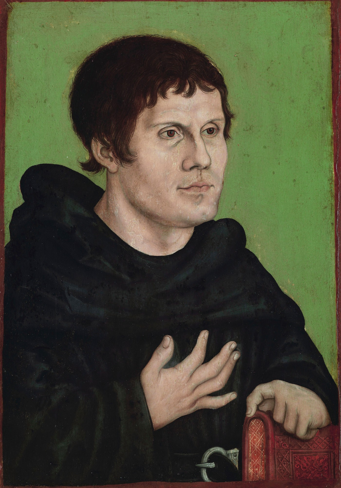

# Appendix M: A New Reformation -- The Five Solas Without the Tradition

The Reformation was built on five solas. *Sola Scriptura. Sola Fide. Sola Gratia. Solus Christus. Soli Deo Gloria.* Scripture alone. Faith alone. Grace alone. Christ alone. To God alone be the glory. Luther and Calvin planted those flags in the ground five hundred years ago and told the world that Christianity does not need Rome, does not need the pope, does not need the magisterium, does not need the tradition to stand.

And then the Reformers turned around and built a tradition.

Confessions, catechisms, seminaries, denominations, hierarchies, creeds that function exactly like the magisterium they rejected, except with different letterhead. And the five solas, which were supposed to free the church from tradition, became the tradition. The battle cry became the fence. And the men inside the fence forgot that the whole point was to tear fences down.

This book gives the five solas back. Without the fence.

<figure class="book-figure-portrait">

<figcaption>Martin Luther as an Augustinian monk (workshop of Lucas Cranach the Elder, after 1546). The friar who pulled the old gospel out of the ground -- still wearing the habit of the system he was about to break. This appendix follows the road he opened, past the confessions where the Reformers stopped.</figcaption>
</figure>

## Sola Scriptura -- Scripture Alone, Actually Meaning It

The Reformers said *Sola Scriptura* and then signed the Westminster Confession. They said the Bible is the final authority and then built a confessional system that functions as the interpretive authority over the Bible. The confession tells the reader what the Bible means. The denomination enforces the confession. And the man who reads the Bible and arrives at a conclusion the confession does not contain is labeled a heretic, not by the Bible, but by the confession the Bible supposedly stands above.

This book derives everything from Scripture. Not from Augustine, not from Calvin, not from the Westminster Confession, not from any creed, confession, or catechism. From the text.

The sentence comes from Hebrews 11:3 (*"things which are seen were not made of things which do appear"*), Colossians 1:17 (*"by him all things consist"*), Acts 17:28 (*"in him we live, and move, and have our being"*), and Isaiah 45:7 (*"I make peace, and create evil"*). Every chapter traces back to Scripture through the derivation map in Appendix B. Every position is derived, not inherited. Every objection is answered from the text, not from the tradition. No confession is required. No tradition is assumed.

*Sola Scriptura* means the man who reads the Bible and follows the logic past the boundaries of every existing confession is doing exactly what Luther did when he followed the logic past the boundaries of Rome. The confession is not the Bible. The tradition is not the text. And the man who evaluates this book by its fidelity to a confession rather than its fidelity to Scripture has replaced one magisterium with another.

## Sola Fide -- Faith Alone, Not Faith Plus Vocabulary

The Reformers said *Sola Fide* and then made correct articulation of the doctrines of grace a condition of assurance. They recovered justification by faith apart from works and then installed a new work: correct theology. The man who rests in Christ but cannot articulate unconditional election is treated as suspect. The man who loves the Lord but uses Arminian vocabulary is labeled a freewiller. The faith is not enough. The vocabulary has to be right too.

This book says faith is a gift of the Spirit (Galatians 5:22), not a duty imposed on the sinner (Chapter 19). Faith is the application layer becoming aware that the firmware has been flashed (Chapter 16). Faith is not a human contribution. It is a fruit. The root produces the fruit, not the other way around.

And Chapter 30 says: if correct doctrine does not save, then incorrect doctrine does not necessarily damn. If a man is resting in Christ alone, that is enough. The vocabulary can be wrong and the faith can be real, because the Spirit who flashes the firmware does not wait for the dictionary to arrive before He does His work.

*Sola Fide* means faith alone. Not faith plus the five points articulated correctly. Not faith plus the right camp. Not faith plus the approval of the men who guard the confessional fence. Faith. Alone. In Christ. And the man who adds a vocabulary requirement to faith has added a work, which is exactly what the Reformers accused Rome of doing.

## Sola Gratia -- Grace Alone, Not Grace Plus Your Decision

The Reformers said *Sola Gratia* and then most of their heirs reintroduced human contribution through the back door. "God is sovereign, BUT man is responsible to believe." That "but" is the back door. It puts a duty back onto the believer. It makes faith a condition the sinner must meet. And a grace that requires a human condition to activate is not grace alone. It is grace plus cooperation.

This book says: no common grace (Chapter 19), no well-meant offer, no human "responsibility" to savingly believe. Grace is particular, effectual, and sovereign. The Spirit gives the faith (Ephesians 2:8). The Spirit flashes the firmware (Chapter 16). The Spirit produces the fruit (Galatians 5:22). Man contributes nothing. Not even the believing.

Rain on the wicked is not grace. It is common bounty, the sustaining of the stage for the sake of the elect (Psalm 92:7). Calling it grace profanes the word. Grace is what Christ did for His bride. It is particular and effectual. It is not shared with the stranger down the street in a "general" sense. A husband who tells his wife he loves someone else too, even "generally," has not honored his wife. And a theology that tells the elect that God "generally" loves the reprobate too has not honored the Bridegroom.

*Sola Gratia* means grace does it all. Not grace does most of it and you do the rest. Not grace makes salvation possible and your decision makes it actual. Grace. Alone. From eternity. Before the foundation of the world. Before the first frame of the filmstrip played. *"Who hath saved us, and called us with an holy calling, not according to our works, but according to his own purpose and grace, which was given us in Christ Jesus before the world began"* (2 Timothy 1:9). Given. Before. Done.

## Solus Christus -- Christ Alone, Not Christ Plus the Moral Law

The Reformers said *Solus Christus* and then kept the moral law as a binding rule for believers. The "third use of the law" survived the Reformation intact, carried through in every major confession. The believer is justified by Christ but guided by the Decalogue. The cross saves but the law rules. Christ is the Savior but Moses is the daily guide.

This book says: the believer is dead to ALL the law (Chapter 20). Not just the ceremonial law. Not just the civil law. All of it. The moral law included. The Ten Commandments included. *"Ye also are become dead to the law by the body of Christ"* (Romans 7:4). Christ is the rule, not the law. The love of Christ constrains (2 Corinthians 5:14), not the written code.

And *Solus Christus* means Christ is the believer's sanctification (1 Corinthians 1:30). Not Christ plus progressive moral improvement. Christ IS the holiness. The believer is as sanctified the day he first believed as the day he dies, because the sanctification is Christ's, not his (Chapter 18).

*Solus Christus* means Christ alone. Not Christ plus Moses for daily guidance. Not Christ plus the moral law as a third use. Not Christ plus progressive sanctification as the evidence of salvation. Christ. Alone. The rule, the sanctification, the justification, the entire package. And the man who adds the moral law back into the believer's daily life has re-yoked the ox that Christ set free (Galatians 5:1).

## Soli Deo Gloria -- To God Alone, Including the Hard Parts

The Reformers said *Soli Deo Gloria* and then exempted God from the authorship of evil. They gave Him the glory for salvation but protected Him from the glory of reprobation. They said God saves by sovereign grace and then said God "permits" evil through secondary causes, as if the Author of the story needed an alibi for the villain He wrote.

This book says: *"I form the light, and create darkness: I make peace, and create evil: I the LORD do all these things"* (Isaiah 45:7). God creates evil. Not permits. Creates. The phrase "God is not the author of sin" is from Plato's *Republic* (Chapter 1), not from Scripture. And a God who needs to be protected from His own authorship is a God who does not get the full glory, because the glory includes the authorship of the hard parts, and the hard parts are the parts the tradition refuses to give Him.

*Soli Deo Gloria* means ALL the glory. The glory of election AND reprobation. The glory of mercy AND judgment. The glory of the two seeds, each authored for a different purpose, both displaying something about God that the other could not display alone (Romans 9:22-23). The glory of the cross AND the glory of the fall that made the cross necessary. Both authored. Both purposeful. Both for His glory.

The Reformers said *Soli Deo Gloria* and meant "to God be the glory for the parts we are comfortable attributing to Him." This book says *Soli Deo Gloria* and means "to God be the glory for everything, including the parts that make the tradition recoil." Because a glory that recoils is not full glory. And a God who is protected from His own authorship is not fully glorified. He is managed. And God does not need managing. He needs worshipping. All of Him. Even the parts that frighten us.

## The Reformation That Did Not Finish

The Reformation was a half-revolution. Luther tore the theological walls down. Calvin rebuilt them with better bricks. And the five solas, which were supposed to be the permanent posture of a church that had learned to stand on Scripture alone, became the letterhead of a new institution that functions exactly like the old one.

This book finishes the revolution. Not by attacking the Reformers. By following them. Following the logic they started but did not complete. Following *Sola Scriptura* past the confessions. Following *Sola Fide* past the vocabulary requirements. Following *Sola Gratia* past the back door of human contribution. Following *Solus Christus* past the third use of the law. Following *Soli Deo Gloria* past the recoil of the law of Plato.

The Reformers said "sola" and meant "mostly." This book says "sola" and means it.

And the men who carry the Reformers' names will be the last to accept it, because finishing the revolution means admitting the revolution was not finished, and the men whose identity is built on the Reformation's completeness cannot afford to admit the Reformation left work undone.

But the work was left undone. And the book that finishes it is sitting on the server, free, in dark mode with music, for anyone honest enough to read it.

The five solas. Derived from Scripture. No tradition required. No confession signed. The Reformation, completed. 

*"I will present the truth softly and wait on the Lord."*

## For Further Study

The following passages speak to the themes of this appendix and are commended to the reader for independent study.

**Sola Scriptura -- Scripture as the final and sufficient authority:** Ps. 12:6; Ps. 119:89; Ps. 119:105; Ps. 119:160; Prov. 30:5-6; Isa. 8:20; Isa. 40:8; Matt. 4:4; Matt. 15:3; Matt. 15:6; Matt. 15:9; Mark 7:7-8; John 10:35; Acts 17:11; 2 Tim. 3:15-17; 2 Pet. 1:19-21; Rev. 22:18-19.

**Sola Fide -- Faith as gift and fruit, not duty or work:** Gal. 5:22; Eph. 2:8-9; Phil. 1:29; John 6:29; John 6:44; John 6:65; Acts 13:48; Acts 16:14; Rom. 12:3; Heb. 12:2; Mark 9:24; Luke 23:42-43; Acts 16:30-31.

**Sola Gratia -- Grace as particular, effectual, and sovereign:** Deut. 7:6-8; Ps. 92:7; Rom. 9:11-16; Rom. 9:21-23; Eph. 1:4-5; 2 Tim. 1:9; Tit. 3:4-7; John 6:37-39; John 10:26-29; John 15:16; Acts 13:48.

**Solus Christus -- Christ as the believer's entire rule and sanctification:** Rom. 6:14; Rom. 7:4; Rom. 8:2-4; Rom. 10:4; 1 Cor. 1:30; Gal. 2:19-20; Gal. 3:24-25; Gal. 5:1; Gal. 5:18; Col. 2:14; Col. 2:20-23; Heb. 7:18-19; Heb. 8:13; Heb. 10:14.

**Soli Deo Gloria -- To God alone be ALL the glory, including the authorship of evil:** Isa. 45:7; Amos 3:6; Lam. 3:38; Prov. 16:4; Rom. 9:17-23; Rom. 11:36; Dan. 4:35; Ps. 115:3; Ps. 135:6; Eph. 1:11; Rev. 4:11.

**Against tradition replacing Scripture:** Matt. 15:1-9; Mark 7:1-13; Col. 2:8; Gal. 1:6-9; Gal. 1:14; 1 Tim. 4:1-5; Tit. 1:14; 2 Thess. 2:15; Acts 5:29.

