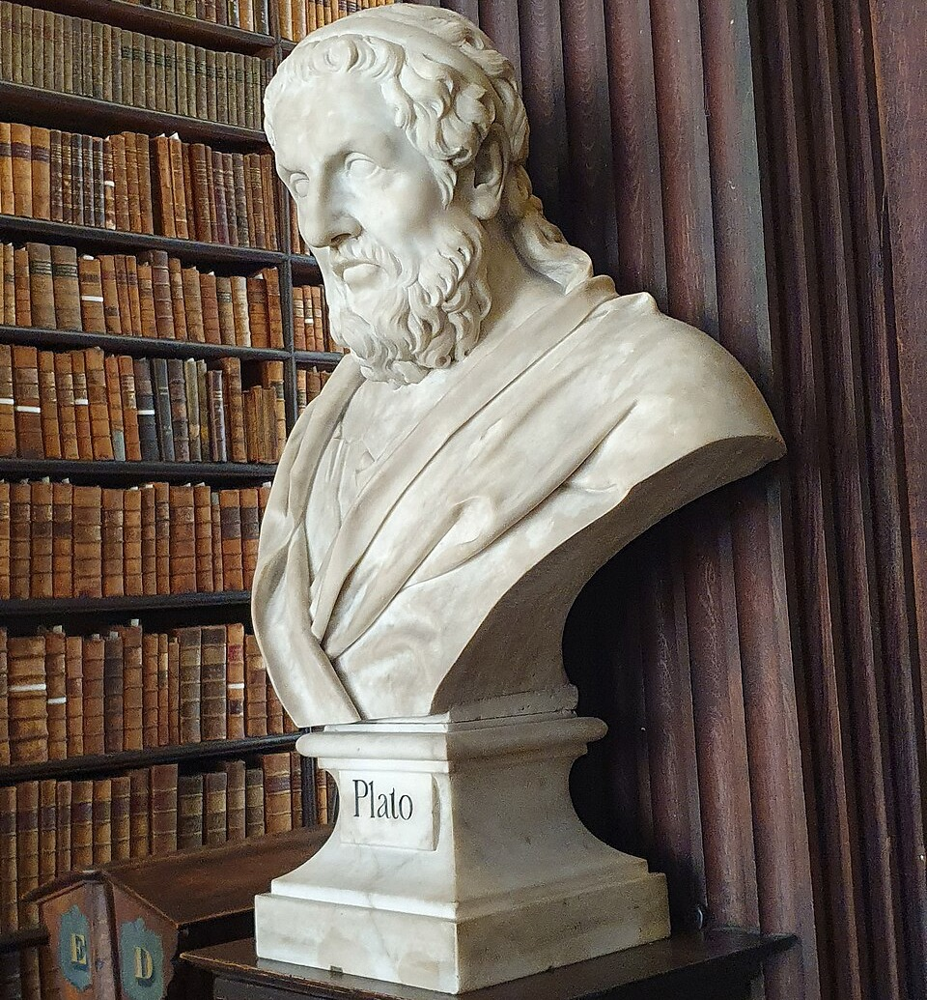
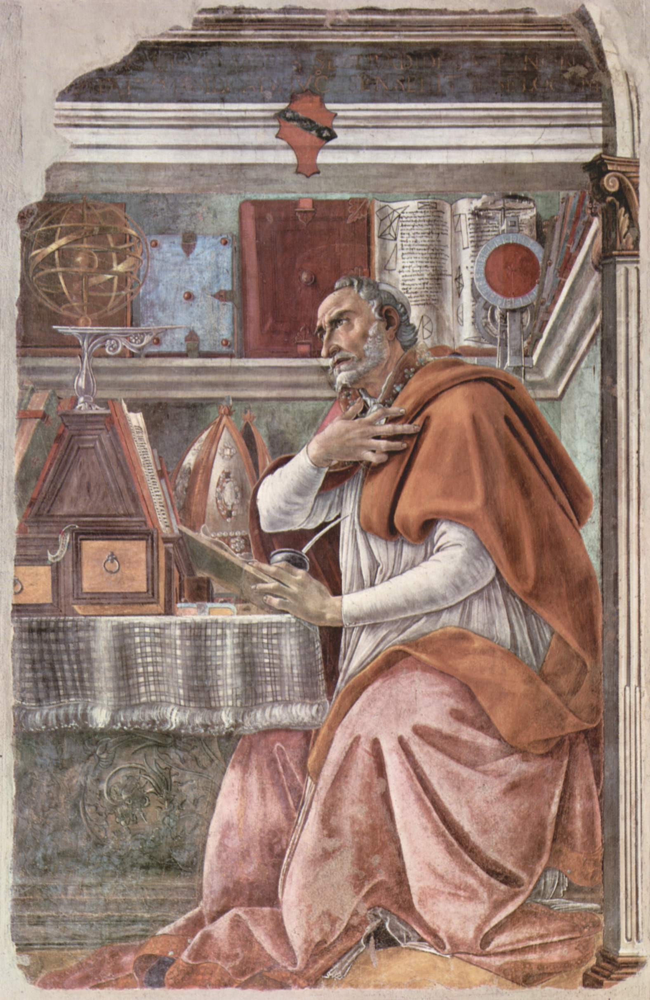

# Appendix N: The Platonic Floor -- The Master Diagnosis Behind Every Other Critique

<figure class="book-figure-center">

<figcaption>Plato (bust, Old Library, Trinity College Dublin). The "law of Plato" -- that the divine must never be named the author of evil -- is the floor this appendix excavates from beneath the house of Christian theology.</figcaption>
</figure>

## Introduction

For thirty years I fought what I thought were many enemies. The fence-policers who called me a compromiser. The Gospelist clergy who whispered that I had drifted. The pastors who preached against me from pulpits without ever calling me. The people who passed videos around naming me a heretic. The friends who stopped writing back. The institutions that ran me off. The denominations whose lines I had crossed. The traditions whose authority I had questioned. The critics who argued in syllogisms and never once in Scripture. The internal (and sometimes external) fights against the small heaven, against the clergy-laity distinction, against the institutional model, against the denial of God's authorship of evil, against the embarrassment of the marriage bed, against the silencing of the widow's hope, against the methods of heresy-hunting that name-call instead of reading. Many fights, in many costumes, across many decades. Each one felt like its own battle.

It was not. It was one fight. It was always one fight. The enemy in every costume was the same enemy, and the enemy was *Plato in the floorboards of Christianity.*

This appendix is the unifying diagnosis. I owed it to the reader earlier. I am offering it now because, until the floor is named, the costumes look like separate enemies. Once the floor is named, the costumes fall off and the same man appears underneath every one of them.

The framework's other appendices have addressed Platonism in pieces. Appendix I traced Augustine's import of the Plotinus-corrupted Plato. Appendix J explained why the Reformed tradition has been realist instead of idealist. Chapter 1 named the law of Plato in its ethical form. Chapter 13 returned to it. Appendix A6 diagnosed the small heaven as Platonic. Chapter 10 named the Platonic shame attached to the marriage bed. Each of these is a scalpel against one organ of the disease. *This appendix is the diagnosis of the body.*

If the reader takes nothing else from the book, take this. *Plato is the floor under most of what is wrong with Western Christianity since the fourth century.* The Reformers reformed the soteriology. They did not reform the floor. Sixteen hundred years of building has happened on top of a foundation that was never the gospel's foundation. The framework I have offered is not a new doctrine. *It is a new floor.* On it, the costumes the institutional church has been wearing for sixteen centuries fall off at once, because they had no anchor in Christ. They had an anchor in Plato. Cut the anchor and the costumes drift away.

What follows is the catalogue. Read it slowly. Test your own framework against it. The mirror is not personal. The mirror only shows what is there. If your framework is Christian to its floor, this appendix will not threaten you. If your framework has Plato in the floorboards, the mirror will render where he is. Either way, the assignment is honest. Look. Decide. The Author handles the rest.

## Part I: Plato 101 -- What He Got Right and What He Got Wrong

### What Plato Got Right

Plato's central insight, the one that the framework keeps and honors, is *idealism.* The invisible is more real than the visible. The forms are the substance. The physical world is a rendering of something prior, deeper, and more enduring than itself. A chair is a shadow of the form of "chair." A sunset is a shadow of the form of beauty. The visible world is a copy. The invisible world is the substance.

This is correct. The framework agrees with Plato here. *Everything that exists is a thought in the mind of God.* That sentence is operational idealism rendered in covenant language. Mind precedes matter. The invisible authors the visible. Plato's ontology, stripped of his ethics and his anthropology, is the philosophical insight closest to what Scripture itself teaches when it says *"the things which are seen were not made of things which do appear"* (Hebrews 11:3). Plato saw the architecture. He saw it without naming the Architect. The framework names what Plato could not name: the personal, sovereign, covenant-making Mind whose thoughts are the structure he glimpsed.

I take from Plato his ontology and reject his ethics. I use his best insight and throw out his worst errors.

### What Plato Got Wrong (Error #1: The Body-Soul Hierarchy)

Plato's *Phaedo* gives us the philosophical foundation that has poisoned Christian anthropology for sixteen hundred years. The body is the prison of the soul. Death is the soul's liberation from matter. The wise man longs for death because death frees the spirit from the corrupting influence of the flesh. Matter is lower. Spirit is higher. The body is suspect.

This is wrong, and Scripture is wrong against it on every page. The Author called matter good when He made it. Genesis 1 repeats the verdict seven times: *"and God saw that it was good."* Christ took on flesh and the Word *"was made flesh, and dwelt among us"* (John 1:14). The resurrection is the redemption of the body, not its discarding. The new creation is a new earth, not an evacuation from earth. The marriage supper of the Lamb has bodies eating food. *Christianity is the most embodied religion in the world,* and Plato's anthropology is its most persistent infection.

### What Plato Got Wrong (Error #2: The Republic Axiom on Evil)

Plato's *Republic* contains the second poison: *the divine cannot be the author of evil.* Plato argued, in defense of the gods against the poets, that no proper deity could be the source of suffering or sin. The gods must be vindicated from any role in the bad things that happen. The good must be insulated from the evil at the level of metaphysical responsibility.

Here is Plato saying it himself: *"Then God, if he be good, is not the author of all things, as the many assert, but he is the cause of a few things only, and not of most things that occur to men. For few are the goods of human life, and many are the evils, and the good is to be attributed to God alone; of the evils the causes are to be sought elsewhere, and not in him"* (Republic II.379c, Jowett). And he makes it the law of the city: any poet or speaker who proposes the alternative is to be banned, and the alternative itself is to be *"strenuously denied, and not to be said or sung or heard in verse or prose by any one whether old or young in any well-ordered commonwealth. Such a fiction is suicidal, ruinous, impious"* (Republic II.380b). Plato did not just teach the axiom. He forbade the alternative within the ideal city he was constructing.

The Hebrews wrote the alternative anyway. Plato's prohibition was binding only inside the *kallipolis* he was constructing on paper; the people of God were writing in caves and palaces and ash-heaps a thousand miles east, with no Greek policeman patrolling their pages. The Treatise on the Two Spirits at Qumran, two centuries before Christ: *"All that is now and ever shall be originates with the God of knowledge"* (1QS 3.15-17, Wise/Abegg/Cook). And further: *"He has created the spirits of light and darkness, and on these has founded every work, on their counsels every service, on their ways every visitation"* (1QS 3.25-26, Vermes). The Thanksgiving Hymns: *"Nothing is done without thee and nothing is known unless Thou desire it"* (1QHodayot IX, Vermes). Amos: *"Shall there be evil in a city, and the LORD hath not done it?"* (Amos 3:6). Lamentations: *"Out of the mouth of the most High proceedeth not evil and good?"* (Lamentations 3:37-38). Hannah: *"The LORD killeth, and maketh alive"* (1 Samuel 2:6). Moses at the burning bush: *"Who maketh the dumb, or deaf . . . have not I the LORD?"* (Exodus 4:11). Moses on Nebo: *"I kill, and I make alive; I wound, and I heal"* (Deuteronomy 32:39). Job on the ash-heap: *"Shall we receive good at the hand of God, and shall we not receive evil? In all this did not Job sin with his lips"* (Job 2:10). And the apostolic church praying after the cross: *"For to do whatsoever thy hand and thy counsel determined before to be done"* (Acts 4:27-28). Plato wrote a law against the sentence. The Hebrews wrote the sentence anyway, in the desert, in the Pentateuch, in the prophets, in the historical books, in the wisdom literature, and in the New Testament. Chapter 13 quotes the catalog at length.

This Platonic axiom became the *law of Plato* that has dominated Christian theodicy from the Patristic period to the present. It is the assumption that requires "secondary causes" to keep God at arm's length from anything bad. It is the assumption that requires permission language instead of authoring language for evil. It is the assumption against which Isaiah 45:7 stands like a wall: *"I form the light, and create darkness: I make peace, and create evil: I the Lord do all these things."* Scripture does not accept Plato's law. The Western tradition, having absorbed Plato through Plotinus through Augustine, has spent sixteen hundred years trying to soften Isaiah 45:7 to fit Plato's axiom. The Reformation did not undo the absorption; the Reformers stayed on Augustine's floor at this point and inherited the softening with the rest of the Augustinian theodicy. The framework rejects the axiom and reads Isaiah 45:7 straight, alongside the Hebrew counter-floor catalogued just above.

### What Plato Got Wrong (Error #3 -- Through Plotinus: The Realist Hierarchy)

Plato himself was an idealist. His philosophical heir Plotinus, some six centuries later, bent the system into a hierarchical realism. The One sits at the top. From it emanates the Nous (mind). From the Nous emanates the Soul. From the Soul emanates Matter, at the bottom of the hierarchy. Reality is a downward cascade with God outside acting upon a creation that is, at its lower levels, real but inferior.

This is the system Augustine inherited. Not Plato's pure idealism. Plotinus's realist corruption of it. The Western Christian tradition, building on Augustine, has stood on Plotinus's hierarchy ever since, with God on one side acting upon a separate creation on the other side, with permission language to keep Him from the evil that happens in the lower levels. *That is not Plato. That is Plotinus baptized as Plato.* The framework returns to the original idealism Plato glimpsed and bypasses the Plotinus corruption.

### Summary of Plato's Errors

1. *Body-soul hierarchy* with body inferior. Wrong. Matter is the rendering of the invisible thought, not its inferior shadow.
2. *Republic ethics* requiring God to be insulated from evil. Wrong. Scripture says God authors evil for His purposes.
3. *(Through Plotinus) Realist hierarchical ontology.* Wrong. Reality is the Author's thought, not a separate substance acted upon from outside.

## Part II: How the Errors Entered Christianity

The pipeline is not mysterious. Plato (4th c. BC) → Plotinus (3rd c. AD, Neoplatonist corruption) → Augustine (4th-5th c. AD, the chief importer) → the Western theological tradition.

Augustine of Hippo was a Neoplatonist before he was a Christian. He studied Plotinus. He absorbed both the body-soul hierarchy and the Republic ethical axiom. When he became Christian, he carried both into his theology and built a framework that became the foundation of Western Christianity for the next sixteen centuries. Calvin built on Augustine. Luther built on Augustine. The Westminster Divines built on Augustine. Gill, Clark, Berkhof, Grudem, Hoeksema, every name in the Reformed tradition's chart, built on Augustine's foundation. They disagreed about the building. None of them questioned the ground it stood on.

<figure class="book-figure-portrait">

<figcaption>Augustine in his study (Sandro Botticelli, c. 1480, fresco, Church of Ognissanti, Florence). The most powerful mind of the early church -- and the chief importer of the Platonic floor. He read Plotinus before he read Paul and carried the hierarchy in with him. Calvin built on Augustine. Luther built on Augustine. None of them questioned the ground.</figcaption>
</figure>

Appendix I traces this pipeline in detail. Appendix J develops the alternative. This appendix presupposes that work and shows what the Augustinian inheritance has produced in the costumes Christianity wears today.

The Eastern Church inherited the same Plotinian floor through different channels (the Cappadocians, Pseudo-Dionysius, Maximus the Confessor) and produced its own costume set: tradition-over-Scripture in a sharper form, the elaborate sacramental hierarchy, the icon system, the privation theory of evil. Eastern Orthodoxy has its own Platonic floor, perhaps even more thoroughly absorbed than the West's, because it never had a Reformation to clear out even the most surface accretions.

The Reformation cleared out some of the visible costumes (indulgences, Marian devotion, the papacy as such). It did not touch the floor. It rebuilt the soteriology on top of the same foundation. Five hundred years later, the foundation still holds the entire Reformed tradition, including its most polemical Baptist subgroups, in alignment with patterns Plato authored and Plotinus systematized and Augustine baptized.

## Part III: The Costumes -- The Catalogue of Platonic Errors in Modern Christianity

What follows is the catalogue. Each entry has the same structure: the Christian appearance, the Platonic substrate, the damage, the framework's correction. The reader is invited to test his own theology against each entry. This is the mirror. The reflection belongs to the reader.

**The twenty-three costumes at a glance.** Each is expounded in full below; this table is the map.

| # | Costume | Wears the disguise of | The framework's answer |
|---|---------|-----------------------|------------------------|
| 1 | Tradition Over Scripture *(the master costume)* | "The Church has always taught this" | Scripture is the floor; tradition is downstream commentary, not the foundation |
| 2 | Phariseeism | Defending sound doctrine | Doctrine and the saint are both God's thoughts -- the doctrine is for the saint |
| 3 | Gospelism | Defending the gospel against compromisers | The gospel is rendered in saints, not in fences |
| 4 | The Small Heaven | Christ-only worship in eternity | Heaven holds the throne and the feast and the bodies and the dog under the table |
| 5 | Fence-Policing | Discernment, protecting the flock | Christ is the only gate; the fence is not the gospel |
| 6 | The Clergy-Laity Distinction | The ordained ministry, the preaching office | Every saint is rendered directly by the Author; no priestly hierarchy |
| 7 | The Institutional Church Model | The visible church, order, membership | The church is the gathered saints, not the institution that claims them |
| 8 | The Denigration of the Marriage Bed | Holiness in marriage, proper bounds | The marriage bed is undefiled -- a window onto the eternal feast |
| 9 | The Shame of Grief | The widow should fix on Christ, not her dead husband | Christ authored the love; the covenant companion persists -- she will see him again |
| 10 | The Free-Willer Accusation as Tribal Test | Defending sovereign grace | Resting in Christ is the brother test, not articulating the mechanism |
| 11 | Iconoclast Overreach | Defending the Second Commandment | It forbids idolatrous worship, not narrative renderings of Christ |
| 12 | Sentimental Universal Love | "God loves everyone equally" | God's love is personal and particular -- Jacob loved, Esau hated (Romans 9) |
| 13 | The "God Cannot Author Evil" Axiom | Defending divine holiness | Isaiah 45:7 -- God creates evil; the ban is Plato's, not Scripture's |
| 14 | The Eschatological Embarrassment | "The world is not our home" | The new creation is more embodied, not less |
| 15 | The Bare Memorial Reduction of the Lord's Supper | "It is just a memorial, just bread" | Bread is bread, but the Supper renders the covenant -- not a bare memory |
| 16 | The Ascetic Suspicion of Pleasure | Holiness, self-denial, avoiding worldliness | Christ ate, drank, attended weddings; pleasure in covenant is sacrament |
| 17 | The Disembodied Atonement Theories | Theological pluralism on the mechanism | The actual body of Christ bore the actual sin -- embodied substitution |
| 18 | The Trichotomy with Body Lowest | Body-soul-spirit anthropology | Body and soul are one person at different rendering layers; no hierarchy |
| 19 | The Dispensational Schemes | Taking the Bible literally; God's plan for Israel | One people, one covenant unfolding; Christ the substance of every type |
| 20 | The Platonic Method of Critique | Discernment ministry, guarding the gospel | Engage the whole system under your own name -- not syllogism-sniping and gatekeeping |
| 21 | Eternal Generation as Plotinian Hierarchy | Confessing Nicaea, refuting Arianism | The Son is fully and eternally God -- without the Plotinian generation scaffolding |
| 22 | The Vow That Dissolves at the Grave | "Till death do us part" | Scripture never says love expires at the grave; the covenant waits for higher resolution |
| 23 | The One-Translation Form | Defending the reliability of Scripture | Every translation is a glass; no single one is THE Bible |

### Costume 1: Tradition Over Scripture (The Master Costume)

*This is the master costume. Costume Zero, listed first. Without it, none of the other costumes survive examination. With it, all of them are bulletproof. Every other costume in this catalogue depends on this one for its survival, because every other costume can be defended with* "the Church has always taught this" *the moment the diagnostic is brought near. The other costumes are symptoms. This one is the auto-immune disorder that prevents the body from ever recognizing the symptoms as symptoms. It is unfalsifiable in form, it launders error through time, it transfers spiritual authority from the Author to the institution, it immunizes the institution from accountability, it kills Berean discipleship at the root, it has produced religious war for two thousand years, it survived the Reformation that was supposed to dismantle it, and it is reflexive and unnoticed even by the men deploying it. If only one costume could be addressed, it would be this one, because addressing this one opens every other to examination and addressing any other does not open this one to examination. Every other costume that follows in this catalogue should be read with the awareness that it has survived only because Costume 1 has been protecting it.*

**Christian appearance:** Honoring the historic faith of the church. Refusing innovation. Standing with the fathers.

**Platonic substrate:** The accumulated form of received teaching (the tradition) privileged over the messier text and the lived covenant in time. The tradition is the ideal form. Scripture is one of its instances. The fathers' interpretation outranks the text itself because the fathers articulated the form more clearly than the text manages to.

**Damage:** Roman Catholicism's worst feature. Eastern Orthodoxy's worst feature. The Reformed scholastic flirtation with the same. Confessions weaponized against fresh exegesis. The reader who notices something in Scripture the tradition missed gets accused of Innovation, which is the tradition's polite word for Heresy.

**Framework correction:** Sola Scriptura, but actually applied. Scripture above tradition because Scripture is the Author's primary rendering and tradition is downstream commentary. The tradition is honored as the work of saints across centuries trying to render Scripture faithfully. It is not infallible. It is not above the text. When the floor swaps, the tradition is restored to its proper role as a chorus of voices to be weighed against the source, not as a higher authority that overrules the source.

**The conversation-closer form of the costume.** The most common practical form of this costume in private conversation is the appeal-to-Church move used as a discussion-ender: *"the Church said this, therefore I believe this."* It functions to close the conversation rather than to advance it. The framework's response is one question, asked gently and dropped: *which church, which century, which council?* The Coptic Church says some things. The Eastern Orthodox Church says some things slightly different. The Roman Catholic Church says some things very different. The Reformed Church says some things radically different. They all claim *"the Church"* as their authority. They all contradict each other on substantive points. The which-church question is unanswered before the appeal-to-Church move can do the work the speaker wants it to do. The speaker has to PICK a church before *"the Church said this"* means anything specific, and once he has picked, his appeal is to ONE tradition's claim, not to a transcendent ecclesial voice. The move is rhetorical posture rather than epistemic argument until the which-church question is answered. And the church has been wrong before on things it once held in consensus. The ransom-to-the-devil theory of the atonement was the dominant view for a millennium before it was abandoned. Geocentrism was held until Galileo. Consensus is not a guarantee of truth; it is sometimes the mechanism by which inherited error survives. The honest tradition tests its consensus against Scripture. The dishonest tradition treats its consensus AS Scripture. The reflexive *"the Church said this"* is the second posture, and it is a simpler move than the best exegetes of any of the historic traditions actually allow. The mature reader of Coptic, Orthodox, Catholic, or Reformed sources interprets Scripture in conversation with tradition; he does not collapse the two. The conversation-closer form is the costume operating as a personal habit rather than as a doctrine. It costs nothing to deploy and it ends every test that might have refined the inheritance. That is the move the framework names and refuses.

### Costume 2: Phariseeism

**Christian appearance:** Defending sound doctrine. Guarding the truth. Holding the line on what the Bible teaches.

**Platonic substrate:** The pure idea (correct doctrine) treated as more real than the embodied saint who holds it imperfectly. The form of orthodoxy becomes more important than the people in whom orthodoxy is supposed to grow. Plato would recognize this exactly: the form is the substance, the embodied instance is its shadow. Apply that to doctrine and saints, and you have produced the Pharisee.

**Damage:** The cold-hearted possessor of correct doctrine who cannot love the people his doctrine was given for. The pulpit that crushes the widow for asking imprecise questions. The conference circuit that excludes the brother who articulates the gospel in slightly different vocabulary. The thinker who dies a Pharisee because he never noticed his pride was disguised as faithfulness.

**Framework correction:** Doctrine and the embodied saint are both thoughts in the mind of God. Neither is more real than the other. The doctrine is for the saint. Not the saint for the doctrine. *The sharpest doctrine produces the widest arms* exactly because both come from the same Mind, and that Mind authored the saint to live the doctrine, not the other way around. When the floor swaps, the Pharisee cannot exist as a category, because there is no longer a realm where the form can be valued above the person.

### Costume 3: Gospelism

**Christian appearance:** Defending the gospel against compromisers. Naming the wolves. Standing for the truth at any cost.

**Platonic substrate:** The abstract gospel-as-form defended against the actual people who live it embodied. The "gospel" becomes a thing distinct from the saints who confess it, and the defense of that thing comes to require the exclusion of those saints whose embodied confession is judged insufficient.

**Damage:** Fence-policing. Tribalism. The shrinking of the church to the smallest acceptable membership of the doctrinally pure. Made-sin controversies. Free-willer accusations against brothers who confess Christ alone. The brother test becomes mechanism-test, and the mechanism-test always finds someone to exclude.

**Framework correction:** The gospel is rendered in saints, not in fences. Defending the gospel against the saints it is for is defending the form against its own purpose. Resting in Christ alone is the brother test. Vocabulary is downstream. When the floor swaps, Gospelism dissolves because the gospel cannot be abstracted from the saints who carry it any more than a song can be abstracted from the voices that sing it.

### Costume 4: The Small Heaven

**Christian appearance:** Christ-only worship in eternity. The exalted vision of God as the all in all. Heavenly mindedness.

**Platonic substrate:** Disembodied spirit privileged over the embodied feast Scripture actually describes. Choir loft over dining table. Plato's wise man longing for the soul's liberation from matter, transposed into a heaven where the redeemed soul finally escapes the body it was burdened with.

**Damage:** The widow shamed for wanting to see her husband. The boy shamed for hoping his dog will be there. The grandfather shamed for missing his wife in the months after her funeral. The framework that cannot pastor grief because it has nothing to offer the grieving except the rebuke that they are looking at a lower order of joy. Generations of saints who could not picture heaven and could not long for it because their pastors had stripped it of everything that made it worth longing for.

**Framework correction:** Appendix A6 develops this fully. Heaven includes the throne AND the feast AND the bodies AND the recognition AND the dog under the table. The new creation is more embodied, not less. *Living is worship. Worship is living.* The Author authored the bodies, the appetites, the relationships, the work, the wine, and authored them to be enjoyed at full resolution at the feast. The widow keeps her hope. The boy keeps his dog. The grandfather embraces his wife. Christ is at the head of the table, not in a separate room.

### Costume 5: Fence-Policing

**Christian appearance:** Discernment. Protecting the flock from wolves. Marking those who cause divisions.

**Platonic substrate:** Guarding the purity of the idea against the contamination of the embodied wrong people. The form is preserved by exclusion, not by inclusion. The smaller the circle, the purer the form. Plato's philosopher-king ruling the republic by keeping out everyone whose nature does not match the form of justice, mapped onto the church.

**Damage:** Excluding saints. Driving thinkers out of the body. Producing the cold orthodox club described in Appendix L. Reducing the Christian community to a graying remnant of theologically certified members who increasingly cannot recognize Christ in their own ranks. The fence outlives the gospel inside it.

**Framework correction:** Christ is the only gate. The fence is not the gospel. *Sharpest doctrine produces the widest arms* because both come from the same Mind. Fellowship is not the reward of correct articulation. Fellowship is the natural relation of saints in whom Christ has rendered Himself. When the floor swaps, the fence has no metaphysical justification, because there is no realm in which the form needs protection from the people meant to live it.

### Costume 6: The Clergy-Laity Distinction

**Christian appearance:** Ordained ministry. The pastor's calling. The seriousness of the preaching office.

**Platonic substrate:** The pastor as higher being closer to the form of God. The layperson as lower being stuck in matter. Plotinus's emanation hierarchy mapped onto the church: pure spirit at the top (the priest, the bishop, the pope), descending levels of impurity below (the laity). The closer to the divine form, the higher in the hierarchy.

**Damage:** The professionalization of the gospel. The disempowerment of the priesthood of all believers (1 Pet 2:9, Rev 1:6). The dependence of the saint on the credentialed mediator. The rise of celebrity pastors as substitute priests. The fence-policing that requires clergy to enforce. The corresponding helplessness of the layperson who has been taught she cannot read Scripture without expert mediation.

**Framework correction:** Every saint is rendered directly by the Author. No mediating priestly hierarchy. Plural leadership without clerical elevation. Gifts distributed through the body (1 Cor 12, Eph 4) without elevation of one tier above another. When the floor swaps, the clergy-laity distinction loses its metaphysical anchor and the body becomes what Scripture says it has always been: a single organism with diverse functions, all members essential, none superior.

### Costume 7: The Institutional Church Model

**Christian appearance:** The visible church. Order. Structure. Accountable membership.

**Platonic substrate:** The institution as the higher form, the actual gathered saints as instruments serving it rather than it serving them. The denomination, the conference, the seminary, the polity become the substantive realities, and the actual believer becomes a member-instance whose value is measured by his conformity to the institutional form.

**Damage:** Babylon. The club. The membership-only fence. The fence-policing apparatus. The clergy-laity distinction enforced. The treating of dissent as betrayal of the institution rather than as faithfulness to Scripture. The slow ossification of every reform movement into the next institution to be reformed.

**Framework correction:** The body of Christ is the gathered saints, not the institution that claims them. When the floor swaps, the institution loses its metaphysical justification as a higher form and is restored to its proper status as a tool the saints may or may not use, depending on whether it serves the body or feeds on the body.

### Costume 8: The Denigration of the Marriage Bed

**Christian appearance:** Holiness in marriage. Sex within proper bounds. Avoiding the worldly preoccupation with the body.

**Platonic substrate:** Sex and the body as lower. Spiritual worship as higher. The embodied union of husband and wife as a concession instead of as a sacrament[^n-sacrament]. Plato's *Phaedo* applied directly to the marriage bed: the body's most embodied act treated as the most suspect of all activities.

**Damage:** Generations of Christians ashamed of their own desire. Marriages diminished to perfunctory duty. Song of Solomon left unread or spiritualized into pure allegory because the literal text would embarrass the Platonic floor. Wives who think their sexual desire is sin. Husbands who think their longing for their wives is unspiritual. Pastors who cannot preach the goodness of the bed because their framework cannot ground it.

**Framework correction:** Chapter 10 develops this. The marriage bed is undefiled (Heb 13:4). Covenant before ceremony. The bed is a window onto the eternal feast. Sex within marriage is the visible rendering of the invisible covenant, which is itself a rendering of the eternal mystery of Christ and the church. *No embarrassment. Sacrament without a priest.* When the floor swaps, the bed becomes worship, and worship becomes embodied, and the saint stops apologizing for what the Author authored him to enjoy in covenant.

### Costume 9: The Shame of Grief

**Christian appearance:** The widow should focus on Christ, not on her dead husband. Heavenly affections should displace earthly attachments.

**Platonic substrate:** Embodied longing competing with spiritual loyalty. The dead husband as the lower attachment. Christ as the higher object that should displace him. Plotinus's hierarchy applied to grief: the lower loves must be sublimated into the higher love, until the higher love is all that remains.

**Damage:** Pastoral cruelty to the bereaved. Widows ashamed of normal love. Adult children ashamed of missing dead parents. Pet owners ashamed of grieving animals. The framework that has nothing to offer the grieving except the rebuke that they are loving the wrong things. Pastors angry when their congregants say they will see their loved ones again.

**Framework correction:** Christ authored the love. The love is not competition. The covenant companion persists. The widow will see her husband. The son will see his father. The boy will see his dog. *Christ is in the room when the widow longs for her husband, not on the other side of the room defending Himself against her longing.* Appendix A6 develops the eschatology. When the floor swaps, grief is honored as the natural shape of love rendered against the firmware glitch of death, and hope is restored to the saints who have lost.

### Costume 10: The Free-Willer Accusation as Tribal Test

**Christian appearance:** Defending sovereign grace. Refusing to compromise with Arminianism.

**Platonic substrate:** The pure tribal form of "true sovereign grace" defended against the polluting embodied practice of welcoming brothers across the line. The form of the doctrine becomes the test of fellowship rather than the substance the doctrine is for. Plato's purity of the form imported into the brother-test.

**Damage:** The cold sovereign grace world. The fence between sovereign grace Baptists who are otherwise brothers. The expulsion of thinkers like the writer of this book. The Free-Willer charge against any pastor who will not denounce specific names. The lonely thinkers walking out of the conferences with no place to land.

**Framework correction:** Chapter 30. *Resting in Christ alone is the brother test.* Articulating the mechanism correctly is not the brother test. Many saints who would call themselves Arminian rest in Christ alone in their actual hour-by-hour spiritual life. Many saints who articulate Calvinism perfectly do not rest in Christ alone in their actual spiritual life. The articulation is downstream of the resting. The resting is what saves. When the floor swaps, the brother test reduces to its actual register, and many lines disappear that the tradition has spent five centuries policing.

### Costume 11: Iconoclast Overreach

**Christian appearance:** Defending the Second Commandment. Refusing all images of Christ.

**Platonic substrate:** Forbidding narrative depiction of Christ because narrative renders embodiment, and embodiment is suspect. The pure form of the Word is to be preserved by stripping away the embodied rendering. Plato's distrust of the visible applied to the Logos.

**Damage:** Pilgrim's Progress condemned by the strictest. The gospels' narrative form treated as the edge of acceptable. Hymns stripped of embodied imagery. Sermons that cannot describe Christ on the cross because describing creates a mental image. Appendix L attacked when it does what Bunyan did. The church's literary imagination atrophied in the name of Second Commandment fidelity.

**Framework correction:** The Second Commandment forbids idolatrous worship images, not narrative renderings. Jesus depicted Himself in parables (the Vine, the Shepherd, the Bridegroom, the Son in the parable of the wicked tenants). Scripture depicts Him narratively across the gospels and Revelation. Bunyan is a saint, and Pilgrim's Progress is in the canon of devotional reading the church has rightly cherished. When the floor swaps, narrative depiction of Christ is restored as the natural form of saying anything truthful about Him, because words about Christ inherently render Him in the reader's imagination, and that rendering is the way Scripture itself works.

### Costume 12: Sentimental Universal Love

**Christian appearance:** God loves everyone equally. He desires all to be saved without distinction. Every human being is the same kind of object of God's affection. Particular election sounds harsh, so soften it.

**Platonic substrate:** The Platonic Form of the Good as universal benevolence imposed on God's actual particular character. Love must be the same for everyone, because the Form of Love is universal by definition. Particularity is treated as a defect rather than as a feature of the personal Author. Plato's universal forms project themselves onto God's actual asymmetrical love and demand that He be evened out to fit the form.

**Damage:** Arminianism's flattening of divine love. The free-offer apparatus that strains against Scripture's hard particularity passages. The denial of God's hatred of the wicked in passages that say He hates them (Ps 5:5, Ps 11:5, Mal 1:3). The sentimental gospel that sells well but does not match the God of Scripture. The pastoral evangelism that promises God loves you in the same way He loves the elect, then leaves the unsaved hearer wondering why nothing changes when she "accepts" a love that was supposedly already hers.

**Framework correction:** God's love is personal and particular. He authored some for salvation and some for destruction (Rom 9:11-23). He loves Jacob and hates Esau (Mal 1:2-3, Rom 9:13). He loves His sheep and laid down His life for them specifically (John 10:11, 10:14-15). His love is decretal, particular, electing, and effectual. Scripture's hard particularity is not softened by sentimental projection of universal benevolence. *"God so loved the world"* (John 3:16) is true in the cosmic sense Scripture means by *world,* and Romans 9 is true in the personal sense Scripture means by *Jacob and Esau.* The framework holds both without flattening either by importing Plato's universal Form. When the floor swaps, divine love is restored to its actual Scriptural shape: personal, particular, sovereign, asymmetrical, and rendered specifically toward the people the Author authored to save.

### Costume 13: The "God Cannot Author Evil" Axiom

**Christian appearance:** Defending divine holiness.

**Platonic substrate:** Plato's *Republic* axiom imported wholesale into Christian theodicy. The divine cannot be the author of evil. *"Then God, if he be good, is not the author of all things, as the many assert, but he is the cause of a few things only, and not of most things that occur to men. For few are the goods of human life, and many are the evils, and the good is to be attributed to God alone; of the evils the causes are to be sought elsewhere, and not in him"* (Republic II.379c, Jowett). And the alternative is forbidden within that city: *"strenuously denied, and not to be said or sung or heard in verse or prose by any one whether old or young in any well-ordered commonwealth. Such a fiction is suicidal, ruinous, impious"* (Republic II.380b).

The mechanism Plato installs to relocate the cause is *the chooser.* Republic Book X closes with the Myth of Er, where the prophet of Lachesis announces the law of the soul's choice: *"Virtue is free, and as a man honours or dishonours her he will have more or less of her; the responsibility is with the chooser -- God is justified"* (Republic X.617e, Jowett). That sentence is the founding text of the Christian free-will defense. Augustine's *De Libero Arbitrio* is Republic X.617e in Christian dress. *Aitia helomenou theos anaitios.* The chooser bears the cause. God is causeless of it. Sixteen centuries of theodicy have been Lachesis with a different name on the door.

This is Plato's sentence, not Scripture's, and the Christian tradition has built its entire theodicy on a sentence Plato wrote rather than the sentence Isaiah wrote.

**Damage:** Permission language. Secondary causes. The whole apparatus of distancing God from His own decree. The watering down of Isaiah 45:7. The free-will defense in its various Christian forms. The sovereignty of God softened to fit Plato's ethical category.

**Framework correction:** Chapter 13 develops this fully. *God authors evil for His purposes.* Scripture is honest. The framework reads it straight. Plato's law is rejected. Isaiah 45:7 stands as it was written. When the floor swaps, the entire theodicy apparatus collapses because it was never needed to defend the God Scripture actually describes; it was only needed to defend the God Plato required. The God of Scripture does not need defending against His own honesty.

### Costume 14: The Eschatological Embarrassment

**Christian appearance:** Heavenly mindedness. The world is not our home.

**Platonic substrate:** Heaven as escape from matter. The new creation deflated into a vague spiritual state with no embodied content. Plato's longing for the soul's liberation from the body's prison transposed onto the Christian's eschatological hope. The wise man longs for death because death frees him from matter.

**Damage:** The small heaven preached. Generations of saints longing for a heaven they cannot quite picture and cannot actually want. The eschatological imagination atrophied. The neglect of the doctrine of the new earth. The funeral that talks about "going home" without naming the bodily resurrection as the actual hope.

**Framework correction:** Appendix A6. Bodies, feast, recognition, work, music, animals, marriage covenants persisting in some form. Heaven as more embodied, not less. *The dog under the feast table.* When the floor swaps, the eschatological imagination is restored to the resolution Scripture authorizes: a new earth with cities, food, drink, work, song, recognition, and the Author Himself dwelling with His people in the city.

### Costume 15: The Bare Memorial Reduction of the Lord's Supper

**Christian appearance:** The Lord's Supper is just a memorial. The bread is just bread. The wine is just juice. We do this only to remember Christ's death.

**Platonic substrate:** Matter cannot bear forward-pointing weight. The Supper is intellectualized into pure mental remembrance because the Platonic floor cannot allow the physical to actually point at anything beyond itself. The body's eating is reduced to a memory aid for the mind. The eschatological dimension is collapsed into the past-tense recollection because the framework cannot let bread and wine do anything substantive in real time.

**Damage:** The thinning of corporate worship. The loss of the eschatological imagination at the table. Generations of believers who think they are merely remembering and not also anticipating. The Lord's Supper reduced to a mental exercise. The forward-pointing dimension that Christ Himself named (*"I will not drink of the fruit of the vine, until the kingdom of God shall come"*, Luke 22:18) and Paul named (*"ye do shew the Lord's death till he come,"* 1 Cor 11:26) gets stripped out, leaving only backward-looking memory.

**Framework correction:** I am not a sacramentalist. I do not hold real presence in the Roman or Lutheran sense. The bread is bread. The wine is wine. There is no transubstantiation, no consubstantiation, no infusion of grace through the elements. *But the Supper is more than bare memorial.* It POINTS. It anticipates. It is the visible rendering at this resolution of the marriage supper of the Lamb at the higher resolution. We are not just remembering the cross. We are rehearsing the feast. Every Lord's Supper is a foretaste of the embodied table at the new creation, where Christ Himself promised to drink wine with His people in the kingdom. When the floor swaps, the Supper is restored to its full weight as both backward-looking memorial AND forward-pointing rendering. The bread we break here previews the bread we will break there. The wine we drink here previews the wine the Bridegroom will pour at the marriage supper. The table is real now because the table is real then, and the now-table renders the then-table at the resolution we currently inhabit.

### Costume 16: The Ascetic Suspicion of Pleasure

**Christian appearance:** Holiness. Self-denial. Avoiding worldliness.

**Platonic substrate:** The body's enjoyments are suspect because the body is suspect. Food, drink, leisure, beauty, art all treated as concession-territory at best. The wise man, said Plato, restricts his bodily indulgences to free his soul for the higher contemplation. Christianity absorbed this and produced centuries of saints ashamed of their own pleasures.

**Damage:** The joyless Christian. The suspicion of beauty in worship. The puritan reflex against music, art, dance, feasting. The saint who feels guilty for enjoying a meal, a glass of wine, a sunset, a swim in the ocean. The framework that cannot ground the goodness of the world the Author authored.

**Framework correction:** Christ ate, drank, attended weddings, accepted expensive perfume on His feet. The body is good. Pleasure rendered in covenant is sacrament[^n-sacrament2]. *"Whether therefore ye eat, or drink, or whatsoever ye do, do all to the glory of God"* (1 Cor 10:31) does not mean restrict your enjoyments; it means render them as worship. When the floor swaps, the saint is freed to enjoy the world the Author authored, in the categories the Author authored, without apology.

### Costume 17: The Disembodied Atonement Theories

**Christian appearance:** Different ways of explaining Christ's work. Theological pluralism on the mechanism.

**Platonic substrate:** Moral influence theory, governmental theory, exemplar theory all retreat from the bodily substitution Scripture insists upon. Each one moves the substance of the atonement up a level, away from the actual body and blood of Christ, into the abstract realm where the atonement becomes lesson, governance, or example. The form is preserved by stripping away the embodied event.

**Damage:** The atonement spiritualized into idea, lesson, or example. The body of Christ on the cross treated as symbolic rather than as the actual sin-bearing flesh. Liberal theologies that retain Christ's example while denying His substitution. Even some Reformed expressions that drift toward forensic-only and forget the bodily.

**Framework correction:** Penal substitution, recapitulation, ransom, all integrated. The body of Christ on the cross was the bearing of the sin. Embodied substitution at the metaphysical and physical level both. The cross is the place where the invisible covenant rendered visible at the highest possible resolution. When the floor swaps, the atonement is restored to its full Scriptural weight: the Son's actual flesh actually bearing the actual sin of His people.

### Costume 18: The Trichotomy with Body Lowest

**Christian appearance:** Body-soul-spirit anthropology. Distinguishing the parts of the person.

**Platonic substrate:** Three-tier hierarchy with body at the bottom, soul in the middle, spirit at the top. The three-tier reading of 1 Thessalonians 5:23 imported through the Platonic lens, producing a graduated person with the body as the lowest layer.

**Damage:** Spiritual elitism. The "spiritual" Christian as the higher Christian. The bodily Christian as a lower-tier believer. The spiritual disciplines as the higher activity, the bodily duties as the lower. The framework that produces a hierarchy of believers based on the relative purity of their spiritual layer.

**Framework correction:** Body and soul are the same person at different rendering layers. Spirit is the firmware. No hierarchy. All of the person is the rendering of the Author's thought, and all of the person matters equally because all of the person is authored. When the floor swaps, the trichotomy stops being a hierarchy and becomes a description of the layers of the same single rendering, with no part more spiritual than another.

### Costume 19: The Dispensational Schemes

**Christian appearance:** Faithfulness to prophecy. Taking the Bible literally. Honoring God's plan for Israel.

**Platonic substrate:** The abstract scheme imposed on the unfolding embodied story. The chart treated as more real than the narrative. Plato's love of the symmetrical form imported into eschatology, producing seven dispensations, two peoples, three peoples, charts of the end times that organize the messy embodied unfolding into clean conceptual boxes.

**Damage:** Two-peoples theology, the rapture, the seven dispensations, the misreading of Israel and the church. Generations of believers trained to read Revelation as a chart-puzzle rather than as the embodied apocalypse Scripture actually presents. The pastoral disasters of dispensational predictions failing publicly across the twentieth century.

**Framework correction:** Appendix A6 and Chapter 27 develop the alternative. One people. One covenant unfolding. Christ as the substance of every type. When the floor swaps, the dispensational schemes lose their metaphysical anchor and the unfolding biblical story is read as the embodied narrative the Author actually authored, not as a puzzle to be solved with charts.

### Costume 20: The Platonic Method of Critique (Heresy-Hunting, Syllogism, Gatekeeping)

**Christian appearance:** Defending orthodoxy. Protecting the flock. Discernment ministry. Guarding the gospel. Standing against error.

**Platonic substrate:** The critic preserves the *form* of defending truth while abandoning the *substance* of engaging it. The entire method lives on Plato's floor even when the critic's stated doctrine is sovereign grace. Every tool in the toolkit is a form-without-substance move: labels instead of Scripture, syllogism instead of exegesis, implication instead of citation, tribe instead of text. The hunter of heresy never opens his Bible in the direction of the man he hunts. He opens categories. He opens reputations. He opens confessions of dead men. He opens the other man's sentences and rearranges them into positions the other man does not hold, and then attacks the rearrangement. *The form of defending truth is preserved. The substance of reading Scripture with the accused is refused.* This is Plato. This is the abstraction-preferred-to-the-embodied move run at the level of method rather than content.

The specific methods of this costume:

- *Name-calling, which is label-slapping.* Compromiser. Hyper-Calvinist. Gnostic. Antinomian. Heretic-adjacent. The tribal label affixed to the accused in place of a scriptural engagement with the accused's actual positions. Name-calling and label-slapping are one move in two registers; the label is the name and the name is the label. The label does the work the text would have to do if the critic were operating on the biblical floor. *The label is a substitute for the argument.*
- *Syllogism without Scripture.* "If God is sovereign then X, therefore your position must lead to Y." The critic deduces from axioms rather than exegetes from text. He treats the logical construct as more real than the biblical statement. Plato's love of the abstract form over the embodied particular, rendered as theological method.
- *False implication.* Attributing to the accused positions the accused does not hold, then demanding the accused defend the imputed positions. *"So you're saying God is the author of sin in the sense that makes Him culpable?"* when the accused has explicitly said the opposite. The critic preserves the form of disagreement while refusing the substance of the actual disagreement.
- *Guilt by association.* Linking the accused to a disfavored figure or group and letting the link do the argument. The form of theological critique without the substance of it.
- *Refusing to read the system.* Attacking one paragraph pulled from one chapter while refusing to engage the integrated whole. The abstract charge preferred to the embodied document. Plato in the footnotes of the footnotes.
- *Gatekeeping without stating a position.* "You are outside our camp" without naming what the camp itself affirms, where the affirmation is documented, or under whose name. The critic preserves the form of authority without the substance of having shown his own work in a falsifiable document.
- *Podcast jabs, pulpit sniping, whisper campaigns.* Theological critique in venues where the accused cannot respond, using forms of address that do not require the critic to make his charges falsifiable. Plato's shadow preferred to the embodied encounter.

**Damage:** The sovereign grace world has been deformed by these methods for centuries. Men who could have been thinkers have been trained as heresy hunters. The Puritan tradition at its worst. The twentieth-century fundamentalist inheritance. The sovereign grace Baptist subculture that cannot produce a new book because its operating mode is defending what has already been said against whoever is saying something new. The men who police the fence never build on their own land. Theological renewal is impossible on a floor that processes every new thought as a threat to be labeled rather than a claim to be tested.

And the damage to the accused is real. Decades of labels accumulate, each label a stand-in for the exegetical engagement that never came. Friends pulled away. Books that almost do not get written because the writer knows what will come. The embodied cost of Platonic critique is enormous.

**Framework correction:** The biblical method of theological disagreement is scriptural engagement with the integrated system under the name of a responsible person who has shown his own work in a falsifiable document. Bring the text. Bring your treatise. Cite the chapter and verse. Read the accused's actual position in the accused's own words and engage it. The form of defending truth must be married to the substance of doing the exegesis. Anything less is Plato in a clerical collar. When the floor swaps, the heresy-hunting method dies because the floor it stood on was never the gospel's floor. It was the inherited Platonic one. The only critique a thinker is obligated to answer is the critique that operates on the same floor the accused's work operates on: Scripture, integrated system, under one's own name, falsifiable, and willing to be corrected in the same register.

*Until the critic brings the text, the disagreement is not theological. It is tribal. And the tribe's floor is Plato's.*

### Costume 21: The Eternal Generation Doctrine as Plotinian Hierarchy at the Foundation of the Godhead

**Christian appearance:** Defending the eternal divinity of the Son. Refuting Arianism. Confessing Nicaea. Holding the historic Trinitarian consensus.

**Platonic substrate:** Plotinus's hierarchical emanation system imported into the doctrine of God Himself. The One eternally produces the Nous as light eternally proceeds from a luminous source. The Nous eternally produces the World-Soul. The lower flows necessarily and eternally from the higher. Origen, drawing on the same Platonism Plotinus would systematize, described the Son's relation to the Father in emanationist terms, and the Cappadocians (Basil, Gregory of Nyssa, Gregory Nazianzus) refined that into what became the Nicene-Constantinopolitan formulation. The Father is the unbegotten *fount of deity.* The Son is *eternally begotten.* The Spirit eternally proceeds. The Plotinian template is plain underneath the Christian sanitization: the Father is the One, the Son is the Nous, the Spirit is the World-Soul, with *emanation* renamed *generation* and *procession* kept intact. Hierarchical realism applied to the Trinity itself.

**Damage:** A two-level Trinitarian ontology in which the Father has a different ontological status than the Son. The Son's existence is dependent on the Father's, even if eternally so. The Son derives. The Father does not. *This is hierarchy under the surface of every formal denial of subordinationism.* The Cappadocians spent their lives qualifying their way out of the implication, and the qualifications never quite work. Augustine had to invent the *De Trinitate* psychological analogies to soften what the structure itself keeps reasserting. The 1054 East-West split turned partly on the *filioque* question, which is downstream of the Plotinian template. If the persons are co-eternal without derivation order, there is no procession question to dispute the source of, and the whole controversy that broke Christendom dissolves. *And the framework's own diagnosis of Plato as the floor under everything else cannot consistently exempt the doctrine of God from the same diagnosis.*

**A second angle converging on the same conclusion:** Eternal generation also fails on time-ontology grounds, independent of the Plotinian diagnosis above. If the Son eternally proceeds from the Father, the procession is either temporal or non-temporal. If temporal, time stretches infinitely backward without creation, which makes time itself uncreated and subjects God to time rather than naming Him its Author. Scripture teaches the opposite: *"In the beginning God created"* (Genesis 1:1). Time is a created feature of the cosmos. If non-temporal, procession must name either a logical-ontological priority of the Father over the Son (which is the hierarchy the Cappadocian qualifiers were meant to deny) or nothing coherent at all. Either the procession is temporal and time is uncreated, or it is hierarchical and the Godhead has levels, or the word is empty. The framework refuses all three. *The Son is eternally Himself in eternal relation to the Father, without procession, without derivation, without hierarchy, and without time-before-creation.* The Plotinian-emanation diagnosis and the time-ontology diagnosis are two independent routes to the same rejection. An opponent who defeats one still has to defeat the other. Together they double the support for the framework's refusal of eternal generation.

**Framework correction:** Appendix A1's section on eternal generation develops this fully. The framework affirms the full deity of the Son and the eternal distinction of the persons, and refuses the Plotinian structure the Cappadocians borrowed to articulate it. *The persons are distinguished by their eternal activities and relations, not by ontological derivation from one another.* The Father is the first person in the relational order revealed in Scripture, not the ontological source of the other two. The Son is the second person, not the eternally produced second person. The Spirit is the third person, not the eternally proceeding third person. Each is eternally Himself in eternal relation to the other two, with no derivation order within the Godhead. The biblical *begotten* language refers to the incarnation and economy of Christ (Acts 13:33; Hebrews 1:5, *"this day"*), not to a derivation in the eternal Godhead. *Monogenes* is *unique,* not *eternally produced.* The Hebrew *Shema* gets honored without reservation: one God, three persons, no hierarchy within the Godhead. The Cappadocian fight against Arius is honored. The Plotinian template they used to mount the defense is not. See Appendix A1 for the full treatment.

*Of all the costumes in this catalogue, this one was the hardest to name in print, because the cost of naming it is heaviest. Almost every Christian tribe confesses Nicaea. To deny eternal generation is to be heard as denying the Trinity itself even though that is not what is meant. The framework requires the denial anyway. The diagnosis applies even at the foundation of the doctrine of God, and the framework cannot eat its own floor at the top of the system without losing the floor everywhere underneath.*

### Costume 22: The Vow That Dissolves at the Grave ("Till Death Do Us Part")

**Christian appearance:** The hallowed language of the Christian wedding. Faithfulness to the spouse for all of life. The solemn line every bride hears at her own wedding and every groom hears at his, spoken aloud as the highest form of commitment one saint can make to another.

**Platonic substrate:** Medieval sacramental theology of marriage, catechized into the one moment no one is defending himself against catechesis. The sacrament is the temporal earthly sign. The eternal heavenly reality is Christ and the church. When the eternal arrives in fullness, the temporal sign has done its job and dissolves. Therefore the covenant ends at death. Plato in ceremonial vestments. The sensible world as shadow, the intelligible as substance, marriage as instrumental rather than final, the earthly good valued only as a pointer to a higher good that replaces it.

Matthew 22 gets read through this sacramental-dissolution lens rather than as Jesus answering the Sadducees' specific riddle about levirate law. The medieval reading becomes the default reading. The default reading becomes liturgy. The liturgy becomes the only thing most Christians have ever heard spoken aloud about marriage and eternity, and most have heard it at their own weddings.

The pipeline is plain. Plotinus's hierarchy of being, Augustine's sacramental theology, the medieval Latin liturgy, the Sarum Use ("till death us depart," where the verb *depart* in Middle English meant *separate*), Cranmer's 1549 Book of Common Prayer that carried the Sarum wording forward, the 1662 revision that reworded only because English had drifted on the word *depart*. Every English-speaking wedding for four hundred seventy-five years, Catholic and Anglican and Reformed and Baptist and secular civil ceremony alike, has recited the medieval sacramental theology as if it were the gospel. The phrase is not Scripture. It is tradition become cultural canon, and the theology underneath it is Platonic all the way down.

**Damage:** The bride and groom are catechized into the dissolution of their own covenant at the exact moment they are making it. Vows are formation disguised as self-expression. Whatever is spoken at the altar shapes the imagination for the duration of the marriage and the duration of the surviving spouse's grief. The result: widows who bury their husbands without Christian hope of reunion at the level of the covenant, because they have heard one sentence spoken aloud about the end of their marriage since they were children, and that sentence was spoken at their own wedding. Grieving spouses who think love's expiration is part of the divine order. Funerals without eschatological spousal hope. Remarriage counsel that treats the first covenant as formally ended rather than as waiting for higher resolution. Wedding sermons that emphasize the brevity of life rather than the extension of covenant. The small heaven of Costume 4 operationalized in the most formative liturgical moment any Christian couple ever enters.

And the damage is silent. No one argues against the phrase. To question it at a funeral would seem callous to the widow. To question it at a wedding would seem pedantic. The phrase is defended only by convention, and convention defends what no one remembers choosing, which is how Plato's costumes always survive: as tradition, quietly, with every generation assuming the previous generation already proved it.

**Framework correction:** Scripture does not say what the phrase says. Matthew 22 is Jesus answering the Sadducees' levirate riddle on their terms, not abstract metaphysics about whether covenants persist. Malachi 2:14 calls the wife *"thy companion, and the wife of thy covenant,"* language the Hebrew text does not time-limit. Genesis 2:24 says *"they shall be one flesh,"* an ontological claim, not a contractual one bounded by mortality. Ephesians 5 says marriage renders the mystery of Christ and the church, and the mystery of Christ and the church does not dissolve at the resurrection. *The covenant does not end at the grave. The grave is the rendering upgrade.* Death is the seam between frames of the same covenant, not the cancellation of it. Appendix A6 develops the eschatology. Chapter 29 develops the higher resolution of the bed.

What the Christian vow should say is the opposite of what the liturgy has said for four hundred seventy-five years. Something like: *I take you from this day forward, across death, into the resurrection, forever. What God has joined together, not even death will sever.* The framework's vow carries the covenant through the grave and names the Author as the One who keeps it on both sides of the seam.

*My wife and I recited the phrase at our wedding in July 1999. We were twenty-four. We had no framework. We said what the minister said and we said it in good faith and we were wrong. Twenty-seven years later, in the same conversation where she confessed to me that marriage persists into eternity and that neither of us would remarry if the other passed, we removed the phrase from our vows together. Not at an altar. In our own covenant space, by mutual agreement, with no officiant present except the Author Himself. The standing covenant was amended. The living saints reformed their own vow when the framework revealed what the liturgy had slipped in. That is the answer Plato's liturgy cannot abide. The covenant is not a thing the church did to us once that cannot be revisited. The covenant is a living thing between two persons and their Author, and when the Platonic error in the old words is seen, the words can be corrected and the covenant goes on, purer, between the same two persons, on the same side of any grave yet to come.*

### Costume 23: The One-Translation Form (KJV-Onlyism and Its Critical-Text Mirror)

**Christian appearance:** Defending the reliability of Scripture against the modernist erosion of textual authority. Holding the line on the King James Version as THE Bible, or, in the opposite tribe, holding the line on the reconstructed critical text as THE Bible. Refusing the liberal impulse to treat Scripture as merely a human product translated and retranslated according to shifting scholarly fashion. A posture of conservatism, traditionalism, and defense of the Word.

**Platonic substrate:** A particular historical rendering elevated to the status of a Form. The 1611 translation, itself a rendering of Hebrew and Greek manuscripts through the constraints of early-modern English and the theological firmware of the Jacobean translators, becomes in KJV-Only hands a singular, timeless, essentially perfect Thing, to which all other translations are inferior participations. The Form is the KJV. Everything else is a shadow of the Form. This is Plato's Form-of-the-Bed applied to Scripture: there is one true Bible, the KJV, and every other translation is a degraded imitation of it. The inverse error runs in the scholarly-critical tribes, where the reconstructed Nestle-Aland critical text becomes the Form and the Textus Receptus is cast as shadow. Same move. Different Form. Both Platonic. A translation or a manuscript tradition treated as the eternal Thing rather than as a rendering of the eternal Thing is the Platonic operating system running under the surface of an argument its proponents believe is about fidelity to Scripture.

**Damage:** Readers who hold the KJV as THE Bible lose the walking-around view of the statue. They see one facet through one glass and mistake the facet for the whole. Theological precision suffers, because where the Jacobean English has drifted, the single-translation reader does not realize he is reading the drift and reads modern meanings into seventeenth-century words. Hebrew and Greek study withers because the English is already final. Evangelism to non-English speakers becomes theologically suspect, because if the KJV is THE Bible, then every translation of the Bible from the KJV into Swahili or Mandarin or Quechua is a translation of the English rather than of the original tongues, and the gospel is held hostage to a single language. Manuscript studies become devotional battles rather than historical inquiry. And the posture hardens into gatekeeping, because defending the Form means excluding anyone whose Bible is a different translation, which in practice means excluding almost every Christian who has ever lived in a non-English-speaking part of the world.

The mirror damage in the critical-text tribes is the same damage with the Form relocated. The scholar who treats Nestle-Aland as the True Text and the Textus Receptus as corruption runs the same single-Form operating system. He sees one facet of the manuscript tradition and mistakes it for the whole. The damage in both tribes is not primarily what they affirm about their preferred text. The damage is what they deny about the other tradition. Both deny that the Author could have preserved His Word through more than one line of transmission, and both run the Platonic assumption that the true text must be one pure thing of which other witnesses are corruptions.

**Framework correction:** Translation is itself a rendering event. Appendix A1's section on Bible translations develops the positive doctrine in full. Every translation is a glass through which the reader looks at what is underneath. The Author, sovereign over manuscript history, preserved what He meant to preserve across both major manuscript traditions, and across the history of translation into every language He intended the gospel to reach. The King James is a good glass and the NASB is a good glass and the ESV is a good glass and the Greek New Testament is a better glass and the Hebrew Bible is the original glass, and the reader who reads multiple glasses sees the statue in three dimensions. To elevate any single translation or manuscript family to the status of THE Bible is to repeat the Platonic error the rest of this catalogue has traced across every other domain, one thing elevated to Form, everything else demoted to shadow. The framework's corrected doctrine of Scripture preserves the authority of the original text, preserves the reliability of faithful translations, and refuses to elevate any particular rendering to an ontological status no rendering can bear.

*The Word is not the King James, and the King James is not the shadow of a higher King James. The Word is what the Author is thinking, rendered through every faithful translation at once, and the reader who walks around the renderings sees what the single-lens reader never quite sees.*

## Part IV: The Floor Swap -- Operational Idealism as the Alternative

The floor swap is the whole framework in one move. *Keep Plato's idealism. Reject Plato's anthropology and ethics. Name the Mind.* That is the alternative floor.

### What Operational Idealism Preserves From Plato

The insight that mind precedes matter. The insight that the invisible authors the visible. The insight that what we see is a rendering of something prior. The insight that change in the visible is downstream of change in the invisible. *That much was right and remains right.* The framework honors Plato as the philosopher who saw the architecture even though he could not name the Architect.

### What Operational Idealism Rejects From Plato

The body-soul hierarchy. The Republic ethics. The Plotinus-corrupted realist hierarchy that came after. The framework rejects all three because all three contradict Scripture and produce the costumes catalogued above.

### The Personal Mind: The Missing Piece

Plato could not name the Mind. He saw the forms, but the forms had no author. They simply were. Operational idealism names what Plato could not: the personal, sovereign, covenant-making God whose thoughts are the structure Plato glimpsed. *"Everything that exists is a thought in the mind of God, sustained by His will, authored by His purpose, and held together by personal covenants of love."* That sentence is Plato's idealism baptized by the addition of the Author. The architecture is the same. The Architect is now named.

### Why This Floor Produces Different Fruit

When the Mind is personal, matter cannot be inferior, because the Mind authored matter on purpose for purposes. When the Mind is sovereign, He can author whatever He pleases, including evil for His purposes; the Republic axiom dissolves. When the Mind is covenant-making, the relations between rendered things (saints, marriages, the body of Christ) are themselves authored and matter at the same level as the things relating. The floor swap is the resolution of every Platonic costume in one move, because every costume depended on Plato's specific errors, and the errors are removed.

### Why This Floor Is More Biblical

Genesis 1: matter is good. Genesis 2: marriage is one flesh. John 1: the Word becomes flesh. Hebrews 11:3: the visible things are made of invisible things. Colossians 1:17: in Christ all things consist. Acts 17:28: in Him we live and move and have our being. Revelation 21: the new earth, with the city, with the throne in it. *Scripture's whole arc presupposes operational idealism and rejects Platonic anthropology.* The Western tradition has been straining for sixteen hundred years against the floor it stood on, partially seeing the gospel through Plato's distortion. The framework removes the distortion.

## Part V: The Mirror -- Test Your Own Framework

What follows is a self-test. The questions are diagnostic. Honest answers will reveal where Plato lives in your framework. The mirror is not personal. The mirror only shows what is there.

### Diagnostic Questions

1. *When you hear a brother articulate the gospel imprecisely, do you correct him or thank him?* If correcting comes first and thanking comes second (or never), Plato is in your floor under Costume 2 or 3.

2. *When you picture heaven, can you see bodies? Can you see a meal? Can you see your dead loved ones? Can you see a dog?* If your answer is no on any of these, Plato is in your floor under Costume 4 or 14.

3. *When a saint in your congregation says she will see her husband in heaven, what is your inner response?* If it is correction, even silent correction, Plato is in your floor under Costume 9.

4. *When you read Song of Solomon, do you spiritualize it immediately, or can you read it as a celebration of the marriage bed?* If spiritualization is your reflex, Plato is in your floor under Costume 8.

5. *When someone calls a Reformed-but-imprecise-on-mechanism brother a brother, what is your inner response?* If it is suspicion of compromise, Plato is in your floor under Costume 10.

6. *When you read Isaiah 45:7, what is your inner response?* If it is to soften, qualify, or distinguish God's authorship from God's authoring, Plato is in your floor under Costume 13.

7. *When you think of your pastor, do you see him as the same kind of saint you are, with a different gift, or do you see him as a higher being closer to the divine?* If the latter, Plato is in your floor under Costume 6.

8. *When you read a tradition's confession, does it overrule Scripture in your reading, or does Scripture overrule the confession?* If the former, Plato is in your floor under Costume 1 (the master costume).

9. *When you enjoy a meal, a glass of wine, a sunset, do you feel guilty?* If yes, Plato is in your floor under Costume 16.

10. *When you read the Lord's Supper passages, do you see real encounter with Christ, or only a memorial?* If only memorial, Plato is in your floor under Costume 15.

11. *When you hear the words* till death do us part *spoken at a Christian wedding, do they sound like gospel to you?* If yes, Plato is in your floor under Costume 22.

12. *When someone calls the King James the only true Bible, or calls the critical text the only true Greek, what is your inner response?* If it is agreement, Plato is in your floor under Costume 23.

The list could be longer. The principle is the same. *Where Plato lives, the test reveals.* Where the floor is operational idealism, the test produces no recoil.

### The Invitation

The floor swap is not a doctrinal change. It is a metaphysical replacement. The reader who has lived on Plato's floor for years cannot replace it overnight. The replacement happens slowly, as the costumes fall off one by one across years of reading and rereading and praying and noticing. *The book is the offer of the new floor.* The reader does the work of moving onto it at the pace the Author decrees.

The framework does not promise immediate clarity. It promises a floor that does not collapse under the weight of Scripture's actual claims. Plato's floor collapsed under Isaiah 45:7. Plato's floor collapsed under the resurrection of the body. Plato's floor collapsed under the marriage supper of the Lamb. Plato's floor has been collapsing wherever Scripture has been read seriously, for centuries, and the saints who noticed the collapse usually had no alternative offered to them. *The framework is the alternative.*

If the reader has come this far, the reader has heard the diagnosis under all the diagnoses. The work of the framework is to swap the floor. The work of the saint is to live on the new floor and let the costumes fall off as they will.

## Closing Note

Plato gave the world an insight (idealism) and three errors (body-soul hierarchy, Republic ethics, the seed of Plotinus's realist hierarchy). The framework keeps the insight and rejects the errors. *That single floor swap dissolves the costumes Western Christianity has been wearing for sixteen hundred years.* The gospel does not change. The fruit changes. The pharisees become brothers. The widow keeps her hope. The dog stays under the feast table. The marriage bed becomes a sacrament. The institution's hold breaks. The clergy-laity distinction dissolves. The free-willer who rests in Christ becomes a brother. *All from one floor swap.*

I did not know I was fighting Plato when I started writing sovereign grace material as a young man. I thought I was fighting many enemies in many costumes. At fifty-one I see the unity. The book is what I was finally able to write when I saw it. The framework is the alternative floor offered.

If the reader has come this far, the reader has heard the diagnosis under all the diagnoses. Paul gave the general warning in the first century: *"Beware lest any man spoil you through philosophy and vain deceit, after the tradition of men, after the rudiments of the world, and not after Christ"* (Colossians 2:8). He did not name Plato by name; he did not have to. He named the category. Greek philosophy, tradition of men, rudiments of the world, anything not-after-Christ.

Paul's warning was timely because the infection had already begun. Greek philosophy was in the water the early church breathed. By the second century the Apologists were identifying Christ with the Greek *Logos* (Justin Martyr), by the third century the Alexandrian school was fusing Scripture with Middle Platonism (Clement, Origen), and by the fourth century the Cappadocians were thinking in Neoplatonic categories natively. Plotinus (3rd c) gave the system its hierarchical realist corruption. Augustine (4th-5th c) systematized that corruption for the Western Latin tradition, and Pseudo-Dionysius (5th-6th c) did the parallel work for the Eastern Greek tradition. The infection was not a late arrival. It was co-temporal with the church's theological formation, and it deepened with each generation that inherited what the previous one had received.

The tradition has read Colossians 2:8 in every generation since. The tradition has failed to apply it to its own metaphysical foundation, because the foundation was already laid before the reading could challenge it. By the time any generation of theologians sat down with Colossians 2:8, the Platonic floor was the floor they stood on while reading, and nobody reads the floor by standing on it.

The Reformation cleared out some of the more visible Platonic costumes, but it did not touch the floor. Luther and Calvin stood on Augustine. Augustine stood on Plotinus. The costumes got changed. The floor did not.

This framework is not *the* recovery of something lost for sixteen hundred years. It is *a* recovery, at the floor level, of a diagnosis that neither the Patristic reception nor the Reformation reached. Paul's warning was always in the canon. The warning has been read in every generation. The warning has never, until now, been applied to the floor on which the reader stood. The floor swap is what happens when the warning finally gets applied where it should have been applied all along.

**For further study:** Gen. 1:1-31; Gen. 2:7; Gen. 2:25; Job 1:21; Isa. 45:7; Isa. 25:6-8; Eccl. 9:7-10; Matt. 5:5; Matt. 22:30 (read in context); Matt. 25:31-46; Mark 12:18-27; Luke 24:39-43; John 1:14; John 6:51-56; Acts 17:28; Rom. 8:18-23; Rom. 11:36; 1 Cor. 6:19-20; 1 Cor. 12:12-27; 1 Cor. 15:35-58; 2 Cor. 5:1-10; 2 Cor. 5:21; Eph. 5:31-32; Col. 1:16-17; Col. 2:8; Col. 2:20-23; 1 Tim. 4:1-5; Heb. 11:3; Heb. 13:4; 1 Pet. 2:9; 1 John 4:2-3; Rev. 1:6; Rev. 5:9-10; Rev. 19:7-9; Rev. 21:1-7; Rev. 21:22-22:5.

[^n-sacrament]: **On the word *sacrament*.** I am not a sacramentalist. I do not hold real presence, transubstantiation, consubstantiation, or the conveyance of grace through the elements. The water does not regenerate (Chapter 22). The bread does not save (Chapter 10). The Reformed are right that no physical element causes what it signifies. I use *sacrament* in the operational-idealism sense. A sacrament is a visible rendering at this resolution of an invisible substance that exists at the eternal resolution. The marriage bed renders the union of Christ and the church (Eph. 5:31-32). Pleasure rendered in covenant renders the joy of the marriage supper of the Lamb. The Lord's Supper renders the eschatological feast (Costume 15 in this appendix; Chapter 10). The sacrament does not BECOME the substance. The sacrament does not CAUSE the substance. The sacrament POINTS at it. The Roman and Lutheran error inflates the rendering into the substance. The bare-memorial error empties the rendering of its pointing function. The framework holds the middle: real rendering, no inflation. *Sacrament* in this book always means rendering. It never means causation.

[^n-sacrament2]: On *sacrament*, see the fuller note at its first use earlier in this appendix -- it always means rendering, never causation.
