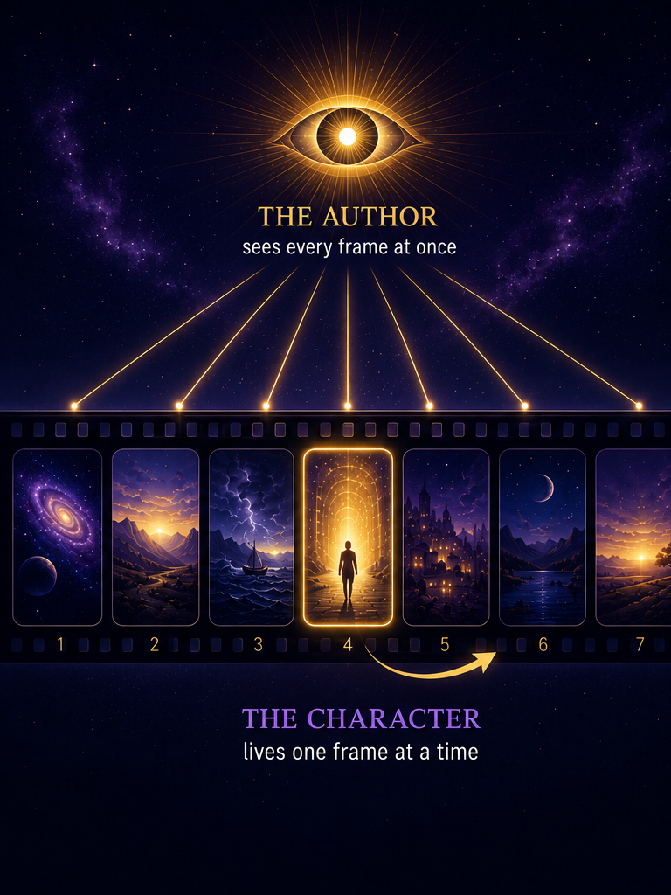

# Chapter 2: The Collapsed Thought

If Chapter 1 is the foundation, this chapter is the key. And it can be stated in a single line:

> *"We are just God's eternal thoughts collapsed in a moment in time."*

That sentence changed my life when I first understood it, and I want to show you why it should change yours. Because if the sentence from Chapter 1 tells you *what* reality is, this chapter tells you *how* it works. And the implications are staggering.

## Eternity Is Not What You Think

Most people, including most Christians, think of eternity as a really long time. An infinite timeline stretching forward and backward without end. Heaven goes on forever. God has always existed. Eternity just means *more time*.

But that's not what the Bible teaches. Eternity is not a quantity of time. Eternity is the *absence* of time. God does not exist across an infinite timeline. He is not contained by it. Time is not His environment. Time is His creation. He made it the same way He made light and darkness, trees and mountains, men and angels. Time is a rendering constraint[^c2-rendering]. It's part of the story. It is not part of the Author.

*"Before the mountains were brought forth, or ever thou hadst formed the earth and the world, even from everlasting to everlasting, thou art God."* (Psalm 90:2)

From everlasting to everlasting. That phrase doesn't mean God has been alive for a really long time. It means God inhabits a reality where "from" and "to" don't apply. God's mind holds no sequence. There is no before and after in it, no "first He thought this, and then He thought that." There is one thought, whole and complete and finished. And what we experience as sequence, as history, as the passage of time, is that one thought being *rendered* into frames that our finite minds can process.

Think of it like a filmstrip. A filmmaker sees every frame of the movie at once. He can lay the whole strip out on a table and look at the beginning, the middle, and the end simultaneously. The characters in the film experience the story sequentially, one frame at a time. They can only see the frame they're in. They remember the frames that came before. They anticipate the frames that come after. And to them, the sequence is real. The experience of living through it, frame by frame, is genuine.

But the filmmaker sees the whole thing at once. He doesn't wonder what happens next. He doesn't hope the ending turns out well. He *wrote* the ending. He wrote every frame. And He sees them all simultaneously, not because He is watching from a distance, but because the film is His thought, and He thinks it whole.

<figure class="book-figure-wide">

<figcaption>The Author sees every frame of the strip at once (eternity). The character lives one frame at a time (time).</figcaption>
</figure>

That's what it means for God to be eternal. He is the Filmmaker. We are the characters. And time is the filmstrip.

And the filmstrip is not my invention. David wrote it three thousand years ago:

*"Thine eyes did see my substance, yet being unperfect; and in thy book all my members were written, which in continuance were fashioned, when as yet there was none of them."* (Psalm 139:16)

In thy book all my members were written, when as yet there was none of them. Every frame of David's life was recorded in the book of God before a single one had rendered in history. Not foreknown. *Written.* The filmstrip was laid out in the mind of God before David drew his first breath. The vocabulary of this book is mine. The metaphor is David's. And the tradition has read that verse for three thousand years without building an ontology out of what it was actually describing.

But I need to qualify the analogy before it misleads. When I say the Filmmaker sees every frame at once, I don't mean He is separate from the film. The filmstrip is not an object sitting on a table apart from God. The filmstrip IS His thought. It exists inside His mind. He doesn't look at it from a distance, He thinks it from within. The distinction is not spatial. It is the difference between the Thinker and the thought. The Filmmaker and the film are not in two different locations. The film IS the Filmmaker's mind at work. The characters experience the thought sequentially because they are the thought. The Thinker experiences it all at once because He is the Thinker.

And here is the part that no philosophy could predict: in Chapter 6, we will see that the Author did something no human filmmaker has ever done. He stepped into His own film. The Thinker became one of His own thoughts. The Word became flesh. The eternal thought collapsed into a frame, and the Author experienced His own story from inside the filmstrip, one frame at a time, without ceasing to be the Author who thinks the whole strip at once. That is the Incarnation, and it is the most staggering collapse of all. But we are not ready for it yet. First, we need to understand the collapse itself.

## The Collapse

So if God's thought is eternal and complete, and we experience it sequentially, what is the relationship between the two? How does an eternal thought become temporal experience?

I call it *collapse*. Not because anything is lost or broken, but because something infinite is being expressed in something finite. The eternal thought is being compressed into a moment. The timeless reality is being rendered into a frame.

And this pattern repeats everywhere. At every level of reality, the same thing is happening: something invisible and eternal is being collapsed into something visible and temporal.

| **The Eternal (God's thought)** | **Collapsed into Time** |
|---|---|
| The covenant | The ceremony |
| Justification | The cross |
| Regeneration | The conversion experience |
| The Author's intent | The character's experience |
| Information | Quantum bits |
| Quantum bits | Electrical signals |
| Boot parameters | Feelings |
| The invisible | The visible |

Look at that table. Every row is the same pattern: something invisible becomes visible, something eternal becomes temporal, something in God's mind becomes something in our experience. And in every case the invisible came first, and the collapse followed. Always.

This is not a metaphor. This is the actual structure of reality. And it solves problems that have plagued theology for centuries.

## Justification: One Thought, Three Frames

Let me show you how this works with one of the most important doctrines in the Bible.

Justification is the act of God declaring His people righteous. Now, *when* does this happen? Ask a hundred theologians and you'll get a dozen different answers. Some say it happens at the moment of faith. Some say it happens at the cross. Some say it happens in eternity. And each of them has Scripture to support their position. Because Scripture describes justification as happening at all of those moments.

And here's the beauty of it: *they're all right*. But not for the reason they think. They're not right because justification happens multiple times. They're right because justification is one thought, and they're each looking at a different collapse of it.

### The Thought

God never viewed His people as condemned. That is not a frame in the filmstrip. That is the film itself.

*"Blessed is the man to whom the Lord will not impute sin"* (Romans 4:8). Notice the tense. Not "will not have imputed." Not "will not begin to not impute." *Will not impute.* It is a permanent, settled, timeless posture of the mind of God toward His people. The thought was complete before the first frame rendered: *my people, in Christ, righteous.*

*"According as he hath chosen us in him before the foundation of the world, that we should be holy and without blame before him in love"* (Ephesians 1:4). Before the foundation of the world. Not before the cross. Not before faith. Before the *world*. Before there was a filmstrip to collapse into. The thought preceded the rendering. And the thought was not "I will *make* them righteous eventually." The thought was "they *are* righteous in my Son." Because in God's mind, where there is no sequence, there is no "eventually." There is only the thought.

*"Who hath saved us, and called us with an holy calling, not according to our works, but according to his own purpose and grace, which was given us in Christ Jesus before the world began"* (2 Timothy 1:9). Given. Past tense. Before the world began. Grace was not extended at the cross. Grace was not offered at conversion. Grace was *given* in Christ Jesus before the world began. The cross and conversion are how the character experiences what was already given.

And this is the part the theologians miss when they debate the "when" of justification. They treat eternity as if it were the first frame in the filmstrip, the earliest moment in the sequence. But eternity is not a frame. Eternity is not a "when" at all. It is the thought that all the frames are expressions of. Asking "when did God justify His people?" is like asking "when did the Author write the story?" The question assumes the Author is at some point in the filmstrip. But the Author, as Author, is not at any point in the filmstrip. The Author thinks the filmstrip. (He does enter it in the incarnation, Chapter 6 develops this, but even then, the entry does not place the Author inside time. It places the Author inside His own story while remaining outside it simultaneously.) The story exists inside His mind, not the other way around. Justification in eternity is not a legal fiction backdated into the past. It is the reality that the past, present, and future are all rendering.

### The Three Frames

If the eternal thought is the film, the frames are its collapses into time. And there are three of them.

1. **The cross** - the eternal thought collapsed into history. *"By his own blood he entered in once into the holy place, having obtained eternal redemption for us"* (Hebrews 9:12). The cross did not create the justification. It *rendered* it. It made visible in time what was always true in eternity. The ceremony of the covenant. The blood was real. The suffering was real. The death was real. But it was the rendering of a thought that was already complete, not the moment the thought first occurred.
2. **Conversion** - the eternal thought collapsed into personal experience. The individual, for the first time, *knows* they are justified. The Spirit reveals it. Faith is born. Assurance dawns. The frame arrives in the character's sequence, and the character experiences what God has always seen. *"The Spirit itself beareth witness with our spirit, that we are the children of God"* (Romans 8:16). The witness is not the creation of sonship. It is the *experience* of it.
3. **Judgment** - the eternal thought collapsed into public declaration. The last day. The final pronouncement. Not a verdict being decided, but a verdict being *announced*. *"Who shall lay any thing to the charge of God's elect? It is God that justifieth"* (Romans 8:33). The answer to the question was never in doubt. The judgment frame is not suspense. It is ceremony. The public declaration of what was always the substance.

```
                  THE ETERNAL THOUGHT
              "My people, in Christ, righteous"
              (Eph 1:4, 2 Tim 1:9, Rom 4:8)
                          |
       ┌──────────────────┼──────────────────┐
       v                  v                  v
   The Cross          Conversion          Judgment
   rendered into      rendered into       rendered into
   history            personal experience public declaration
   (Heb 9:12)         (Rom 8:16)          (Rom 8:33)
```

Same thought. Three frames. Three collapses of one eternal reality into three moments in the filmstrip. And the theologians who argue about *when* justification happens are comparing frames to each other, as if one of the three is the "real" one and the others are secondary. But that is the wrong comparison. The real question is not which frame is primary. The real question is what all three frames are *expressions of*. And the answer is the eternal thought of God, which is not a frame at all.

This is what it means to believe in justification from eternity. Not that the cross was unnecessary because God already made up His mind. Not that conversion doesn't matter because it's "just" experience. Not that the final judgment is a formality. Each frame is real. Each collapse is genuine. But none of them is the source. The source is the thought. And the thought was never *not* there.

*"Known unto God are all his works from the beginning of the world."* (Acts 15:18)

From the beginning of the world. Not from the cross. Not from the conversion. From the *beginning*. Because God doesn't have a timeline. He has a thought. And the thought was complete before the first frame ever rendered.

## The Chain

Now let me show you the full chain. Because the collapse doesn't stop at theology. It goes all the way down.

God thinks. That thought is information. That information collapses into quantum bits, the fundamental building blocks of physical reality. Those quantum bits produce matter, energy, force, the physical universe as we know it. And within that physical universe, electrical signals fire in a human brain. Those electrical signals produce feelings, pre-propositional information that arrives at the conscious mind before words can form. And the conscious mind takes those feelings and interprets them, assigns them labels and causes and meanings, and produces thoughts. And those thoughts, if the mind is regenerate, eventually produce theology. Theology about the God whose original thought started the whole chain.

God thinks -> information -> quantum bits -> matter -> electrical signals -> feelings -> thoughts -> theology about God thinking.

One unbroken chain from the Author to the character and back. And the chain is circular. It's a loop. The character's theology points back to the Author who started the whole thing. The output of the system is a reflection of its input. The creation contemplates the Creator, and in doing so, demonstrates that the creation was always a thought in the Creator's mind.

The system is circular by design. Not because it's a logical fallacy, as the critics of presuppositionalism would say. But because a closed loop is the only shape a system can have when the Author is the substrate. When God is the ground of all being, every chain of reasoning eventually leads back to Him. That's not a flaw. That's the architecture.

## The Immutable God

And the chain holds because the God behind it does not change.

*"For I am the LORD, I change not; therefore ye sons of Jacob are not consumed."* (Malachi 3:6)

This may be one of the most important verses in the entirety of Scripture. God does not change. He cannot change. And without this immutability, the entire chain we just traced collapses.

If God could change His mind, the thought could change. If the thought could change, the decrees could change. If the decrees could change, the collapse is unstable, the filmstrip is being rewritten in real time, and the Author is no longer thinking the story. He is reacting to it, adjusting to it, constrained by it, and that is not the God of Malachi 3:6. That is the God of open theism. And open theism is just deism with anxiety.

God causes all things, but nothing causes God. God changes all things, but nothing changes God. *"The counsel of the LORD standeth for ever, the thoughts of his heart to all generations"* (Psalm 33:11). His counsel stands because it was never contingent on anything outside Himself. It was complete before the first frame rendered. And it has not been revised since, because revision requires a reason, and a sovereign, self-existent God has no reasons imposed on Him from outside.

This is why the collapse works. The eternal thought doesn't degrade as it collapses into time. The cross is not a degraded version of the decree. The conversion is not a degraded version of the cross. Each frame is a faithful expression of the same unchanging thought, rendered at different resolutions, experienced at different moments, but never altered. The substance does not change because the Author does not change.

And this is the ground of every comfort this book will offer. The elect are not consumed because the God who chose them does not change His mind. The covenant is not breakable because the God who made it is not mutable. The thought that you are, the specific thought in the mind of God that constitutes your existence, was never revised, never reconsidered, never at risk. *"My covenant will I not break, nor alter the thing that is gone out of my lips"* (Psalm 89:34). He will not. He cannot. Because He is the Lord, and He changes not.

*"Jesus Christ the same yesterday, and to day, and for ever."* (Hebrews 13:8)

The same. Yesterday. Today. Forever. The Author does not revise His story. The Thinker does not rethink His thought. And the sons of Jacob are not consumed.

## What This Means for Your Life

I want to be practical here, because I know this can sound abstract. So let me tell you what the collapsed thought means for the person reading this right now.

It means your struggle is real, but it's already resolved. From inside the filmstrip, the war between faith and doubt, between the flesh and the Spirit, between what you believe and what you feel, is agonizing. I know. I live it every day. I have genuine doubts about God and Christ, and I've said it out loud, which most sovereign grace guys won't do. There are moments when assurance vanishes and all you have is the memory that it was once there. And in those moments, the filmstrip feels like the only reality, and the frame you're in feels like it will last forever.

But from outside the filmstrip, the Author sees the whole picture. He sees the doubt and the assurance and the resolution and the mature man at sixty, all at once, as one thought. The "gap between what I believe and what I feel" is a temporal experience of a timeless reality. From inside, it feels like struggle. From outside, it was always the finished picture.

And that should bring you comfort. Not because the struggle isn't real. It is. The frames are real. Your experience is real. But the outcome was never in question. Because the Author already wrote it. And He wrote it before the struggle began, before the doubt crept in, before the world was even made. You are an eternal thought. And eternal thoughts don't get lost in the filmstrip.

It also means that progressive revelation, the gradual unfolding of truth across history and across your own lifetime, is not God figuring things out as He goes. It's timelessness decompressing into time. The eternal thought unfolding into sequential experience. Not growth toward a destination. The destination was always there. Just the character experiencing the frames, one at a time, in the order the Author set.

And it means that when Paul says *"we know that all things work together for good to them that love God, to them who are the called according to his purpose"* (Romans 8:28), he's not expressing a hope. He's stating a fact about the structure of reality. All things work together for good because the Author wrote them to do exactly that. The frames are ordered. The sequence is ordained. And the outcome is certain, because the Author sees the whole filmstrip, and He's already told us how it ends.

## Objections and Answers

**"If God sees all things simultaneously, free will doesn't exist."**

No. Not in the libertarian sense. The character in a novel doesn't choose the plot. But the character IS the novel. The experience is real even though the Author wrote it. The character's joy is real joy. The character's grief is real grief. The character's choices feel like choices from inside the frame. And that's by design. The Author wanted the characters to *experience* the story, not just observe it. But the choices were authored. All of them. *"For it is God which worketh in you both to will and to do of his good pleasure"* (Philippians 2:13). To *will* and to *do*. Even the willing is His work.

**"If time is just a rendering constraint, history doesn't really matter."**

It matters immensely. The filmstrip is real to the characters in it. The frames are real experience. Christ really died. You really suffer. Love really costs. The fact that the Author sees it all at once doesn't make any frame less real. What's not real is the illusion that the frames are self-generating, that history is producing itself without an Author. History is authored. But it's still history.

**"This makes prayer meaningless. God already decided everything."**

Prayer is part of the script. God ordained both the prayer and the answer. The prayer is the means He uses. He doesn't need the means, but He authored them for our experience. And the experience of prayer, the communion with God, the pouring out of the heart, the waiting, the answer, all of that is real. The Author wrote it because He wanted the characters to experience the relationship. Prayer isn't an attempt to change God's mind. It's an invitation to participate in the story He's already writing. And the participation is the point.

*"Be careful for nothing; but in every thing by prayer and supplication with thanksgiving let your requests be made known unto God."* (Philippians 4:6)

He already knows. You pray anyway. Because the prayer is the communion. And the communion is the point.

**"If the struggle is already resolved, the pain we feel now is meaningless."**

Because you're inside the filmstrip. The resolution is real from God's perspective. But you experience the frames sequentially. The frame you're in right now might be the hardest frame in the whole strip. And it still hurts. It's supposed to. The Author wrote it that way. But the next frame is coming. And the last frame is glory. And the Author has never lost a character He intended to keep.

**"If justification is one thought and the cross is just a frame, the cross was unnecessary."**

The cross didn't create the justification. It *rendered* it. The cross made visible in time what was always true in eternity. And God determined to display His justice and mercy in blood, in history, in a frame the characters could see and touch and remember. The thought was always complete. But the Author chose to render it in the most dramatic frame the filmstrip contains, because the characters needed to see it. The cross is not less important because the thought preceded it. The cross is the thought's most important rendering. Chapter 15 develops this fully.

> *"We are just God's eternal thoughts collapsed in a moment in time."*

That's not a line in the system. That IS the system. Everything else is commentary.

## For Further Study

The following passages speak to the themes of this chapter and are commended to the reader for independent study.

**God's eternity and existence outside of time:** Ex. 3:14; Deut. 33:27; Ps. 90:2; Ps. 102:25-27; Isa. 57:15; Isa. 44:6; Rev. 1:8; Rev. 22:13; Mic. 5:2; Hab. 1:12; 1 Tim. 6:15-16; 2 Pet. 3:8; Jude 1:25.

**God's immutability, He does not change:** Num. 23:19; 1 Sam. 15:29; Ps. 102:26-27; Isa. 46:10-11; Mal. 3:6; James 1:17; Heb. 1:10-12; Heb. 6:17-18; Heb. 13:8.

**God's eternal decree and foreordination:** Isa. 25:1; Isa. 37:26; Isa. 44:7-8; Isa. 48:3-5; Jer. 1:5; Eph. 3:9-11; 2 Tim. 1:9; 1 Pet. 1:20; Rev. 17:8.

**The filmstrip, the frames written before they played:** Ps. 139:16; Job 14:5; Ps. 31:15; Acts 17:26; Eph. 1:11; Rev. 13:8.

**Justification as an eternal reality:** Rom. 4:5-6; Rom. 4:8; Rom. 5:1; Rom. 5:9; Rom. 5:18-19; Rom. 8:30; Rom. 8:33-34; 2 Cor. 5:19; 2 Cor. 5:21; Gal. 2:16; Tit. 3:7.

**All things working together under God's sovereign plan:** Prov. 16:9; Prov. 16:33; Prov. 20:24; Jer. 10:23; Lam. 3:37-38; Dan. 4:35; Rom. 8:28; Eph. 1:11; 1 Thess. 5:24; Heb. 6:17.

**Progressive revelation as timelessness decompressing into time:** Isa. 28:10; Matt. 13:17; Luke 10:24; 1 Pet. 1:10-12; Heb. 1:1-2; Eph. 3:4-5; Col. 1:26.


[^c2-rendering]: *Rendering* is this book's working word for how the invisible becomes visible without becoming something else. A screen renders data into an image: the image is real, but it is not the data. So the physical world renders God's thought, the Supper renders the feast, the marriage bed renders the covenant. *Rendering* always means real expression, never a change of substance.
