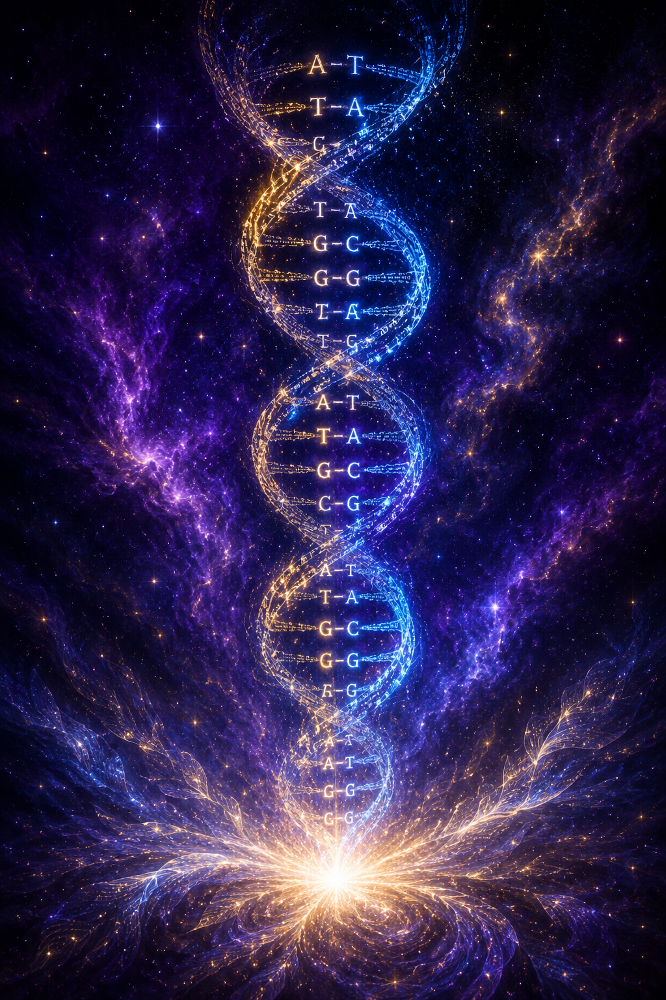

# Chapter 3: Bit from God

In 1990, a physicist named John Archibald Wheeler proposed an idea that shook the foundations of modern science. He called it "it from bit." The idea was radical and simple: reality is not fundamentally made of matter. Reality is fundamentally made of *information*. Every particle, every force, every physical quantity in the universe derives its existence from yes-or-no questions, from binary choices, from *bits*. The universe, Wheeler argued, is participatory. It doesn't just sit there being physical. It comes into existence through observation, through measurement, through the act of asking it questions and receiving answers.

Wheeler was not a theologian. He was not a Christian, as far as I know. He was a physicist at Princeton who worked on the Manhattan Project and spent decades trying to understand the relationship between information and reality. And he arrived, through pure physics, at a conclusion that the Bible stated three thousand years before he was born.

*"Things which are seen were not made of things which do appear."* (Hebrews 11:3)

Wheeler said "it from bit." The framework of this book says "bit from God."

## The Observer

One of the strangest and most well-documented phenomena in quantum mechanics is the observer effect. At the subatomic level, particles don't behave the way you'd expect matter to behave. A photon, for example, will behave as a wave when it's not being observed, passing through two slits simultaneously and creating an interference pattern. But the moment you observe it, the moment you measure which slit it goes through, it collapses into a particle and behaves like a tiny ball of matter.

The act of observation changes the outcome. The universe behaves differently depending on whether something is watching. And physicists have been arguing about what this means for a long time now.

I'm not a physicist. I'm a computer programmer. But I know what this looks like. It looks like a rendering engine. It looks like a system that doesn't fully render the scene until a viewer is present. If you've ever played a video game, you've seen this. The game doesn't render the whole world at once. It renders what the player can see. The rest is potential, stored as data, waiting to be rendered when the camera turns.

Now, the physicists would rightly object to my analogy. The observer effect in quantum mechanics is more complex than a video game rendering engine, and I'm not claiming a one-to-one equivalence. What I *am* claiming is that the observer effect is exactly what idealism predicts. If reality is information in a mind, and the physical world is a rendering of that information, then the rendering should behave differently depending on the state of observation, because observation is participation in the mind that sustains it.

In Christian idealism, God's consciousness IS the observer. He is the one holding reality in existence by the continuous act of thinking it. *"By him all things consist"* (Colossians 1:17). When we observe a particle, we're not creating reality. We're participating, at an incredibly small scale, in the observation that God is performing at the cosmic scale all the time. Our observation collapses a small piece of the rendering. His observation sustains the whole thing.

I want to be careful here, because I am *not* building theology on physics. The theology was there first. The Scriptures taught that the invisible is more real than the visible, that reality is sustained by the Word of God, and that the physical universe is a product of information, long before any physicist measured a photon. What I am doing is noting that physics has arrived at what theology said first. And the convergence is striking.

## The Simulation

The simulation hypothesis has become popular in recent years, especially among technologists and physicists who can see the informational structure of reality but can't bring themselves to call it God. The argument goes like this: if reality is fundamentally information, and if we are approaching the technological ability to create simulated universes ourselves, then statistically it's more likely that we're *in* a simulation than that we're in the original "base reality."

And from the framework of this book, the honest answer is: they're closer than they think.

We ARE in a simulation. In the sense that the physical world is a rendering of information in a Mind. The universe IS computed, in the sense that every moment is being sustained by a consciousness that holds it all together. The "code" running reality IS authored, in the sense that DNA is a four-letter digital information system with syntax, error-correction, and nested regulatory instructions.

But the Simulator is not a machine. The Simulator is personal, sovereign, conscious, and loving. And the simulation is not a program running on hardware. It's a *thought* running in a *mind*. The secular simulation hypothesis asks the right question with the wrong answer. It sees the informational structure of reality but refuses to look for the Person behind it. It can see the code but won't acknowledge the Coder.

And I find this fascinating, because it's the same pattern we see everywhere in the history of ideas. The secular world gets close to the truth and then swerves at the last moment to avoid the conclusion. They see that reality is information. They see that the universe has the structure of a designed system. They see that consciousness plays a role in the collapse of physical reality. And they'll build a thousand theories about simulations and multiverses and self-organizing complexity before they'll say the one word that explains all of it: God.

## Authored Code

I've been writing code since I was ten years old. My parents bought me an Apple IIc, and I sat down and started programming. Forty years later, I'm still at it. I've written code in Turbo Pascal, Perl, PHP, C, Java, PL/SQL, and probably a dozen other languages I've forgotten. I've built content management systems, matchmaking software (that's a funny story), SaaS products, and I've directed a team of developers running core operations for a federal agency for most of my career. I know what authored code looks like.

And when I look at DNA, I see code.

I don't mean that as a metaphor. DNA is literally a four-letter digital code. The four nucleotide bases, adenine, thymine, guanine, and cytosine, function as a quaternary alphabet. They encode instructions. They are read by molecular machines. They are copied, error-checked, and executed with a precision that makes the best human programming look clumsy. DNA stores, transmits, and executes information. It has syntax and grammar, regulatory elements that control when and how the code is expressed, and nested instructions that run in recursive loops.

<figure class="book-figure-center"><figcaption>DNA as authored code: a four-letter alphabet (A, T, G, C), written and sustained by a Mind, not assembled by a machine.</figcaption></figure>

And in forty years of programming, I have never once encountered a functional information system that was produced by random processes. Not once. Not ever. Every information system I have ever seen was authored by a mind.

Now, I'm well aware of the counterarguments: evolution by natural selection, random mutation, deep time providing enough rolls of the dice. I've heard them all. And I don't deny that organisms change over time. What I deny is that random processes produce *functional information systems from scratch*, because that's not what randomness does. Randomness degrades information. It introduces noise. It corrupts signal. Every programmer knows this. If you randomly change bytes in a functioning program, you don't get a better program. You get a crash.

DNA didn't crash. DNA works. It works with a sophistication that dwarfs anything human beings have ever produced. And the simplest explanation, the one that any programmer would give if you showed them the code without telling them where it came from, is that *someone wrote it*.

But I want to push this beyond the "intelligent design" argument, because intelligent design still thinks inside a mechanistic box. The ID movement says, "Look at the complexity. Someone must have *designed* it." But a designer builds a machine. And a machine can exist independently of the designer. You build a clock, you walk away, the clock keeps ticking. The designer is separate from the design.

The framework of this book says something different. It says God didn't *design* DNA. He *thinks* it. DNA is not a machine that God built and left running. DNA is a thought God is actively thinking. The information in every cell of your body is being sustained right now by a Mind that has never stopped thinking it. Remove the Mind, and the code doesn't just stop running. It ceases to exist, because the code was never stored on hardware. It was stored in God.

| | Intelligent Design (Designer / Machine) | Operational Idealism (Author / Thought) |
|---|---|---|
| The artifact | A machine assembled from parts | A thought, rendered |
| Maker's relation to it | External engineer | The Author whose mind it lives inside |
| If the maker steps away | The machine keeps running | It ceases to exist instantly |
| Where information lives | Encoded into matter | Matter IS the information rendered |
| Vocabulary it produces | Mechanism, function, fine-tuning | Story, character, render, sustaining |

## Where Physics Meets Genesis

*"And God said, Let there be light: and there was light."* (Genesis 1:3)

God *said*. He spoke. He used language. He used *information*. And information became reality. Light didn't exist, and then God transmitted a signal, a word, a thought, and light appeared, not because He flipped a switch, but because He *thought* it.

*"By the word of the LORD were the heavens made; and all the host of them by the breath of his mouth."* (Psalm 33:6)

By the *word*. By the *breath of his mouth*. Language. Information. Signal. The entire universe, from the largest galaxy to the smallest quark, was spoken into existence by a God who creates through *information*, not through mechanics.

<figure class="book-figure-center">

<figcaption>"By the word of the LORD were the heavens made." The visible cosmos -- here a stellar nursery thousands of light-years away -- is information rendered by a Mind. (Image: NASA, ESA, CSA, and STScI.)</figcaption>
</figure>

And the physicist looks through his telescope and sees information at the foundation of reality. And the biologist looks through her microscope and sees authored code in every cell. And the computer scientist runs his simulations and discovers that the universe has the structure of a computed system. And all three of them are looking at the same thing. The thought of God, rendered into a form their instruments can detect.

This is where quantum physics meets Genesis 1 meets Colossians 1 meets the electrical signal firing in your brain right now as you read this sentence. It's all one system. One chain. One thought. And the thought has a name.

*"In the beginning was the Word."*

## The Downgrade

If the physical world is a rendering of God's thought, and the rendering has parameters that determine what the world looks like, then the fall was a rendering downgrade. And the Bible says exactly this.

Before the fall, the rendering was at its original resolution. There was no death, no disease, no decay. Nothing preyed on anything else, the soil yielded no thorns, and the woman knew no pain in childbirth. The ground produced without resistance. The animals had no fear of man. Adam and Eve stood before God and before each other naked and not ashamed (Genesis 2:25). But this was not the full resolution. Adam was still local, still bound by gravity, still subject to time, still unable to walk through walls or appear and disappear. Eden was the original rendering, not the final one. The full resolution is future, the new heavens and the new earth (Chapter 28), where the rendering goes beyond anything Eden ever had.

Then the fall happened. But the fall was not a catastrophe that happened TO Adam. Adam was created sinful (Chapter 11). The fall was the moment his nature was revealed, the decree rendered in history. And once the nature was exposed, God adjusted the rendering parameters downward to match. The downgrade wasn't retribution. It was coherence. The Author made the world reflect what the man had always been.

*"Unto the woman he said, I will greatly multiply thy sorrow and thy conception; in sorrow thou shalt bring forth children"* (Genesis 3:16). Rendering parameter changed: pain in childbirth.

*"Cursed is the ground for thy sake; in sorrow shalt thou eat of it all the days of thy life; thorns also and thistles shall it bring forth to thee"* (Genesis 3:17-18). Rendering parameter changed: the ground resists. Thorns. Thistles. Entropy.

*"In the sweat of thy face shalt thou eat bread, till thou return unto the ground; for out of it wast thou taken: for dust thou art, and unto dust shalt thou return"* (Genesis 3:19). Rendering parameter changed: mortality. The body decays. The rendering degrades over time and eventually stops.

These are the Author adjusting the rendering engine to match the revealed nature. The thought didn't change. Adam was always the same thought in God's mind. But the rendering of that thought changed: more constraints, lower resolution. The physical world became harder, more painful, more limited, not because the world is evil (the world is still a thought God is thinking, and He still calls it His creation) but because the nature was now visible, and the Author rendered the environment to match it. The downgrade is the world catching up to what the man always was.

And this is why the resurrection is not a miracle added from outside (Chapter 29). The resurrection is the Author removing the constraints He imposed at the fall and going further than Eden ever did. Mortality is not the natural state of the body. It is a constraint imposed at Genesis 3:19 and removed at the resurrection. The "miraculous" properties of the resurrection body, walking through walls, appearing and disappearing, ascending, are not a return to Adam's original rendering. Adam never walked through walls. They are the full resolution the Author was always heading toward, visible for the first time in Christ. The fall subtracted. The resurrection does not merely restore. It upgrades past the starting point. Same thought. Different rendering parameters. Higher resolution than the original.

The entire arc of history, from Genesis 3 to Revelation 21, is the story of a rendering downgrade followed by a rendering upgrade. The fall imposed new constraints. The cross purchased the upgrade. The resurrection applies it. And the new heaven and new earth (Chapter 28) is the full resolution rendering, not a return to Eden, but something Eden never was. Eden was the starting point. The new creation is the destination. Christ's resurrection body does things Adam's body never could, walks through walls, appears and disappears, ascends, eats fish in a glorified state. The full resolution goes beyond the original because the story between them is part of the thought. The cross. The display of mercy and justice. The revealing of the two seeds. The glory of Christ made visible through the entire arc of fall, redemption, and restoration. The destination is richer than the starting point because the Author was always heading somewhere Adam had never been.

## A Note of Caution

I want to end this chapter with an honest admission, because I think the reader deserves it.

I am not a physicist. I am a programmer with an education in computer science and a deep love for the Scriptures. The physics I've cited in this chapter is real, and the convergence between quantum mechanics and biblical idealism is, I believe, genuine and significant. But I am using the physics as *confirmation*, not as *proof*. If quantum mechanics were revised tomorrow, if the observer effect turned out to have a different explanation, if Wheeler's "it from bit" were superseded by a better model, the theology would not change, because the theology doesn't rest on the physics. The theology rests on Scripture. The physics just happens to agree.

I say this because I've seen well-meaning Christians build too much of their case on scientific evidence, and when the science shifts, as science always does, the theology looks like it has failed. It hasn't. The science was never the foundation. Christ was. And Christ doesn't need a particle accelerator to validate His Word.

But I will say this: it's something when the physics arrives at the same place the theology started from. And when the biologist discovers authored code in every cell, and the physicist discovers information at the bottom of reality, and the computer scientist discovers that the universe looks like a rendering engine, and all three of them arrive at the same conclusion that Genesis 1 stated in its opening verse, that's not an accident. That's a thought. And the thought has a Thinker.

Wheeler said "it from bit."

I say "bit from God."

## Objections and Answers

**"You're misusing quantum physics. The observer effect doesn't mean what you think it means."**

The physics confirms what Scripture already stated. I'm not building theology on physics. I'm noting that physics arrived at what theology said first. If the physics changes, the theology stands. But the convergence is worth noting, and I won't pretend it doesn't exist just because some people are uncomfortable with it.

**"Science doesn't prove God."**

Correct. Nothing proves God to the natural man. *"The natural man receiveth not the things of the Spirit of God: for they are foolishness unto him"* (1 Corinthians 2:14). But the coherence between quantum mechanics and biblical idealism is exactly what the system predicts. If reality IS information, and information requires a mind, then discovering information at the foundation of reality is discovering what we already knew. The evidence doesn't create the faith. The faith interprets the evidence.

**"Even if reality is informational, you can't prove the information source is the God of Scripture."**

You're right. The physics cannot make that jump. The physics shows that reality is informational. It does not show WHO is processing the information. The materialist says "math." The simulation theorist says "a computer." I say "the God of Scripture." The physics is consistent with all three. But here is the difference: the materialist has no agent. Math is not a mind. Laws of physics are descriptions, not causes. Information without a mind processing it is incoherent. The simulation theorist has an agent but infinite regress, who simulates the simulator? The sentence has an agent with no regress. God is self-existent. He doesn't need a cause. He IS the Mind. And the physics, by confirming the informational structure of reality, eliminated the one worldview that said no Mind was necessary. It didn't prove my God. But it disproved the assumption that my God is unnecessary. And that is the strongest position a theology can hold with respect to science: not dependent on it, but confirmed by it. The theology was there first. The physics caught up. See Appendix H for the full treatment.

**"The simulation hypothesis is atheist. You can't baptize it."**

I'm not baptizing it. I'm pointing out that the secular version asks the right question, *are we in a simulation?*, with the wrong answer, a machine did it. The Simulator is personal and sovereign. And the simulation is called creation.

**"DNA could have evolved naturally. You're making a God-of-the-gaps argument."**

I've been programming for forty years. I know what authored code looks like. Random processes degrade information. They don't produce functional systems from scratch. This isn't God-of-the-gaps. This is a programmer looking at code and recognizing authorship. The gap isn't in my knowledge. It's in the theory that says random noise can write a genome.

**"If Adam was created sinful (Chapter 11), the rendering was never at full resolution. The fall didn't downgrade anything."**

Adam's nature was always sinful. But the rendering of the world around him was not yet adjusted to reflect it. Both the man and the world are thoughts in God's mind. Both are renderings. But the fall revealed what Adam's thought always contained, and God adjusted the environmental rendering to match. The rendering parameters, death, thorns, pain, decay, were not properties of Adam's nature. They were adjustments to the world's rendering, brought into coherence with the nature that was now exposed. The downgrade is the world's rendering catching up to what the man's thought always was.

**"The vocabulary is made up. Rendering engines and firmware have no place in theology."**

Every generation of theologians has used the vocabulary of their era to describe eternal realities. Paul borrowed legal vocabulary from Rome to describe justification. The prophets borrowed agricultural vocabulary to describe spiritual growth. Jesus borrowed fishing vocabulary to describe evangelism. Aquinas used Aristotle. Calvin used law. Edwards used Newtonian mechanics. Every one of them was accused of importing foreign categories into theology. Every one of them was right to do it, because the realities they were describing needed words, and the words came from the world God placed them in.

The vocabulary of computer science, rendering, firmware, layers, boot parameters, resolution, constraints, upgrades, describes realities that the traditional vocabulary cannot reach. "Regeneration" tells you THAT the Spirit changes a person. "Firmware flash" tells you WHERE in the soul the change happens and HOW the old nature is overwritten. "Heaven" tells you WHERE the saved go. "Higher resolution rendering" tells you WHAT changes and WHY the resurrection body can walk through walls. The new words don't replace the old ones. They extend them. They describe the architecture underneath the doctrine. And the architecture was always there. It just didn't have a name until someone came along who thought in systems.

If the vocabulary offends you, ask yourself why. Is it because the words are unfamiliar? Or is it because they describe something you recognize but couldn't articulate? If a farmer in the first century could understand Jesus saying "the sower went out to sow," then a reader in the twenty-first century can understand a programmer saying "the Author upgraded the rendering engine." The vocabulary is the bridge, not the barrier.

**"This chapter is more philosophy than theology."**

It's both. And the distinction between them is a modern invention that the Bible doesn't recognize. Paul preached on Mars Hill using the philosophers' own language (Acts 17:28). The truth doesn't belong to a discipline. It belongs to Christ. And if Christ's truth shows up in physics, in computer science, in philosophy, and in Scripture, that's not a problem. That's the sentence from Chapter 1, applied.

## For Further Study

The following passages speak to the themes of this chapter and are commended to the reader for independent study.

**God creating by His word and command:** Gen. 1:6; Gen. 1:9; Gen. 1:14; Gen. 1:20; Gen. 1:24; Ps. 33:6; Ps. 33:9; Ps. 148:5; Isa. 48:13; 2 Pet. 3:5; Heb. 11:3; John 1:3; John 1:10.

**The physical world as a product of God's mind, not self-sustaining matter:** Ps. 104:1-5; Ps. 136:5-9; Prov. 3:19-20; Prov. 8:22-31; Jer. 10:12; Jer. 51:15; Isa. 40:12-14; Isa. 40:28; Rev. 4:11; Neh. 9:6.

**Information, order, and design testifying to the Creator:** Ps. 19:1-4; Ps. 97:6; Ps. 8:3-4; Rom. 1:19-20; Job 12:7-9; Job 26:7-14; Job 38:4-41; Isa. 40:25-26; Isa. 45:12; Isa. 45:18.

**The natural man's inability to receive spiritual truth:** 1 Cor. 1:18; 1 Cor. 1:21; 1 Cor. 1:25; 1 Cor. 2:10-12; 2 Cor. 4:3-4; John 12:39-40; Matt. 11:25; Matt. 13:11-13; Rom. 1:21-22; Rom. 1:28.

**Christ as the agent and sustainer of creation:** John 1:2-4; 1 Cor. 8:6; Eph. 3:9; Heb. 1:2; Heb. 1:10; Rev. 3:14.

**The rendering downgrade at the fall, the curse on the creation:** Gen. 3:14-19; Gen. 5:29; Gen. 8:21; Rom. 5:12; Rom. 8:19-22; 1 Cor. 15:21-22; Rev. 22:3.

**The rendering upgrade at the resurrection, the creation restored and surpassed:** Isa. 11:6-9; Isa. 25:8; Isa. 35:1-2; Isa. 65:17; Isa. 65:25; Rom. 8:21; Rev. 21:1-5; Rev. 21:4; Rev. 22:3; 1 Cor. 15:42-44; Phil. 3:20-21.

