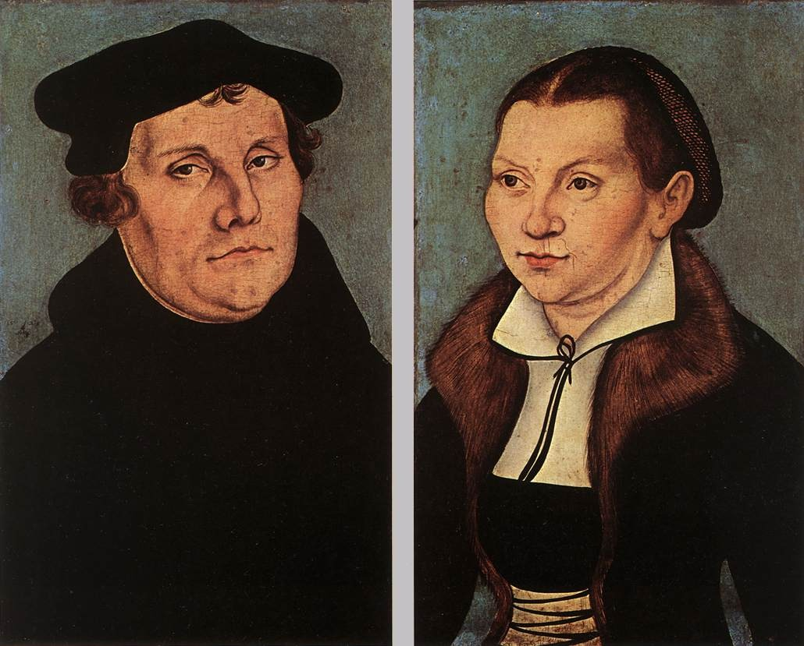

# Chapter 10: The Covenant Before the Ceremony

If there's one principle in this book that applies to more domains than any other, it's this one. And it's so simple that the only mystery is how it ever stayed hidden so long.

The invisible precedes the visible. Always. In every domain.

The covenant precedes the ceremony. The substance precedes the formality. The reality precedes the declaration. And the reason is the ontology itself: the substance is the thought, and the ceremony is the rendering. God thinks before He renders. The invisible is the information in His mind. The visible is the collapse of that information into time and matter. The thought is always first because the Mind is always first. This is not a preference or a theological opinion. It is the architecture of reality, derived from the sentence in Chapter 1.

And in every case where the church, or the culture, or the tradition has gotten confused, it's because they reversed the order. They made the ceremony the cause of the covenant. They made the visible the source of the invisible. And the moment you do that, you've turned the whole system upside down.

## Marriage

Let me start with marriage, because it's the place where this principle is most obvious and most personal to me.

Angie and I have been together since 1993. We met at Mineral Area College in the fall of that year. She played saxophone. I played trombone. She's the only woman I've ever dated, kissed, or loved. We married in July of 1999, and that wedding was beautiful. But I want to tell you something that might sound strange to some of you.

The covenant was already there long before the wedding.

I knew it the first time I kissed her. The deal was sealed in my mind. Getting married was a foregone conclusion from that moment. I didn't decide it. It happened to me. One kiss, and my brain said, "This is forever." The wedding in 1999 was wonderful. But the real thing had been running for six years.

And Scripture backs this up.

*"And Isaac brought her into his mother Sarah's tent, and took Rebekah, and she became his wife; and he loved her."* (Genesis 24:67)

No ceremony. No officiant. No license. He brought her into the tent, and she became his wife. The covenant was formed by commitment and union. The ceremony, the ketubah, the witnesses, those developed later as social and legal structures. They were not divine requirements. They were community practices that acknowledged what already existed.

This is not an argument for promiscuity. This is an argument about the *nature* of the covenant. Marriage is formed by mutual commitment and the union of two people becoming one flesh. The wedding is the public declaration of what already exists. The ceremony is for the community. The covenant is for God.

## The One-Flesh Union

*"Therefore shall a man leave his father and his mother, and shall cleave unto his wife: and they shall be one flesh."* (Genesis 2:24)

The two shall become *one flesh*. This is the visible rendering of the invisible covenant. The physical union IS the covenant rendered in bodies, not a reward for the ceremony, not a privilege earned by signing a license. It is the substance to which the ceremony points.

And Paul, in Ephesians, takes this further than most people are comfortable with:

*"For this cause shall a man leave his father and mother, and shall be joined unto his wife, and they two shall be one flesh. This is a great mystery: but I speak concerning Christ and the church."* (Ephesians 5:31-32)

Paul calls it a *mystery*. And then he says he's speaking concerning Christ and the church. The physical union between husband and wife IS the theological statement about Christ and the church. They're not two different meanings competing. They're two rendering resolutions of the same thought. The lower resolution is a husband and wife, bodies together, one flesh. The higher resolution is Christ and His bride, fully known, fully loved, the covenant rendered in intimacy.

And the Song of Solomon is the Bible being honest about both resolutions at once. The Song is not allegory OR literal. It's BOTH. Dual purpose. The physical love between a man and a woman AND the spiritual love between Christ and His church are expressed in the same language, because in the framework, they're the same thought at different rendering levels.

And the church's embarrassment about the Song of Solomon is the law of Plato, one more time. If the body is lesser than the spirit (Plato), then sex is lesser than worship. But if matter is a rendering of God's thought, then union in the body is the covenant collapsed into flesh. The embarrassment reveals Platonic assumptions hiding in the pews. The Bible isn't ashamed of the body. Plato is.

<figure class="book-figure-center">

<figcaption>Martin Luther and Katharina von Bora (workshop of Lucas Cranach the Elder, 1529). The runaway nun who married the Reformer and ran the household that fed, funded, and sheltered the Reformation -- the living refutation of the Platonic shame the church had hung on marriage and on women.</figcaption>
</figure>

## Communion

The same principle applies to the Lord's Supper. The atonement is the substance, His sacrifice purposed in eternity, accomplished on the cross. The bread and wine are the ceremony, a visible rendering of the invisible reality.

*"And he took bread, and gave thanks, and brake it, and gave unto them, saying, This is my body which is given for you: this do in remembrance of me."* (Luke 22:19)

*In remembrance of me.* Remembrance of what was ALREADY finished. Not a sacrament that conveys grace. Not a magical transformation of bread into literal flesh. And not an empty symbol stripped of meaning either. A *rendering*. The substance is Christ. The ceremony points at the substance. The bread doesn't become Christ. It renders Him, the way the physical world renders God's thought.

This eliminates three errors at once. Transubstantiation (Rome) says the bread literally becomes Christ. That's making the ceremony the substance. Memorialism (Zwingli) says the bread is just a reminder. That's emptying the ceremony of any connection to the substance. The framework says the bread *renders* the substance without becoming it or being empty of it. Same as a picture renders a person without being the person, and without being meaningless.

And the Lord's Supper is participatory, not priestly. *"For as often as ye eat this bread, and drink this cup, ye do shew the Lord's death till he come"* (1 Corinthians 11:26). Every believer *shews*. No priest required. No institution required. Just believers, together, rendering the covenant in bread and wine.

And it is a *celebration*.

The modern church has turned the Lord's Supper into a funeral: somber music, bowed heads, whispered prayers, a tiny cracker and a thimble of juice passed in silence, as though the saints are attending a memorial for someone who is still dead. But Christ is not still dead. He is risen. And the table is a feast, not a wake.

The Bible has what Bob Higby once called a "theology of wine." Noah planted a vineyard after the flood and the promise. David wrote that *"wine maketh glad the heart of man"* (Psalm 104:15). And Isaiah described the eschatological banquet in terms no somber ritual can contain:

*"And in this mountain shall the Lord of hosts make unto all people a feast of fat things, a feast of wines on the lees, of fat things full of marrow, of wines on the lees well refined. And he will destroy in this mountain the face of the covering cast over all people, and the vail that is spread over all nations. He will swallow up death in victory; and the Lord God shall wipe away tears from off all faces."* (Isaiah 25:6-8)

A feast of fat things, wines well refined, death swallowed up, every tear wiped away. That is the substance the Lord's Supper renders, not a memorial for a dead man but a preview of the feast that never ends. The early church understood this. Their communion was an agape feast, a full meal shared in fellowship, the highest point of their week, a celebration of the resurrection. It looked nothing like the "snippet and sip" that most churches practice today. There was no privatistic meditation. No fearful silence. There was joy and fellowship. Wine that was wine, not grape juice. And the saints looked forward to it because it was the closest they came on earth to the table they would share with Christ in the higher resolution rendering.

*"For I say unto you, I will not drink of the fruit of the vine, until the kingdom of God shall come."* (Luke 22:18)

Christ pointed the table FORWARD. Not backward to the cross only, but forward to the kingdom. The Lord's Supper is a preview of Revelation 19:9: *"Blessed are they which are called unto the marriage supper of the Lamb."* The marriage supper. The feast Isaiah saw, with fat things and wines on the lees and every tear wiped away (Isa. 25:6-8). Appendix L renders what that feast looks like from inside the rendering. That feast is the substance. The Lord's Supper is the ceremony. And the ceremony should feel like a foretaste of the feast, not a funeral for the host.

Celebrate. Break bread with gladness. Pour real wine. Remember that He is risen and that the table goes on forever. The substance preceded the ceremony, and the ceremony should honor the substance by reflecting its joy.

## Justification

The covenant preceded the ceremony here too. God justified His people from eternity, as we established in Chapter 2. The cross was the rendering. The conversion was the experience. The final judgment will be the public declaration. In every case, the invisible reality came first.

The tradition that says justification happens at the moment of faith has reversed the order. It has made the faith the cause and the justification the effect. But faith doesn't cause justification. Faith *recognizes* justification. Faith is the moment the character in the filmstrip becomes aware of what the Author has always seen. The justification was there before the faith. The covenant was there before the ceremony.

## The Canon

Even the Bible itself follows this pattern. The church councils at Hippo (393 AD) and Carthage (397 AD) didn't *create* the canon. They recognized what was already true. The books of Scripture were functioning as Scripture long before any council met to discuss them. The early church was reading Paul's letters and the Gospels as authoritative Scripture decades before any institutional body gave them an official stamp.

The councils were the ceremony. The canon was the covenant. The invisible reality, these books ARE the Word of God, preceded the visible acknowledgment. And any theology that says "without the church, we wouldn't have the Bible" has reversed the order. Without God, we wouldn't have the Bible. The church just acknowledged what God had already given.

## The Universal Pattern

Do you see it? It's everywhere.

| **Substance (Invisible)** | **Formality (Visible)** |
|---|---|
| The covenant | The wedding |
| The union | The ceremony |
| The atonement (purposed in eternity) | The bread and wine |
| Justification | The cross / faith / judgment |
| The canon | The church council |
| Regeneration | Baptism |
| The Spirit | The water |
| The indwelling | The church membership |
| The thought | The matter |

Every row in that table is the same principle. The invisible came first. The visible followed. The substance preceded the formality. And every error in the history of the church that involves making the visible the cause of the invisible, baptismal regeneration, sacramental salvation, justification by works, institutional authority, every one of them, is a reversal of this table.

This is operational idealism in action, not philosophy but life. Every domain.

## Objections and Answers

**"Marriage requires a ceremony. You're justifying living in sin."**

Isaac took Rebekah into his tent and she became his wife (Genesis 24:67). No ceremony. No officiant. The covenant precedes the paperwork. I'm not arguing against weddings. Weddings are beautiful. I'm arguing about the *nature* of the covenant. The ceremony didn't create the marriage. The commitment and union did. The ceremony announced it.

**"If the canon was already true before the councils, the councils were pointless."**

Same reason we need weddings. Public acknowledgment of what already exists. The ceremony serves the community's understanding, not God's reality.

**"The Song of Solomon is allegory about Christ and the church, not about sex."**

It's both. Dual purpose. Paul says explicitly: *"This is a great mystery: but I speak concerning Christ and the church"* (Ephesians 5:32). The physical and the spiritual are one thing, not two. The church that can discuss the atonement in graphic detail (blood, wounds, suffering) but blushes at the Song of Solomon has Platonic priorities, not biblical ones.

**"Making sex theological cheapens the theology."**

Making sex *separate* from theology cheapens the body. God designed the union. He put it in the canon. He called it a mystery pointing to Christ. If He's not embarrassed, we shouldn't be.

**"If the substance always precedes the ceremony, the ceremonies are pointless."**

Because the rendering is good. The ceremony doesn't create the substance, but it honors the substance by making it visible. The wedding doesn't create the marriage, but the wedding declares the marriage to the community. The bread and wine don't create the atonement, but they render the atonement for the saints. Water baptism doesn't create the regeneration, but it announces what the Spirit has already done. The ceremony matters. It just doesn't *cause*. And the moment you confuse honoring the substance with causing the substance, you've reversed the order and turned the ceremony into an idol. Honor the rendering. Don't worship it. Worship the thought behind it.

## For Further Study

The following passages speak to the themes of this chapter and are commended to the reader for independent study.

**The invisible substance always preceding the visible formality:** 2 Cor. 4:18; 2 Cor. 5:7; Heb. 11:1; Heb. 11:3; Heb. 11:7; Heb. 11:8; Heb. 11:13; Heb. 11:27; Rom. 4:17; Rom. 8:24-25; Col. 3:1-4.

**Marriage as covenant, not ceremony:** Gen. 2:22-24; Gen. 29:21-23; Ruth 4:13; Prov. 2:17; Mal. 2:14; Matt. 19:4-6; 1 Cor. 6:16-17; 1 Cor. 7:2; Heb. 13:4.

**The one-flesh union as a picture of Christ and the church:** Song 2:16; Song 6:3; Song 7:10; Isa. 54:5; Isa. 62:5; Hos. 2:16; Hos. 2:19-20; Rev. 19:7-9; Rev. 21:2; Rev. 21:9; 2 Cor. 11:2.

**Communion -- the bread and wine rendering the substance of atonement:** Ex. 12:13; Ex. 12:26-27; Ps. 104:15; Isa. 25:6-8; Matt. 26:26-28; Mark 14:22-24; Luke 22:18; 1 Cor. 10:16-17; 1 Cor. 11:23-25; 1 Cor. 11:27-29; John 6:53-56; Rev. 19:9.

**The canon existing before the councils acknowledged it:** Luke 1:1-4; 2 Pet. 1:16-21; 2 Pet. 3:15-16; 1 Thess. 2:13; Col. 4:16; 1 Tim. 5:18; Rev. 22:18-19.

**Regeneration preceding baptism -- the Spirit before the water:** Ezek. 36:25-27; John 3:3-8; Acts 10:44-48; Acts 11:15-17; Acts 15:8-9; Acts 16:14-15; Tit. 3:5-6; 1 Pet. 1:23; 1 John 5:1.

