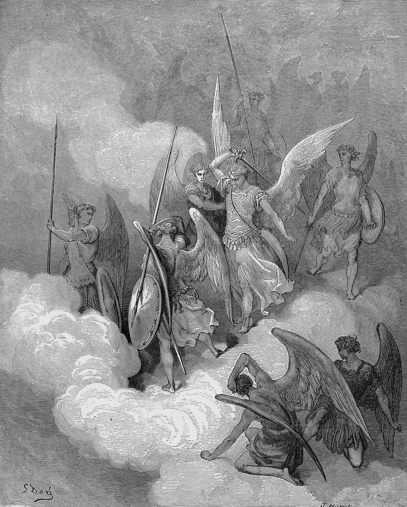

# Chapter 13: Satan Created Evil, Not Fallen

I believed the story for thirty years. The beautiful angel. The highest cherub. The worship leader of heaven who got too proud, rebelled against God, and was cast down like lightning from the sky. I heard it preached. I read it in commentaries. I saw the Milton version and the Sunday school version and the heavy metal album cover version. And I never questioned it, because everyone told it the same way, and the two passages that supposedly proved it, Isaiah 14 and Ezekiel 28, seemed clear enough at a glance.

And then I read the context. And five words in Isaiah 14:4, *"against the king of Babylon,"* destroyed the entire narrative.

What follows is probably the most controversial claim in this book. I held it loosely until the framework forced my hand. I ask only that you read to the end before you decide whether you agree.

But I'm getting ahead of myself. I'll walk through Isaiah 14 in detail below. Let me start where we should always start. With the logic.

## The Impossibility Argument

We established this in Chapter 11, but it bears repeating here because the stakes are higher. A perfectly righteous being *cannot* sin. This is not a limitation imposed on God. It is a logical necessity that flows from the nature of righteousness itself. If a being is perfectly aligned with God's will, there is no mechanism by which that will can produce rebellion. The output cannot contain what the input does not.

In Chapter 11, we applied this to Adam. Adam sinned, therefore Adam was not perfectly righteous. The fall revealed a nature that was already inclined toward sin.

Now apply the same logic to Satan.

If Satan was a perfectly righteous angel who fell, then we have the same impossibility problem we had with Adam, but worse, because Adam at least had a body, an environment, a physical temptation. The tree was "good for food" and "pleasant to the eyes" (Genesis 3:6). There was a sensory mechanism through which temptation could operate. But Satan, in the traditional narrative, was a disembodied spirit in the direct presence of God. No body. No sensory temptation. No serpent whispering in his ear. Just pure spirit in the full light of divine glory.

And somehow, from that position, pride arose? From where? If Satan's nature was perfectly righteous, where did the pride come from? If his will was perfectly aligned with God, what turned it? You cannot get pride from humility, rebellion from perfection, or sin from sinlessness. A good tree *cannot* bring forth evil fruit (Matthew 7:18). Christ said so.

The traditional answer is the same answer they give for Adam: free will. Satan had the *freedom* to choose rebellion. But freedom to choose rebellion implies a nature that contains the *capacity* for rebellion. And a nature that contains the capacity for rebellion is not perfect righteousness. It is something less. Something that already has the seed of sin built into it.

So either Satan was created with a nature inclined toward pride and rebellion (in which case he was created evil, which is what I'm arguing) or the traditional narrative has a hole in it that no amount of theological patching can repair.

God created Satan evil. That's the answer. Not fallen, not corrupted, not a once-good angel who went wrong. God created him evil, on purpose and for a purpose.

## Isaiah 14: Read the Context

Let me walk through the passage that has been used for two thousand years to prove that Satan fell from heaven, and show you what it actually says.

*"How art thou fallen from heaven, O Lucifer, son of the morning! how art thou cut down to the ground, which didst weaken the nations!"* (Isaiah 14:12)

Beautiful verse. Dramatic imagery. And absolutely, unequivocally, about the king of Babylon.

How do I know? Because the prophet told us. Eight verses earlier.

*"That thou shalt take up this proverb against the king of Babylon, and say, How hath the oppressor ceased! the golden city ceased!"* (Isaiah 14:4)

This is a *proverb against the king of Babylon*. The entire passage from verse 4 through the end of the chapter is an oracle of judgment against a specific political ruler. The "Lucifer" of verse 12 is not a pre-temporal angel. The Hebrew word is *helel*, which means "shining one" or "morning star." It is a title given to the king of Babylon to describe his brightness, his glory, his position among the nations. And the fall described in the passage is a *political* fall: the collapse of an empire, the humiliation of a tyrant, the descent of a man who said *"I will ascend into heaven, I will exalt my throne above the stars of God"* (v13) and found himself instead *"brought down to hell, to the sides of the pit"* (v15).

And the nations respond:

*"They that see thee shall narrowly look upon thee, and consider thee, saying, Is this the man that made the earth to tremble, that did shake kingdoms?"* (Isaiah 14:16)

This is the *man*. Not the angel. Not the spirit. The man. The one who made the earth tremble and shook kingdoms. This is political language about a political figure, and the entire Christian tradition has ripped it out of its context and applied it to a cosmic angelic rebellion that the passage never describes.

## Ezekiel 28: Same Problem

The same error applies to Ezekiel 28, which is the other passage commonly cited as the "fall of Satan."

*"Son of man, take up a lamentation upon the king of Tyrus, and say unto him, Thus saith the Lord GOD; Thou sealest up the sum, full of wisdom, and perfect in beauty. Thou hast been in Eden the garden of God."* (Ezekiel 28:12-13)

A lamentation upon the king of *Tyrus*. Tyre. A Phoenician city-state. A human ruler. Not an angel. Not a spirit. A king.

The language about Eden and the precious stones and the anointed cherub is prophetic *imagery* applied to a human ruler to describe his exalted position and catastrophic fall. Prophets do this constantly. They use cosmic language to describe political events. Isaiah calls the fall of Babylon a fall from heaven. Ezekiel calls the king of Tyre a cherub in Eden. This is prophetic hyperbole, the language of divine oracle, not a literal description of a pre-temporal angelic event.

And if you insist on reading Ezekiel 28 as a literal description of Satan, you have to explain why the prophet explicitly says it's about "the king of Tyrus" in verse 12. The context is right there. The prophet identified his subject. The tradition ignored the identification and substituted its own.

## The Law of Plato

So where did the story come from? If Isaiah 14 is about Babylon and Ezekiel 28 is about Tyre, how did the church arrive at the narrative of Satan's angelic rebellion?

The answer is the same answer that keeps coming up in this book, and I am going to keep saying it until it sticks: the *law of Plato*.

Plato, in his *Republic*, argued that the divine must never be proposed as the author of evil[^c13-plato]. This was not a minor point in Plato's system. It was foundational. The gods, in Plato's view, are the source of good and *only* good. If evil exists, it must come from some other source: human free will, the corruption of matter, some force outside the divine that introduces chaos into the cosmos. But the gods themselves are clean. They don't create evil. They don't author wickedness. They are, in Plato's system, permanently and necessarily good.

Here is Plato in his own words, from *Republic* Book II in Jowett's translation. Watch the move. Watch the law come down.

> *"Then God, if he be good, is not the author of all things, as the many assert, but he is the cause of a few things only, and not of most things that occur to men. For few are the goods of human life, and many are the evils, and the good is to be attributed to God alone; of the evils the causes are to be sought elsewhere, and not in him."* (Republic II.379c)

That is Plato's sentence. *Of the evils the causes are to be sought elsewhere, and not in him.* And he does not stop at description. He makes it the law of the ideal city:

> *"Let this then be one of our rules and principles concerning the gods, to which our poets and reciters will be expected to conform, that God is not the author of all things, but of good only."* (Republic II.380c)

And he forbids the alternative:

> *"But that God being good is the author of evil to any one is to be strenuously denied, and not to be said or sung or heard in verse or prose by any one whether old or young in any well-ordered commonwealth. Such a fiction is suicidal, ruinous, impious."* (Republic II.380b)

Suicidal. Ruinous. Impious. Plato banned the sentence Isaiah wrote. The prophet's *"I form the light, and create darkness: I make peace, and create evil: I the LORD do all these things"* (Isaiah 45:7)[^c13-ra] is, by Plato's decree, not to be said or sung or heard in any well-ordered city. Augustine inherited the ban. The Western tradition inherited Augustine. And the result is that the prophet's sentence has been softened, qualified, and edited out of pulpits for sixteen hundred years, while Plato's sentence has done the work the prophet's sentence was supposed to do.

When the question comes back, *did Plato actually say this?* the answer is plain. He said it in those exact words. He made it the law of his ideal city. He forbade the alternative as suicidal, ruinous, impious. The Christian inheritance from Plato is not a vague metaphysical mood. It is a specific forbidden sentence and a specific rule of the well-ordered city, written by Plato, inherited by Augustine, absorbed by the church as if it were Scripture, traceable in the text just quoted.

Plato never read the Hebrew Scriptures; the Septuagint did not exist until a century after his death. But his axiom condemns them in advance. The stories in which God authors evil, causes suffering, sends plagues, hardens hearts, and destroys nations, every one of them violates the rule Plato laid down. The Hebrew God is precisely the deity Plato's philosophy declares impossible: good, and yet the author of evil.

Now here is the tragedy. The early church fathers, the Patristics, were educated in Greek philosophy. They read Plato before they read Paul. And they imported Plato's axiom into their theology without realizing what they were doing. Augustine, the most influential theologian in church history, was a Neoplatonist before he was a Christian. And he carried the Platonic assumption about divine goodness directly into his doctrine of God[^c13-privatio]. God cannot author evil. God only creates good. If evil exists, it must have entered the system through some other door.

And that other door became Satan.

The narrative goes like this: God created everything good. God created angels good. God created Satan good. But Satan, using his free will, chose to rebel. Evil entered the universe not through God's authorship but through Satan's choice. God remains clean. Plato's axiom is preserved. And the Hebrew insistence that God creates evil (Isaiah 45:7) is quietly reinterpreted, softened, or ignored.

This is the origin of the Lucifer myth. It was constructed to protect God from the charge of authoring evil. And it was constructed using two passages ripped from their context and a philosophical axiom borrowed from a pagan whose god is the opposite of the God of Scripture.

## The Sentence Plato Banned, Quoted Back

Plato made the law in Athens. The Hebrews never heard it. And the Hebrews kept writing the sentence Plato banned, century after century, in Jerusalem and the wilderness and the desert caves, with no idea any Greek had forbidden it.

Start with the desert caves. Plato wrote *Republic* II.380b around 380 BC. More than two centuries later, in the Judean wilderness, the community at Qumran was copying out a *Treatise on the Two Spirits* into the Community Rule. Listen to what they wrote.

> *"All that is now and ever shall be originates with the God of knowledge. Before things come to be, He has ordered all their designs, so that when they do come to exist, at their appointed times as ordained by His glorious plan, they fulfill their destiny, a destiny impossible to change."* (Community Rule, 1QS 3.15-17, Wise/Abegg/Cook)

That is the Hebrew counter-claim, written by Jewish scribes who would have rejected the Platonic axiom on sight. *All that is now and ever shall be originates with the God of knowledge.* Not most things. Not the good things only. *All that is now and ever shall be.* Plato's "few things only" forbidden by the desert sect's "all that is and ever shall be," written without anyone in those caves knowing they were contradicting Athens.

And the same Treatise on the Two Spirits goes further. The community had been reading the Hebrew prophets, and they kept writing the prophetic vision forward into their own confession.

> *"For it is He who created the spirits of Light and Darkness and founded every action upon them and established every deed upon their ways."* (Community Rule, 1QS 3.25-26, Vermes)

*He who created the spirits of Light and Darkness.* Plato's whole system is built on the impossibility of that sentence. The Qumran scribe wrote it as a matter of theological description. The God who is the source of darkness was not a problem the Hebrew tradition needed to solve. It was a confession the Hebrew tradition refused to give up.

The Thanksgiving Hymns make the same move in worship.

> *"By Thy wisdom all things exist from eternity, and before creating them Thou knewest their works for ever and ever. Nothing is done without thee and nothing is known unless Thou desire it. Thou hast created all the spirits and hast established a statute and law for all their works . . . All things exist according to Thy will and without Thee nothing is done."* (1QHodayot IX, Vermes)

*Nothing is done without thee.* That is the line Plato banned. The desert sect sang it.

Now turn from the caves to the prophets. Amos asks the question Plato had already declared answered.

> *"Shall a trumpet be blown in the city, and the people not be afraid? shall there be evil in a city, and the LORD hath not done it?"* (Amos 3:6)

The grammar of the question gives the answer. Of course there shall be evil in a city. Of course the LORD hath done it. The prophet does not soften, qualify, or reach for a secondary cause. Lamentations the same.

> *"Who is he that saith, and it cometh to pass, when the Lord commandeth it not? Out of the mouth of the most High proceedeth not evil and good?"* (Lamentations 3:37-38)

*Out of the mouth of the most High proceedeth not evil and good?* Both. From the same mouth. Plato's mouth had room for one. The prophet says the Most High has both in His.

Hannah sings the same theology in 1 Samuel.

> *"The LORD killeth, and maketh alive: he bringeth down to the grave, and bringeth up. The LORD maketh poor, and maketh rich: he bringeth low, and lifteth up."* (1 Samuel 2:6-7)

Killing and making alive. Bringing down and bringing up. Poverty and wealth. The grave and the resurrection. The same Lord, the same hand, the same active verb. Plato had to assign one of these to a different deity or a different cause. Hannah assigns them both to one Lord without breaking stride.

Moses heard it from God Himself at the burning bush.

> *"And the LORD said unto him, Who hath made man's mouth? or who maketh the dumb, or deaf, or the seeing, or the blind? have not I the LORD?"* (Exodus 4:11)

That is the LORD speaking in His own voice. *Have not I the LORD?* The dumb, the deaf, the blind, are made by the LORD. The disability is not a glitch in a system Plato has to explain. It is the work of the Maker, named in the first person, claimed without apology.

Deuteronomy at the end of Moses' life.

> *"I kill, and I make alive; I wound, and I heal: neither is there any that can deliver out of my hand."* (Deuteronomy 32:39)

Wounding. Healing. Both verbs. Same first-person pronoun.

Job, in the worst hour of his life, with his children dead and his body covered in sores, looked at his wife and said:

> *"What? shall we receive good at the hand of God, and shall we not receive evil? In all this did not Job sin with his lips."* (Job 2:10)

*Shall we not receive evil?* Job did not sin in saying that sentence. The narrator interrupts to confirm it. The book of Job, which the church has spent two thousand years reading as a theodicy, has Job himself stating the very sentence Plato declared *suicidal, ruinous, impious.* And the Spirit who inspired the book recorded that Job was sinless in saying it.

And then the New Testament does not soften the inheritance. The early church in Acts, praying after the cross, recited the doctrine over the worst evil ever committed in history.

> *"For of a truth against thy holy child Jesus, whom thou hast anointed, both Herod, and Pontius Pilate, with the Gentiles, and the people of Israel, were gathered together, For to do whatsoever thy hand and thy counsel determined before to be done."* (Acts 4:27-28)

*Whatsoever thy hand and thy counsel determined before to be done.* The crucifixion of the Son of God, the greatest evil ever to land in time, was determined by the hand and counsel of God before it was done. Plato wrote a law forbidding the church from saying that sentence. The church in Acts said it about the cross.

This is the line of witnesses: the Qumran scribes in their caves, Amos at Bethel, Jeremiah weeping over Jerusalem, Hannah at Shiloh, Moses on Sinai and on Nebo, Job on the ash-heap, Peter and John before the Sanhedrin. They had not read Plato. If they had, they would have written exactly what they did write, because the Hebrew witness from Genesis to Acts is one long contradiction of *Republic* II.380b. The sentence Plato banned is the sentence the people of God refused to stop saying.

The church then heard Plato over the prophets. And the prophets are still on the page, waiting to be quoted back.

## The Lineage of the Story

The Christian construction took fourteen centuries, and the axiom it served is older still. Plato wrote it in the fourth century BC. The narrative that filled the gap was assembled in stages, by writers who inherited what came before and added what they thought was true. Milton, when he sat down to write *Paradise Lost,* was at the end of a long pipeline. He did not invent the story. He synthesized and crowned it. The doctrine of Satan most Christians actually carry around in their heads is the synthesis of fourteen centuries of accumulated tradition, with Jewish apocryphal antecedents that predate the New Testament.

Here is the chain. Read it slowly. Each link added something the next link inherited.

**Jewish apocryphal antecedents (third century BC through the first century AD).**

The pre-Christian Jewish writings that never made it into the Hebrew canon contain the seeds of the angelic-fall narrative. *1 Enoch,* the Book of the Watchers, third century BC, describes a rebellion of celestial beings, though its rebels are the Watchers of Genesis 6, not Satan. *2 Enoch* (the Slavonic Enoch, late first century AD or after) introduces *Satanail,* an archangel who falls through pride before the creation of man. The *Life of Adam and Eve* (first century AD; the refusal episode survives in its Latin form, while the parallel Greek *Apocalypse of Moses* lacks it) tells the story of Satan refusing to bow to Adam at the creation, being cast out for that refusal, and turning his envy on the first couple.[^c13-enoch] None of these books are Scripture. The Hebrew canon does not include them. The Septuagint does not include them as canonical. They circulated in Jewish apocalyptic literature, were absorbed into early Christian imagination, and shaped the patristic readings of Isaiah and Ezekiel that came afterward. The Islamic story of *Iblis* refusing to worship Adam draws on the same *Vita Adae et Evae* tradition.[^c13-iblis] So does the Christian one.

**Origen, *De Principiis,* third century AD.**

Origen is the first to build a doctrine of the pre-temporal angelic fall out of these texts. Tertullian had already applied both Ezekiel 28 (*Against Marcion* II.10) and Isaiah 14 (V.11, 17) to the devil a decade and more earlier, but in passing, as proof-texts, not narrative. Origen made the story. He is the proximate Christian source of the misreading I diagnosed in the earlier sections of this chapter. Origen was also a heavy Platonist. He was reading Plato's metaphysical assumptions back into the prophetic text. The chain from Plato to the Christian Lucifer myth runs through Origen first.[^c13-origen]

**Augustine, *City of God,* fifth century.**

Augustine systematized what Origen began. He developed the angelic-fall narrative theologically, named pride as the cause, and gave the doctrine the gravitas of the Bishop of Hippo. From Augustine forward, the Western tradition treated Satan's pride and fall as established theology. Every Western theologian after him inherited it.[^c13-augustine]

**Pseudo-Dionysius and Gregory the Great, sixth century.**

Pseudo-Dionysius codified the nine choirs of angels around 500; Gregory the Great fixed them in the Latin West a century later and placed Lucifer at the top before his fall. The hierarchical angelology Milton later inherits is their joint bequest.[^c13-gregory]

**The Anglo-Saxon and medieval poets, seventh through fifteenth centuries.**

The Old English *Genesis A* and *Genesis B* (once attributed to Caedmon's school; eighth through tenth centuries) put Satan's rebellion into English-language verse nearly a thousand years before Milton. The medieval Latin *Vita Adae et Evae* circulated widely. The mystery plays of the late medieval period dramatized Satan's fall for village audiences. By the time the English language existed in a form Milton could write in, the rebellion narrative had been in English vernacular literature and pulpit theatre for centuries.

**Aquinas, *Summa Theologiae,* thirteenth century.**

Aquinas systematized the angelic doctrine for high Scholastic theology, treating Satan's pride and fall as established Christian metaphysics. From Aquinas, the doctrine entered every Catholic and Reformation textbook.[^c13-aquinas]

**Milton, *Paradise Lost,* 1667.**

And then Milton. He did not start the story. He crowned it. He took the inherited synthesis of fourteen centuries of patristic, medieval, and apocryphal tradition and gave it the dominant literary form English-speaking Christianity has carried ever since. He stated the theological mission plainly in the opening of the poem:

> *"That, to the height of this great argument, / I may assert Eternal Providence, / And justify the ways of God to men."* (Paradise Lost I.24-26)

*Justify the ways of God to men.* That is the law of Plato turned into iambic pentameter. Milton announced the Platonic theodicy aim in the opening lines. The whole epic is the law of Plato in verse.

Here is Milton on what caused the fall. Book V:

> *"Satan; so call him now, his former name / Is heard no more in Heaven; he of the first, / If not the first Arch-Angel, great in power, / In favour and pre-eminence, yet fraught / With envy against the Son of God, that day / Honoured by his great Father, and proclaimed / Messiah King anointed, could not bear / Through pride that sight, and thought himself impaired. / Deep malice thence conceiving and disdain..."* (Paradise Lost V.658-666)

Envy. Then pride. Then malice. The cause is in Satan's free will. *That is the law of Plato performed at narrative level.* The cause of evil is relocated to the chooser. God is exonerated. Lachesis, the Fate in Plato's myth who presides while each soul chooses its lot, would have approved.

And here is the line that became cultural canon, spoken by Satan from the burning lake:

> *"To reign is worth ambition, though in Hell: / Better to reign in Hell than serve in Heaven."* (Paradise Lost I.262-263)

That line is in films. It is in songs. It is in sermons. It is the imaginative shape of Satan in Western Christianity. And it is *fiction.* A dramatic line spoken by a character in a 17th-century English epic. It has the cultural weight of Scripture for most readers, and it is not Scripture.

The popular detail of *a third of the angels falling with Satan* also crystallized in Milton's narrative reading of Revelation 12:4. The verse says the dragon's tail *"drew the third part of the stars of heaven, and did cast them to the earth."* The angels-reading was already Scholastic boilerplate (Aquinas cites Revelation 12:4 of the demons, *Summa Theologiae* I.63.8), but Milton gave the third its narrative form, with Satan in cosmic battle drawing the host: *"the third part of Heaven's host"* (Paradise Lost V.710). The image is Milton's. The exegesis assumes the image. Most pastors who teach the third-of-the-angels detail have never traced it back further than the apocalyptic vision they read through Milton's lens.

**The pipeline as a whole.**

Plato wrote the axiom in the fourth century BC. Apocryphal Jewish literature supplied the proto-narrative of Satan's fall in the centuries before Christ and the first century after. Origen baptized the Platonic floor and read the angelic fall into Isaiah 14 and Ezekiel 28 in the third century. Augustine systematized it in the fifth. Medieval poets and theologians elaborated it for a thousand years. Milton crowned it with verse no English speaker can unsee. By the time Milton finished his poem in 1667, the law of Plato had been operating in the church for fourteen centuries, picking up Jewish apocryphal additions and patristic theological scaffolding along the way.

I am not saying any of these men were bad poets or bad theologians. Augustine was a master of Latin prose. Aquinas was the greatest Scholastic mind of the Middle Ages. Milton was a master of English verse. I am saying the church has confused their work for revelation. *None of it is Scripture.* The doctrine of Satan most Christians hold has been formed more by Origen plus Augustine plus medieval imagination plus Milton than by the Bible's silence on the very topics this pipeline chose to fill in.

<figure class="book-figure-center">

<figcaption>Gustave Doré, <em>Abdiel Attacks Satan</em> (1866), from Milton's <em>Paradise Lost</em>. The war in heaven as the literary tradition built it -- a scene Scripture never narrates, drawn so vividly the church came to read the painting back into the text.</figcaption>
</figure>

## Isaiah 45:7

*"I form the light, and create darkness: I make peace, and create evil: I the LORD do all these things."* (Isaiah 45:7)

I've cited this verse many times in this book already, and I will cite it many more, because it is the single most important verse in the Bible for understanding the nature of God's sovereignty, and it is the single most suppressed verse in the history of Christian theology.

The Hebrew word is *ra*. It is the same word used for "evil" throughout the Old Testament. It means wickedness, calamity, disaster, moral evil. It is the word used in Genesis 2:9 for the tree of knowledge of good and *evil*. It is the word used in Genesis 6:5 for the wickedness of man. It is the same word, carrying the same range of meaning, in every context.

And God says He creates it. Not permits it. Not allows it. Creates it. *"I make peace, and create evil: I the LORD do all these things."*

Newer translations have watered this down. The NIV renders *ra* as "disaster." The ESV renders it as "calamity." Both translations strip the moral dimension from the word and reduce it to natural catastrophe. And both translations do so not because the Hebrew demands it, but because the translators have absorbed the law of Plato and cannot stomach the idea that God creates moral evil. The KJV, translated before modern squeamishness fully infected the translation committees, gives you the word as it stands: evil.

And the rest of the Old Testament confirms it:

*"Shall there be evil in a city, and the LORD hath not done it?"* (Amos 3:6)

*"Out of the mouth of the most High proceedeth not evil and good?"* (Lamentations 3:38)

*"...and an evil spirit from the LORD troubled him."* (1 Samuel 16:14)

An evil spirit *from the Lord*. Not from Satan. From the Lord. God sent it. God authored it. God deployed it. And the church has spent centuries trying to explain that away, because the law of Plato says God can't do that.

But He can. And He did. And He said so.

## God's Holiness and Evil

"But if God creates evil, He's not holy!"

This objection is the law of Plato restated in Christian vocabulary. And it collapses under the weight of what *holiness* actually means.

Holiness means *set apart*. It means God is utterly distinct from His creation, perfectly consistent with His own nature, uncontaminated by anything outside Himself. And His nature includes *sovereignty over all things*. All things. Including evil.

Creating evil for His purposes is not sinning. Sin is rebellion against God. God cannot rebel against Himself. If He creates a being that rebels, that is the creature's sin, authored by God but experienced by the creature. The Author writes a villain. The villain does villainous things. The Author is not villainous for writing the villain. The Author is an author. And the villain serves the story.

God's holiness is not threatened by His authorship of evil any more than Disney is threatened by Emperor Palpatine. The studio that houses the villain is not the villain. (Whether the sequel trilogy threatened other things in Disney's portfolio is one of those questions the framework cannot derive.) The Author stands outside and above the moral categories that apply to the characters. He creates good characters and evil characters, and both serve the story He's telling. The story requires both. The glory requires both. And God, being God, has no obligation to create a universe in which evil doesn't exist. He chose to create this one. With evil in it. On purpose. For His glory.

*"The LORD hath made all things for himself: yea, even the wicked for the day of evil."* (Proverbs 16:4)

## The Church Was Wrong

"But the church has always taught that Satan fell!"

Yes. And the church has been wrong about many things for many centuries.

The Patristic doctrine of the atonement held for over a thousand years that Christ's death was a *ransom paid to the devil*. That Satan held humanity captive, and God paid the devil off with Christ's blood. This was the dominant view of the atonement from the early church through the medieval period. And it was wrong. Catastrophically wrong. It made Satan a party to a transaction with God, as if the devil had rights that God needed to satisfy. The ransom view held until Anselm's satisfaction theory displaced it around 1100; the Reformers' penal substitution refined Anselm's frame, but it took over a millennium.[^c13-ransom]

Augustine's Platonic assumptions about the nature of evil, that evil is the absence of good rather than a created thing, have never been fully purged from Reformed theology. They survive in the language of "permission," in the discomfort with Isaiah 45:7, in the insistence that God is "not the author of sin." All of this is Plato in a Christian suit. And the church has never had the courage to strip it off.

The fact that "the church has always taught it" is not an argument from Scripture. It is an argument from tradition. And tradition, as the Reformers themselves insisted, must be tested against Scripture. When I test the tradition of Satan's angelic fall against the Scripture, I find Isaiah 14 talking about Babylon, Ezekiel 28 talking about Tyre, and Isaiah 45:7 saying God creates evil. The tradition fails the test.

## Demons Created Evil

And if Satan was created evil, then the demons were created evil too.

Demons are not fallen angels in this framework. They are evil spirits created by God for His purposes. The same logic applies: if a demon was once a righteous angel, then a righteous being produced sin, which is impossible. A good tree cannot bring forth evil fruit. The demons were always evil. They were authored that way. They serve the story the Author is telling.

Remember the evil spirit that troubled Saul? From the *Lord* (1 Samuel 16:14). Not from a rebel angel who escaped God's control. Sent by God. Deployed by God. Created by God for the purpose of troubling Saul.

The entire infrastructure of "spiritual warfare" as it's taught in most churches assumes that demons are rogue agents, escaped prisoners of a cosmic war, running loose in the world doing damage that God is trying to contain. But that's not what Scripture describes. Scripture describes a God who *sends* evil spirits (1 Samuel 16:14), who *creates* evil (Isaiah 45:7), who *hardens hearts* (Exodus 7:3), who *sends strong delusion* (2 Thessalonians 2:11). The demons are not God's enemies. They are God's instruments. They do what they were made to do. And what they were made to do serves the story the Author is telling.

## Objections and Answers

**"Isaiah 14 clearly describes Satan's fall from heaven."**

I walked through this in detail above. Read the section on Isaiah 14. The prophet identified his subject in verse 4, and verse 16 confirms it with the word *man*. The Lucifer myth is a tradition built on a decontextualized reading of a passage the prophet himself said was about Babylon.

**"Ezekiel 28 calls the king of Tyre a cherub in Eden. That can't be a human."**

Same problem as Isaiah 14, same answer. Prophets use cosmic imagery for political figures constantly. The prophet identified his subject in verse 12, "the king of Tyrus," and the tradition chose to ignore it. See the Ezekiel 28 section above.

**"If God creates evil, He's not holy."**

This is the hardest objection to sit with, and I don't fault anyone for raising it. The instinct to protect God's holiness is a good instinct. The question is whether we protect it by denying what Scripture says or by redefining holiness the way Scripture defines it. See the section on God's holiness above. This objection is the law of Plato restated in Christian vocabulary. Creating evil for His purposes is not sinning, because sin is rebellion against God, and God cannot rebel against Himself. Either Isaiah 45:7 is wrong or Plato is wrong. I'll take Isaiah.

**"The church has always taught Satan fell."**

I addressed this above. The church has been wrong about many things for many centuries: the ransom-to-the-devil atonement, baptismal regeneration, keeping the Bible in Latin. "The church has always taught it" is an argument from tradition, and the Reformation was built on the principle that tradition must yield to Scripture. This is one of those conflicts.

**"If Satan was created evil, God is responsible for all the evil Satan does."**

Yes. God authored Satan's nature. God placed Satan in the garden. God decreed every act Satan would ever perform. And God said, "I create evil" (Isaiah 45:7). God's responsibility for evil is not the same as God's guilt for evil. The Author is responsible for the story. The Author is not guilty of the villain's crimes, because the Author stands outside the moral framework that applies to the characters. God creates the rules. He is not subject to them. He is the Potter. The clay has no standing to accuse Him.

**"What about 2 Peter 2:4 and Jude 6? Those say angels sinned."**

They do. But the Greek word *angelos* means messenger, and the context of both passages is false teachers, not celestial beings. Peter's entire second chapter is about false prophets. Jude's letter is the same. The "angels that sinned" are human messengers who left their proper calling and presumed to speak for God while being enemies of God. I develop this fully in Appendix A2, in the section "On Spirits, Angels, Demons, and Satan's Fate."

**"Revelation 12:7-9 describes a war in heaven. Satan was cast out."**

Revelation is apocalyptic literature, not historical narrative. The "war in heaven" is the spiritual reality behind Christ's victory at the cross, rendered in symbolic vision. The casting out of the dragon is the binding of Satan's authority (see Appendix A6, "On the Binding and Loosing of Satan"). John is not describing a pre-creation rebellion. He is describing the gospel's triumph in apocalyptic imagery. The full argument is in Appendix A2.

**"Revelation 12:4 says Satan's tail drew a third of the stars. That's a third of the angels."**

Stars in Revelation are symbols. In Revelation 1:20 the seven stars are the *angels*, the messengers, of the seven churches, and the seven candlesticks are the churches. The "third" is symbolic, as is everything else in the vision. Reading a literal angelic rebellion into an apocalyptic symbol requires importing a narrative the text does not contain. See Appendix A2 for the full treatment.

**"Luke 10:18. Jesus said, 'I beheld Satan as lightning fall from heaven.'"**

Jesus said this as the seventy returned from their preaching mission. He is watching Satan's authority collapse in real time, not reminiscing about a pre-creation event. The fall is present, not past. Satan's kingdom is being dismantled by the gospel. The full argument is in Appendix A2.

**"1 Timothy 3:6 says a novice might fall into 'the condemnation of the devil.' That means Satan fell through pride."**

"The condemnation of the devil" is a genitive of source, the condemnation that the devil brings, not the condemnation the devil received. Paul is warning against the same *kind* of judgment, not referencing a biographical event in Satan's history. See Appendix A2.

**"Matthew 25:41 says the fire was prepared for 'the devil and his angels.' Those are the angels who fell with him."**

"His angels" means his messengers, his servants. Same *angelos* argument. Demons serve Satan's purposes because God authored them for that role (Chapter 12), not because they followed him in a rebellion. They are "his" by design, not by recruitment. See Appendix A2.

## For Further Study

The following passages speak to the themes of this chapter and are commended to the reader for independent study.

**Isaiah 14 and Ezekiel 28 -- about Babylon and Tyre, not a cosmic angelic rebellion:** Isa. 14:4; Isa. 14:12; Isa. 14:16; Ezek. 28:2; Ezek. 28:12-13.

**God creates evil:** Isa. 45:7; Amos 3:6; Lam. 3:38.

**God as the creator and controller of evil spirits:** Judg. 9:23; 1 Sam. 16:14-16; 1 Sam. 16:23; 1 Sam. 18:10; 1 Sam. 19:9; 1 Ki. 22:19-23; 2 Chr. 18:18-22; Job 1:12; Job 2:6-7; 2 Cor. 12:7.

**God hardening hearts directly:** Ex. 4:21; Ex. 7:3; Ex. 9:12; Ex. 10:1; Ex. 10:20; Ex. 10:27; Ex. 11:10; Ex. 14:4; Ex. 14:8; Deut. 2:30; Josh. 11:20; Isa. 6:10; Isa. 63:17; John 12:39-40; Rom. 9:18; Rom. 11:7-8; 2 Thess. 2:11-12.

**God sending delusion, deception, and destruction:** 2 Thess. 2:11; 1 Ki. 22:22-23; Ezek. 14:9; Jer. 4:10; Isa. 19:14; Ps. 78:49; Deut. 28:20-22.

**Satan as an instrument under God's control, not an independent agent:** Job 1:6-12; Job 2:1-6; Zech. 3:1-2; Luke 22:31-32; 2 Cor. 12:7; Rev. 20:1-3; Rev. 20:7-10; Mark 1:27; Luke 4:35; Matt. 8:29.

**God creating all things for His purpose, including the wicked:** Prov. 16:4; Isa. 54:16; Col. 1:16; Rom. 11:36; Rev. 4:11; Neh. 9:6; Ps. 145:9.

**The impossibility of a perfectly righteous being producing sin (applied to Satan):** Matt. 7:17-18; Matt. 12:33-35; Luke 6:43-45; James 3:11-12; 1 John 3:9.

**Prophetic hyperbole -- cosmic language for political events:** Isa. 13:10; Isa. 34:4; Ezek. 31:2-18; Ezek. 32:2-8; Joel 2:10; Joel 2:31; Matt. 24:29; Acts 2:19-20.

[^c13-enoch]: The angelic-fall antecedents: *1 Enoch* (the Book of the Watchers), 3rd c. BC, on the Genesis 6 Watchers, in George W. E. Nickelsburg, *1 Enoch 1* (Hermeneia; Minneapolis: Fortress, 2001); *2 Enoch* (Slavonic), 1st c. AD or later, introducing *Satanail* (29:4-5); and the *Life of Adam and Eve / Apocalypse of Moses* (1st c. AD), on Satan's refusal to bow to Adam. Translations in James H. Charlesworth, ed., *The Old Testament Pseudepigrapha*, 2 vols. (New York: Doubleday, 1983-85).

[^c13-iblis]: The refusal-to-bow motif appears in the *Life of Adam and Eve* (12-16) and in the Qur'an (2:34; 7:11-12; 15:31-33); scholars generally treat the parallel as shared dependence on a common Near Eastern tradition rather than direct literary borrowing.

[^c13-origen]: Origen reads Isaiah 14 and Ezekiel 28 as a pre-temporal angelic fall in *De Principiis* (*On First Principles*) I.5.

[^c13-augustine]: Augustine develops the angelic fall and names pride as its cause in *The City of God* (*De Civitate Dei*) XI-XII.

[^c13-gregory]: Pseudo-Dionysius, *The Celestial Hierarchy* (c. 500), is the canonical codification of the nine orders; Gregory the Great sets them out for the Latin West in *Homiliae in Evangelia* 34.

[^c13-aquinas]: Thomas Aquinas treats the sin and fall of the angels in *Summa Theologiae* I, qq. 63-64.

[^c13-ransom]: On the ransom (or "Christus Victor") theory of the atonement and its prominence in the patristic and early-medieval church, see Gustaf Aulen, *Christus Victor*, trans. A. G. Hebert (London: SPCK, 1931). Its dominance is real but not uncontested among historians of doctrine.

[^c13-plato]: Plato states it directly: God is good and the cause of good only, never of evil, so that God must not be named the author of all things but only of the good (*Republic* II.379b-380c; cf. 617e, "the responsibility is with the chooser -- God is justified" (Jowett)). This is the axiom the chapter tracks.

[^c13-ra]: The Hebrew *ra'* ranges from moral evil to disaster and calamity; the KJV renders it "evil" here, many modern versions "disaster" or "calamity." The claim does not hang on the harsher gloss -- whichever English word is chosen, the verse makes God the ultimate cause of the dark thing, which is exactly what Plato's axiom forbids. See BDB / HALOT, *ra'*.

[^c13-privatio]: Augustine carried the Platonic axiom into Christian doctrine: God is not the author of evil, and evil has no substance of its own but is a privation of good (*privatio boni*). See Augustine, *Enchiridion* 11-14, and *Confessions* VII.12.18; he had been a Neoplatonist before his conversion.
