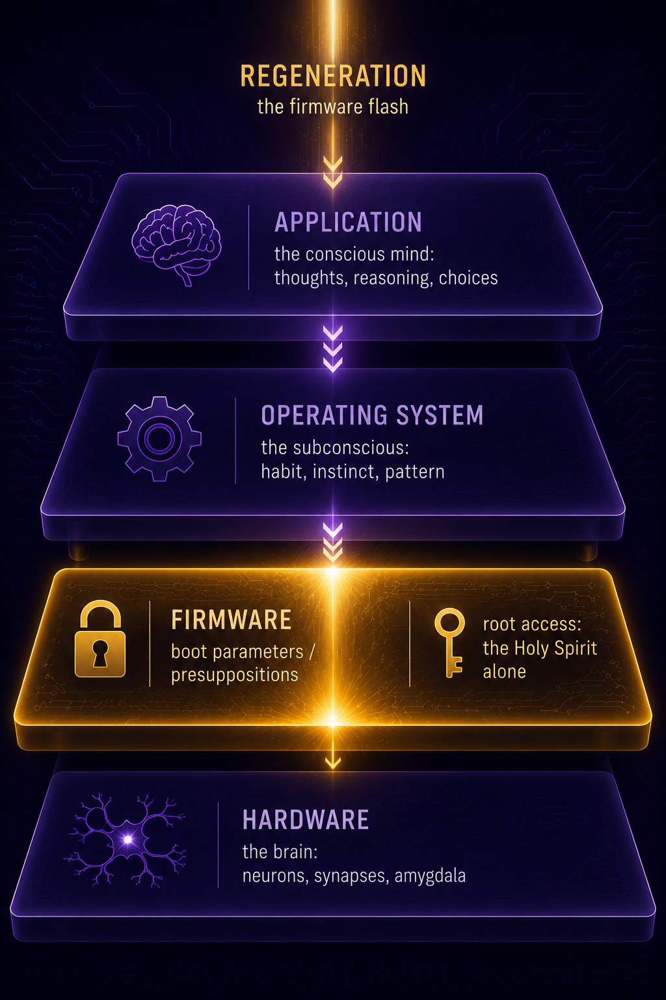

# Chapter 16: The Firmware -- How God Teaches His People

I used to think the Holy Spirit worked primarily through feelings. That He moved on the heart, stirred the emotions, created an inner warmth, a conviction, a tug -- something you couldn't quite name but knew was real. And I wasn't alone in thinking this. Most of the Christian world, from Pentecostals to Reformed, talks about the Spirit in experiential, emotional, mystical terms. "I felt the Spirit moving." "The Spirit impressed on my heart." "I sensed the Lord leading me."

And I'm not going to say those experiences aren't real. They are. But they're not the *primary* work of the Spirit. They're the byproduct. The side effect. The downstream result of something much more precise and much more important than a feeling.

The Holy Spirit's primary work is *epistemological*. He teaches. He reveals. He informs. He gives *knowledge*.

And once you see this, the entire doctrine of the Spirit's work snaps into focus in a way that the mystical framework never provides. Because the mystical framework can't tell you what the Spirit is actually *doing*. It can only tell you what it *feels like*. But the epistemological framework tells you exactly what He's doing -- He's changing what you know. And in changing what you know, He changes everything else.

## The Mind Is the Target

*"And be not conformed to this world: but be ye transformed by the renewing of your mind."* (Romans 12:2)

The renewing of your *mind*. Not the warming of your heart. Not the stirring of your emotions. Not the tingling of your spine. Your *mind*. Paul says the transformation happens through the mind. The mind is the target. The mind is where the Spirit does His work.

And this makes sense in the framework. If reality is information in God's mind, and if the human mind is what makes us unique among all physical creatures (as we'll develop in the next chapter), then the Spirit's work on the human mind is the Author editing the character's code. He's not decorating the interface. He's rewriting the source.

*"For who hath known the mind of the Lord, that he may instruct him? But we have the mind of Christ."* (1 Corinthians 2:16)

We have the *mind* of Christ. Not the feelings of Christ. Not the vibes of Christ. The mind. Paul is talking about a transfer of information. The Spirit gives the believer the capacity to think as Christ thinks, to see as Christ sees, to know as Christ knows -- not exhaustively, not perfectly in this life, but truly. The direction of travel is toward the mind of Christ. And the vehicle is knowledge.

What does the Spirit reveal? Propositional truth. Knowledge of sin -- that you are a sinner and cannot save yourself. Knowledge of God's attributes -- that He is sovereign, holy, just, and merciful. Knowledge of Christ -- that He is the Son of God who accomplished salvation for His people. Knowledge of the Gospel -- that Christ died for your sins, was buried, and rose again, and that this is *for you*.

Every one of those is a proposition. A claim. A piece of information. The Spirit doesn't give contentless experiences. He gives content. And the content transforms.

## Regeneration: The Firmware Flash

Now we come to the core metaphor of this chapter, and it's a metaphor I've been building toward since the beginning of this book.

Regeneration is the firmware flash[^c16-firmware]. The Spirit changes the boot parameters beneath awareness.

Let me explain what I mean by that, because the language is from computers but the reality is from Scripture. And it's not a cute analogy. It's the most precise description I know of for what the Spirit actually does when He regenerates a human soul.

Every computer has layers. The hardware is the physical machine -- the circuits, the chips, the screen. The firmware is the deepest layer of software, the instructions that run before the operating system loads, the code that tells the machine what it is and how to behave at the most basic level. The operating system sits on top of the firmware and manages the day-to-day operations. And the application layer -- the programs you actually interact with, the browser, the email client, the word processor -- sits on top of the operating system.

The human soul has the same architecture. The hardware is the brain -- neurons, synapses, the amygdala, the prefrontal cortex. The firmware is what I'm calling the boot parameters -- the deepest presuppositions of the soul, the assumptions that live beneath conscious awareness and determine how everything above them operates. The operating system is the subconscious mind, processing information constantly without the conscious mind's awareness. And the application layer is the conscious mind -- the thinking, reasoning, deciding part that you identify as "you."

| Layer | What it is | What touches it |
|---|---|---|
| **Application** | The conscious mind. Reasoning, argument, decision, prayer in words | Preaching, apologetics, CBT, education |
| **Operating System** | The subconscious. Habit, instinct, pattern processed without awareness | Long obedience, repeated formation, dreams |
| **Firmware** | Boot parameters and presuppositions. What you cannot question, because you reason FROM it | **Root access: the Holy Spirit alone** |
| **Hardware** | The brain. Neurons, synapses, amygdala, prefrontal cortex | Medication, neurology, sleep, food |

Read the rows top-down as the layers stack: the conscious mind sits on the subconscious, which sits on the firmware, which sits on the hardware. Every higher layer is constrained by every lower one. Only the Spirit reaches the firmware.

<figure class="book-figure-center">

<figcaption>The four layers of the soul. Every higher layer rests on the one beneath it, and regeneration is the Spirit's flash of the firmware -- the one layer no argument or habit can reach.</figcaption>
</figure>

When the Spirit regenerates a person, He doesn't work at the application layer. He doesn't give you a new argument you haven't heard before. He doesn't provide evidence that finally tips the scale. He doesn't appeal to your reason and wait for you to make a decision. He goes *deeper*. He goes to the firmware. He changes the boot parameters. He rewrites the presuppositions that determine how you process everything.

And you don't know it's happening.

That's the critical point. Firmware flashes happen beneath awareness. The application layer doesn't see the firmware being rewritten. It only experiences the *results*. One day you looked at the cross and saw foolishness. The next day you looked at the cross and saw glory. Nothing changed in the argument. Nothing changed in the evidence. Nothing changed at the application layer. What changed was underneath -- the firmware, the boot parameters, the presuppositions that determine what the application layer does with the information it receives.

*"For it is God which worketh in you both to will and to do of his good pleasure."* (Philippians 2:13)

Both to *will* and to *do*. The willing is firmware -- the deep desire, the direction of the soul, the presupposition that Christ is desirable. The doing is application -- the conscious choices that flow from the new will. God works in *both* layers. He doesn't just change your actions. He changes your wants. He changes what you love. He changes the boot parameters, and the application follows.

## The Spirit Prepares Before Faith

Here is something that most theology misses entirely, and it's one of the most pastorally important things in this book.

The Spirit prepares His people their entire lives before they actually believe. The firmware flash of regeneration doesn't happen in a vacuum. It happens at the end of a lifelong preparation that the Spirit has been conducting since birth.

Every experience. Every conversation. Every book. Every failure. Every moment of conviction. Every time the truth brushed past you and something inside stirred, even though you didn't know what it was. The Spirit was loading data. He was preparing the ground. He was arranging the grammar, to use the classical education language we'll develop at the end of this chapter.

I look back at my own life and I can see it. Years before I believed the sovereign grace of God, the Spirit was arranging circumstances, placing people in my path, giving me experiences that would make the truth make sense when it finally arrived. I didn't recognize it at the time. I couldn't. The firmware hadn't been flashed yet. But the Spirit was working underneath, loading data, filing away truths, preparing the subconscious for the moment when He would change the boot parameters and everything would click.

And this means that the Spirit's work is *not* limited to the moment of conversion. Conversion is the visible event. But the invisible work started long before. The elect are being prepared their whole lives. Even when they're running from God. Even when they're in the pig pen. The Spirit is at work underneath, and He doesn't fail.

## Only the Spirit Has Root Access

In a computer, root access means you can change anything. You can rewrite the firmware. You can alter the operating system. You can modify any file, any setting, any parameter. Root access is total control of the machine.

Only the Holy Spirit has root access to the human soul.

No argument has it. No preacher has it. No book has it. No evidence has it. No amount of logic, rhetoric, or persuasion can change the firmware. All of those things operate at the application layer. They present information to the conscious mind. And the conscious mind processes that information *according to its boot parameters*.

This is why apologetics doesn't produce faith. Not because the arguments are bad. Some of them are excellent. But the arguments operate at the application layer, and the firmware determines what the application layer does with them. A regenerate person hears the gospel and believes, because the firmware was flashed. An unregenerate person hears the same gospel and rejects it, because the firmware wasn't flashed. Same argument. Same evidence. Same words. Different firmware. Different result.

*"But the natural man receiveth not the things of the Spirit of God: for they are foolishness unto him: neither can he know them, because they are spiritually discerned."* (1 Corinthians 2:14)

The natural man *cannot* receive them. Not "will not" as a choice. *Cannot.* The boot parameters don't allow it. The firmware is set to "foolishness." And no application-layer argument can change firmware-level settings. Only the Spirit can do that. Only the Spirit has root access.

This is the most freeing truth in all of evangelism. You are not responsible for changing anyone's mind. You can't. It's not your job and it's not in your power. Your job is to present the truth. The Spirit's job is to flash the firmware. And He always does it for His elect, at the appointed time, through the means He has ordained.

## What Faith IS

I need to say this carefully, because this is the point where most of the theological world gets off the bus.

Faith is not a duty. Faith is not a condition. Faith is not a human contribution to salvation. Faith is not the one thing God requires of you before He'll save you.

Faith is the application layer becoming aware that the firmware has been flashed.

That's it. Faith is the *experience* of salvation, not the *cause*. It's the conscious mind waking up to what the Spirit already did in the subconscious. It's the moment the prodigal son realizes he's still a son. He didn't make himself a son by realizing it. The realization came *because* he was a son. The faith came *because* the Spirit regenerated him. Not the other way around.

*"But the fruit of the Spirit is love, joy, peace, longsuffering, gentleness, goodness, faith."* (Galatians 5:22)

Faith is listed as a *fruit* of the Spirit. A fruit. Not a duty. Not a condition. Not a work. A fruit -- something that grows from a root, naturally, inevitably, without straining. The root is the Spirit. The fruit is faith. And fruit doesn't produce the root. The root produces the fruit.

*"For by grace are ye saved through faith; and that not of yourselves: it is the gift of God."* (Ephesians 2:8)

The gift of God. Not your contribution. Not your side of the bargain. The *gift*. And if faith is a gift, then faith is given, not generated. If faith is given, then God gives it to whom He wills. And if God gives it to whom He wills, then faith is sovereign, not free.

And the regenerate individual doesn't just receive intellectual assent to historical facts. "Jesus died and rose again" -- even the devils believe that (James 2:19). Saving faith is something else entirely. The Spirit testifies to the conscience that the Gospel promises are *for you*. That Christ's blood covers *your* sin. That the righteousness is imputed to *you*. That you are a child of God, not in the abstract, but personally, specifically, inescapably. And that personal assurance -- that "Abba, Father" moment -- is what separates saving faith from mere intellectual agreement. The regenerate person doesn't just believe the gospel is true. They jump for joy because the gospel is true *for them*.

## The Trivium: Education as Rendering

There's a connection here that I didn't see until my son Cole was deep into his classical education, and then later into his philosophy degree at Marshall. But the link held and would not let go.

The classical Trivium -- grammar, logic, rhetoric -- mirrors the architecture the Spirit uses to regenerate.

**Grammar** is the loading of data. Raw information. Facts. Vocabulary. The building blocks. In education, you learn the names, the dates, the rules, the definitions. In the Spirit's work, He loads truth progressively -- through Scripture, through sermons, through conversations, through experiences. He fills the warehouse.

**Logic** is the finding of patterns. Connections. Analysis. How the data relates to itself. In education, you learn to think -- to identify contradiction, to build arguments, to see how one fact connects to another. In the Spirit's work, He connects the truths He's been loading -- the law reveals sin, sin reveals need, need reveals Christ, Christ reveals grace. The patterns emerge.

**Rhetoric** is the building of output. Expression. Persuasion. The data and the patterns produce something. In education, you learn to speak and write -- to take what you know and what you've analyzed and produce something new. In the Spirit's work, rhetoric is faith. Faith is the output. The grammar was loaded, the logic connected it, and the rhetoric produced the response: "I believe. This is for me. Christ is mine."

The same architecture the Spirit uses to regenerate is the architecture used to educate a mind. Classical education mirrors divine pedagogy. And it's not a coincidence. It's design. The Author who designed the soul also designed the method of teaching the soul. Grammar, logic, rhetoric -- it's His pattern. We didn't invent it. We discovered it.

But the Spirit does not work through these stages in strict sequence the way a classroom does. In the classroom, grammar comes first, then logic, then rhetoric, and the student moves through them over years. In the Spirit's work, all three overlap and repeat across a lifetime. Data is being loaded while patterns are being connected while earlier patterns are producing output. The warehouse is being filled and organized and drawn from simultaneously. The Spirit is not a teacher following a syllabus. He is an Author who works at every layer at once, loading data in one conversation while connecting patterns from a conversation ten years ago while the application layer is already producing faith from data loaded twenty years before that. The trivium describes the architecture. It does not describe a timeline.

## Objections and Answers

**"You're reducing the Spirit's work to information transfer."**

Not reducing. Clarifying. The Spirit gives *information*: knowledge of sin, knowledge of Christ, knowledge of the Gospel. He doesn't give contentless feelings. Romans 12:2 says transformation comes through the renewing of the *mind*. 1 Corinthians 2:16 says we have the *mind* of Christ. The mind is the target. The feelings are real, but they follow the information. They don't precede it. The Spirit isn't a warm fuzzy. He's the Author rewriting the code.

**"If no argument produces faith, preaching is pointless."**

Because preaching is the means God uses. The argument at the application layer doesn't change the firmware. But the Spirit uses the argument as the *occasion* to flash the firmware. We preach because God told us to. He handles the results. The preacher plants and waters. God gives the increase (1 Corinthians 3:6-7). And He always gives the increase for His elect. Every single time. The means are real means. They just aren't the efficient cause. The Spirit is.

**"The 'boot parameters' language is from computers, not theology."**

The language is new. The reality isn't. Presuppositions have always been recognized. Van Til called them "basic commitments." Gordon Clark called them "first principles." Every presuppositionalist knows that your deepest assumptions determine how you process everything above them. Boot parameters is just the honest name for what the Reformed world has always acknowledged -- your foundational presuppositions were not chosen by you. They were installed. By the Author. And only the Author has the access to change them.

And I want to be honest about the limits of the model itself. The four-layer architecture -- hardware, firmware, OS, application -- is vocabulary, not revelation. Scripture speaks of the heart, the inward parts, the spirit. The model maps these to firmware, OS, and application because the architecture is useful and consistent. But the Bible doesn't draw lines between boot parameters and subconscious processing. It speaks of the heart as one thing. The model's value is in clarifying HOW the Spirit's work operates at different depths. The risk is in treating the model as though God designed the soul with a software manual. He didn't. He designed it with a purpose. The model describes the mechanism. The purpose is Christ.

## For Further Study

The following passages speak to the themes of this chapter and are commended to the reader for independent study.

**The Spirit's epistemological work -- teaching, revealing, informing:** John 14:26; John 16:8-11; John 16:13-14; 1 Cor. 2:10-13; 1 Cor. 2:16; Eph. 1:17-18; Eph. 3:16-19; Col. 1:9; 1 John 2:20; 1 John 2:27; Isa. 11:2; Isa. 54:13; Jer. 31:33-34.

**The mind as the target of transformation:** Rom. 8:5-8; Rom. 12:2; 1 Cor. 2:16; Col. 3:2; Eph. 4:23; Phil. 2:13; Phil. 4:8; Tit. 1:15; 2 Cor. 10:5; Isa. 26:3; 1 Pet. 1:13.

**Regeneration as an act of God beneath human awareness:** Ezek. 36:26-27; Deut. 30:6; Jer. 24:7; Jer. 31:33; Jer. 32:39; John 3:3-8; John 1:13; James 1:18; 1 Pet. 1:3; 1 Pet. 1:23; Tit. 3:5.

**The natural man's inability to receive spiritual truth:** 1 Cor. 1:18; 1 Cor. 1:21; 1 Cor. 1:23; 1 Cor. 2:14; 2 Cor. 4:3-4; John 8:43; John 12:39-40; Matt. 11:25-27; Matt. 13:10-15; Rom. 8:7-8.

**The Spirit preparing the elect throughout their lives:** Ps. 139:1-6; Ps. 139:16; Prov. 16:1; Prov. 16:9; Prov. 20:24; Jer. 10:23; Acts 17:26-27; Rom. 2:4; Isa. 46:3-4; Isa. 49:1.

**Faith as gift and fruit, not human contribution:** Gal. 5:22; Eph. 2:8; Phil. 1:29; Heb. 12:2; Mark 9:24.

**Preaching as the means God uses:** Rom. 10:14-15; Rom. 10:17; 1 Cor. 1:21; 1 Cor. 3:6-7; 2 Cor. 4:5-7; 2 Tim. 4:2; James 1:21; 1 Pet. 1:25; Isa. 55:10-11; Jer. 23:29.

[^c16-firmware]: The *firmware* metaphor is my name for regeneration: the Spirit's monergistic, instantaneous rewrite of the layer beneath thought and will -- not the reform of the old nature but the flashing of a new one. The metaphor is mine; the doctrine is the old word *regeneration* (John 3; Titus 3:5).
