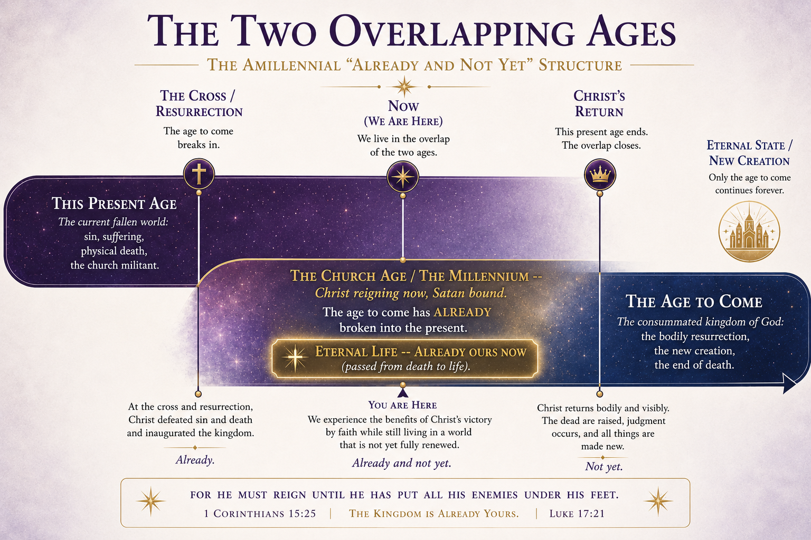
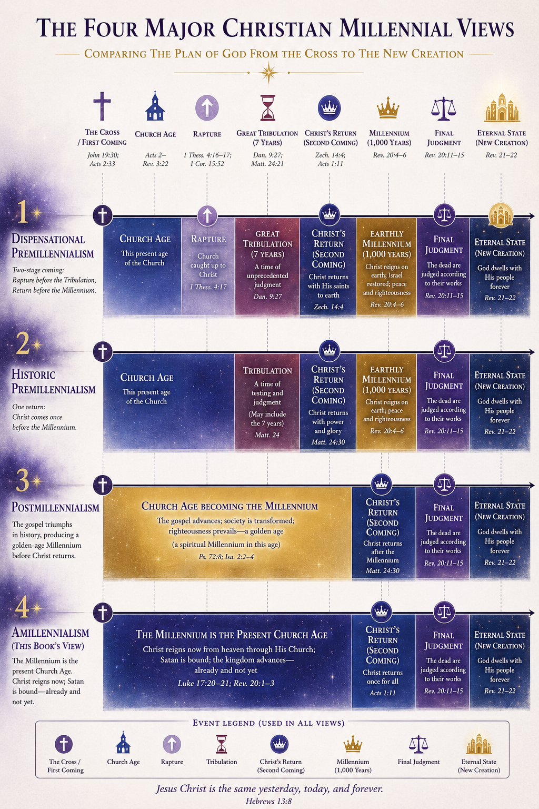
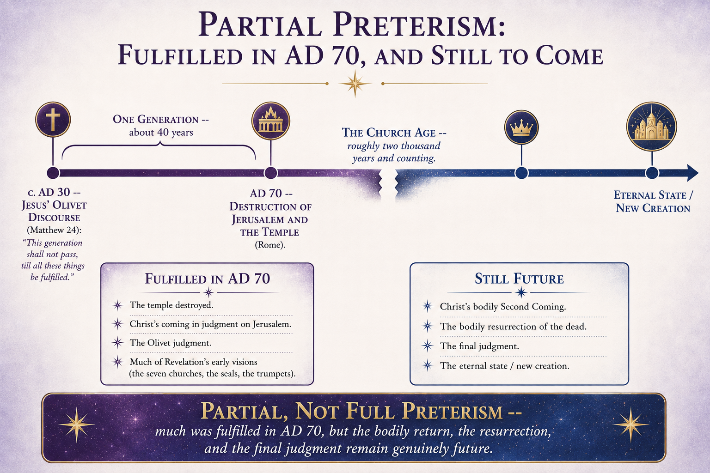
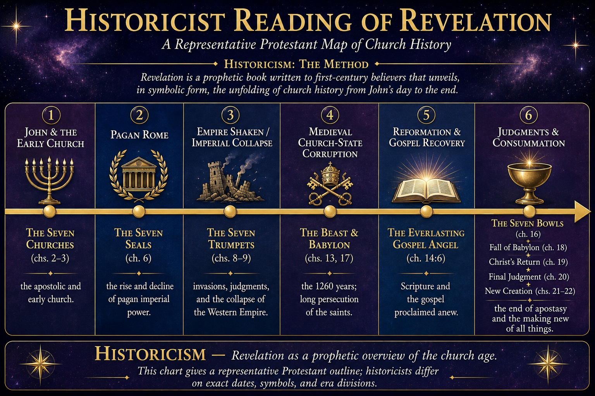

# Chapter 27: The Revelation -- Amillennial, Partial Preterist, Historicist

I hold this chapter with more open hands than anything else in the book.

That's an unusual way to start a chapter on eschatology, because eschatology is the one domain where everyone seems to have absolute certainty. The dispensationalists have their charts. The postmillennialists have their optimism. The premillennialists have their timelines and their rebuilt temples and their seven-year tribulations and their rapture indexes. Everyone has a system. Everyone is sure. And I'm going to tell you what I believe and then I'm going to tell you that I hold it more loosely than I hold justification from eternity or the two seeds or the authorship of evil. Because God *deliberately* obscured apocalyptic literature. He wrote Revelation in a genre designed to conceal as much as it reveals. And the man who reads a deliberately obscured text and comes away with absolute certainty about every detail has mistaken his confidence for comprehension.

I've watched men build entire ministries on prophecy charts. I've watched them calculate dates. I've watched them read every headline through the lens of their eschatological system and declare that *this* war, *this* treaty, *this* political figure is the fulfillment of *that* verse. And they've been wrong every single time. Not wrong about the *nature* of the last things, but wrong about the *timing*, the *specifics*, the details they were most sure about. And they never seem to learn, because the next headline produces the next confident interpretation, and the cycle repeats.

I'm not going to do that. I'm going to tell you what the framework derives about the nature of the end, and I'm going to hold the timing and the details loosely, because the Author wrote this chapter of His story in a genre that doesn't yield to human certainty.

## The Kingdom Is Spiritual, Not Physical

This is the starting point, and it comes directly from the framework. The invisible is more real than the visible. The substance precedes the formality. The covenant precedes the ceremony. And the reason is always the same: the substance is the thought in God's mind, and the ceremony is the rendering of that thought into time and matter. The thought is first because the Mind is first. That is operational idealism (Chapter 1), and it applies in *every* domain we've examined in this book. The invisible reality is the real one. The physical expression is the rendering.

Why would eschatology be different?

*"Jesus answered, My kingdom is not of this world: if my kingdom were of this world, then would my servants fight, that I should not be delivered to the Jews: but now is my kingdom not from hence."* (John 18:36)

My kingdom is *not of this world*. Christ said it plainly. He said it to Pilate, who was looking for a political threat, and Christ told him there isn't one. Not because Christ doesn't have a kingdom. He does. But because His kingdom is invisible. Spiritual. Real in the way that everything invisible in this book has been real, more real than the physical rendering, not less.

*"Neither shall they say, Lo here! or, lo there! for, behold, the kingdom of God is within you."* (Luke 17:21)

Within you. Not in a rebuilt temple, not in a thousand-year geopolitical reign, not on a throne in Jerusalem with nations sending ambassadors. *Within you.* The kingdom is the regenerated heart. The kingdom is the new firmware. The kingdom is Christ reigning in His people right now, this moment, in every believer across the globe.

And this is the amillennial position. Not that there is no millennium. But that the millennium is the present age. Christ is reigning *now*. He has been reigning since His ascension. The kingdom was inaugurated at the cross, not at some future date on a prophecy chart. And the millennium, the "thousand years" of Revelation 20, is a symbolic number describing the entire period between Christ's first and second comings.

*"All power is given unto me in heaven and in earth."* (Matthew 28:18)

All power. Given. Past tense. Not "all power will be given to me when I return." All power is given unto me *now*. In heaven AND in earth. Christ is not waiting to reign. He is reigning. The kingdom is not future. The kingdom is present. And if the invisible is more real than the visible, then the fact that you can't *see* the kingdom doesn't mean it isn't *here*. It means you're looking at the rendering instead of the thought.

<figure class="book-figure-wide"><figcaption>The amillennial &ldquo;already and not yet&rdquo;: the age to come has already broken into the present, and eternal life is ours now.</figcaption></figure>

| | Dispensational Premill | Historic Premill | Postmillennial | Amillennial (MCT) |
|---|---|---|---|---|
| Nature of the millennium | A literal future earthly thousand-year reign | A literal thousand years after Christ's return | A future golden age before Christ returns | The current age, between the cross and Christ's return |
| When Christ returns | After the rapture, before the millennium | After tribulation, before the millennium | After the millennium | At the end of the present age |
| Israel and the church | Two distinct peoples with separate destinies | One people, with a future for ethnic Israel | One people | One people; the church is true Israel by faith |
| Direction of history | Decline until the rapture | Decline until Christ returns | Gradual earthly progress to a golden age | Wheat and tares grow together. Gospel advances, opposition advances, until Christ returns |
| Hermeneutic | Literal-future for prophecy | Mostly literal-future | Literal but optimistic | Apocalyptic-symbolic; the invisible is more real |

<figure class="book-figure-wide"><figcaption>The four major millennial views compared, from the cross to the new creation.</figcaption></figure>

## Partial Preterism -- What Was Fulfilled in AD 70

Much of the New Testament's apocalyptic language was fulfilled in the destruction of Jerusalem in AD 70. And I need to be precise here, because full preterism says *everything* was fulfilled in AD 70, including the second coming and the resurrection, and I reject that completely. Christ will return bodily. The resurrection is future. The final judgment is future. Those things are not accomplished.

But the Olivet Discourse (Matthew 24, Mark 13, Luke 21) is largely about the destruction of the temple, not the end of the world. And Jesus said so explicitly.

*"Verily I say unto you, This generation shall not pass, till all these things be fulfilled."* (Matthew 24:34)

*This generation.* Not a future generation two thousand years later. The generation standing in front of Jesus. And within forty years, the Roman army destroyed Jerusalem, leveled the temple, and scattered the Jewish nation. The abomination of desolation. The fleeing to the mountains. The tribulation. The signs in the heavens. All of it happened in AD 70, to the generation Jesus was speaking to.

The early church understood this. It's only the modern church, saturated in dispensational futurism, that reads Matthew 24 as if it's entirely about the twenty-first century. Jesus was answering a specific question from His disciples: *"When shall these things be? and what shall be the sign of thy coming, and of the end of the world?"* (Matthew 24:3). And He answered both questions. The destruction of the temple was near. The end of the world was distant. The discourse weaves both together, and the interpreter's job is to distinguish between the near fulfillment and the far.

Most of Revelation's early chapters (the seven churches, the seals, the trumpets) correspond to events that have already occurred. The persecution under Rome. The fall of Jerusalem. The spread of the early church. The conflicts and heresies of the first centuries. This is not a novel interpretation. This is what the church believed for most of its history.

<figure class="book-figure-wide"><figcaption>Partial preterism: much was fulfilled in AD 70, but the return, resurrection, and final judgment remain genuinely future.</figcaption></figure>

<figure class="book-figure-wide"><figcaption>A representative historicist reading of Revelation: the book as a prophetic map of church history, from the apostolic age to the consummation. Historicists differ on the exact dates and divisions.</figcaption></figure>

## Historicism -- The Original Reformed Framework

And here is the piece that modern evangelicalism has almost entirely forgotten.

The historicist interpretation of Revelation holds that the book is a map of church history unfolding across the centuries. The seals, the trumpets, the beasts, the plagues: they correspond to real historical events and movements. Not to a seven-year tribulation at the end of time. Not to a rebuilt temple in the twenty-first century. To *history*. To the story that has been unfolding since the first century.

*"And from the days of John the Baptist until now the kingdom of heaven suffereth violence, and the violent take it by force."* (Matthew 11:12)

The kingdom has been under assault since it was announced. That's not a future event. That's church history. This was the *original* Reformed eschatological framework. Luther identified the papacy with the antichrist. Calvin held a historicist reading. Knox held it. The Westminster divines held it. Wycliffe, Huss, Tyndale. Every major Reformer read Revelation as a map of the church's ongoing struggle. The identification of the beast with Rome and the papacy wasn't a fringe position. It was *the* position. For fifteen hundred years.

And then John Nelson Darby came along in the 1830s, invented dispensationalism, split history into seven ages, divided God's program for Israel from God's program for the church, and introduced the pretribulational rapture. And within two hundred years, his system completely replaced the one that had stood for a millennium and a half. The Scofield Reference Bible popularized it. Hal Lindsey's *Late Great Planet Earth* made it a bestseller. The *Left Behind* novels made it pop culture.[^c27-dispensationalism] And now most evangelicals think dispensational premillennialism is *the* biblical position and they've never even heard of historicism.

None of this came from Scripture. It came from Darby. The charts, the rebuilt temple, the pretribulational rapture, the distinction between Israel and the church as two separate programs of God, none of it is derived from the text. It is a system imposed ON the text. And the church adopted it wholesale because the system was exciting and the books sold well. Not because it was true.

I hold the historicist position because it fits the framework. The Author is still writing the story. Revelation maps the ongoing narrative. The seals have been opening across centuries. The trumpets have been sounding across centuries. The beasts have risen and fallen across centuries. And reading Revelation requires the same pattern recognition across history that the Author built into every other domain of this book. The invisible precedes the visible. The plan precedes the execution. And the story is still unfolding, page by page, because the Author hasn't written "The End" yet.

## Why Not Premillennialism?

Premillennialism, especially in its dispensational form, is the eschatological system I grew up with. And I reject it for the same reason I reject every other system in this book that puts the visible before the invisible, the ceremony before the covenant, the institutional before the personal.

Dispensational premillennialism requires a physical kingdom. A literal thousand-year reign of Christ on earth, sitting on a physical throne in physical Jerusalem, governing physical nations with physical laws. It requires a rebuilt temple with reinstated animal sacrifices. It requires a distinction between Israel and the church as two separate peoples of God with two separate destinies.

And every one of those requirements puts the visible before the invisible. The physical throne before the spiritual reign, the rebuilt temple before the indwelling Spirit, the geopolitical nation before the covenant people. It's the same error this book has been attacking since Chapter 1, applied to eschatology. The kingdom is *not* of this world. The kingdom is within you. The covenant precedes the ceremony, and the spiritual kingdom precedes any physical expression of it.

And the prophecy charts. The timelines. The date calculations. The newspaper exegesis. The entire infrastructure of dispensational eschatology has more in common with institutional formality than with personal covenant. It turns the book of Revelation into a puzzle to be solved rather than a story to be lived. And it has produced more false predictions and more embarrassed prophets than any other system in the history of the church.

## Why Not Postmillennialism?

Postmillennialism teaches that the gospel will triumph progressively in history, that the world will get better and better, that Christian influence will spread until virtually the whole earth is Christianized, and that *then* Christ will return to a world that has already been won.

And I hold it with more sympathy than premillennialism, because at least it takes the *present* kingdom seriously. But it doesn't match reality. And it doesn't match the posture of this book, which is *"present the truth softly and wait on the Lord."*

*"This know also, that in the last days perilous times shall come."* (2 Timothy 3:1)

The world is not getting better. The gospel is not progressively winning. The gates of hell are not falling one by one in an orderly march toward global Christianization. The world is doing what the world has always done: some souls are being called, others are hardening, and the Author is writing a story that includes *both* simultaneously.

Postmillennialism is triumphalist, and triumphalism is a kind of pride. It assumes we can *see* the direction of history by looking at the rendering. But we can't. Only the Author sees the filmstrip from above. The character in the story can't tell whether the plotline is rising or falling by looking at the current page. And the posture of a character who trusts the Author isn't triumphalism. It's faithfulness. Quiet, steady, soft-spoken faithfulness. Present the truth. Wait on the Lord. He knows the ending. We don't.

Mary Van Weelden makes the same case from the biblical-theological side in her exegesis of Isaiah 24-27. The prophecy's vision is a struggling remnant and a city of chaos awaiting final judgment, not a gradually Christianized earth awaiting a victorious return. *"The Lord will work through Zion, rather than Zion doing the work."*[^c27-vanweelden] The remnant does not build the kingdom. The Lord does. Her reading sharpens the exegetical spine of the rejection the framework has already argued from posture and sovereignty. See the bibliography for the full citation.

## AI and the Final Chapter

I need to be transparent about something. What follows is speculation. Clearly labeled, clearly identified as my own observation, not a derivation from the framework. The framework derives the *nature* of the last things. This section speculates about a possible *mechanism*.

For all of recorded history, every "beast" (every totalitarian system, every empire, every surveillance state) has been limited by human bandwidth. The Roman Empire couldn't monitor every citizen because there weren't enough soldiers. The Soviet Union couldn't surveil every conversation because there weren't enough KGB agents. Even the most oppressive regimes in history had cracks, because the humans running the systems couldn't process the volume of information required for total control.

AI removes that limit.

For the first time in the history of the world, it is *technically feasible* to monitor every transaction, every conversation, every movement, every thought expressed digitally, in real time, without human bottlenecks. One system could mark every person. One algorithm could approve or deny every purchase. One network could identify every dissenter. Not because it's happening now. But because the technical infrastructure *exists* for the first time in human history.

*"And that no man might buy or sell, save he that had the mark, or the name of the beast, or the number of his name."* (Revelation 13:17)

For nineteen centuries, that verse was incomprehensible. How could any system control every transaction? Now it's not only comprehensible, it's technically trivial. A central digital currency, a biometric identifier, a social credit system, an AI-driven approval network. The technology exists. The implementation is a policy decision, not an engineering challenge.

I'm not saying AI *is* the beast. I'm not saying we're in the final chapter. I'm not building a prophecy chart with AI at the center. That would be doing exactly what I criticized the dispensationalists for doing. But I am observing that the historicist framework, which reads Revelation as a map of church history unfolding across centuries, has arrived at a point in history where one of the most specific and puzzling descriptions in the text, total economic control, is technically feasible for the first time. And the mechanism that makes it feasible is artificial intelligence.

That's not a prophecy. It's an observation. And the observation is worth noting, even with uncertainty, even with the full acknowledgment that I might be wrong about the significance.

The Author is still writing. And the ink on the current page looks different than the ink on any page that came before.

## The Lens, Not the Calendar

Here is what the framework *does* derive about eschatology, distinct from timing and details.

The principle I established at the top of this chapter, the invisible is more real than the visible, means the victory is accomplished even though the battle appears ongoing. Everything we've built across twenty-six chapters applies here.

The Author is writing the story. This means history is not random, not cyclical, and not meaningless. It is *going* somewhere. The filmstrip has a last frame. And the Author, who sees every frame simultaneously, is moving the narrative toward a conclusion that we can't see from inside the rendering but that is as certain as every other decree.

The three groups will be resolved. The elect angels. The elect humans. The reprobate. All three groups that we identified in Chapter 12 will be brought to their final state. The next two chapters address what that final state looks like. But the eschatological framework establishes that the resolution is coming, that it was planned before the first frame played, and that nothing in history is accidental or meaningless.

*"But of that day and hour knoweth no man, no, not the angels of heaven, but my Father only."* (Matthew 24:36)

And the framework predicts its own limits. It can derive what the last things *are*. It cannot derive *when* they occur. And that's not a flaw. That's the Author deliberately obscuring the timeline because the point was never the calendar. The point was the Person.

Christ reigns now. Christ will return bodily. The dead will be raised. The three groups will be resolved. And the Author who planned every frame will bring every frame to its appointed conclusion.

Beyond that, I hold it with open hands. And I think that's where the Author wanted His readers to stand.

## The Cross Is Forward-Loaded

And here is what I want to say loud enough for the saint who has been told that eschatology is the boring chapter at the back of the systematic. Eschatology is not the back of the book. It is the front-vector of the saint's life.

There is a popular line of thought in the sovereign grace world I came up in. It says the Old Testament saints looked forward to the cross, and the New Testament saints look back to it with greater clarity. We read the Old Testament with New Testament eyes. I agree with this completely. Henry Mahan made a lifework out of it. Spurgeon preached it. The framework affirms it.

But the framing is incomplete. It treats the New Testament saint as the END-POINT of the redemptive arc. The Old Testament saint looked forward. The New Testament saint looks back. The end. That is not what the New Testament actually teaches. The New Testament saint is the MIDPOINT between the cross-past and the glory-future. He does not just look back. He looks both directions.

*"And not only they, but ourselves also, which have the firstfruits of the Spirit, even we ourselves groan within ourselves, waiting for the adoption, to wit, the redemption of our body."* (Romans 8:23)

*"Looking for that blessed hope, and the glorious appearing of the great God and our Saviour Jesus Christ."* (Titus 2:13)

*"And unto them that look for him shall he appear the second time without sin unto salvation."* (Hebrews 9:28)

*"For our conversation is in heaven; from whence also we look for the Saviour, the Lord Jesus Christ: who shall change our vile body, that it may be fashioned like unto his glorious body."* (Philippians 3:20-21)

The whole New Testament is forward-leaning, not just backward-grateful. Paul groans. Paul looks. Paul waits. The saint who has only been catechized to look back does not groan. He gives thanks. The thanks is good. The thanks alone is not the New Testament saint's whole posture.

And the cross itself is forward-loaded. What Calvary purchased is not just propitiation and atonement and the forgiveness of past sins. Calvary purchased the resurrection body, the marriage supper of the Lamb, the new earth, the saints reigning, the glass coming down, and the covenant companion at the feast. Ephesians 1 moves from the blood of the cross to *"the dispensation of the fulness of times"* in three sentences. Paul never let the cross stay flat. Most preaching does. The cross is the hinge. The hinge points both ways.

And the Lord's Supper itself is forward-pointing. *"For as often as ye eat this bread, and drink this cup, ye do shew the Lord's death till he come."* (1 Corinthians 11:26) *Till he come.* The supper terminates at the second coming. Christ Himself said: *"I will not drink henceforth of this fruit of the vine, until that day when I drink it new with you in my Father's kingdom."* (Matthew 26:29) The supper is not memorial-only. The supper is the marriage supper of the Lamb rendered at lower resolution. Chapter 10 already said this. Most pulpits do not.

So when I say I hold eschatology with open hands, I want to be precise about what I mean. The TIMING is held loosely. The DETAILS of the seventy weeks, the man of sin, the millennial timeline, the political identification of Revelation's beasts, the order of the unfulfilled prophecies, all of it loose. The Author obscured the calendar on purpose. But the STRUCTURE is not loose. The structure is load-bearing.

The structure is this. The cross is forward-loaded. The saint looks both directions. The marriage supper is the front-vector of his life. The redemption of his body is what he waits for. The new earth is where the work is going. The covenant companion persists at the feast (Chapter 29 develops this, and Appendix A6 carries the longer treatment of the Hebrew *chaver* and the legal-ontological register distinction). The saints reign in the same reality the reprobate inhabit. The glass comes down for everyone in the higher resolution rendering. *These are not held loosely.* These are the pillars eschatology rests on, and the framework derives them from Scripture as firmly as it derives justification from eternity or the authorship of evil.

We are not just saved FROM. We are saved FOR. Saved for the marriage supper. Saved for the new earth. Saved for the covenant companion at the feast. Saved for the glass coming down. Saved for the resurrection body. Calvary paid AND secured. Mahan and Spurgeon got the paying right. Their lineage needs the securing also at the front of the saint's mind.

If you treat eschatology as the back of the book, you have starved your daily anchoring of the forward-vector that produces hope. The saint who only looks back at the cross is grateful. The saint who looks both directions is hopeful. Hope is not optional. *"For we are saved by hope: but hope that is seen is not hope: for what a man seeth, why doth he yet hope for? But if we hope for that we see not, then do we with patience wait for it."* (Romans 8:24-25) The hoping IS the saint's posture. The cross secures the hope. Without the forward-vector, the saint loses what he was saved for.

That is why this chapter sits where it sits in this book. Not as a footnote. Not as the Author's afterthought. As the front-vector the cross actually purchased. The next two chapters develop what the cross secured at higher resolution. Eschatology is not the genre's appendix. It is the saint's compass.

The timing I hold loosely. The compass I hold firmly. Both at once. Always both.

## Objections and Answers

**"Premillennialism has dominated evangelicalism for two hundred years."**

Popularity is not an argument. If it were, the freewillers would be right about everything. The question is not how long a position has been held or how many people hold it. The question is whether it can be derived from Scripture. Dispensational premillennialism cannot. It requires a physical kingdom the text doesn't teach (John 18:36), a two-stage return the text doesn't describe (Acts 1:11), and a distinction between Israel and the church the text doesn't make (Galatians 3:28-29). Length of tradition establishes nothing. Scripture establishes everything.

**"Including eschatology while holding it with open hands is incoherent."**

Because the framework has something to say about the *nature* of the last things even if the *timing* remains obscured. It derives what heaven and hell are. It derives how the three groups resolve. It derives the relationship between the present kingdom and the final state. Open hands about timing doesn't mean silence about nature. The next two chapters demonstrate what the framework can derive without a prophecy chart.

**"AI and eschatology is speculation."**

It is. I said so before I made the observation and I'm saying it again now. But the observation itself (that total economic surveillance and control is technically feasible for the first time in history, and that the mechanism is artificial intelligence) is not speculation. That's fact. The speculative part is the connection to Revelation 13. And I hold that connection with the same open hands I hold the rest of eschatology. But I'd rather observe it honestly and hold it loosely than ignore it entirely and pretend the technical landscape doesn't matter.

**"The state of the world proves Christ is not reigning now."**

Because the kingdom is invisible, and you're looking at the rendering. The world has always been a mess. It was a mess in the first century when Christ said "My kingdom is not of this world." The mess is the story. The kingdom is the thought behind the story. And the Author who reigns over the mess is the same Author who wrote the mess into the script for His purposes. The world doesn't have to look redeemed for the kingdom to be real. The covenant doesn't have to look like a ceremony to be a covenant.

**"Historicism is dead. Nobody holds it anymore."**

Correction: nobody in *American evangelicalism* holds it anymore, because American evangelicalism was captured by dispensationalism. But a position doesn't stop being true because people stop believing it. I already addressed the popularity argument above.

## For Further Study

The following passages speak to the themes of this chapter and are commended to the reader for independent study.

**The kingdom as spiritual and present, not physical and future:** Matt. 11:12; Luke 17:20-21; John 18:36; Rom. 14:17; 1 Cor. 4:20; Col. 1:13; Heb. 12:28; Matt. 12:28; Mark 1:15; Mark 9:1; Luke 11:20; John 3:3; John 3:5; 2 Tim. 3:1.

**Christ reigning NOW from the right hand of the Father:** Ps. 2:6-9; Ps. 110:1-2; Matt. 28:18; Acts 2:33-36; 1 Cor. 15:25; Eph. 1:20-22; Phil. 2:9-11; Col. 3:1; Heb. 1:3; Heb. 1:13; Heb. 2:8; Heb. 10:12-13; 1 Pet. 3:22; Rev. 1:5.

**AD 70 fulfillment -- the destruction of the temple foretold:** Matt. 23:36-38; Matt. 24:1-2; Matt. 24:15-21; Matt. 24:34; Mark 13:1-2; Mark 13:30; Luke 19:41-44; Luke 21:5-6; Luke 21:20-24; Luke 21:32; Dan. 9:26-27.

**Against dispensationalism -- no separate program for Israel and the church:** Rom. 2:28-29; Rom. 4:11-12; Rom. 4:16; Rom. 9:6-8; Rom. 11:17-24; Gal. 3:7; Gal. 3:16; Gal. 3:28-29; Gal. 6:16; Eph. 2:11-16; Eph. 3:6; Phil. 3:3; Heb. 8:8-13; 1 Pet. 2:9-10.

**The second coming -- bodily, visible, certain:** Matt. 24:36; Acts 1:11; Matt. 24:30; Matt. 25:31; Mark 13:26; Luke 21:27; 1 Thess. 4:16-17; 2 Thess. 1:7-10; Tit. 2:13; Heb. 9:28; Rev. 1:7; Rev. 13:17; Rev. 22:12; Rev. 22:20.

**The resurrection of the dead:** John 5:28-29; John 6:39-40; John 6:44; John 6:54; John 11:25-26; Acts 24:15; Rom. 8:11; 1 Cor. 15:20-23; 1 Cor. 15:42-57; 1 Thess. 4:14-16; Phil. 3:20-21; Rev. 20:12-13.

**The forward-vector -- the saint groaning, looking, waiting for what the cross secured:** Rom. 8:23; Rom. 8:24-25; Tit. 2:13; Heb. 9:28; Phil. 3:20-21; 1 Cor. 11:26; Matt. 26:29; Eph. 1:7-10; 2 Pet. 3:13; 1 John 3:2-3; Rev. 22:17; Rev. 22:20.

**The cross as eternal, not just past -- the Lamb slain from the foundation of the world:** Rev. 13:8; Eph. 1:4-5; 1 Pet. 1:18-20; 2 Tim. 1:9; Acts 2:23; Acts 4:27-28; Rev. 17:8.

[^c27-dispensationalism]: On the origins of dispensationalism in J. N. Darby and the Plymouth Brethren in the 1830s, see *The Collected Writings of J. N. Darby*, ed. William Kelly, 34 vols. (London: G. Morrish, 1867-1900); C. I. Scofield, ed., *The Scofield Reference Bible* (New York: Oxford University Press, 1909); Hal Lindsey with Carole C. Carlson, *The Late Great Planet Earth* (Grand Rapids: Zondervan, 1970); Tim LaHaye and Jerry B. Jenkins, *Left Behind* (Wheaton: Tyndale House, 1995).

[^c27-vanweelden]: Mary Van Weelden, "No Room for Post-Millennialist Optimism: Considering the Saints and the City of Chaos in Isaiah 24-27," *Modern Reformation*, April 17, 2026.
