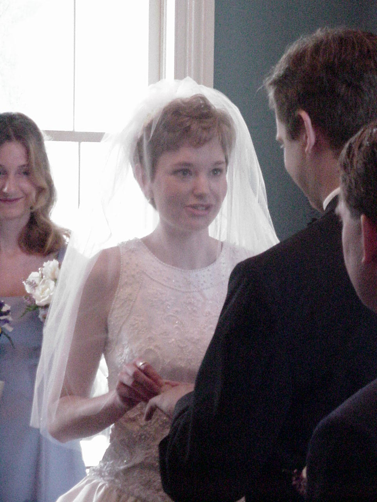
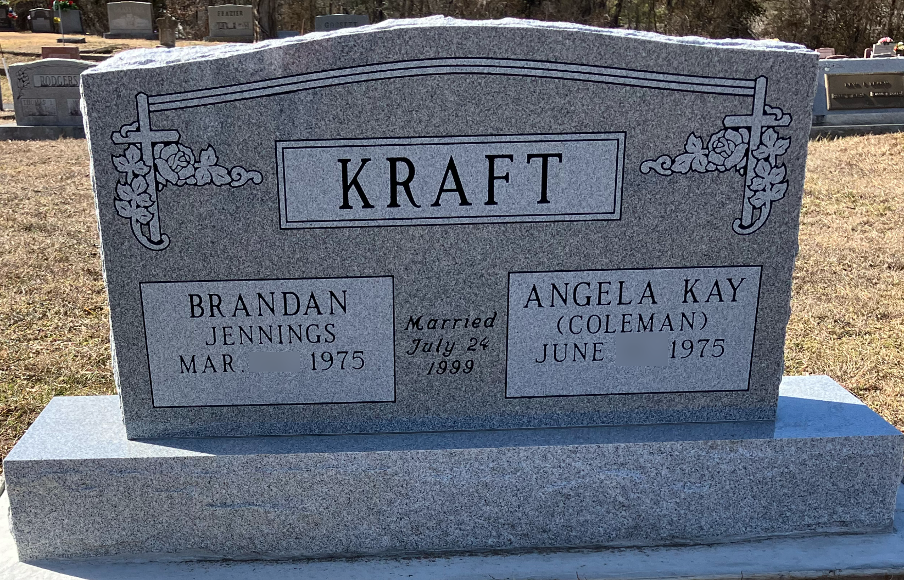

# Chapter 29: The Higher Resolution Rendering

I need to confess something before I start this chapter. I used to think the resurrection body was a miracle. Something God *added* to the human body, something supernatural layered on top of the natural. As if Jesus walked out of the tomb and God had bolted on a set of supernatural abilities (the ability to walk through walls, the ability to appear and disappear, the ability to ascend into the sky) like upgrades to a base model. Resurrection body 2.0. More features. Better specs.

And I was wrong. Not about the resurrection. About what the resurrection *is*. The resurrection body isn't God adding things to the human body. It's God *stopping subtracting*. The miraculous properties of the resurrection body aren't additions. They're what happens when the rendering constraints are removed. The old rendering engine was limiting the body. The new one stops limiting it. And what's left is what was always there.

## The Prototype

Christ's resurrection body is the prototype. The first one off the line. The model that every other resurrection body will match. And it has four properties that tell us everything we need to know about the higher resolution rendering.

**It is physical.**

This is the first thing. And it is the most important thing, because every Gnostic instinct in us wants to make the resurrection body less physical, not more. We want to spiritualize it. We want to say the body was transcendent, ethereal, ghostly. And Jesus goes out of His way to demonstrate the opposite.

*"And while they yet believed not for joy, and wondered, he said unto them, Have ye here any meat? And they gave him a piece of a broiled fish, and of an honeycomb. And he took it, and did eat before them."* (Luke 24:41-43)

He ate fish. Broiled fish and honeycomb. After the resurrection. A spirit doesn't eat. A ghost doesn't chew. Jesus ate because He had a real body with real physicality that could process real food. He wasn't demonstrating something symbolic. He was demonstrating something biological. The resurrection body eats. It digests. It is *more* physical than what came before, not less.

And Thomas.

*"Then saith he to Thomas, Reach hither thy finger, and behold my hands; and reach hither thy hand, and thrust it into my side: and be not faithless, but believing."* (John 20:27)

Reach hither thy finger. Thrust it into my side. This is a physical body with physical wounds that a physical hand can touch. The nail prints are still there. The spear wound is still there. The body carries the marks of the crucifixion in the resurrection, not because the body is incomplete or broken, but because the marks are part of the information. They are part of who Jesus is. The wounds are the signature of the covenant, rendered in flesh, carried into eternity. The body doesn't shed the cross. The body *wears* the cross, permanently, as proof of what was accomplished.

**It is unconstrained.**

*"Then the same day at evening, being the first day of the week, when the doors were shut where the disciples were assembled for fear of the Jews, came Jesus and stood in the midst, and saith unto them, Peace be unto you."* (John 20:19)

The doors were shut. And Jesus stood in the midst. He didn't knock. He didn't open the door. He was simply *there*. And if you're tempted to say this means the body is immaterial, remember what we just established. He ate fish. Thomas touched Him. The body is physical; we just established that. But it walks through locked doors. Which means locked doors are a rendering constraint, not a feature of reality. In the old rendering, walls are barriers. In the higher resolution rendering, walls are not barriers. The wall didn't change. The body's relationship to the wall changed. The constraint was removed.

*"And their eyes were opened, and they knew him; and he vanished out of their sight."* (Luke 24:31)

He vanished. Disappeared. Was present and then was not present. Again, not because the body is immaterial, but because locality, being stuck in one place, is a rendering constraint. The old rendering engine says you can only be in one location at a time. The new rendering engine doesn't impose that constraint. Jesus can appear, be present, teach, and then vanish, not because He's flickering in and out of existence, but because He's operating at a resolution where the rules that bind our bodies don't bind His.

And He ascended.

*"And when he had spoken these things, while they beheld, he was taken up; and a cloud received him out of their sight."* (Acts 1:9)

Gravity is a rendering constraint. The old rendering engine says bodies fall. The higher resolution rendering doesn't impose that rule. Jesus ascended because the constraint that holds us down was removed. The same physical body rose into the sky. Physical *and* unconstrained. Not one or the other. Both.

**It is recognizable but different.**

And here is the detail that means the most to me.

*"Jesus saith unto her, Woman, why weepest thou? whom seekest thou? She, supposing him to be the gardener, saith unto him, Sir, if thou have borne him hence, tell me where thou hast laid him, and I will take him away. Jesus saith unto her, Mary. She turned herself, and saith unto him, Rabboni; which is to say, Master."* (John 20:15-16)

Mary stood at the empty tomb, weeping, and she didn't recognize Jesus. She thought He was the gardener. She looked right at Him and didn't know who He was. And then He said her name. *Mary.* One word. And she recognized Him instantly. Not by His face. By His *voice*. The higher resolution body looked different enough that a woman who loved Him didn't recognize Him by sight. But the voice was the same. The signature was the same. The *person* was the same.

And on the road to Emmaus.

*"And it came to pass, that, while they communed together and reasoned, Jesus himself drew near, and went with them. But their eyes were holden that they should not know him."* (Luke 24:15-16)

They walked with Him for miles. They talked with Him. They reasoned with Him. And they didn't recognize Him. For miles. Until the moment He broke bread.

*"And it came to pass, as he sat at meat with them, he took bread, and blessed it, and brake, and gave to them. And their eyes were opened, and they knew him; and he vanished out of their sight."* (Luke 24:30-31)

Their eyes were opened. Note that carefully. The text doesn't say Jesus changed. The text says their *eyes* were opened. The change was in their perception, not in His appearance. His rendering was already at higher resolution. Their firmware needed a moment to adjust. They recognized Him in the breaking of bread: a gesture, a habit, a signature of who He was. Not the surface. The signature.

This is what the higher resolution rendering preserves. Not the surface appearance, not the exact arrangement of features. The *person*. The voice. The habits. The way He breaks bread. The way He says your name. The higher resolution rendering doesn't make you *less* you. It makes you *more* you. It strips away the rendering constraints that were limiting the expression of who you are, and what's left is the clearest, most faithful rendering of the original thought that God ever expressed.

Mary recognized Him by His voice. The Emmaus disciples recognized Him in the breaking of bread. The higher resolution body preserves the *signature*, not the surface.

## What the Resurrection IS

Now let me say what this is in the language of the framework.

The resurrection is not a miracle in the traditional sense of God intervening from outside to do something the system can't do on its own. The resurrection is God upgrading the rendering engine to be more faithful to the original thought. The current rendering engine limits. It constrains. It takes the infinite thought that is a person and renders it into a body that gets tired, gets sick, ages, and dies, not because the thought is limited, but because the rendering engine is limited. The thought has always been more than the body could express.

The resurrection body is what happens when the rendering engine stops limiting. The "miraculous" properties (walking through walls, appearing and disappearing, ascending, being unconstrained by gravity and locality) are not additions. They are what was *always* true about the thought, now expressed without constraint. The old rendering engine was subtracting from the thought. The new rendering engine stops subtracting. And what's left is the full thought, rendered faithfully, at the resolution the Author always intended.

*"It is sown in corruption; it is raised in incorruption: It is sown in dishonour; it is raised in glory: it is sown in weakness; it is raised in power: It is sown a natural body; it is raised a spiritual body."* (1 Corinthians 15:42-44)

Look at the pairs. Corruption and incorruption. Dishonor and glory. Weakness and power. Natural and spiritual. Every pair is the same information at two different rendering resolutions. The thought doesn't change. The rendering changes. Corruption, weakness, dishonor: these are rendering constraints, not properties of the person. Remove the constraints, and what was always there becomes visible.

"It is sown a natural body; it is raised a spiritual body." And here is where people get confused, because they read "spiritual body" and think "immaterial body." But that is not what Paul is saying. A "spiritual body" is a body animated and governed by the Spirit. The "natural body" is animated by the soul: the *psyche*, the natural life, the old firmware. The "spiritual body" is animated by the Spirit: the *pneuma*, the new firmware, the power of God Himself. Same body. Different operating system. The body doesn't become less physical. It becomes less *constrained*. The Spirit doesn't make the body immaterial. The Spirit makes the body *free*.

## Not Gnosticism

And I need to address this directly, because someone will read this chapter and say I'm teaching Gnosticism. That I'm saying the physical is bad and the spiritual is good. That I'm saying we escape the body into some higher spiritual reality.

I'm saying the exact opposite.

Gnosticism taught that matter is evil, that the body is a prison, that the goal of salvation is to escape the physical and ascend to the spiritual. The Gnostics despised the body. They called it corrupt, shameful, a trap for the divine spark.

The framework of this book says matter gets *upgraded*. The rendering *improves*. The body doesn't go away. The body gets *better*. Jesus after the resurrection is the prototype of what embodiment was always meant to be. He is touched. He carries wounds. He is physical in ways that make the disciples uncomfortable; they think they're seeing a ghost, and He corrects them by eating in front of them.

*"Behold my hands and my feet, that it is I myself: handle me, and see; for a spirit hath not flesh and bones, as ye see me have."* (Luke 24:39)

A spirit hath not flesh and bones. Handle me and see. This is the anti-Gnostic statement of all time. The resurrection body is flesh and bones. Touchable. Handleable. Physical. The disciples wanted to spiritualize it, and Jesus said no. Touch me. I'm real. I'm more real than I was before.

The higher resolution rendering is more physical, not less. It is more embodied, not less. The Gnostic escape from matter is the opposite of the resurrection. The resurrection doesn't free you from the body. It frees the body from its *constraints*. The caterpillar doesn't escape the body. The caterpillar *becomes* the butterfly. Same creature. New form. More beautiful. More capable. More alive.

## The Covenant Companion at the Feast

*"For in the resurrection they neither marry, nor are given in marriage, but are as the angels of God in heaven."* (Matthew 22:30)

I avoided this verse for years. Every time I tried to picture the new creation, my wife's face came up next to the picture, and this verse stood between us in the frame. The church taught me the verse was a wall and I was supposed to accept that the covenant ended at the grave. I could not find the part of me that wanted to accept it, and I could not find the Scripture that confirmed the wall. Eventually I went back to the verse in context and read it again without the tradition between me and the page.

The verse answers a trap. It is not a wall.

The Sadducees come to Jesus denying the resurrection. *"Which say that there is no resurrection"* (Matt 22:23). They build a riddle out of levirate marriage, the Mosaic provision in Deuteronomy 25 that required a man to marry his dead brother's widow and raise up seed in his brother's name. Seven brothers in succession marry the same woman. Each dies. Whose wife is she in the resurrection? The whole question is staged to make the resurrection sound absurd. Jesus answers them on their terms. He tells them they do not know the Scriptures or the power of God. And He says *in the resurrection they neither marry nor are given in marriage*. Two Greek verbs. Both describe the act of *entering into a new marriage*. Jesus is saying new marriages are not contracted in the resurrection. He is not saying the covenants already in force are dissolved. He is refusing to play the Sadducees' levirate game on their terms.

The verse does not say what the church has said it says on the traditional reading. That reading is not uniquely the tradition's fault. It is the natural outcome of inheriting a Platonic substrate underneath the exegesis. Appendix N, Costume 22, names the mechanism. The medieval sacramental theology of marriage held the earthly covenant as the temporal sign of a higher reality that dissolves the sign once the reality arrives. Cranmer's vow language carried that Platonism into every wedding in the English-speaking world for four hundred seventy-five years. The tradition read Matthew 22 through that floor, and the floor made the dissolution reading the only available reading. I do not think that reading survives comparative exegesis once the floor is named. Appendix A6 works through the comparison in detail, including a chart laying the two readings side by side across the key passages. Both readings require interpretive work. The question is which reading strains less and strains in places it admits. The levirate trap is answered by Christ. The covenant is not on trial.

Now hold the correct reading next to the positive testimony of Scripture.

Malachi 2:14 calls the wife *"thy companion, and the wife of thy covenant."* The Hebrew word is *chaver*, the one bound together with you in the deepest covenantal sense. Covenant, not contract. Not temporary arrangement. Covenant. And covenants in Scripture do not dissolve when the body fails. They mature. They are kept. Genesis 2:24 says *"they shall be one flesh."* No expiration date on the clause. Christ quoted it in Matthew 19 and added *"what therefore God hath joined together, let not man put asunder"* (Matt 19:6). Death is not a man. Death is a rendering constraint, and the whole book has been arguing for twenty-nine chapters that rendering constraints lift at the resurrection while the things they constrained are not dissolved. The body is not discarded. The earth is not discarded. The memory is not erased. And the covenant the Author authored between a man and his wife does not dissolve at the seam where mortality ends.

The image the framework leaves with the reader is older and more biblical than the tradition's. The Author plants a seed in time. The seed is the covenant between a man and his wife. The seed grows in time under constraints, with sin and with distance and with the ordinary glitches of the firmware. The resurrection is not the gardener pulling the seed up and replacing it with a different plant. The resurrection is the constraints coming off. The tree finally stands at its full height. What grew in time is what flourishes in eternity, at higher fidelity, without sin and without distance and without death.

So I will say what the exegesis has been saying against the tradition for decades without quite saying it cleanly. Marriage is not abolished at the resurrection. New marriages are not contracted. The existing covenants are kept. *The covenant companion is still the covenant companion at the feast.*

The specific form at the feast is the Author's to render. Scripture does not hand the church a chart, and I am not pretending to hand one out. What Scripture does positively teach is that the covenant endures, the person is known, the one-flesh is honored, and the companion is still the companion. Whether the specifics of the earthly marriage bed are rendered forward at higher resolution, or whether the covenant companionship is carried into a register the framework cannot picture from this side, the Author will render in a way that is not less than the pointer. He does not dissolve what He authored. That is Plato's god. Not the Author of Scripture.

I will say one thing plainly because it has landed in my own house. My wife and I spoke forever aloud together in April 2026. We agreed we stay married in the new creation. We agreed that *till death do us part* does not apply to us, and we removed the phrase from the vow we had made each other twenty-seven years earlier, because it imported the small heaven we had not yet learned to diagnose. We agreed that if either of us outlives the other, the survivor will not remarry. We have had our tombstone made already, one stone for the two of us, while we are both still living. The covenant is not frozen in the liturgy of 1999. The covenant is living, and when the framework showed us the old wording was wrong, we amended the wording together. The Author did not waver. The covenant did not crack. It got cleaner. That is what living covenants do when the saints see the costume for what it is and walk out of it.

<figure class="book-figure-center book-figure-pair">

</figure>

<figure class="book-figure-center">

</figure>

Love her now. Love her forever. The Author is generous enough to give both. The grave is not the covenant's end. The grave is the rendering upgrade, and what walks out of it is the same two persons He joined, at higher resolution, still His and still each other's.

See Appendix A6 *On the Covenant Companion in the New Creation* for the fuller exegetical work, including the *Harder Passages* treatment of Luke 20, Romans 7, and 1 Corinthians 7, and the *Two Readings Compared* chart. See Appendix N Costume 22 for the diagnosis of the vow language the tradition inherited.

## The Author's Thought at Full Resolution

Let me bring it together.

Every person is a thought in the mind of God. The current physical body is the rendering of that thought at limited resolution. And for a time, the thought experiences itself through those constraints.

The resurrection is the Author upgrading the rendering engine. What was always true about the person, the *real* person, the thought in God's mind, becomes visible for the first time. The body becomes what it was always meant to be. Not something different. Something *truer*.

And the higher resolution rendering is MORE real, not less. Jesus ate fish. Thomas touched His wounds. Mary heard His voice. The Emmaus disciples recognized His gesture. The signature persists. The person persists.

The Gnostics got it backwards. They thought the body was the problem. The body was never the problem. The rendering engine was the problem. And the Author is upgrading the engine.

*"For our conversation is in heaven; from whence also we look for the Saviour, the Lord Jesus Christ: Who shall change our vile body, that it may be fashioned like unto his glorious body, according to the working whereby he is able even to subdue all things unto himself."* (Philippians 3:20-21)

Fashioned like unto *His* glorious body. The prototype. The model. The same resurrection body that walked through walls and carried nail prints and spoke Mary's name. That body is the template. And every elect human, every vessel of mercy, every thought in the mind of God who was redeemed by Christ and regenerated by the Spirit, will be rendered at the same resolution.

The thought will finally match the rendering. And the rendering will finally match the thought.

And what that will *feel* like, the framework cannot say, because eye hath not seen, nor ear heard, neither have entered into the heart of man, the things which God hath prepared for them that love Him.

But the Author knows. He's always known, because we were always the thought. And the thought was always this.

## Objections and Answers

**"The resurrection body walks through walls. That's not really physical."**

The body ate fish. Thomas touched the wounds. Jesus said it out loud: *"A spirit hath not flesh and bones, as ye see me have"* (Luke 24:39). Walking through walls isn't a lack of physicality. It's the removal of a rendering constraint, as I laid out in "The Prototype." The wall is still there. The body simply isn't bound by it anymore.

**"'No marriage in heaven' means we lose our relationships."**

No. Matthew 22:30 answers the Sadducees' levirate trap about whose wife a widow is in the resurrection. Jesus says new marriages are not contracted in the resurrection. He does not say existing covenants are dissolved. I laid out the full reading in "The Covenant Companion at the Feast" and the comparative exegesis in Appendix A6 *On Luke 20, Romans 7, and the Harder Passages* and *The Two Readings Compared*. Both the framework's reading and the tradition's reading require interpretive work; the framework names its work, the tradition does not notice its own. Appendix N Costume 22 names the Platonic substrate the tradition inherited. Read the text in context, compared honestly against the tradition's own derivations, and the wall disappears. The covenant companion is still the covenant companion at the feast.

**"This sounds like the Gnostics escaping the physical into the spiritual."**

It's the opposite, and I addressed it directly in "Not Gnosticism." The Gnostics said matter is evil and the body is a prison. The framework says matter gets *upgraded*. The rendering *improves*. The body gains, it doesn't lose. The Gnostic wants to escape the body. The Christian gets a *better* body.

**"If the 'miraculous' properties are just removed constraints, Jesus' earthly miracles are the same kind of thing, which trivializes them."**

Yes. Every miracle Jesus performed was a preview of the higher resolution rendering. Walking on water: gravity constraints removed. Healing the sick: corruption constraints removed. Raising the dead: mortality constraints removed. The miracles weren't additions to the system. They were glimpses of what the system looks like without the constraints. The Author briefly ran the rendering engine at a higher resolution, inside the low-resolution world, to show what the final product will be. Every miracle is a trailer for the resurrection.

**"The framework's claim that we can't imagine the resurrection is too limiting; we can imagine it."**

You can imagine. But your imagination runs on old firmware. The experiential content of the higher resolution rendering exceeds what the current firmware can process. It's like asking a character in a two-dimensional drawing to imagine three dimensions. The character can gesture at it. The character can use metaphors. But the character cannot *experience* it from inside the drawing. The upgrade has to happen before the experience is available. And it will. The Author has already written the page where the rendering changes. We just haven't turned to it yet.

## For Further Study

The following passages speak to the themes of this chapter and are commended to the reader for independent study.

**The resurrection body as physical, unconstrained, and glorified:** John 20:19; John 20:15-16; Luke 24:15-16; Luke 24:30-31; Acts 1:9; 1 Cor. 15:35-44; 1 Cor. 15:49-54; 2 Cor. 5:1-4; Phil. 3:20-21; 1 John 3:2; Rom. 8:11; Rom. 8:23; Dan. 12:3; Matt. 13:43.

**Christ's resurrection as the prototype and firstfruits:** 1 Cor. 15:20-23; 1 Cor. 15:45-49; Col. 1:18; Rev. 1:5; Acts 26:23; Rom. 6:5; Rom. 6:9; 2 Cor. 4:14.

**The new heaven and new earth -- creation renewed, not destroyed:** Isa. 65:17; Isa. 66:22; 2 Pet. 3:13; Rev. 21:1-5; Rom. 8:19-22; Acts 3:21; Ps. 102:25-27; Heb. 1:10-12; Heb. 12:26-28.

**Against Gnosticism -- the body is good, matter is upgraded:** Gen. 1:31; Gen. 2:7; 1 Tim. 4:4; Col. 1:16; John 1:14; Luke 24:39; Rom. 8:11; Rom. 8:23; 1 Cor. 6:19-20; 1 Cor. 15:35-44.

**The covenant companion at the feast -- levirate trap answered, one flesh honored, covenant kept across the seam:** Gen. 2:24; Deut. 25:5-10; Mal. 2:14; Matt. 19:4-6; Matt. 22:23-33; Mark 12:18-27; Luke 20:27-40; Eph. 5:31-32; Rev. 19:7-9.

**The eternal rest and the crown -- what the upgraded rendering produces:** Heb. 4:9-11; 2 Tim. 4:8; James 1:12; 1 Pet. 5:4; Rev. 2:10; Rev. 3:11; 1 Cor. 9:25.

**The miraculous as previews of the higher resolution rendering:** Isa. 35:5-6; Isa. 25:8; Isa. 26:19; Matt. 11:4-5; John 5:20-21; John 11:25-26; John 14:12; Acts 2:22; Heb. 2:4; Heb. 6:5.

