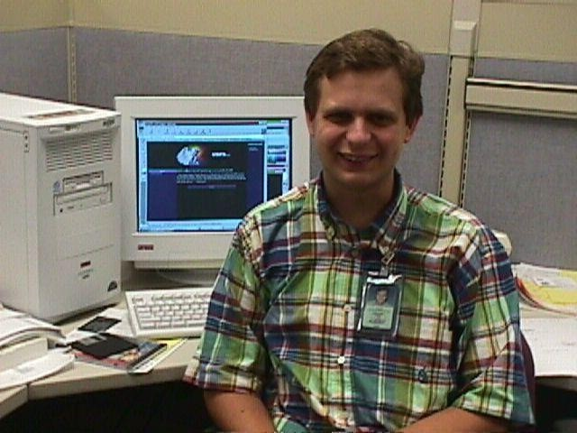

# Preface: Why I Wrote This

## The Man Without Credentials

I have a confession to make. I don't have a seminary degree. I don't have a PhD in theology. I don't have a denominational endorsement. I don't have the approval of any theological institution on the face of this earth. And I wrote a systematic theology anyway.

If that bothers you, I understand. It would have bothered me in my early twenties too. I used to think you needed credentials to speak about God with any authority. I used to think the guys with the letters after their names had some special access to truth that the rest of us didn't. And then I read the Scriptures carefully and noticed that God seems to have a pattern of choosing the most unlikely people to carry His message. Shepherds. Fishermen. Tax collectors. A tentmaker from Tarsus who persecuted the church before he preached to it. And not a single one of them went to seminary.

I'm a computer programmer. I grew up in Potosi, a small town in the Missouri Ozarks, where my father owned an auto parts store. I've been writing code since I was ten years old, starting on an Apple IIc that I begged my parents to purchase for me. Most kids in that town had never seen one. I've been writing software for the same employer since 1998. I live in a small town in eastern Kentucky with my wife Angie, who is the only woman I have ever dated, kissed, or loved. I play trombone in three community bands. I change a diaper twice a day on a cat named OJ who was once paralyzed and whom nobody else wanted. And I have spent the better part of three decades building and maintaining a website called pristinegrace.org, where I have published over two hundred articles, nearly sixty songs, and a growing catalog of podcasts. All from my living room. All without permission from anyone.

That's who I am. And this is the book I wasn't supposed to write.

## Where the Sentence Came From

The sentence that opens Chapter 1 didn't appear out of thin air. It was thirty years in the making, and I owe the reader an account of the road.

I came to believe in the sovereign grace of God in my mid-twenties. And when I say I came to believe it, I mean it hit me like a freight train. The absolute sovereignty of God over all things, including salvation. The finished work of Christ on the cross. The impossibility of human contribution to what God has already accomplished. These truths changed the entire landscape of my mind, and I have never recovered from the impact. I don't want to recover from it.

And from the very beginning, I was not content to be told what to believe. I needed to know *why*. Why sovereign grace? Why particular atonement? Why unconditional election? "Because the Bible says so" was never enough for me. Not because I doubted the Bible. Because I needed to see the *architecture*. I needed to see how the pieces fit. And I have been building that architecture ever since.

The first piece came from Bob Higby. I found my way into the doctrines of grace through the Scriptures, through the writings of men like John Gill and Augustus Toplady and William Gadsby, but most importantly through Bob. He found my website in the early days and called me up out of the blue. Asked me where I went to church. I told him, and the next Sunday he showed up. I told him I was a supralapsarian. He said, "Me too." And that was the beginning of one of the most important friendships and theological partnerships of my life.

Bob was the one who showed me that the covenant of grace was not the same thing the Reformed world calls the "covenant of grace." He showed me that the covenants in Scripture are personal, particular, and specific to the elect. He showed me that the Reformed tradition had imported a framework from covenant theology that flattened the covenants into a system that doesn't match the text. And he was right. That was the first crack in the wall. Once I saw that the covenants were personal and particular, I could never go back to a system that treated them as institutional and universal. We talked for hours. I got more out of those conversations than I ever got out of the preaching. Bob gave me the DNA of what would eventually become Modified Covenant Theology. I named the system. He gave me most of the pieces. And I have never forgotten that.

The second piece came from Gordon Clark. Clark taught me that all reasoning rests on an axiom you cannot prove from outside it, and that the real question is not "can you prove your axiom?" but "which axiom accounts for reality?" Clark was a presuppositionalist who started with the Bible and reasoned out from there. And his method was right, even where his conclusions weren't. He showed me that theology is not a collection of independent doctrines. It is a *system*. And a system has a starting point. I just didn't know what mine was yet.

But before the arguments, there was a rejection. When I was twenty-six years old, I was called into an elder's office at my church for what I thought was a friendly conversation. Instead, three elders were waiting. They told me I hadn't been tithing properly. I told them I didn't believe tithing was a requirement for believers, and I quoted 2 Corinthians 9:7 and Galatians 5:1. They responded by telling me I shouldn't be studying the Bible without their oversight. They removed me from every ministry responsibility and eventually told me to find a different church. I walked to my car in tears and called my wife and told her we were no longer welcome. I was devastated. But looking back nearly twenty-five years later, I am thankful for it. God used that rejection to set me free. He taught me that my conscience belongs to Him, not to church leaders. He taught me that my identity is found in Christ, not in membership. And He taught me that freedom in Him is real and worth every cost. That moment is where my independence was born. And that independence is what eventually produced this book.

The third piece came from the arguments. For years, I was the guy in the chat rooms, the forums, the Facebook groups, dismantling every Arminian who crossed my path. I was sharp. I was relentless. I was right about most of the doctrine and wrong about most of the delivery. And what that season taught me was not theology. It taught me that being right is not the same thing as being useful. It taught me that the sharpest sword produces the worst wounds when it's swung in anger. And it taught me that the sovereign grace world, for all its doctrinal precision, was producing some of the cruelest, most arrogant, most loveless people I had ever encountered. Including me. That experience is what eventually produced Chapter 30. But it took twenty years of watching the fruit before I could write it.

And it was Charles Spurgeon and Chuck Swindoll who showed me what the fruit was supposed to look like. I grew up listening to Swindoll in the car because my mom was a big Chuck Swindoll listener. I didn't know it at the time, but the boot parameters were being written. The tenderness I heard in that man's voice was being installed in my firmware before I could even name what it was. I don't agree with either man's theology. Spurgeon held to common grace, a general call, and a Calvinism that was broader than anything in this book. Swindoll is a dispensationalist whose system I reject in almost every particular way. But both men had a pastoral heart that most sovereign grace men will never touch. Spurgeon wept over sinners. Swindoll taught me what it looks like to love the people in front of you without making them pass a test first. Both of them preached with tenderness because they understood that truth without love is noise. And when I finally wrote Chapter 30, it was their pastoral hearts beating underneath it. Not their theology. I had that from Gill and Bob. Their *hearts*. The warmth that refuses to let precision become cruelty. That was the piece I was missing for twenty years.

<figure class="book-figure-float-right">

<figcaption>Me, early in my programming career</figcaption>
</figure>

The fourth piece came from my career. I'm a programmer. I build systems for a living. I think in layers, in architectures, in processes that have inputs and outputs and feedback loops. And somewhere along the way, I started seeing the same architecture in theology. The covenants have layers. The soul has layers. Salvation has layers. The law, the gospel, the application of grace to the individual believer, all of it has structure that looks like the systems I build at work. I didn't borrow the vocabulary from computer science on purpose. The vocabulary showed up because the patterns matched. The rendering engine isn't a metaphor I chose. It's a description I couldn't avoid.

The fifth piece came from my marriage. This is the piece I'm least comfortable telling you about, because it's personal in a way that theology usually isn't. But the glass, the concept that sits at the center of Chapter 28 and holds the eschatology together, came from my own experience of standing behind a barrier between who I really am and what I let the world see. Every person has a curator. Every person manages their exposure. And I spent years sitting with that reality in my own life before I realized it was a theological category that nobody had ever named. The glass didn't come from a commentary. It came from a marriage. And it became the most precise description of the final state the framework can produce.

The sixth piece came from the sciences. Neuroscience gave me the four-layer model. The amygdala fires before the reasoning cortex catches up. Feelings arrive before thoughts. That's not theology. That's biology. But the theology explains *why* the biology works that way, and the biology confirms what the theology predicted. The four-layer model, pre-propositional information, the three channels, the Spirit's hardware interrupt, all of that came from watching the science confirm the architecture. And quantum physics gave me the rendering engine's seams. Superposition, entanglement, the observer effect, the uncertainty principle, all of it behaves exactly the way you'd expect if reality is information being rendered by a Mind. I didn't need the physics to believe the sentence. But the physics confirmed it.

And all of these pieces, every one of them, sat in my mind. Unconnected. Or connected in ways I could feel but couldn't articulate. I knew the covenants were personal. I knew the reasoning was circular. I knew the soul had layers. I knew the glass was real. I knew the physics pointed somewhere. But I didn't have the sentence.

The sentence arrived when I stopped looking for it. I was writing, the way I've always written, following the logic wherever it led. And the thought just *landed*. Everything that exists is a thought in the mind of God, sustained by His will, authored by His purpose, and held together by personal covenants of love. One sentence. And every piece I'd been carrying for thirty years snapped into place around it like iron filings around a magnet. The covenants. The soul. The glass. The physics. The law. The ethics. The eschatology. All of it derived from one proposition. The system built itself. I simply noticed.

Look at what that one sentence actually claims. It does not say the universe is matter that happens to produce a few minds. It says the reverse. The thing behind everything is a thought, and matter is only what that thought looks like once God renders it. The invisible came first, and the invisible is more real than the visible, because the visible is here at all only because the invisible is holding it in place. *Through faith we understand that the worlds were framed by the word of God, so that things which are seen were not made of things which do appear* (Hebrews 11:3). The writer of Hebrews said it before I did. Mind before matter. Thought before thing.

I call this *operational idealism*. Not idealism as abstract philosophy, but idealism as the operating system for daily life. And that principle doesn't just apply to metaphysics. It applies to *everything*. Marriage, baptism, church, law, ethics, politics, psychology, education, the nature of heaven and hell. One principle. Universal application. I didn't plan it that way. I just kept noticing the same pattern in every domain, and eventually I realized it was all one system.

I believe the Holy Spirit gave me that sentence. Not because I heard a voice. Not because I had a vision. Because the sentence produces things I couldn't have produced on my own. I'm a decent thinker. I'm not this good. No one is. The framework's internal consistency across thirty chapters and thirty appendices, covering ontology, Christology, soteriology, eschatology, anthropology, psychology, epistemology, physics, ethics, ecclesiology, and the nature of heaven and hell, with what I believe to be zero contradictions, from one sentence, is not something a human mind assembles by talent. It's something the Spirit does when He gives a man a thought and the tools to render it.

I believe the Spirit authored the sentence and the framework both. And if He did, then the book isn't mine. It's His. And I'm just the programmer who was given the spec and told to build.

## How I Built This Book

I did not come at theology the way a seminarian comes at theology. I came at it the way a systems analyst comes at a specification. I started my career as a systems analyst for the federal government, and today I lead a team of systems analysts and software developers. That is what I have been doing in information technology for the rest of my working life. You analyze the requirements. You design the system. You write the code. You test it against every edge case you can imagine. You try to break your own system before you ship it. And if the system will not survive the tests you throw at it, you do not ship it. You fix the bug.

I have applied that method to theology for thirty years.

I had the Bible in digital form before most of my peers did. My primary interface with the text has been a search engine, not a commentary. When a theological question surfaces, my reflex is to query the corpus for every verse that might bear on it. Not skim three commentaries. Query the text itself. Thirty years of that forms a very different mind than thirty years of reading Berkhof.

And I have always sought to challenge my own positions. I argue against them from every perspective I can put myself into. I read the strongest critics of what I believe before I commit to a position. I stage the objections in my own mind and I answer them, and if I cannot answer, I adjust the position. I have spent twenty years in forums and chat rooms and comment threads being swung at by Arminians and universalists and freewillers and dispensationalists and Catholics and my own sovereign-grace brothers. Every position I hold has been stress-tested by people motivated to break it. The positions that remained are the positions that remained for a reason.

*"He that is first in his own cause seemeth just; but his neighbour cometh and searcheth him"* (Proverbs 18:17). I have tried to be the neighbour against my own cause. That discipline is the reason the book you are reading holds together.

And the method produced the form.

Most systematic theologies start with a list of doctrines and then work through them one by one. They feel like textbooks. They're organized by topic, and each topic is treated in isolation. You read the chapter on justification, then you read the chapter on sanctification, and you might not see how they connect to each other or to anything else in the system.

This book doesn't work that way. This book starts with one sentence. One single sentence. And then it derives *everything* from that sentence. Every doctrine. Every position. Every application. The sentence generates the theology, and the theology generates the ethics, and the ethics generate the pastoral conclusions. It's not a collection of independent doctrines. It's one thought, unfolded across every domain I can think of. And if the sentence is true, everything else follows. And if it's false, none of the rest matters.

And here is something else you will notice as you read. On every long-standing binary debate in Christian theology, I land at a third position that neither side has. Not a splitting of the difference. Not a middle way. Not a synthesis. A position that was invisible from inside the binary, and that comes into view only when the floor underneath the binary gets replaced. Predestination and free agency both real. Measured curse that ends and eternal shame that continues. Imputation grounded in Christ's total substitution of wrath and shame. Sacrament as rendering. Authorship as the third category between identity and separation. On and on across every chapter. And the reason the pattern is consistent is that it is the signature of the method. When a debate has lasted a thousand years, both sides are almost always standing on the same hidden floor, and the floor is almost always Platonic. Swap the floor, and the third position was there the whole time. Appendix N names the floor. Appendix O names its replacement. The chapters show the third positions that follow.

Every chapter in this book ends with a section called "Objections and Answers." Not "Questions and Answers." Not "Frequently Asked Questions." Objections. And I chose that word deliberately.

A question asks for information. An objection challenges a position. And I would rather face the challenge than answer the softball. The objections are not stupid. Some of them are very good. Some of them kept me up at night before I found the answer.

So I've done something most systematic theologies don't do. I've *tried* to put the strongest version of the pushback inside the book, right next to the position it challenges. Not tucked away in an appendix. Not saved for a follow-up volume. Right there, at the end of each chapter, where you can see the position and the challenge side by side and judge for yourself whether the answer holds.

If I've done my job, the answers will hold. If I haven't, you'll know exactly where the framework breaks. Either way, you won't have to wonder what the other side thinks. I've already told you.

And after the chapters are finished, the appendices take the sentence further. Appendices A1 through A12 apply it to every question I could anticipate, the ones that fall between chapters, the ones that keep people up at night, the ones no single doctrine answers by itself. If the framework is real, it should be able to handle anything you throw at it. The applied appendices are where I threw everything I could think of. And the appendices are where the framework will continue to grow. As new questions arise, as new objections surface, as the sentence gets applied to domains I haven't thought of yet, they'll be added here. The chapters are the foundation. The appendices are the construction that never stops.

## Campless

And here's the thing that took me the longest to say out loud. The system doesn't belong to any camp. I'm not a Calvinist, though people call me one. I'm not Reformed, though I hold many Reformed positions. I'm not a Baptist, though I've attended Baptist churches my whole believing life. I'm not New Covenant Theology, though I share their rejection of the Adamic covenant of works and go further by rejecting federal headship entirely. I'm not Dispensational, though I believe in a genuine distinction between the old and new covenants. I'm not *anything*, in the sense that no existing camp contains all of what I believe. No confession of faith captures it. No denominational statement covers it. I am theologically homeless. And I have been for as long as I can remember.

That's not a complaint. It's a description. When you follow the logic honestly, when you refuse to stop at the boundaries of your camp just because the camp tells you to stop, you end up alone. Not lonely. I have a wife who loves me, a son who challenges me, a best friend I've talked to every day for as long as I can remember without ever meeting in person, and a small circle of brothers who understand what I'm saying even when everyone else thinks I've lost my mind. I'm not lonely. I'm just campless. And campless is the only honest place to stand when the truth doesn't fit inside any fence.

## Before We Begin

Two things before we begin.

First, this book uses vocabulary you have not encountered in any other systematic theology. Firmware. Rendering. Boot parameters. Application layer. Collapsed thought. The glass. These are not decorations. They are the framework's native language, drawn from computer science, physics, and philosophy of mind, and they describe realities that traditional theological vocabulary has never been able to express. A glossary is provided at the back of the book for reference. But the terms are defined in context as they appear, and the reader who stays with the text will learn the language as the framework unfolds. I am a computer programmer. I think in systems. And the system demanded its own vocabulary because no existing vocabulary could contain it.

Second, I am not going to police every sentence in this book to prevent misuse. When the sentence says "held together by personal covenants of love," I mean the elect. The book makes this clear in Chapters 7, 12, 15, and 19. I am not going to append "for the elect only" every time I mention love, grace, covenant, or promise. If you read one sentence in isolation and conclude that I believe in common grace or universal love, you haven't read the book. You've read a sentence. I have watched people do this -- pull phrases from my articles, strip the context, and build accusations on fragments. The book is the qualification. I'm writing it for people who read books, not fragments.

And now I need to tell you something else, and I need you to hear this clearly. This book will make you uncomfortable. I don't say that to be dramatic. I say it because every single time I publish something that pushes past the comfort zone of one camp or another, I lose friends. I've been called a hyper-calvinist, a compromiser, an arch-heretic, an unbeliever, and a tolerant. Sometimes by the same people at different points in my writing career. I've had men preach against my articles from pulpits without ever picking up the phone to talk to me first. And I kept writing.

I kept writing because the truth doesn't belong to a camp. It doesn't belong to a denomination. It doesn't belong to the men with the credentials or the men with the pulpits or the men with the loudest voices on Facebook. The truth belongs to Christ. And my job is not to protect it. My job is not to defend it. My job is to present it. Softly. Patiently. And then wait on the Lord to do what only He can do with it.

And I want to say one more thing about the labels and the men who apply them. Every one of those labels was applied without engaging the argument. Nobody who called me a hyper-calvinist sat down and refuted the denial of common grace from Scripture. Nobody who called me a compromiser walked through Chapter 30 and showed me where the derivation breaks. Nobody who preached against me from a pulpit picked up the phone first. The method is always the same. Label first. Dismiss. Move on. And the label is always an appeal to authority, not an appeal to Scripture. "Hodge warned against this." "The confession says otherwise." "The tradition has always held." Those are not arguments. Those are appeals to men. And the Reformation was built on the principle that appeals to men are not sufficient when the question is what does Scripture say. The test of this book is not who wrote it. The test is whether the derivation from Scripture holds. If you evaluate the book by the author's credentials, you are doing what Rome did to Luther. If you evaluate the book by its argument from Scripture, you are doing what the Reformation asked you to do. I invite you to do the second.

So here it is. Everything I believe. In one book. Starting with one sentence. And ending with the widest arms I know how to open. If you read nothing else, read the last chapter. Because twenty-nine chapters of the sharpest doctrine I know how to hold end in the one place the sentence was always leading: love. Not despite the theology. Because of it.

If you disagree with me, I'm not offended. If you think I'm wrong about something, you might be right. I don't claim infallibility. I claim consistency. And I claim that this system, built from Scripture over more than two decades, holds up under pressure in a way that no other system I've encountered does. But I hold it with open hands. Because the moment I grip it too tightly, I've made an idol of the framework instead of worshipping the Christ the framework points to. And I've seen that happen to too many men already.

Read carefully. Think honestly. Disagree where your conscience demands it. And remember that neither your correct understanding nor your incorrect understanding is what saves you. Christ saves. And He alone.

::: keep-with-signature
That's the first thing I believe. It's also the last thing. And everything in between is just me showing you why.

Grace and Peace,
Brandan
:::
